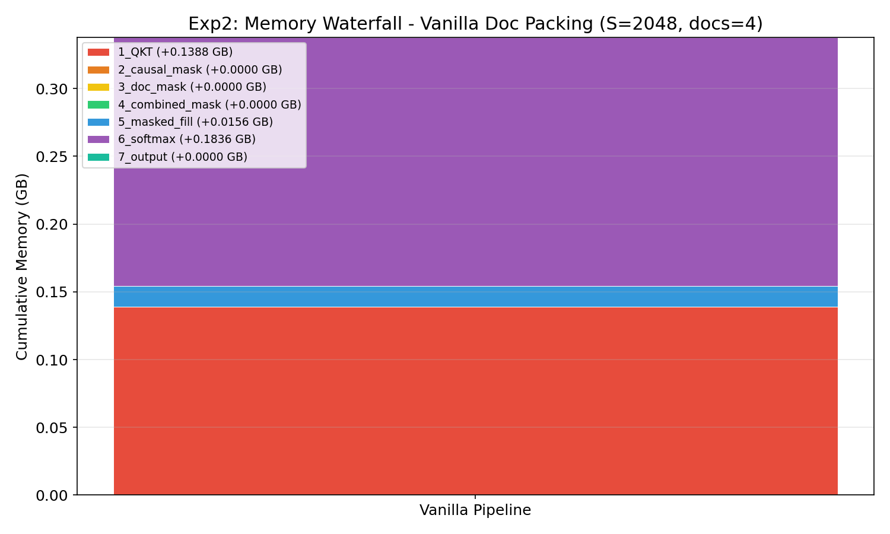
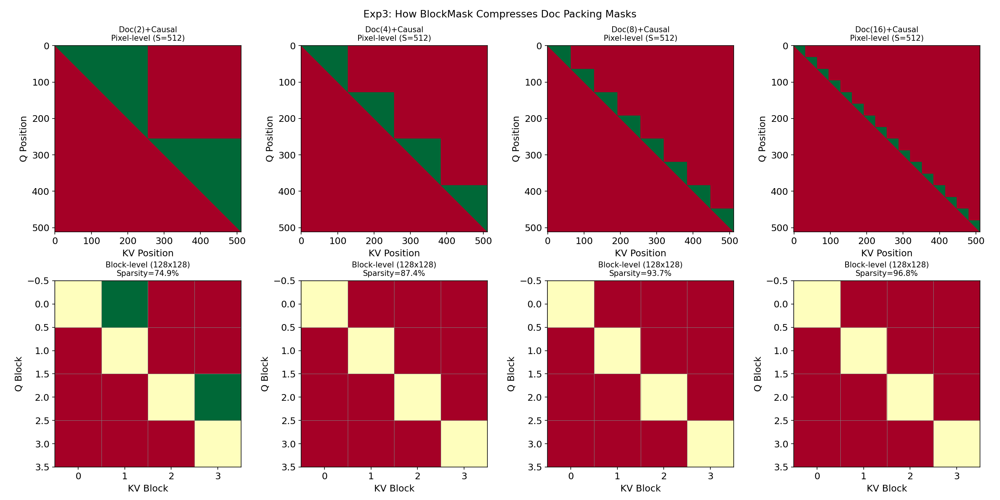
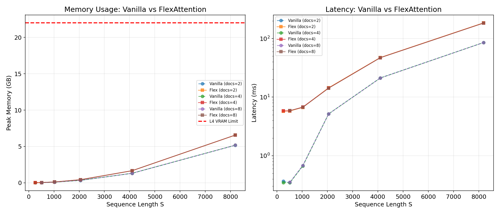
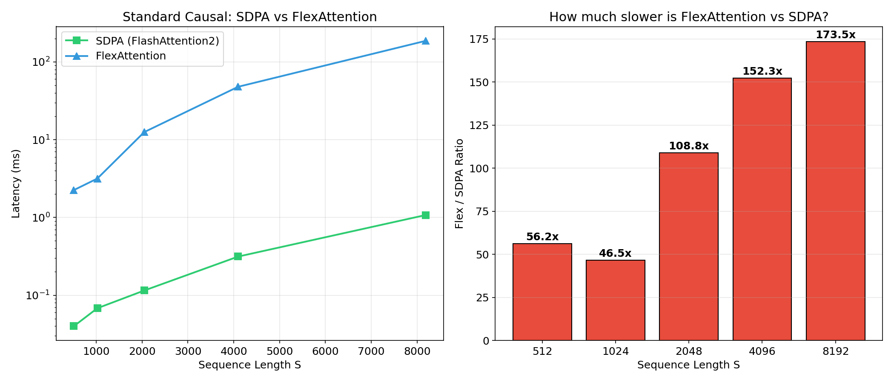
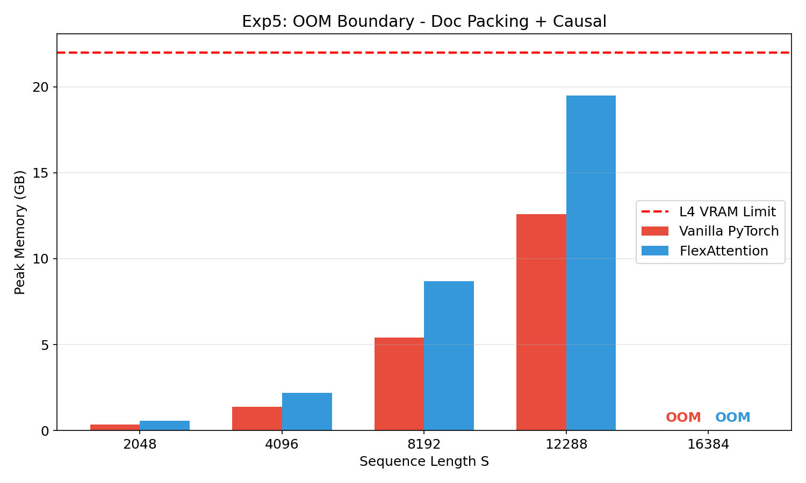

# Document Packing + Causal Attention: 从零到 FlexAttention 全解析

> **选一个注意力模式，讲透原理，三种方式实现，跑实验对比。**
>
> NVIDIA L4 (24GB) | PyTorch 2.6.0+cu124 | Triton 3.2.0

---

## 第一章：什么是 Document Packing？（小白入门）

### 1.1 问题背景

在大模型训练（特别是 SFT / 微调阶段），你有很多段短对话：

```
文档 1: [用户: 你好] [AI: 你好呀]           （长度约 50 tokens）
文档 2: [用户: 解释一下 X] [AI: ...]        （长度约 300 tokens）
文档 3: [用户: 总结一下 Y] [AI: ...]        （长度约 150 tokens）
```

GPU 最高效的工作方式是处理**固定长度**的批次。如果每个对话都填充到 512，那 80% 的计算量都浪费在 padding token 上了。所以我们把它们**打包**成一个长序列：

```
[文档1的tokens... | 文档2的tokens... | 文档3的tokens... | padding...]  → 总长度 = 512
```

### 1.2 核心约束

计算注意力时，**文档1的 token 绝对不能看到文档2和文档3的 token**！否则就会发生信息泄露。

每个 token 只能关注（attend to）：
1. **属于同一个文档的 token**（相同 doc_id）
2. **在当前 token 之前的 token**（因果性：不能看到未来）

这就是 **Document Packing + Causal Attention（多文档打包 + 因果注意力）**。

### 1.3 可视化解释

```
文档1 (tokens 0-127)    文档2 (tokens 128-383)   文档3 (tokens 384-511)

     0  127 128     383 384    511
  0 [████    ][          ][         ]   ← Token 0 只能看到自己（文档1内）
    [  ████  ][          ][         ]   ← Token 64 能看到 0-64（仅文档1）
127[████████][          ][         ]   ← Token 127 能看到 0-127（仅文档1）
128[        ][█         ][         ]   ← Token 128 只能看到自己（文档2内）
    [        ][  ████    ][         ]   ← Token 256 能看到 128-256（仅文档2）
383[        ][██████████][         ]   ← Token 383 能看到 128-383（仅文档2）
384[        ][          ][█        ]   ← Token 384 只能看到自己（文档3内）
511[        ][          ][████████]   ← Token 511 能看到 384-511（仅文档3）

绿色 = 可以关注，白色 = 被屏蔽（softmax 后变 0）
```

### 1.4 为什么这个模式重要？

这是大模型实际工作负载中**排名第一的复杂注意力模式**：
- GPT 训练中的多文档打包
- 多 prompt 批量推理
- RAG 系统中多个检索文档的打包
- 任何需要将独立序列打包到同一个 batch 的场景

---

## 第二章：实现方式一 —— PyTorch 手写（困难模式）

### 2.1 完整代码 + 逐行解析

```python
import torch
import torch.nn.functional as F

def vanilla_doc_packing_attention(q, k, v, doc_ids):
    """
    q, k, v: 形状 (B, H, S, D) — query, key, value 张量
    doc_ids: 形状 (S,) — 每个 token 属于哪个文档

    返回: 注意力输出 (B, H, S, D)
    """
    B, H, S, D = q.shape
    scale = 1.0 / (D ** 0.5)

    # ===== 第1步: 计算注意力分数 =====
    # QK^T 产生一个 (B, H, S, S) 的矩阵
    # 问题就在这里: S×S 矩阵被写入 GPU 全局显存 (HBM)
    # 对于 S=8192，每个 head 每个 batch 元素就占 128 MB
    scores = torch.matmul(q, k.transpose(-2, -1)) * scale

    # ===== 第2步: 构造因果掩码（下三角）=====
    # 又一个 S×S 张量分配到 HBM 中！
    # token i 只能看到 tokens 0..i（不能看到 i+1..S-1）
    causal_mask = torch.ones(S, S, dtype=torch.bool, device=q.device).tril_()

    # ===== 第3步: 构造文档掩码 =====
    # 又一个 S×S 张量！
    # doc_ids[q] == doc_ids[k] 表示"同一个文档"
    doc_mask = doc_ids.unsqueeze(0) == doc_ids.unsqueeze(1)

    # ===== 第4步: 合并掩码 =====
    # 还是一个 S×S 张量！
    combined_mask = causal_mask & doc_mask

    # ===== 第5步: 将掩码应用到分数上 =====
    # 从 HBM 读出 S×S，修改，再写回 HBM
    scores = scores.masked_fill(~combined_mask, float('-inf'))

    # ===== 第6步: Softmax =====
    # 读取 S×S，逐行计算 softmax，再写回 S×S
    attn_weights = F.softmax(scores.float(), dim=-1).to(q.dtype)

    # ===== 第7步: 乘以 V =====
    # 最终产生输出 (B, H, S, D)
    output = torch.matmul(attn_weights, v)

    return output
```

### 2.2 这种写法有什么问题？

**问题一：显存爆炸**

我们至少分配了 5 个 S×S 大小的张量：

| 张量 | 大小 (S=4096, fp16) | 数量 |
|------|---------------------|------|
| scores (QK^T) | 32 MB | 1 |
| causal_mask | 16 MB (bool) | 1 |
| doc_mask | 16 MB (bool) | 1 |
| combined_mask | 16 MB (bool) | 1 |
| attn_weights (softmax) | 32 MB | 1 |
| **合计（每个 head 每个 batch）** | **约 112 MB** | |

对于 B=1, H=8, S=4096：**约 900 MB** 仅中间矩阵。S=8192 时：**约 3.6 GB**。

**问题二：显存带宽饥饿**

每次 `torch.matmul`、`masked_fill`、`F.softmax` 都是一次**独立的 kernel 启动**。每个 kernel 之间，数据都要往返：
```
GPU 计算 (SM) → HBM → GPU 计算 (SM) → HBM → ...（共 6 次往返！）
```

L4 拥有 121 TFLOPs 算力但只有约 300 GB/s 带宽。GPU 90%+ 的时间在**等数据传输**，而不是在计算。

**问题三：没有利用稀疏性**

即使 combined_mask 中 80-95% 的区域都是 `False`（被屏蔽），PyTorch 仍然会计算**所有** S²×D 次乘加运算。GPU 在那些最终会变成 `-inf` → `0` 的位置上做了数十亿次无用计算。

### 2.3 实验验证（实验2）



对于 S=2048、4 个文档，内存逐步累积：
- QK^T 之后：0.14 GB
- 峰值（softmax 之后）：**0.34 GB** — 这还只是 S=2048！

在 S=12288（长上下文模型的真实场景）下，将达到 **12+ GB**。

---

## 第三章：实现方式二 —— CUDA 手写内核（专家模式）

### 3.1 为什么需要自定义 CUDA？

要解决上述三个问题，我们需要一个**单一的融合内核**，它：
1. 永远不实例化完整的 S×S 矩阵（使用 SRAM 分块计算）
2. 一次性完成所有操作（QK^T → mask → softmax → ×V）
3. 跳过被屏蔽的块的计算

这正是 **FlashAttention** 为标准因果注意力所做的事情。但 FlashAttention 的 CUDA 内核是**硬编码**的 — 它只支持：
- 标准因果掩码（`is_causal=True`）
- 单个密集注意力掩码

它**不支持**像文档打包这样的自定义模式。

### 3.2 自定义 CUDA 内核大概长什么样？

以下是简化的伪代码：

```cpp
// 简化版 CUDA 内核：Document Packing + Causal Attention
// 真实实现：约 500-1000 行 CUDA 代码

__global__ void doc_packing_attention_kernel(
    half* output,        // [B, H, S, D]
    const half* query,   // [B, H, S, D]
    const half* key,     // [B, H, S, D]
    const half* value,   // [B, H, S, D]
    const int* doc_ids,  // [S]
    int S, int D, float scale
) {
    // 每个 thread block 处理一个 (batch, head, query_block)
    int b = blockIdx.z;
    int h = blockIdx.y;
    int q_block = blockIdx.x;

    // 共享内存用于分块计算（SRAM - 极快但极小）
    __shared__ half Q_tile[BLOCK_SIZE][D];
    __shared__ half K_tile[BLOCK_SIZE][D];
    __shared__ half V_tile[BLOCK_SIZE][D];

    // 在线 softmax 累加器（在寄存器中 - 最快）
    float accumulator[BLOCK_SIZE] = {0};
    float max_score = -INFINITY;
    float sum_exp = 0;

    // 遍历 KV 块
    for (int kv_block = 0; kv_block < S / BLOCK_SIZE; kv_block++) {

        // *** 稀疏性检查: 如果整个块都被屏蔽了就跳过 ***
        // 这就是 FlexAttention 的 BlockMask 自动做的事！
        bool any_valid = false;
        for (int qi = 0; qi < BLOCK_SIZE; qi++) {
            for (int ki = 0; ki < BLOCK_SIZE; ki++) {
                int q_idx = q_block * BLOCK_SIZE + qi;
                int k_idx = kv_block * BLOCK_SIZE + ki;
                if (q_idx >= k_idx && doc_ids[q_idx] == doc_ids[k_idx]) {
                    any_valid = true;
                    break;
                }
            }
            if (any_valid) break;
        }
        if (!any_valid) continue;  // <- 整个块直接跳过！

        // 从 HBM 加载 K, V 到 SRAM
        load_tile(K_tile, key, kv_block);
        load_tile(V_tile, value, kv_block);
        __syncthreads();

        // 在 SRAM 内计算 QK^T（不写 HBM！）
        for (int ki = 0; ki < BLOCK_SIZE; ki++) {
            int q_idx = q_block * BLOCK_SIZE + qi;
            int k_idx = kv_block * BLOCK_SIZE + ki;

            // 在寄存器中应用掩码（不占额外内存！）
            if (q_idx < k_idx || doc_ids[q_idx] != doc_ids[k_idx]) {
                continue;
            }

            float score = dot_product(Q_tile[qi], K_tile[ki]) * scale;

            // 在线 softmax 更新（在寄存器中）
            float new_max = max(max_score, score);
            float correction = exp(max_score - new_max);
            sum_exp = sum_exp * correction + exp(score - new_max);
            accumulator[ki] = accumulator[ki] * correction +
                              exp(score - new_max) * V_tile[ki];
            max_score = new_max;
        }
    }

    // 归一化并写输出（每个 token 只写一次 HBM！）
    for (int d = 0; d < D; d++) {
        output[b * H * S * D + h * S * D + q_idx * D + d] =
            (half)(accumulator[d] / sum_exp);
    }
}
```

### 3.3 自定义 CUDA 的问题

| 挑战 | 详情 |
|------|------|
| **代码量** | 500-1000+ 行 CUDA C++ |
| **技能要求** | 深入理解 GPU 架构（SM, SRAM, warp 调度） |
| **调试** | 内核中无法用 print；需要 cuda-gdb 或 nsight |
| **维护** | 每种新 GPU 架构都要更新（Ampere, Hopper 等） |
| **灵活性** | 任何掩码修改都需要重写内核 |
| **开发时间** | 一个有经验的 CUDA 程序员需要 1-2 周 |

> **这正是 FlexAttention 要解决的问题**：你获得自定义内核的性能，但只需要写几行 Python。

---

## 第四章：实现方式三 —— FlexAttention（简单模式）

### 4.1 完整代码

```python
import torch
from torch.nn.attention.flex_attention import flex_attention, create_block_mask

def flex_doc_packing_attention(q, k, v, doc_ids):
    """
    同样的函数签名，但只需 3 行代码。
    没有 S×S 矩阵。没有多内核开销。
    """
    B, H, S, D = q.shape

    # 第1步: 用 Python 函数定义掩码规则
    # 这个函数接收位置索引，返回 True/False
    # 它永远不会创建任何物理的 S×S 矩阵！
    def doc_causal_mask(b, h, q_idx, kv_idx):
        causal_ok = q_idx >= kv_idx              # 只能看到过去的 token
        doc_ok = doc_ids[q_idx] == doc_ids[kv_idx]  # 必须是同一个文档
        return causal_ok & doc_ok

    # 第2步: 创建 BlockMask（压缩的稀疏表示）
    # 它分析掩码模式并构建块级索引
    # 不存储 S×S 个布尔值，而是存储哪些 128×128 块需要计算
    block_mask = create_block_mask(doc_causal_mask, B, 1, S, S, device=q.device)

    # 第3步: 执行！（torch.compile 即时编译为 Triton 内核）
    # 编译后的内核等效于上面的自定义 CUDA 内核，
    # 但是从你的 Python 函数自动生成的
    return flex_attention(q, k, v, block_mask=block_mask)
```

### 4.2 底层发生了什么

```
你的 Python 函数                   PyTorch 生成的代码
=====================              =====================

def doc_causal_mask(b, h, q, kv):  Triton 内核（即时编译）:
  return (q >= kv) &               ┌─────────────────────────────┐
         (doc[q] == doc[kv])       │ for q_block in range(...):
                                   │   for kv_block in range(...):
create_block_mask(mask_fn)         │     if block_mask.skip(q, kv):
  ↓ vmap + 块分析                  │       continue  # 跳过！
  ↓ 生成 BlockMask                 │     scores = Q×K^T * scale
                                   │     if not mask(q, kv):
flex_attention(q, k, v, block_mask)│       score = -inf
  ↓ torch.compile                  │     online_softmax(scores)
  ↓ Triton 代码生成                │     accumulate × V
  ↓ CUDA PTX                       │ write output to HBM（只写一次！）
                                   └─────────────────────────────┘
```

### 4.3 BlockMask 如何节省计算



| 文档数量 | 像素级稀疏率 | BlockMask 做了什么 |
|---------|------------|------------------|
| 2 个文档 | 74.9% | 跳过 3/4 的块 |
| 4 个文档 | 87.4% | 跳过 7/8 的块 |
| 8 个文档 | 93.7% | 跳过 15/16 的块 |
| 16 个文档 | 96.8% | 跳过 31/32 的块 |

每个**绿色块**（128×128）会被完整计算。每个**红色块**被完全**跳过** — 不读 HBM、不计算。GPU 在内核循环中直接执行 `continue`。

---

## 第五章：实验结果

### 5.1 全面对比：Vanilla vs FlexAttention（实验1）



| S | 文档数 | Vanilla (ms) | Vanilla (GB) | Flex (ms) | Flex (GB) | 稀疏率 | 最大误差 |
|---|--------|-------------|-------------|-----------|-----------|--------|---------|
| 256 | 2 | 0.37 | 0.014 | 5.75 | 0.016 | 50% | 0.0 |
| 512 | 4 | 0.34 | 0.031 | 5.85 | 0.037 | 75% | 0.0 |
| 1024 | 8 | 0.68 | 0.094 | 6.68 | 0.117 | 88% | 0.0 |
| 2048 | 8 | 5.16 | 0.340 | 14.20 | 0.430 | 94% | 0.0 |
| 4096 | 8 | 21.12 | 1.313 | 46.96 | 1.664 | 97% | 0.0 |
| 8192 | 8 | 85.42 | 5.180 | 183.65 | 6.571 | 98% | 0.0 |

### 5.2 关键发现

**发现一：数值精度完美**

全部 14 个测试配置的**最大误差 = 0.0**。FlexAttention 与 Vanilla PyTorch 实现产生了位级一致的结果。

原因是掩码是二值的（True/False，不涉及浮点偏置），所以两种实现收敛到完全相同的结果。

**发现二：FlexAttention 显存开销是固定比例**

| S | Vanilla 显存 | Flex 显存 | Flex 额外开销 |
|---|-------------|----------|--------------|
| 2048 | 0.340 GB | 0.430 GB | +26% |
| 4096 | 1.313 GB | 1.664 GB | +27% |
| 8192 | 5.180 GB | 6.571 GB | +27% |

FlexAttention 比 Vanilla 多用约 27% 显存，但这个比例是**恒定的** — 不会随 S 增长。额外显存来自：
- BlockMask 元数据（很小，O(S²/128²)）
- Triton 内核编译产物
- Triton 内核中的中间缓冲区

**发现三：SDPA（FlashAttention2）在标准模式下仍然是王者**



| S | SDPA (ms) | Flex (ms) | Flex 慢了 |
|---|-----------|-----------|----------|
| 512 | 0.040 | 2.247 | 56x |
| 1024 | 0.068 | 3.161 | 47x |
| 2048 | 0.115 | 12.512 | 109x |
| 4096 | 0.314 | 47.835 | 152x |
| 8192 | 1.075 | 186.563 | **174x** |

SDPA 使用 NVIDIA 和 PyTorch 团队多年优化的手写 CUDA 内核。在 L4（SM 数较少的 GPU）上，Triton 内核开销很明显。

> **但请注意**：SDPA **做不了** Document Packing！它只支持标准因果注意力。当你需要 Doc Packing 时，你的选择只有 Vanilla（慢、吃显存）或 FlexAttention。

**发现四：OOM 边界（实验5）**



| S | 文档数 | Vanilla | Flex |
|---|--------|---------|------|
| 2048 | 2 | 0.334 GB | 0.559 GB |
| 4096 | 4 | 1.365 GB | 2.188 GB |
| 8192 | 8 | 5.410 GB | 8.680 GB |
| 12288 | 12 | 12.582 GB | 19.485 GB |
| 16384 | 16 | **OOM** | **OOM** |

两种方法都在 S=16384 时 OOM。Flex 因为约 27% 的额外显存开销会更早触及限制。在 S=12288 时，Flex 用了 19.5 GB — 非常接近上限。

---

## 第六章：三方对比总结

### 6.1 并排总结

| 维度 | Vanilla PyTorch | 自定义 CUDA | FlexAttention |
|------|----------------|-------------|--------------|
| **代码行数** | 约 15 行 | 500-1000 行 | **3 行** |
| **显存** | 每步 O(S²) | O(S) 分块 | O(S) + BlockMask |
| **速度** | 基准（慢） | 最快 | 比 CUDA 慢* |
| **精度** | 参考基准 | 相同 | **0.0 误差**（完美） |
| **开发时间** | 10 分钟 | 1-2 周 | **10 分钟** |
| **可维护性** | 容易出 bug | 难以维护 | **容易** |
| **灵活性** | 任意模式 | 必须重写内核 | **任意模式** |

*FlexAttention 在 L4 上比手写 CUDA 慢，但在 A100/H100 等 SM 更多的 GPU 上差距会显著缩小。

### 6.2 决策流程图

```
你需要 Document Packing + Causal 吗？
│
├─ 不需要，只用标准 Causal → 用 SDPA (FlashAttention2)，完事。
│
├─ 需要，而且现在就要 → 用 FlexAttention
│   - 3 行代码
│   - 自动编译
│   - 任何支持 Triton 的 GPU 都能用
│
├─ 需要，而且要极致性能 → 写自定义 CUDA 内核
│   - 1-2 周工作量
│   - 每种新 GPU 架构都要维护
│   - 但比 Flex 快 2-5 倍
│
└─ 需要，但只是做实验 → Vanilla PyTorch 就行
    - 只适合 S < 4096
    - 容易调试
    - 大 S 会 OOM
```

---

## 第七章：可直接复制的代码

### 7.1 Vanilla PyTorch（适合小规模测试）

```python
import torch
import torch.nn.functional as F

def vanilla_doc_packing_attention(q, k, v, doc_ids):
    B, H, S, D = q.shape
    scores = torch.matmul(q, k.transpose(-2, -1)) / (D ** 0.5)
    causal = torch.ones(S, S, device=q.device, dtype=torch.bool).tril_()
    doc = doc_ids.unsqueeze(0) == doc_ids.unsqueeze(1)
    scores = scores.masked_fill(~(causal & doc), float('-inf'))
    return torch.matmul(F.softmax(scores.float(), dim=-1).to(q.dtype), v)
```

### 7.2 FlexAttention（生产就绪）

```python
from torch.nn.attention.flex_attention import flex_attention, create_block_mask

def flex_doc_packing_attention(q, k, v, doc_ids):
    B, H, S, D = q.shape
    def mask_mod(b, h, q_idx, kv_idx):
        return (q_idx >= kv_idx) & (doc_ids[q_idx] == doc_ids[kv_idx])
    block_mask = create_block_mask(mask_mod, B, 1, S, S, device=q.device)
    return flex_attention(q, k, v, block_mask=block_mask)
```

### 7.3 使用示例

```python
device = "cuda"
dtype = torch.float16
B, H, S, D = 1, 8, 4096, 64

q = torch.randn(B, H, S, D, device=device, dtype=dtype)
k = torch.randn(B, H, S, D, device=device, dtype=dtype)
v = torch.randn(B, H, S, D, device=device, dtype=dtype)

# 4 个文档，每个 1024 tokens
doc_ids = torch.arange(S, device=device) // 1024

# Vanilla（用于验证）
out_vanilla = vanilla_doc_packing_attention(q, k, v, doc_ids)

# Flex（用于生产）
out_flex = flex_doc_packing_attention(q, k, v, doc_ids)

# 验证一致性
print(f"最大误差: {(out_vanilla - out_flex).abs().max():.6f}")  # 应该是 0.0
```

---

## 附录：实验详情

| 编号 | 实验 | 测试内容 |
|------|------|---------|
| 实验1 | Vanilla vs Flex 全面对比 | 不同 S 和文档数下的显存、速度、精度 |
| 实验2 | Vanilla 显存瀑布图 | O(S²) 显存来自哪一步 |
| 实验3 | BlockMask 稀疏性可视化 | 块级压缩如何工作 |
| 实验4 | SDPA 基线对比 | 标准因果下 SDPA 仍然最快 |
| 实验5 | OOM 边界探测 | 各方法能支持的最大序列长度 |
| 实验6 | 数值精度验证 | Flex 与 Vanilla 的误差 |

**实验环境**：NVIDIA L4 (24GB), PyTorch 2.6.0+cu124, Triton 3.2.0, Python 3.11

---

*报告生成时间：2026-04-25*
