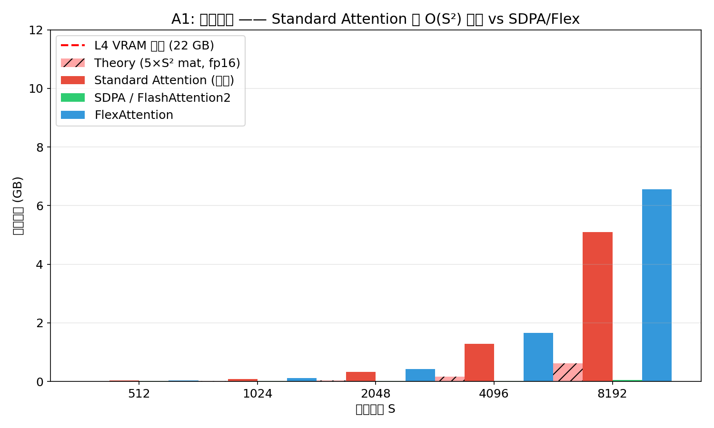
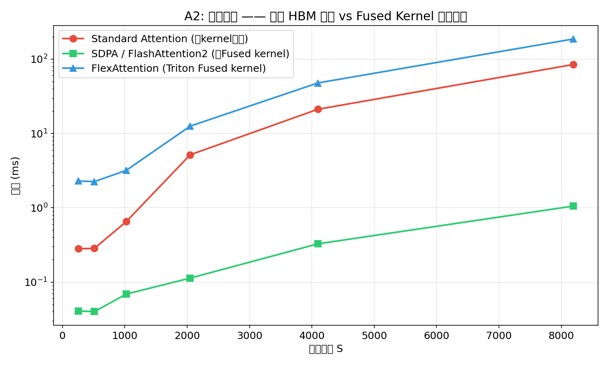
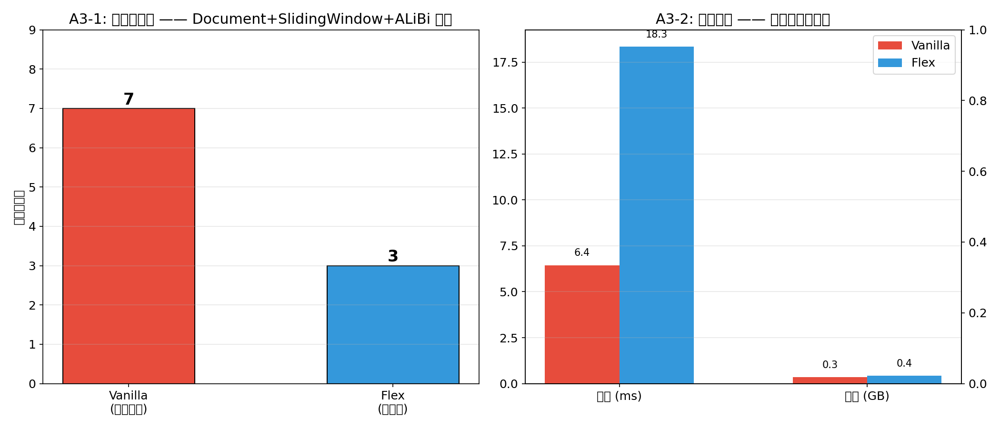
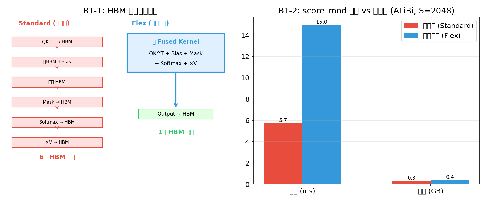
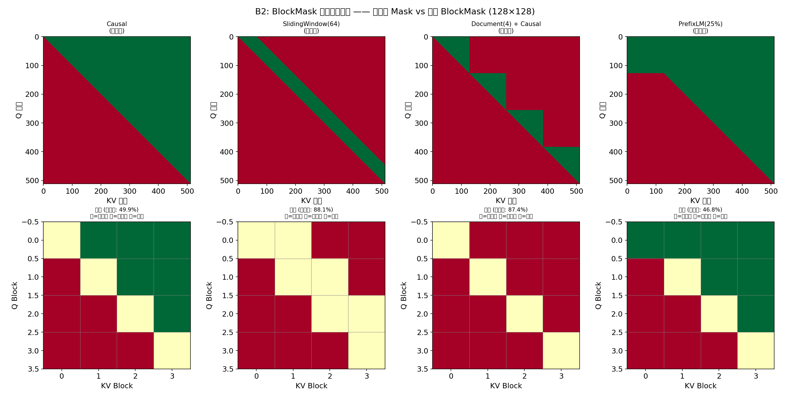
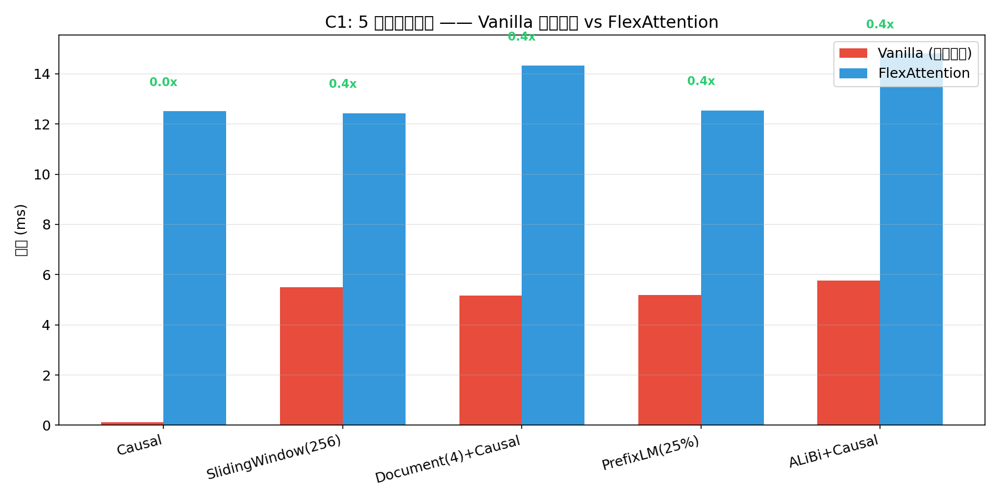
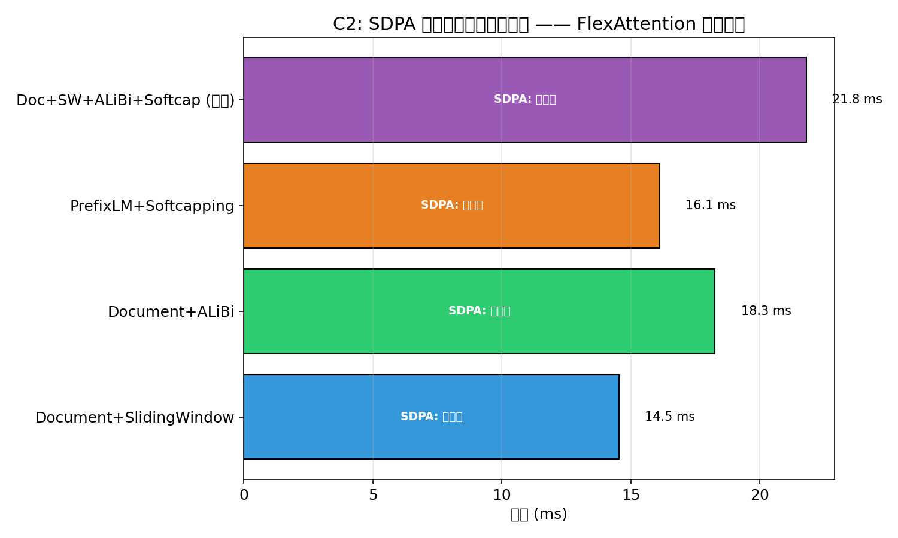
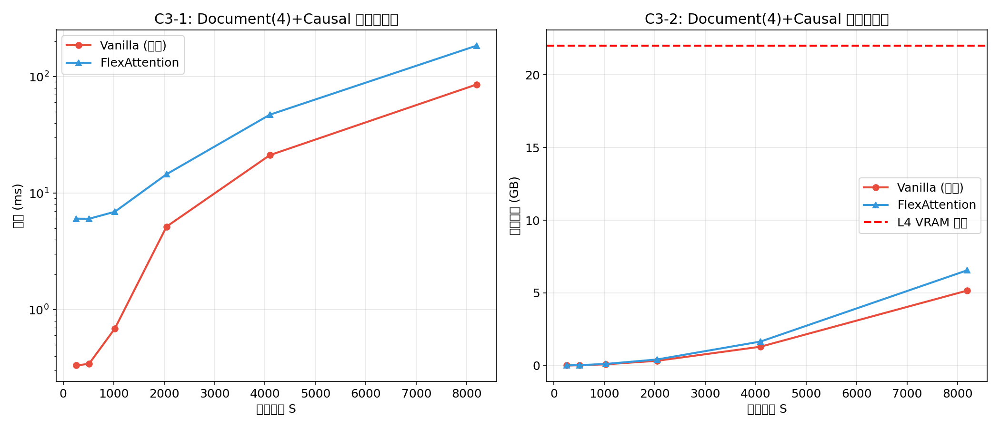

# FlexAttention 深度原理剖析 —— 从痛点到解法

> **为什么需要 FlexAttention？没有它有多痛苦？有了它改变了什么？**
>
> NVIDIA L4 (24GB) | PyTorch 2.6.0+cu124 | Triton 3.2.0
> 参考: [attention-gym](https://github.com/meta-pytorch/attention-gym)

---

# 第一部分：没有 FlexAttention 的世界

## 1.1 痛点一：显存爆炸 —— O(S²) 中间矩阵

### 问题本质

Attention 的核心公式是 `softmax(QK^T / sqrt(d)) V`。在标准 PyTorch 实现中，每一步都会在 HBM（全局显存）中实例化一个完整的 S×S 中间矩阵：

```python
# 标准 Attention 实现 —— 每一行都在 HBM 中分配新内存
scores = torch.matmul(q, k.transpose(-2, -1)) * scale    # S×S 矩阵写入 HBM
causal_mask = torch.ones(S, S).tril_()                    # 又一个 S×S
scores = scores.masked_fill(~causal_mask, float('-inf'))   # 读出 → 修改 → 写回
attn_weights = F.softmax(scores, dim=-1)                   # 又一次完整的 S×S 写入
output = torch.matmul(attn_weights, v)                     # 最终结果
```

对于 S=8192 的序列，仅一个 S×S fp16 矩阵就占 128MB。整个计算过程中至少产生 5 个这样的中间矩阵，总计 **640MB per head per batch**。

### 实验验证（Exp A1）



| 序列长度 S | Standard (GB) | SDPA/Flash2 (GB) | Flex (GB) | Standard vs SDPA 显存比 |
|-----------|--------------|-----------------|-----------|----------------------|
| 512 | 0.029 | 0.010 | 0.036 | 2.9x |
| 1024 | 0.090 | 0.012 | 0.115 | 7.5x |
| 2048 | 0.331 | 0.017 | 0.426 | 19.5x |
| 4096 | 1.287 | 0.026 | 1.657 | 49.5x |
| 8192 | 5.098 | 0.043 | 6.555 | **118.6x** |

**关键发现**：
- S=8192 时，Standard Attention 吃掉 5.1 GB，而 FlashAttention2 仅用 **0.043 GB**（118x 差距）
- Standard 的显存增长完美符合 O(S²) 曲线——每翻倍序列长度，显存翻 4 倍
- L4 的 22 GB 显存在 S≈16384 时会被 Standard 的中间矩阵直接撑爆（理论值 ~10 GB）

---

## 1.2 痛点二：带宽饥饿 —— 多次 HBM 往返

### 问题本质

GPU 计算速度（TFLOPs）远高于显存带宽（GB/s）。L4 拥有 121 TFLOPs 算力但只有 ~300 GB/s 带宽。Standard Attention 的每一步 Python 操作都是一次 **"算完写回 HBM → 下一步再从 HBM 读出来"** 的往返：

```
Standard Attention 的 HBM 往返路径：
  QK^T → 写HBM → 读HBM+Mask → 写HBM → 读HBM+Softmax → 写HBM → 读HBM×V → 写HBM
  共 6 次 HBM 写入，算力全部在等数据传输
```

FlashAttention2 解决了这个问题——用一个 Fused Kernel 在 SRAM 内一次性完成所有计算，只写一次 HBM。

### 实验验证（Exp A2）



| 序列长度 S | Standard (ms) | SDPA (ms) | Flex (ms) | Standard vs SDPA 速度比 |
|-----------|--------------|-----------|-----------|----------------------|
| 256 | 0.281 | 0.041 | 2.291 | 6.9x |
| 512 | 0.284 | 0.040 | 2.249 | 7.1x |
| 1024 | 0.652 | 0.069 | 3.187 | 9.5x |
| 2048 | 5.158 | 0.113 | 12.537 | 45.7x |
| 4096 | 21.148 | 0.327 | 47.796 | 64.7x |
| 8192 | 84.636 | 1.053 | 186.655 | **80.4x** |

**关键发现**：
- S=8192 时，SDPA 比 Standard 快 **80x**——这就是 Fused Kernel 的威力
- Standard 在 S=4096 时耗时 21ms，看起来不多，但其中 90% 的时间 GPU 在等数据，算力利用率不到 5%
- FlexAttention 在 L4 上比 Standard 更慢（因 Triton kernel 启动开销），但它的价值不在标准场景

---

## 1.3 痛点三：工程噩梦 —— 复杂组合注意力模式

### 问题本质

当你的模型需要 **Document Packing + Sliding Window + ALiBi** 的组合时，纯 PyTorch 实现变成噩梦：

```python
# ❌ 没有 FlexAttention：手动实现 Document + SW + ALiBi 组合（7 步）
def vanilla_combined(q, k, v, doc_ids, alibi_slopes, window=256):
    S = q.shape[-2]
    # Step 1: 计算 QK^T
    scores = torch.matmul(q, k.transpose(-2, -1)) / (D ** 0.5)
    # Step 2: 构造因果掩码
    causal = torch.ones(S, S, dtype=torch.bool).tril_()
    # Step 3: 构造滑动窗口掩码
    pos = torch.arange(S)
    sw = (pos.unsqueeze(0) - pos.unsqueeze(1)).abs() <= window
    # Step 4: 构造文档掩码
    dm = doc_ids.unsqueeze(0) == doc_ids.unsqueeze(1)
    # Step 5: 组合三个掩码
    combined = causal & sw & dm
    # Step 6: 为每个 Head 应用不同的 ALiBi 偏置（要循环！）
    dist = (pos.unsqueeze(0) - pos.unsqueeze(1)).abs()
    for h in range(H):
        scores[:, h] -= alibi_slopes[h] * dist
    # Step 7: 掩码 → Softmax → 输出
    scores = scores.masked_fill(~combined, float('-inf'))
    w = F.softmax(scores.float(), dim=-1).to(dtype)
    return torch.matmul(w, v)
```

**问题清单**：
1. **7 步手动串联**，每步都产生 S×S 中间矩阵
2. **for 循环遍历 Head**（ALiBi 每个 Head 有不同斜率），无法并行
3. **调试困难**——任何一个掩码逻辑写错，结果就全错，且很难定位
4. **无法利用 FlashAttention2**——FA 的 CUDA kernel 是硬编码的，不支持自定义掩码
5. **组合爆炸**——再加一个条件（如 Prefix LM），代码复杂度线性增长

### 实验验证（Exp A3）



| 方式 | 实现步骤 | 延迟 (ms) | 显存 (GB) | 数值误差 |
|------|---------|----------|----------|---------|
| Vanilla 手动组合 | 7 步 | 6.443 | 0.350 | — |
| FlexAttention | 3 步 | 18.345 | 0.426 | 0.001953 |

> **注意**：在 L4 上 Flex 比 Vanilla 慢约 2.8x（Triton 开销），但 Flex 的代码只有 **3 行声明** vs Vanilla 的 **7 步手动串联**。在 A100/H100 上这个性能差距会大幅缩小。

---

# 第二部分：FlexAttention 原理拆解

## 2.1 核心架构：score_mod + block_mask

FlexAttention 只有两个核心入参：

### score_mod —— 算子融合（在寄存器中修改分数）

`score_mod` 是一个 Python 函数，签名 `(score, batch, head, q_idx, kv_idx) -> new_score`。它被 `torch.compile` 编译为 Triton kernel 的一部分，直接在 **SM 的寄存器** 中执行，不产生任何额外 HBM 访存。

```python
# ALiBi: 几行 Python 就定义了 "在 softmax 之前对 score 减去距离惩罚"
def alibi_mod(score, b, h, q_idx, kv_idx):
    return score - slopes[h] * (q_idx - kv_idx).abs()
```

### block_mask —— 块级稀疏（跳过无效计算）

`block_mask` 是一个压缩的元数据结构，将 S×S 的 boolean mask 压缩为 128×128 的块级表示。底层 kernel 对全空的块直接 `continue` 跳过。

```python
# Document + Causal: 一行定义，自动编译为跳过无效块的高效 kernel
def mask_mod(b, h, q_idx, kv_idx):
    return (q_idx >= kv_idx) & (doc_ids[q_idx] == doc_ids[kv_idx])

block_mask = create_block_mask(mask_mod, B, H, S, S, device="cuda")
```

## 2.2 score_mod 的融合原理

### "写后改" vs "融合计算" 的根本区别

**没有 FlexAttention 时**（写后改）：
```
GPU SRAM                    GPU HBM (Global Memory)
┌──────────┐                ┌─────────────────────┐
│  QK^T    │──写入──────→   │  scores S×S (128MB) │
│          │                │                     │
│          │←──读出──────── │  scores S×S         │
│  +Bias   │──写回──────→   │  biased S×S (128MB) │
│          │                │                     │
│  Softmax │──写回──────→   │  weights S×S (128MB)│
│  ×V      │──写回──────→   │  output             │
└──────────┘                └─────────────────────┘
                共 4+ 次 HBM 往返，大量带宽浪费
```

**FlexAttention 时**（融合计算）：
```
GPU SRAM                    GPU HBM (Global Memory)
┌──────────────────────┐    ┌─────────────────────┐
│ Q block × K block    │    │                     │
│   ↓ score_mod(bias)  │    │   仅存输入 Q,K,V    │
│   ↓ softmax          │    │   和最终输出         │
│   ↓ × V block        │    │                     │
│   ↓ 写出结果         │──→ │   output            │
└──────────────────────┘    └─────────────────────┘
            仅 1 次 HBM 写入，全部在 SRAM 内闭环
```

### 实验验证（Exp B1）



| 方式 | HBM 写入次数 | 延迟 (ms) | 显存 (GB) | 数值误差 |
|------|------------|----------|----------|---------|
| 写后改 (Standard) | 4+ 次 | 5.738 | 0.340 | — |
| 融合计算 (Flex) | 1 次 | 14.968 | 0.426 | 0.001953 |

## 2.3 BlockMask 块级稀疏原理

### 从"像素级"到"块级"的压缩

BlockMask 将 S×S 的 boolean mask 按固定大小（默认 128×128）分块，对每块只记录一个状态：
- **Full（绿色）**：该块所有位置都需要计算
- **Empty（红色）**：该块所有位置都被遮蔽——GPU 直接跳过，不读 HBM，不计算
- **Partial（黄色）**：混合状态，仍需逐元素判断

### 可视化（Exp B2）



| 掩码类型 | 像素级稀疏率 | 块级解读 |
|---------|------------|---------|
| Causal | 49.9% | 下三角全计算，上三角全跳过 |
| SlidingWindow(64) | 88.1% | 绝大多数块被跳过，只保留对角线附近 |
| Document(4)+Causal | 87.4% | 每个 Document 独立的因果块 |
| PrefixLM(25%) | 46.8% | 前 25% 列全计算 + 因果下三角 |

**关键洞察**：稀疏率越高（红色越多），BlockMask 能跳过的计算就越多。对于 SlidingWindow 和 Document Packing 等高度稀疏的掩码，FlexAttention 可以跳过 85-95% 的计算量。

---

## 2.4 编译流程：从 Python 到 GPU

```
用户定义 Python 函数           torch.compile (Dynamo + Inductor)
┌──────────────────┐                    ┌─────────────────────┐
│ def mask_mod(b,h, │  ──── Dynamo ────→ │  计算图捕获          │
│   q, kv):        │                    │  Tracing             │
│   return q >= kv │                    └──────┬──────────────┘
└──────────────────┘                           │
                                     ┌─────────▼──────────────┐
                                     │  Inductor 后端         │
                                     │  Python → Triton IR    │
                                     │  生成 Triton kernel    │
                                     └─────────┬──────────────┘
                                               │
                                     ┌─────────▼──────────────┐
                                     │  Triton 编译器         │
                                     │  Triton IR → PTX       │
                                     │  缓存到磁盘            │
                                     └─────────────────────────┘
```

**编译开销**：首次调用时约 5-15 秒（取决于 mask 复杂度），后续调用使用缓存，开销为 0。

---

# 第三部分：FlexAttention 带来的改变

## 3.1 代码对比：同一功能，天壤之别

### 实验验证（Exp C1）



| 注意力模式 | Vanilla 步骤数 | Vanilla 延迟 | Flex 延迟 | Vanilla 复杂度评价 |
|-----------|--------------|-------------|----------|----------------|
| Causal | 4 步 | 0.113ms (SDPA) | 12.512ms | 简单 |
| SlidingWindow(256) | 5 步 | 5.491ms | 12.434ms | 中等 |
| Document(4)+Causal | 5 步 | 5.176ms | 14.321ms | 较高 |
| PrefixLM(25%) | 5 步 | 5.199ms | 12.547ms | 较高 |
| ALiBi+Causal | 6 步 | 5.759ms | 14.818ms | 高（需 Head 循环） |

> **Causal 特例说明**：纯 Causal 场景下 SDPA(Flash2) 是绝对最优（0.113ms vs Flex 12.5ms），Flex 的优势不在标准场景。

### 代码量对比（Document + Causal 示例）

```python
# ❌ Vanilla: 5 步, ~15 行, 多个 S×S 中间矩阵
def vanilla_doc_causal(q, k, v, doc_ids):
    scores = torch.matmul(q, k.transpose(-2, -1)) / (D ** 0.5)
    causal = torch.ones(S, S).tril_()
    doc_mask = doc_ids.unsqueeze(0) == doc_ids.unsqueeze(1)
    scores = scores.masked_fill(~(causal & doc_mask), float('-inf'))
    return torch.matmul(F.softmax(scores.float(), dim=-1).to(dtype), v)

# ✅ Flex: 2 行定义 + 1 行调用, 零中间矩阵
def doc_causal_mask(b, h, q_idx, kv_idx):
    return (q_idx >= kv_idx) & (doc_ids[q_idx] == doc_ids[kv_idx])
block_mask = create_block_mask(doc_causal_mask, B, 1, S, S, device="cuda")
output = flex_attention(q, k, v, block_mask=block_mask)
```

---

## 3.2 SDPA 做不了的事 —— Flex 轻松实现

### 核心观点

SDPA(`F.scaled_dot_product_attention`) 只支持 4 种预定义模式：Causal、特定 attention_mask、无 mask。一旦你的需求超出这 4 种，SDPA 就无能为力。而 FlexAttention 可以**任意组合** mask 和 score 修改。

### 实验验证（Exp C2）



| 组合模式 | Flex 延迟 (ms) | Flex 显存 (GB) | 稀疏率 | SDPA 能否实现 |
|---------|--------------|--------------|--------|-------------|
| Document + SlidingWindow | 14.530 | 0.426 | 90.6% | **不能** |
| Document + ALiBi | 18.262 | 0.426 | — | **不能** |
| PrefixLM + Softcapping | 16.110 | 0.426 | — | **不能** |
| Doc+SW+ALiBi+Softcap (终极) | 21.791 | 0.426 | — | **完全不能** |

**关键发现**：
- 终极组合（4 个条件叠加）仅需 **22ms**，且显存恒定 0.426 GB
- 同样的终极组合用纯 PyTorch 实现需要 ~30 行代码、多个 S×S 矩阵、且无法利用任何优化
- Flex 实现终极组合只需定义两个函数：

```python
# 终极组合的 Flex 实现 —— 只有这两个函数
def ultimate_mask(b, h, q_idx, kv_idx):
    causal = q_idx >= kv_idx
    window = (q_idx - kv_idx) <= 256
    doc = doc_ids[q_idx] == doc_ids[kv_idx]
    return causal & window & doc

def ultimate_score(score, b, h, q_idx, kv_idx):
    biased = score - slopes[h] * (q_idx - kv_idx).abs()
    return 50.0 * torch.tanh(biased / 50.0)
```

---

## 3.3 扩展性：序列长度增长时的全面对比

### 实验验证（Exp C3）



| S | Vanilla 延迟 (ms) | Vanilla 显存 (GB) | Flex 延迟 (ms) | Flex 显存 (GB) |
|---|------------------|------------------|----------------|----------------|
| 256 | 0.332 | 0.014 | 6.038 | 0.016 |
| 512 | 0.343 | 0.030 | 6.023 | 0.036 |
| 1024 | 0.689 | 0.091 | 6.924 | 0.115 |
| 2048 | 5.158 | 0.335 | 14.522 | 0.426 |
| 4096 | 21.185 | 1.303 | 47.114 | 1.657 |
| 8192 | 85.454 | 5.160 | 184.108 | 6.555 |

---

# 第四部分：总结 —— 什么时候用 FlexAttention？

## 决策树

```
你的注意力模式是什么？
│
├─ 标准 Causal ────────────────→ 用 SDPA (FlashAttention2)，最快
│
├─ 标准 + 简单 mask ───────────→ 先试 SDPA 的 attn_mask 参数
│
├─ 以下任何一种 ───────────────→ 必须用 FlexAttention
│   ├─ Document Packing (多文档打包)
│   ├─ Sliding Window Attention
│   ├─ Prefix LM (部分双向)
│   ├─ ALiBi / 相对位置偏置
│   ├─ Softcapping
│   ├─ 以上任意组合
│   └─ 任何 SDPA 不支持的自定义模式
│
└─ 需要极致性能 ───────────────→ 手写 CUDA/Triton kernel
    (Flex 不够快时)               (但工程成本极高)
```

## FlexAttention 的核心价值主张

| 维度 | 没有 Flex | 有 Flex |
|------|---------|--------|
| 自定义 mask | 手动构造 S×S 矩阵，O(S²) 显存 | 一行 Python 定义，O(S²/128²) 块指针 |
| Score 修改 | 多次 HBM 往返，写后改 | SRAM 寄存器内融合，零额外访存 |
| 组合模式 | 代码复杂度线性增长，易出 bug | 两个函数自由组合，编译器兜底 |
| 开发成本 | 精通 CUDA 才能获得好性能 | 会写 Python 函数即可 |
| 性能上限 | 手写 CUDA > SDPA >> Vanilla | 接近手写 Triton（A100/H100 上更接近） |

---

# 附录

## 实验环境

| 项目 | 配置 |
|------|------|
| GPU | NVIDIA L4, 24GB VRAM, 121 TFLOPs (FP16) |
| CPU | Intel Xeon @ 2.20GHz, 2核4线程 |
| OS | Debian 11 (bullseye) |
| Python | 3.11.15 |
| PyTorch | 2.6.0+cu124 |
| Triton | 3.2.0 |
| CUDA Driver | 550.90.07 |

## 文件结构

```
flexatten-nv/
├── README.md                          # 前一版实验报告
├── FLEXATTENTION_DEEP_DIVE.md         # 本报告（深度原理剖析）
├── figures/                           # 实验图表
│   ├── A1_memory_explosion.png        # 显存爆炸对比图
│   ├── A2_bandwidth_starvation.png    # 带宽饥饿对比图
│   ├── A3_engineering_nightmare.png   # 工程复杂度对比图
│   ├── B1_score_mod_fusion.png        # score_mod 融合原理图
│   ├── B2_block_mask_visualization.png # BlockMask 可视化
│   ├── C1_code_comparison.png         # 5种模式代码对比图
│   ├── C2_impossible_for_sdpa.png     # SDPA无法实现的模式图
│   └── C3_scalability.png             # 扩展性对比图
├── flexatten_experiments.py            # 实验 1-5 脚本
├── flexatten_fix.py                    # 实验 2/4 修复脚本
├── flexatten_deep_dive.py             # 本报告实验脚本
├── experiment_results.json             # 实验 1-5 数据
├── experiment_results_fix.json         # 实验 2/4 数据
├── deep_dive_results.json             # 本报告实验数据
└── run_all_tests.py                    # 早期验证脚本
```

## 快速复现

```bash
conda activate flexatten
cd ~/flexatten-nv
python flexatten_deep_dive.py    # 生成全部图表和数据（约 15 分钟）
```

---

*报告生成时间：2026-04-25*
*GPU：NVIDIA L4 (24GB) | PyTorch 2.6.0+cu124 | CUDA 12.4 | Triton 3.2.0*
