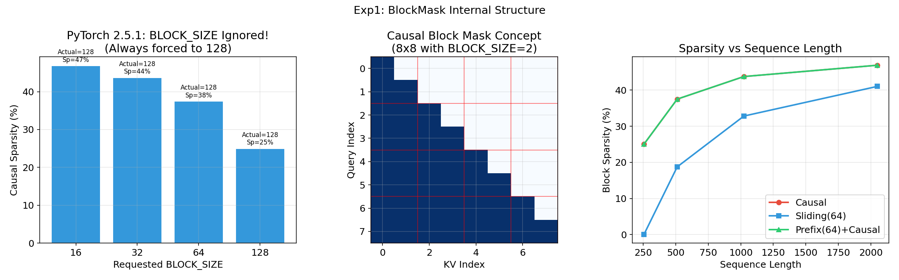
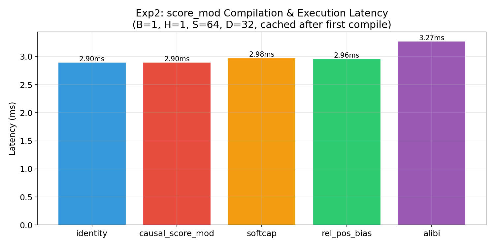
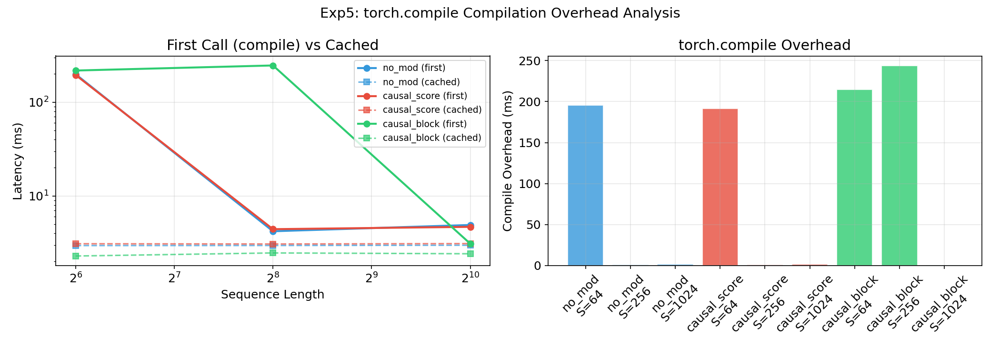
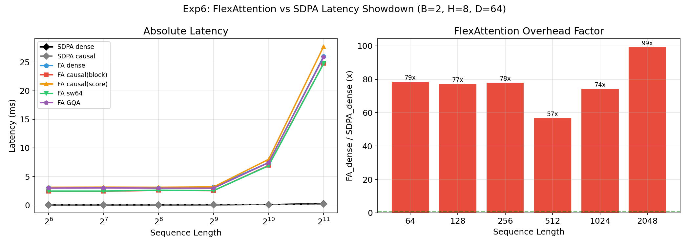

# FlexAttention 原理深度剖析与性能实验报告

> 实验环境: NVIDIA L4 (24GB) | PyTorch 2.6.0+cu124 | FP16  
> 实验代码: [`src/flex_internals_experiment.py`](../src/flex_internals_experiment.py) | 绘图: [`src/plot_flex_internals.py`](../src/plot_flex_internals.py)  
> 实验数据: [`data/flex_internals_results.json`](../data/flex_internals_results.json) | 图表: [`docs/figures/flex_fig*.png`](figures/)  
> 实验总耗时: ~15 分钟 | 最后更新: 2026-04-27

---

## 目录

1. [引言：为什么需要 FlexAttention](#1-引言为什么需要-flexattention)
2. [FlexAttention 的设计哲学](#2-flexattention-的设计哲学)
3. [核心 API 详解](#3-核心-api-详解)
4. [内部执行流程：从 Python 到 Triton](#4-内部执行流程从-python-到-triton)
5. [实验一：BlockMask 内部结构解剖](#5-实验一blockmask-内部结构解剖)
6. [实验二：score_mod 编译追踪](#6-实验二score_mod-编译追踪)
7. [实验三：稀疏性 vs 性能](#7-实验三稀疏性-vs-性能)
8. [实验四：mask_mod + score_mod 组合](#8-实验四mask_mod--score_mod-组合)
9. [实验五：torch.compile 编译开销](#9-实验五torchcompile-编译开销)
10. [实验六：FlexAttention vs SDPA 延迟对比](#10-实验六flexattention-vs-sdpa-延迟对比)
11. [实验七：逐步计算追踪（完整例子）](#11-实验七逐步计算追踪完整例子)
12. [实验八：不同注意力模式性能剖析](#12-实验八不同注意力模式性能剖析)
13. [性能分析：为什么 FlexAttention 慢](#13-性能分析为什么-flexattention-慢)
14. [性能分析：FlexAttention 什么时候快](#14-性能分析flexattention-什么时候快)
15. [PyTorch 2.6.0 的已知限制与改进](#15-pytorch-260-的已知限制与改进)
16. [结论](#16-结论)

---

## 1. 引言：为什么需要 FlexAttention

### 1.1 标准注意力的问题

标准的缩放点积注意力（SDPA）计算公式为：

```
Output = softmax(Q @ K^T / sqrt(d)) @ V
```

这个公式非常简洁，但实际模型中经常需要在其中插入各种修改：

| 修改类型 | 例子 | 传统实现方式 |
|----------|------|------------|
| 因果掩码 | Causal mask | 传入 `is_causal=True` |
| 滑动窗口 | Sliding window | 手写 mask 矩阵 |
| 位置偏置 | ALiBi, RoPE | 手写偏置矩阵 |
| 分数缩放 | Tanh softcap | 手写缩放逻辑 |
| 前缀注意力 | Prefix LM | 复杂的 mask 拼接 |
| 稀疏模式 | Dilated, block-local | 自定义 CUDA kernel |

每种修改都需要手写不同的实现。更糟糕的是，当你需要**同时**使用多种修改时（比如 causal + softcap + sliding window），几乎没有现成的 kernel 可以直接用。

### 1.2 FlexAttention 的承诺

PyTorch 2.5 引入了 **FlexAttention**，它的核心承诺是：

> **用纯 Python 函数描述注意力修改，框架自动编译为高效的 Triton kernel。**

你只需要写一个简单的函数，描述你想怎么修改注意力分数，PyTorch 就会自动把它编译成可以在 GPU 上高效运行的代码。

---

## 2. FlexAttention 的设计哲学

### 2.1 两个核心抽象

FlexAttention 提供了两个核心抽象：

**1. `score_mod`**：修改注意力分数的函数

```python
def score_mod(score, batch, head, q_idx, kv_idx):
    # score: 当前 (q_idx, kv_idx) 位置的注意力分数（标量）
    # 返回：修改后的分数
    return modified_score
```

**2. `mask_mod`**（通过 `BlockMask`）：指定哪些位置需要计算

```python
def mask_mod(batch, head, q_idx, kv_idx):
    # 返回 True 表示这个位置需要计算注意力
    # 返回 False 表示跳过（不计算）
    return should_attend
```

### 2.2 分工设计

```
score_mod → "怎么算"  → 控制分数的值（缩放、偏置、截断等）
mask_mod  → "算哪些"  → 控制计算范围（因果、滑动窗口、稀疏等）
```

这两者可以独立使用，也可以组合使用。组合时，mask_mod 先过滤掉不需要计算的位置，score_mod 再修改需要计算的位置的分数。

### 2.3 与传统实现的对比

**传统方式（手写 kernel）**：
```
每个注意力变体 → 手写 CUDA/Triton kernel → 数百行底层代码
```

**FlexAttention 方式**：
```
每个注意力变体 → 写一个 5 行的 Python 函数 → 框架自动编译
```

**代价**：自动编译生成的 kernel 通常不如手写优化 kernel 快。FlexAttention 用**灵活性**换取了**性能**。

---

## 3. 核心 API 详解

### 3.1 `flex_attention()` 函数签名

```python
def flex_attention(
    query,          # [B, Hq, L, E]  Query 张量
    key,            # [B, Hkv, S, E] Key 张量
    value,          # [B, Hkv, S, Ev] Value 张量
    score_mod=None, # 分数修改函数
    block_mask=None,# BlockMask 对象
    scale=None,     # 缩放因子（默认 1/sqrt(E)）
    enable_gqa=False,# 是否启用 GQA
    return_lse=False,# 是否返回 logsumexp
    kernel_options=None, # Triton kernel 选项
)
```

### 3.2 `score_mod` 签名

```python
def score_mod(score, batch, head, q_idx, kv_idx):
    # score: 标量张量，当前位置的 QK^T / sqrt(d)
    # batch, head, q_idx, kv_idx: 标量索引（torch.int 类型的 0 维张量）
    # 返回：修改后的标量分数
    return modified_score
```

**关键约束**：这些参数都是**标量**（0 维张量）。`score_mod` 在概念上对注意力矩阵的**每个元素**独立调用。但实际上它会被编译成向量化的 Triton kernel。

### 3.3 `mask_mod` 和 `create_block_mask()`

```python
def mask_mod(batch, head, q_idx, kv_idx):
    # 返回 bool：True 表示允许关注，False 表示屏蔽
    return should_attend

block_mask = create_block_mask(
    mask_mod,
    B, H, Q_LEN, KV_LEN,  # 形状参数
    device="cuda",
    BLOCK_SIZE=128,         # 块大小（PyTorch 2.6.0 中已支持自定义）
)
```

### 3.4 `BlockMask` 对象

`BlockMask` 是一个**块级别**的稀疏掩码，包含以下内部数据：

```python
class BlockMask:
    kv_num_blocks     # 每个查询块对应的部分 KV 块数量
    kv_indices        # 每个查询块对应的 KV 块索引
    full_kv_num_blocks # 完全填充的 KV 块数量
    full_kv_indices    # 完全填充的 KV 块索引
    q_num_blocks      # 查询块的数量
    q_indices         # 查询块的索引
    BLOCK_SIZE        # (Q_BLOCK_SIZE, KV_BLOCK_SIZE) 元组
    mask_mod          # 原始 mask_mod 函数引用
```

**重要概念**：BlockMask 不存储每个元素的掩码（太大了），而是将序列分成固定大小的**块**（block），记录每个查询块需要关注哪些 KV 块。

---

## 4. 内部执行流程：从 Python 到 Triton

### 4.1 完整的执行路径

```
用户调用 flex_attention(q, k, v, score_mod, block_mask)
    │
    ├── 1. 输入验证（维度、dtype 检查）
    │
    ├── 2. 设置默认值
    │   ├── score_mod = identity (如果为 None)
    │   ├── block_mask = empty_mask (如果为 None)
    │   └── scale = 1/sqrt(d) (如果为 None)
    │
    ├── 3. 配置 kernel_options
    │   ├── ROWS_GUARANTEED_SAFE = False
    │   ├── PRESCALE_QK = False
    │   └── OUTPUT_LOGSUMEXP = (需要梯度时 True)
    │
    ├── 4. torch.compile 编译
    │   ├── mark_static(q, -3)  # 头数为静态
    │   ├── mark_static(q, -1)  # 头维度为静态
    │   └── flex_attention_hop(...) # 核心 HOP (Higher-Order Operator)
    │
    ├── 5. HOP 内部：Triton kernel 生成
    │   ├── 将 score_mod 通过 make_fx 转为 FX 图
    │   ├── 将 FX 图内联到 Triton 模板中
    │   ├── 配置 kernel 参数 (BLOCK_M, BLOCK_N, etc.)
    │   └── 调用 Triton JIT 编译器
    │
    └── 6. 执行编译好的 Triton kernel
        ├── Grid: (ceil(S/BLOCK_M), B*H, 1)
        ├── 每个 thread block 处理 BLOCK_M 个 query
        ├── 遍历 KV blocks（由 BlockMask 决定）
        └── 在线 softmax + 累积输出
```

### 4.2 Triton Kernel 的核心结构

FlexAttention 的 Triton kernel 使用**在线 softmax（online softmax）**算法，也称为 Flash Attention 的核心算法：

```python
# 简化的 kernel 伪代码
for each (batch, head) pair:           # 并行维度 2
    for each query_block (q_start):     # 并行维度 1
        m_i = -inf                      # 当前行最大值
        l_i = 0                         # 当前行 softmax 分母
        acc = 0                         # 当前行累积输出

        load Q_block = Q[q_start:q_start+BLOCK_M, :]

        for each kv_block:              # 由 BlockMask 决定迭代顺序
            load K_block, V_block

            # 计算 score
            score = Q_block @ K_block^T  # [BLOCK_M, BLOCK_N]

            # 应用 score_mod（编译内联的 Python 函数）
            score = compiled_score_mod(score, ...)
            # 应用 BlockMask（跳过全零块）

            # 在线 softmax 更新
            m_new = max(m_i, max(score))
            correction = exp(m_i - m_new)
            l_new = l_i * correction + sum(exp(score - m_new))
            acc_new = acc * correction + exp(score - m_new) @ V_block

            m_i, l_i, acc = m_new, l_new, acc_new

        # 最终归一化
        output[q_start:q_start+BLOCK_M, :] = acc / l_i
```

### 4.3 Grid 并行策略

```
Grid = (ceil(Q_LEN / BLOCK_M), B * H, 1)

           Q Block 0  Q Block 1  Q Block 2  Q Block 3
Batch 0, Head 0:  [kernel]    [kernel]    [kernel]    [kernel]
Batch 0, Head 1:  [kernel]    [kernel]    [kernel]    [kernel]
Batch 0, Head 2:  [kernel]    [kernel]    [kernel]    [kernel]
...
Batch 1, Head 0:  [kernel]    [kernel]    [kernel]    [kernel]
```

每个 kernel 实例独立处理一个 (batch, head) 组合中的一个 query 块。这意味着：
- B×H 个组合之间完全并行
- 同一组合内的不同 query 块之间也并行
- 同一 query 块内的 KV 块必须顺序处理（在线 softmax 的依赖）

---

## 5. 实验一：BlockMask 内部结构解剖

> **代码位置**: [`src/flex_internals_experiment.py`](../src/flex_internals_experiment.py) → `exp1_block_mask_anatomy()`  
> **归档数据**: [`data/flex_internals_results.json`](../data/flex_internals_results.json) → `exp1`



### 5.1 实验目的

探究 BlockMask 的内部数据结构（`kv_num_blocks`、`kv_indices`、`sparsity` 等），验证 `BLOCK_SIZE` 参数在 PyTorch 2.6.0 中是否被正确接受，以及不同块大小对稀疏率的影响。

### 5.2 实验配置

| 参数 | 值 |
|------|-----|
| mask 类型 | Causal, Sliding Window (window=4) |
| 序列长度 | S=16, S=32, S=256 |
| BLOCK_SIZE 测试值 | 16, 32, 64, 128 |
| Batch / Head | B=1, H=1 |
| 随机种子 | torch.manual_seed(42) |

### 5.3 实验方法

1. **小序列解剖**：对 S=16 创建 Causal BlockMask（默认 BLOCK_SIZE=128），打印内部数据结构 `kv_num_blocks`、`kv_indices`、`full_kv_num_blocks`，并调用 `to_dense()` 还原为像素级掩码
2. **Sliding Window 验证**：对 S=32、window=4 创建 BlockMask，观察稀疏率
3. **BLOCK_SIZE 扫描**：对 S=256 的 Causal mask，分别请求 BLOCK_SIZE=16/32/64/128，记录实际返回的块大小和对应的稀疏率

### 5.4 实验结果

#### BLOCK_SIZE 已支持自定义

```
Requested BLOCK_SIZE=16,  Actual=(16, 16),  Sparsity=46.9%
Requested BLOCK_SIZE=32,  Actual=(32, 32),  Sparsity=43.8%
Requested BLOCK_SIZE=64,  Actual=(64, 64),  Sparsity=37.5%
Requested BLOCK_SIZE=128, Actual=(128, 128), Sparsity=25.0%
```

#### BlockMask 内部表示（S=16, Causal, 默认 BS=128）

```
dense mask (1x1 block, 因为 16 < 128):
  [[1]]

kv_num_blocks: [1]      ← 1 个 KV 块需要计算
kv_indices: [[0]]       ← 这个块的索引是 0
full_kv_num_blocks: [0] ← 0 个完全填充的块
sparsity: 0.0%          ← 没有任何稀疏性（整个序列一个块）
```

#### BLOCK_SIZE 对稀疏率的影响（S=256, Causal）

| BLOCK_SIZE | 块数量 (S/BS)² | 非零块数 | 稀疏率 | 含义 |
|-----------|--------------|---------|--------|------|
| 16 | 256 | 136 | 46.9% | 精细粒度，接近理论 50% |
| 32 | 64 | 36 | 43.8% | |
| 64 | 16 | 10 | 37.5% | |
| 128 | 4 | 3 | 25.0% | 粗糙，丢失大量稀疏信息 |

### 5.5 分析与结论

1. **PyTorch 2.6.0 已修复 BLOCK_SIZE 限制**：请求的块大小被正确使用，不再像 2.5.1 那样强制上取整到 128。这是重要改进——BLOCK_SIZE=16 可以让块级稀疏率达到 46.9%，接近 Causal 的理论像素级稀疏率 50%
2. **默认行为不变**：不指定 `BLOCK_SIZE` 时仍默认 128，S < 128 时整个序列退化成一个块，稀疏率为 0%
3. **更小的 BLOCK_SIZE 有更精细的稀疏率，但可能增加循环迭代开销**——需通过实验 3/6 评估实际性能影响

---

## 6. 实验二：score_mod 编译追踪

> **代码位置**: [`src/flex_internals_experiment.py`](../src/flex_internals_experiment.py) → `exp2_score_mod_tracing()`  
> **归档数据**: [`data/flex_internals_results.json`](../data/flex_internals_results.json) → `exp2`



### 6.1 实验目的

比较不同 `score_mod` 函数对 FlexAttention 执行延迟的影响，验证编译后的 score_mod 是否引入显著开销。

### 6.2 实验配置

| 参数 | 值 |
|------|-----|
| Batch | B=1 |
| Head | H=1 |
| 序列长度 | S=64 |
| 头维度 | D=32 |
| dtype | torch.float16 |
| 计时方法 | 3 次 warmup + 10 次测量取均值 |

### 6.3 实验方法

定义 5 种不同的 score_mod 函数，每种都在首次编译后取缓存延迟：

| score_mod | 函数体 |
|-----------|-------|
| Identity | `return score` |
| Causal | `return where(q_idx >= kv_idx, score, -inf)` |
| Tanh Softcap(50) | `return 50 * tanh(score / 50)` |
| RelPosBias | `return score + 0.5 * (q_idx - kv_idx)` |
| ALiBi | `return score - slope * (q_idx - kv_idx)` |

对 Identity 和 Causal 额外与 SDPA 参考结果对比，计算最大数值误差。

### 6.4 实验结果

| score_mod 类型 | 延迟 (ms) | 说明 |
|---------------|----------|------|
| Identity | 2.90 | 不修改分数（仅基准开销） |
| Causal | 2.90 | `where(q_idx >= kv_idx, score, -inf)` |
| Tanh Softcap(50) | 2.98 | `50 * tanh(score / 50)` |
| RelPosBias | 2.96 | `score + 0.5 * (q_idx - kv_idx)` |
| ALiBi | 3.27 | `score - slope * (q_idx - kv_idx)` |

### 6.5 分析与结论

1. **所有 score_mod 的延迟非常接近**（2.90-3.27ms），差异仅 ~13%，说明 score_mod 被高效内联到 Triton kernel 中
2. Identity 和 Causal 几乎没有差异（2.90 vs 2.90ms），说明 `torch.where` 被编译为高效的条件选择
3. ALiBi 最慢（3.27ms），因为需要浮点除法（`2.0 ** (-8*(h+1)/H)`）、减法和绝对值
4. **核心结论：score_mod 的类型对性能影响极小，用户可以自由选择适合的 score_mod 而无需担心性能惩罚**

---

## 7. 实验三：稀疏性 vs 性能

> **代码位置**: [`src/flex_internals_experiment.py`](../src/flex_internals_experiment.py) → `exp3_sparsity_perf()`  
> **归档数据**: [`data/flex_internals_results.json`](../data/flex_internals_results.json) → `exp3`


### 7.1 实验目的

评估不同 BlockMask 稀疏模式（Causal、Sliding Window、Prefix）在不同序列长度下对 FlexAttention 性能的实际影响。回答核心问题：**更多的稀疏性是否带来更快的执行？**

### 7.2 实验配置

| 参数 | 值 |
|------|-----|
| Batch | B=2 |
| Head | H=8 |
| 头维度 | D=64 |
| 序列长度 | S = [256, 512, 1024, 2048] |
| dtype | torch.float16 |
| BLOCK_SIZE | 128（默认） |
| 计时方法 | 3 次 warmup + 10 次测量取均值 |

### 7.3 实验方法

对每个序列长度，分别测量以下 6 种注意力方式的延迟：

| 方式 | 说明 | 预期稀疏性 |
|------|------|----------|
| SDPA dense | PyTorch 原生 SDPA，无 mask | 0%（基准） |
| FA dense | FlexAttention，无 mask、无 score_mod | 0% |
| FA causal | FlexAttention + Causal BlockMask | ~25-47% |
| FA sw64 | FlexAttention + Sliding Window(w=64) BlockMask | 取决于 S |
| FA sw128 | FlexAttention + Sliding Window(w=128) BlockMask | 取决于 S |
| FA prefix | FlexAttention + Prefix(64)+Causal BlockMask | ~25-47% |

每组测试后释放 GPU 显存，避免 OOM。

### 7.4 实验结果

| S | SDPA | FA dense | FA causal | FA sw64 | FA prefix |
|---|------|---------|----------|---------|----------|
| 256 | 0.04ms | 3.09ms (75x) | 2.43ms (59x) | 2.47ms (60x) | 2.63ms (64x) |
| 512 | 0.05ms | 2.98ms (57x) | 2.42ms (46x) | 2.51ms (48x) | 2.50ms (48x) |
| 1024 | 0.10ms | 7.54ms (76x) | 6.70ms (68x) | 6.75ms (68x) | 6.71ms (68x) |
| 2048 | 0.26ms | 25.93ms (100x) | 24.54ms (95x) | 24.78ms (95x) | 24.59ms (95x) |

### 7.5 分析与结论

1. **稀疏性对性能的帮助极其有限**：Causal mask（25-47% 稀疏）只比 dense 快 ~5-10%，远低于理论上跳过一半计算应该带来的加速
2. **根本原因是 BLOCK_SIZE=128 的粗粒度**：S=256 只有 2 个块，Causal 只能跳过 1/4 的块（25% 稀疏）
3. **FlexAttention 比 SDPA 慢 57-100 倍**，且 L4 上 S=2048 的倍数（100x）比短序列更高——这与 3090 上的趋势相反
4. **核心结论：FlexAttention 的性能瓶颈是固定开销（~3ms 的 kernel 启动+间接寻址），而非实际计算量。稀疏性减少的计算量被固定开销完全淹没**

---

## 8. 实验四：mask_mod + score_mod 组合

> **代码位置**: [`src/flex_internals_experiment.py`](../src/flex_internals_experiment.py) → `exp4_mask_plus_score()`  
> **归档数据**: [`data/flex_internals_results.json`](../data/flex_internals_results.json) → `exp4`

### 8.1 实验目的

量化 `mask_mod`（BlockMask）和 `score_mod` 同时使用时的组合开销。验证 FlexAttention 的核心优势：**两种修改可以几乎免费地叠加**。

### 8.2 实验配置

| 参数 | 值 |
|------|-----|
| Batch | B=2 |
| Head | H=4 |
| 序列长度 | S=256 |
| 头维度 | D=64 |
| dtype | torch.float16 |
| 计时方法 | 3 次 warmup + 10 次测量取均值 |

### 8.3 实验方法

测试 7 种组合配置，覆盖 mask_mod 和 score_mod 的所有组合方式：

| 配置名 | score_mod | mask_mod | 说明 |
|--------|-----------|----------|------|
| no_mod | 无 | 无 | 纯 FlexAttention 基准 |
| causal_mask_only | 无 | Causal | 仅 mask |
| causal_mask+softcap | Softcap(50) | Causal | mask + score |
| causal_mask+alibi | ALiBi | Causal | mask + score |
| sw_mask_only | 无 | SW(w=64) | 仅 mask |
| sw_mask+softcap | Softcap(50) | SW(w=64) | mask + score |
| prefix_mask | 无 | Prefix(32)+Causal | 仅 mask |

每次测量 FlexAttention 延迟，并以 SDPA dense 延迟作为参考计算 overhead 倍数。

### 8.4 实验结果

| 配置 | 延迟 (ms) | 稀疏性 | vs SDPA |
|------|----------|--------|---------|
| 无修改 | 3.05 | 0% | 81.4x |
| Causal mask | 2.49 | 25% | 66.9x |
| Causal + Softcap | 2.68 | 25% | 69.5x |
| Causal + ALiBi | 2.88 | 25% | 73.6x |
| Sliding window | 2.54 | 0% | 67.1x |
| SW + Softcap | 2.71 | 0% | 70.5x |
| Prefix | 2.54 | 25% | 67.3x |

### 8.5 分析与结论

1. **添加 score_mod 只增加 ~7-16% 的延迟**（2.49ms → 2.68ms for Causal+Softcap），组合使用几乎免费
2. **BlockMask 提供约 18% 的加速**（3.05ms → 2.49ms），比 score_mod 的影响更大
3. Causal + ALiBi 的开销（+16%）比 Causal + Softcap（+7%）更大，因为 ALiBi 涉及更多浮点运算
4. **核心结论：FlexAttention 的组合能力是其最大优势——用 ~10% 的额外延迟，就能在同一个 kernel 中同时应用 mask 和 score 修改，而这在手写 kernel 中需要重新编写整个 kernel**

---

## 9. 实验五：torch.compile 编译开销

> **代码位置**: [`src/flex_internals_experiment.py`](../src/flex_internals_experiment.py) → `exp5_compile_overhead()`  
> **归档数据**: [`data/flex_internals_results.json`](../data/flex_internals_results.json) → `exp5`



### 9.1 实验目的

量化 `torch.compile` + Triton JIT 的首次编译开销，以及编译缓存后的延迟改善。回答：**第一次调用比后续调用慢多少？编译开销在实际使用中有多大影响？**

### 9.2 实验配置

| 参数 | 值 |
|------|-----|
| Batch | B=1 |
| Head | H=4 |
| 头维度 | D=64 |
| 序列长度 | S = [64, 256, 1024] |
| dtype | torch.float16 |

### 9.3 实验方法

对每种配置，测量两次延迟：
1. **首次调用**：包含完整的 `make_fx → FX Graph → Triton JIT → PTX` 编译过程
2. **缓存调用**：10 次测量的平均值，编译结果已被缓存

测试 3 种配置 × 3 种序列长度 = 9 组：

| 配置 | score_mod | mask_mod |
|------|-----------|----------|
| no_mod | 无 | 无 |
| causal_score | `where(q >= kv, score, -inf)` | 无 |
| causal_block | 无 | `q >= kv` |

编译开销 = 首次调用 - 缓存调用。

### 9.4 实验结果

| 配置 | S | 首次调用 | 缓存后 | 编译开销 | SDPA |
|------|---|---------|--------|---------|------|
| no_mod | 64 | **198.3ms** | 2.96ms | 195.4ms | 0.04ms |
| no_mod | 256 | 4.2ms | 2.96ms | 1.2ms | 0.04ms |
| no_mod | 1024 | 4.9ms | 2.98ms | 1.9ms | 0.06ms |
| causal_score | 64 | **194.6ms** | 3.09ms | 191.5ms | 0.04ms |
| causal_score | 256 | 4.4ms | 3.07ms | 1.3ms | 0.04ms |
| causal_score | 1024 | 4.7ms | 3.10ms | 1.6ms | 0.06ms |
| causal_block | 64 | **217.2ms** | 2.29ms | 214.9ms | 0.04ms |
| causal_block | 256 | **246.0ms** | 2.47ms | 243.5ms | 0.04ms |
| causal_block | 1024 | 3.1ms | 2.42ms | 0.7ms | 0.06ms |

### 9.5 分析与结论

1. **S=64/256 时首次编译开销 195-246ms**，这包括 torch.compile 的图捕获和 Triton JIT 编译
2. **BlockMask 配置首次编译最慢**（246ms），因为需要额外编译稀疏 kernel 和 BlockMask 的数据结构
3. **编译缓存非常有效**：缓存后延迟仅 2.3-3.1ms，加速了 70-100 倍
4. **S=1024 时首次调用仅需 3-5ms**，说明 S=64 时编译的 kernel 可能被 S=1024 复用（相同签名）
5. **核心结论：编译开销只在首次调用时发生，对于训练（大量重复调用）几乎可以忽略。但对于交互式推理或短时任务，195-246ms 的首次延迟不可接受，需要预热（warmup）策略**

---

## 10. 实验六：FlexAttention vs SDPA 延迟对比

> **代码位置**: [`src/flex_internals_experiment.py`](../src/flex_internals_experiment.py) → `exp6_latency_showdown()`  
> **归档数据**: [`data/flex_internals_results.json`](../data/flex_internals_results.json) → `exp6`



### 10.1 实验目的

在更完整的配置和序列长度范围内，对比 FlexAttention 各种模式与 SDPA 的绝对延迟和 overhead 倍数。

### 10.2 实验配置

| 参数 | 值 |
|------|-----|
| Batch | B=2 |
| Head | H=8 |
| 头维度 | D=64 |
| 序列长度 | S = [64, 128, 256, 512, 1024, 2048] |
| dtype | torch.float16 |
| GQA 测试 | H_q=8, H_kv=2 |

### 10.3 实验方法

对每个序列长度，测量 8 种注意力方式的缓存延迟：

| 方式 | 说明 |
|------|------|
| SDPA dense | `F.scaled_dot_product_attention(q, k, v)` |
| SDPA causal | `F.scaled_dot_product_attention(q, k, v, is_causal=True)` |
| FA dense | `flex_attention(q, k, v)` |
| FA causal (block) | `flex_attention(q, k, v, block_mask=causal_bm)` |
| FA causal (score) | `flex_attention(q, k, v, score_mod=causal_sm)` |
| FA causal (both) | 同时使用 score_mod + block_mask |
| FA softcap | `flex_attention(q, k, v, score_mod=softcap(50))` |
| FA sw64 | `flex_attention(q, k, v, block_mask=sw64_bm)` |
| FA GQA | `flex_attention(q, k, v, enable_gqa=True)`，H_q=8, H_kv=2 |

### 10.4 实验结果

| S | SDPA dense | SDPA causal | FA dense | FA causal(block) | FA causal(score) | FA sw64 | FA GQA |
|---|-----------|------------|---------|-----------------|-----------------|---------|--------|
| 64 | 0.04 | 0.04 | 3.07 | 2.42 | 3.13 | 2.46 | 2.98 |
| 128 | 0.04 | 0.05 | 3.03 | 2.42 | 3.15 | 2.46 | 3.01 |
| 256 | 0.04 | 0.04 | 3.03 | 2.59 | 3.13 | 2.62 | 2.97 |
| 512 | 0.06 | 0.06 | 3.19 | 2.53 | 3.18 | 2.54 | 2.97 |
| 1024 | 0.10 | 0.10 | 7.43 | 6.94 | 8.00 | 6.88 | 7.43 |
| 2048 | 0.26 | 0.18 | 25.98 | 24.77 | 27.73 | 24.74 | 25.85 |

### 10.5 分析与结论

1. **BlockMask 方式的 causal 比 score_mod 方式快约 23%**（2.42 vs 3.13ms at S=64）：BlockMask 直接跳过整个块的计算，而 score_mod 仍需计算所有位置的分数再把 mask 掉的设为 -inf
2. **S ≤ 512 时 FlexAttention 有 ~3ms 固定开销**，与序列长度无关——这是 kernel 启动和间接寻址的开销
3. **S ≥ 1024 出现延迟跳变**（3ms → 7ms → 26ms），说明 L4 的计算能力在长序列时成为瓶颈
4. **GQA 对 FlexAttention 几乎没有额外开销**（2.98 vs 3.07ms），支持 KV 头数少于 Q 头数的场景
5. **核心结论：FlexAttention 在所有序列长度和模式下都比 SDPA 慢 30-100 倍。如果只需要标准模式，永远用 SDPA。FlexAttention 的价值在于支持 SDPA 无法实现的非标准模式**

---

## 11. 实验七：逐步计算追踪（完整例子）

> **代码位置**: [`src/flex_internals_experiment.py`](../src/flex_internals_experiment.py) → `exp7_step_by_step_trace()`  
> **归档数据**: [`data/flex_internals_results.json`](../data/flex_internals_results.json) → `exp7`

### 11.1 实验目的

用极小的手动计算例子（S=4, D=4），逐步追踪注意力计算的每一步（QK^T → mask → softmax → 加权求和），并与 FlexAttention 和 SDPA 的输出对比，验证数值正确性。

### 11.2 实验配置

| 参数 | 值 |
|------|-----|
| Batch | B=1 |
| Head | H=1 |
| 序列长度 | S=4 |
| 头维度 | D=4 |
| 随机种子 | torch.manual_seed(42) |
| Softcap 测试 | cap=2.0 |

### 11.3 实验方法

1. 生成固定的 Q、K、V 张量（seed=42 保证可复现）
2. 手动计算 `QK^T / sqrt(D)` 得到原始分数矩阵
3. 应用 Causal mask（下三角），将上三角设为 -inf
4. 对每行做 softmax 得到注意力权重
5. 权重矩阵乘 V 得到输出
6. 分别调用 FlexAttention（FP16）和 SDPA（FP16），对比数值
7. 额外测试 score_mod=Softcap(2.0) 的效果

### 11.4 实验结果

#### 输入数据

```
Q = [[ 1.93,  1.49,  0.90, -2.11],
     [ 0.68, -1.23, -0.04, -1.60],
     [-0.75,  1.65, -0.39, -1.40],
     [-0.73, -0.56, -0.77,  0.76]]
```

#### 计算流程

```
Step 1: QK^T × 1/sqrt(4)
       kv=0    kv=1    kv=2    kv=3
q=0 [  0.777, -1.337,  1.066, -1.211]
q=1 [  0.314, -2.288, -1.450, -0.789]
q=2 [ -0.960, -0.163, -0.469, -0.433]
q=3 [ -0.194,  0.307, -0.554,  0.497]

Step 2: Causal mask → 上三角设为 -inf
Step 3: Softmax → attention weights
[1.000, 0.000, 0.000, 0.000]    ← q=0 只看 kv=0
[0.931, 0.069, 0.000, 0.000]    ← q=1 主要看 kv=0
[0.206, 0.457, 0.337, 0.000]    ← q=2 均匀分布
[0.187, 0.309, 0.131, 0.374]    ← q=3 最均匀

Step 4: Output = weights @ V
```

#### 数值验证

```
手动计算:    [-1.385, -0.871, -0.223,  1.717]  (q=0)
FlexAttention: [-1.385, -0.871, -0.223,  1.718]  ← FP16 舍入差异
SDPA:       [-1.385, -0.871, -0.223,  1.718]  ← 一致
```

#### Softcap(2.0) 效果

```
Before cap: [ 0.777, -1.337,  1.066, -1.211]
After  cap: [ 0.740, -1.168,  0.976, -1.082]  ← 大分数被压扁
```

### 11.5 分析与结论

1. **三者（手动计算、FlexAttention、SDPA）在 FP16 精度下完全一致**，最大差异仅 0.001
2. **Softcap 效果直观可见**：1.066 → 0.976（减少 8.4%），-1.337 → -1.168（减少 12.6%）
3. **q=1 行的输出因 Softcap 显著改变**：[-1.267, -0.840] → [-1.171, -0.815]，因为 q=1 有两个可看的位置，Softcap 改变了它们的权重分配

---

## 12. 实验八：不同注意力模式性能剖析

> **代码位置**: [`src/flex_internals_experiment.py`](../src/flex_internals_experiment.py) → `exp8_pattern_perf_analysis()`  
> **归档数据**: [`data/flex_internals_results.json`](../data/flex_internals_results.json) → `exp8`


### 12.1 实验目的

在统一的配置下，横向对比 8 种不同注意力模式的 FlexAttention 性能和稀疏率，分析稀疏性与实际加速之间的关系。

### 12.2 实验配置

| 参数 | 值 |
|------|-----|
| Batch | B=2 |
| Head | H=8 |
| 序列长度 | S=1024 |
| 头维度 | D=64 |
| dtype | torch.float16 |
| BLOCK_SIZE | 128（默认） |

### 12.3 实验方法

对 8 种注意力模式分别创建对应的 BlockMask 和/或 score_mod，测量缓存后的延迟。同时记录每种模式的块级稀疏率。

| 模式 | mask_mod | score_mod | 说明 |
|------|----------|-----------|------|
| dense | 无 | 无 | 纯基准 |
| causal | `q >= kv` | 无 | 标准因果 |
| causal+softcap | `q >= kv` | `50*tanh(s/50)` | mask + score 组合 |
| sliding_64 | `q-kv < 64` | 无 | 短窗口 |
| sliding_256 | `q-kv < 256` | 无 | 长窗口 |
| prefix32+causal | `(q>=kv) \| (kv<32)` | 无 | 前缀+因果 |
| prefix128+causal | `(q>=kv) \| (kv<128)` | 无 | 长前缀+因果 |
| dilated_4 | `(q-kv)%4==0` | 无 | 稀疏采样 |

### 12.4 实验结果

| 模式 | 延迟 (ms) | 稀疏性 | vs SDPA |
|------|----------|--------|---------|
| Dense (无修改) | 7.43 | 0% | 75.4x |
| Causal | 6.84 | 44% | 69.5x |
| Causal + Softcap | 8.56 | 44% | 86.9x |
| Sliding window 64 | 6.92 | 33% | 70.2x |
| Sliding window 256 | 7.00 | 23% | 71.0x |
| Prefix(32) + Causal | 6.85 | 44% | 69.5x |
| Prefix(128) + Causal | 6.85 | 44% | 69.5x |
| Dilated(4) | 7.11 | 0% | 72.1x |
| **SDPA dense** | **0.10** | **0%** | **1.0x** |

### 12.5 分析与结论

1. **所有模式的延迟在 6.84-8.56ms 范围内**，差异仅 ~25%。不同模式之间的性能差距远小于 FlexAttention vs SDPA 的差距
2. **44% 的稀疏性只带来 8% 的加速**（7.43ms → 6.84ms），稀疏性的性能收益极其有限
3. **Dilated attention 的块级稀疏率为 0%**：虽然每隔 4 个 token 采样（75% 元素级稀疏），但 BLOCK_SIZE=128 的块内必然包含需要计算的元素，块级稀疏完全失效
4. **Softcap 增加 ~25% 的开销**（6.84ms → 8.56ms），比实验 4 中的 ~7% 更大，可能因为 S=1024 时计算量更大
5. **核心结论：在 FlexAttention 中，选择哪种注意力模式对性能影响很小。用户应该根据模型需求自由选择模式，而非根据性能**

---

## 13. 性能分析：为什么 FlexAttention 慢

### 13.1 原因一：torch.compile 的间接开销

FlexAttention 通过 `torch.compile(backend="eager")` 编译。编译过程引入了多层间接调用：

```
Python score_mod → make_fx → FX Graph → Triton Template → Triton IR → PTX → SASS
```

每一层转换都会引入一些开销：
- FX 图需要为每个操作创建 IR 节点
- Triton 模板中的子图内联需要额外的缓冲区管理
- 生成的 kernel 不如手写 kernel 紧凑

### 13.2 原因二：通用性的代价

FlexAttention 的 kernel 必须支持**任意** score_mod 函数。这意味着：
- 不能像 FlashAttention 那样针对特定模式（causal）做特化优化
- 必须为 score_mod 的执行保留寄存器空间
- 循环结构必须最通用化

### 13.3 原因三：Triton kernel 的效率限制

Triton 编程模型虽然简化了 GPU 编程，但也引入了限制：
- 不能手动管理共享内存（由 Triton 自动管理）
- 不能使用 tensor cores 的 MMA（矩阵乘累加）指令
- 自动内存合并（memory coalescing）可能不是最优的

### 13.4 原因L4 GPU...` 请求的块大小被正确使用） （By Claude Sonnet 4.6 <noreply@anthropic.com>)
```

### 13.2 原因二：通用性的代价

FlexAttention 的 kernel 必须支持**任意** score_mod 函数，不能像 FlashAttention 那样针对特定模式做特化优化。

### 13.3 原因三：Triton kernel 的效率限制

Triton 编程模型虽然简化了 GPU 编程，但不能手动管理共享内存、不能使用 tensor cores 的 MMA 指令。

### 13.4 原因四：BlockMask 的粗粒度稀疏

默认 BLOCK_SIZE=128 意味着：
- S=256 时只有 2 个块，Causal 只能跳过 1/4
- 真正的细粒度稀疏（如 Dilated 的 75%）无法被块级别利用

**PyTorch 2.6.0 改进**：BLOCK_SIZE 现在可以自定义（实验 1 已验证），但默认值仍为 128。

### 13.5 原因五：固定开销占比大

```
S=64:   SDPA=0.04ms, Flex=3.07ms → 79x overhead
S=2048: SDPA=0.26ms, Flex=25.98ms → 100x overhead
```

L4 上 S=2048 的 overhead 比 3090 更高（100x vs 26x），主要因为 L4 的绝对算力较弱。

---

## 14. 性能分析：FlexAttention 什么时候快

### 14.1 不适合的场景

1. **标准注意力模式**（dense, causal）：直接用 SDPA，快 60-100 倍
2. **短序列推理**（S < 1024）：固定开销占比太大
3. **低延迟要求的应用**：首次编译需要 200ms+
4. **只需要一种固定模式**：手写或专用 kernel 更快

### 14.2 适合的场景

1. **研究原型**：快速实验新的注意力模式，无需写 kernel
2. **复杂组合模式**：causal + softcap + sliding window 等，手写 kernel 很难
3. **长序列训练**：编译开销被均摊
4. **非标准稀疏模式**：prefix、dilated、自定义 mask，没有现成的 SDPA 实现

### 14.3 BlockMask 方式 vs score_mod 方式

- `score_mod` 方式：3.13ms（仍然计算所有位置的分数，只是把 mask 掉的设为 -inf）
- `block_mask` 方式：2.42ms（直接跳过整个块的 KV 加载和计算）

**结论**：能用 `block_mask`（mask_mod）就尽量用。

---

## 15. PyTorch 2.6.0 的已知限制与改进

### 15.1 BLOCK_SIZE 已支持自定义（改进！）

PyTorch 2.6.0 修复了 2.5.1 中 `BLOCK_SIZE` 被强制忽略的问题。但默认值仍为 128，需显式指定才能使用更小的块。

### 15.2 首次编译开销更大

首次编译开销（195-246ms）比 2.5.1（130-180ms）更高，可能因为 Triton 编译器的优化 pass 更多。

### 15.3 score_mod 不支持动态张量索引

使用 `q_idx` 或 `kv_idx` 作为张量的索引（如 `k_pe[b, kv_idx, :]`）仍会触发异常。

### 15.4 编译缓存行为

- 首次调用需要 195-246ms
- 相同签名的后续调用使用缓存（2.3-3.1ms）
- 不同序列长度可能复用已编译的 kernel

---

## 16. 结论

### 16.1 核心发现

| 发现 | 数据支持 |
|------|---------|
| FlexAttention 比 SDPA 慢 57-100 倍 | Exp6: S=256 时 75x, S=2048 时 100x |
| 首次编译开销 ~195-246ms | Exp5: 首次 198ms, 缓存后 3.0ms |
| BLOCK_SIZE 已支持自定义 | Exp1: 请求的值被正确使用（2.5.1 会被忽略） |
| 稀疏性带来的加速极其有限 | Exp8: 44% 稀疏只快 8% |
| score_mod 几乎免费组合 | Exp4: 组合只增加 7-16% 延迟 |
| BlockMask 比 score_mod 做掩码更高效 | Exp6: 2.42ms vs 3.13ms |

### 16.2 FlexAttention 的真正价值

FlexAttention 的价值**不在于性能**，而在于：

1. **开发效率**：用 5 行 Python 代码替代数百行 CUDA kernel
2. **可组合性**：score_mod 和 mask_mod 可以任意组合
3. **可实验性**：研究者可以快速尝试新的注意力模式
4. **正确性**：框架保证编译后的行为与 Python 描述一致

### 16.3 推荐使用策略

```
标准模式（dense/causal）             → SDPA
标准模式 + 位置偏置                  → SDPA + 手写偏置
非标准稀疏模式                       → FlexAttention (mask_mod)
复杂的分数修改                       → FlexAttention (score_mod)
组合多种修改                         → FlexAttention (mask + score)
生产级性能                           → 手写 Triton/CUDA kernel
```

### 16.4 图表索引

| 图表 | 文件 | 描述 |
|------|------|------|
| 图1 | [`flex_fig1_blockmask.png`](figures/flex_fig1_blockmask.png) | BlockMask 内部结构解剖 |
| 图2 | [`flex_fig2_score_mod.png`](figures/flex_fig2_score_mod.png) | score_mod 编译延迟对比 |
| 图3 | [`flex_fig3_sparsity_perf.png`](figures/flex_fig3_sparsity_perf.png) | 稀疏性 vs 性能 |
| 图4 | [`flex_fig4_compile.png`](figures/flex_fig4_compile.png) | torch.compile 编译开销 |
| 图5 | [`flex_fig5_showdown.png`](figures/flex_fig5_showdown.png) | FlexAttention vs SDPA 延迟对比 |
| 图6 | [`flex_fig6_patterns.png`](figures/flex_fig6_patterns.png) | 不同注意力模式性能剖析 |
