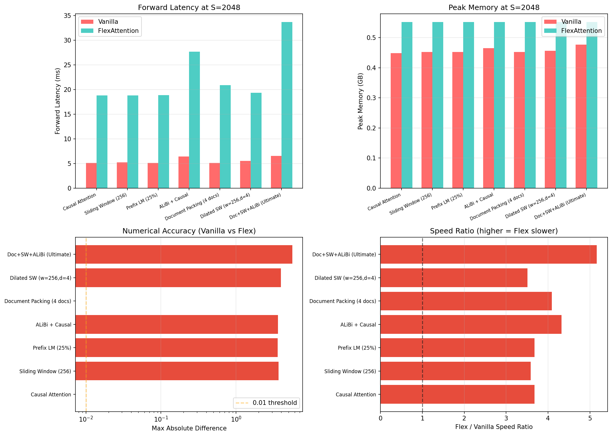
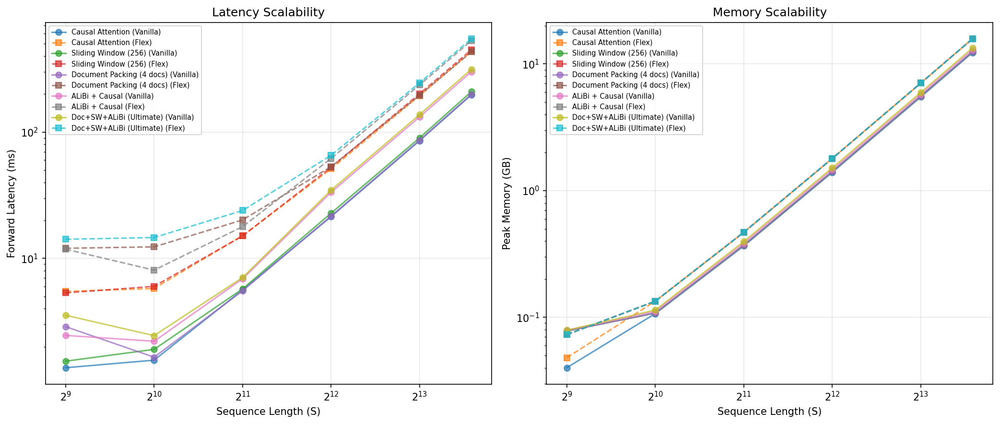
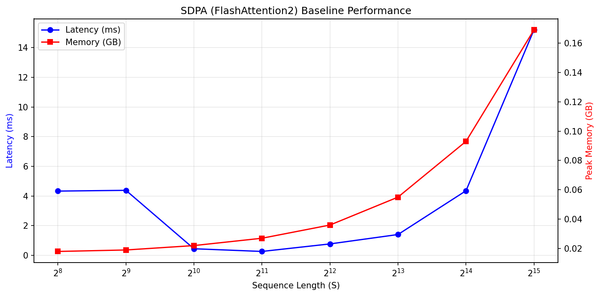
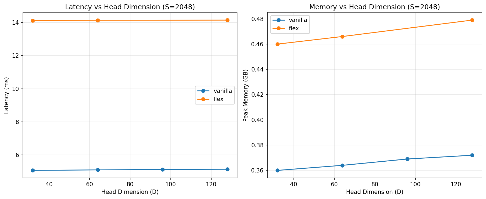
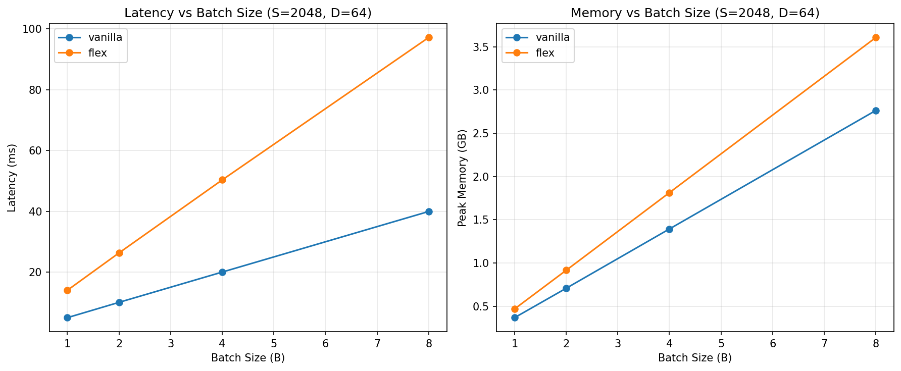
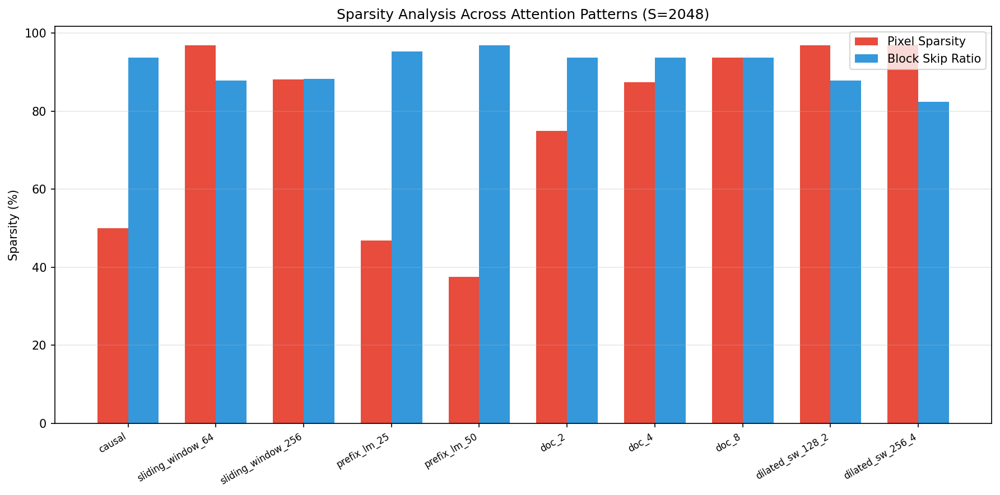
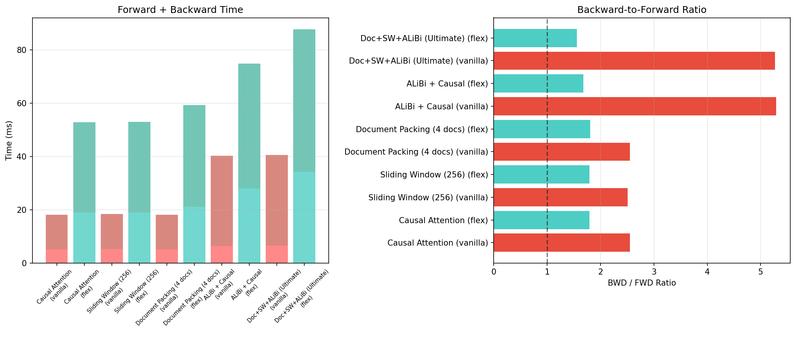
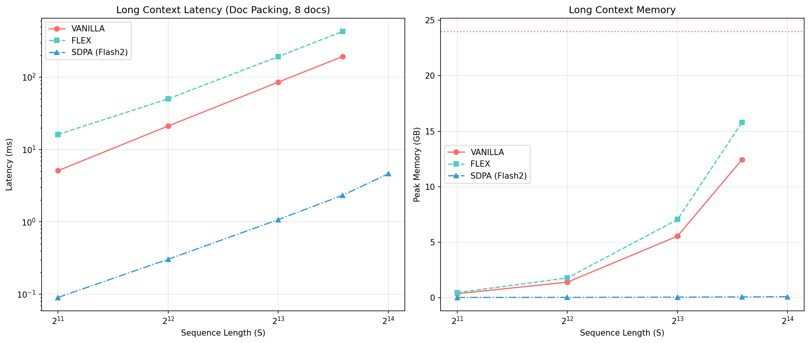
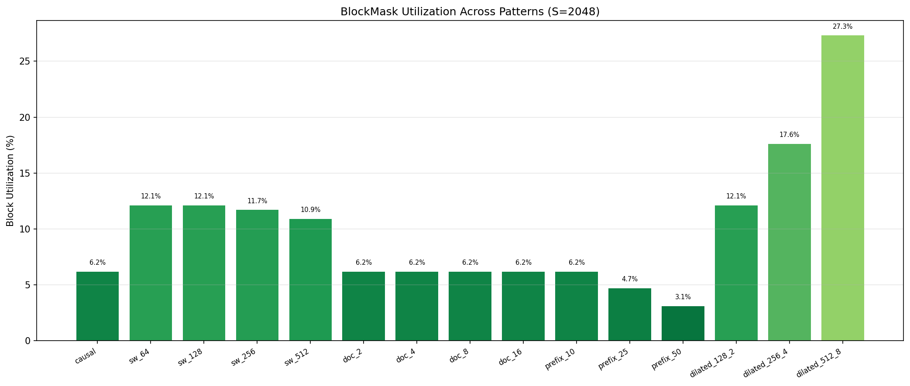

# FlexAttention 注意力模式全解析：8种模式 × 3种实现

> **从 attention-gym 出发，逐一实现、对比实验、讲透原理。**
>
> NVIDIA L4 (24GB) | PyTorch 2.6.0+cu124 | Triton 3.2.0

---

## 第一章：为什么需要不同的注意力模式？

### 1.1 背景

标准 Causal Attention（因果注意力）只是大模型中最基础的注意力模式。在实际训练和推理中，我们遇到了越来越多样化的需求：

| 模式 | 典型应用 | 核心思想 |
|------|---------|---------|
| Causal | GPT 系列 | 每个 token 只能看到过去 |
| Sliding Window | Mistral, Gemma | 只看固定窗口内的 token，降低复杂度 |
| Prefix LM | T5, Flan-T5 | 前缀双向、后缀因果 |
| ALiBi | BLOOM, Baichuan | 用线性偏置代替位置编码 |
| Softcapping | Gemma-2, Grok-1 | 用 tanh 截断 logits，防止数值爆炸 |
| Document Packing | 多文档训练 | 多个独立序列打包到同一 batch |
| Dilated Sliding Window | 长文档建模 | 在窗口内按固定间隔采样 |
| Combined | 实际生产 | 以上模式的任意组合 |

### 1.2 核心问题

**SDPA（`F.scaled_dot_product_attention`）只支持标准 Causal 模式。** 一旦你的模型需要 Sliding Window、ALiBi、Document Packing 中的任何一个，SDPA 就无能为力。你只能：
1. 用 Vanilla PyTorch 手写（慢、吃显存）
2. 写自定义 CUDA 内核（500-1000行、难维护）
3. 用 FlexAttention（3行 Python、自动编译为 Triton 内核）

---

## 第二章：8种注意力模式逐一解析

### 2.1 Causal Attention（因果注意力）

**原理**：最基础的注意力模式。每个 token 只能关注自己和之前的 token。

```
    0  1  2  3  4
0 [█  .  .  .  .]   token 0 只看自己
1 [█  █  .  .  .]   token 1 看 0,1
2 [█  █  █  .  .]   token 2 看 0,1,2
3 [█  █  █  █  .]   token 3 看 0,1,2,3
4 [█  █  █  █  █]   token 4 看全部
```

**Vanilla 实现**（5行）：
```python
scores = torch.matmul(q, k.transpose(-2, -1)) / (D ** 0.5)
causal = torch.ones(S, S, dtype=torch.bool).tril_()
scores = scores.masked_fill(~causal, float('-inf'))
weights = F.softmax(scores.float(), dim=-1).to(dtype)
output = torch.matmul(weights, v)
```

**FlexAttention 实现**（2行）：
```python
block_mask = create_block_mask(lambda b, h, q, kv: q >= kv, B, 1, S, S, device="cuda")
output = flex_attention(q, k, v, block_mask=block_mask)
```

**稀疏率**：50%（上三角全部被屏蔽）

---

### 2.2 Sliding Window Attention（滑动窗口注意力）

**原理**：来自 Mistral 论文。每个 token 只看固定窗口大小内的过去 token。窗口外的不参与计算。

```
窗口大小 = 2
    0  1  2  3  4
0 [█  .  .  .  .]
1 [█  █  .  .  .]
2 [.  █  █  .  .]   token 2 只看 1,2
3 [.  .  █  █  .]   token 3 只看 2,3
4 [.  .  .  █  █]   token 4 只看 3,4
```

**Vanilla 实现**：
```python
pos = torch.arange(S)
causal = pos.unsqueeze(0) >= pos.unsqueeze(1)
window = (pos.unsqueeze(0) - pos.unsqueeze(1)) <= window_size
mask = causal & window
scores = scores.masked_fill(~mask, float('-inf'))
```

**FlexAttention 实现**：
```python
def sw_mask(b, h, q_idx, kv_idx):
    return (q_idx >= kv_idx) & ((q_idx - kv_idx) <= window_size)
```

**稀疏率**：
- 窗口=64：96.9%
- 窗口=256：88.2%

窗口越小，稀疏率越高，FlexAttention 能跳过更多无用计算。

---

### 2.3 Prefix LM（前缀语言模型）

**原理**：用于 T5、Flan-T5 等 encoder-decoder 模型。前缀部分（如输入 prompt）是双向的——互相可见；后缀部分（如生成的回答）是因果的。

```
前缀长度 = 2
    0  1  2  3  4
0 [█  █  .  .  .]   前缀内：双向
1 [█  █  .  .  .]   前缀内：双向
2 [█  █  █  .  .]   后缀：因果，但能看到全部前缀
3 [█  █  █  █  .]
4 [█  █  █  █  █]
```

**FlexAttention 实现**：
```python
def prefix_mask(b, h, q_idx, kv_idx):
    causal = q_idx >= kv_idx
    prefix = kv_idx < prefix_length  # 所有 token 都能看到前缀
    return causal | prefix
```

**稀疏率**：
- 25% 前缀：46.9%（因为前缀区域是双向的，稀疏率反而低于纯因果）
- 50% 前缀：37.5%

---

### 2.4 ALiBi（Attention with Linear Biases）

**原理**：来自 BLOOM 模型。不使用位置编码，而是在注意力分数上加上一个与距离成正比的偏置。不同 Head 使用不同的衰减速率。

```
Head h 的偏置矩阵（对角线为0，越远越负）：
    0     1     2     3     4
0 [ 0  -1.0 -2.0  -3.0  -4.0]
1 [ 0    0  -1.0  -2.0  -3.0]
2 [ 0    0    0   -1.0  -2.0]
3 [ 0    0    0     0   -1.0]
4 [ 0    0    0     0     0 ]

斜率 slope_h = 2^(-8*(h+1)/H)，每个 Head 不同
```

**Vanilla 实现**（需要 for 循环遍历 Head！）：
```python
slopes = torch.tensor([2 ** (-8 * (h+1) / H) for h in range(H)])
dist = (pos.unsqueeze(0) - pos.unsqueeze(1)).abs().float()
for h in range(H):  # 必须循环！每个 Head 偏置不同
    scores[:, h] -= slopes[h] * dist
```

**FlexAttention 实现**（无需循环！）：
```python
def alibi_score(score, b, h, q_idx, kv_idx):
    return score - slopes[h] * (q_idx - kv_idx).abs()
# score_mod 直接在编译后的 kernel 中并行处理每个 Head
```

**关键区别**：ALiBi 使用 `score_mod`（修改分数值）而非 `mask_mod`（True/False 掩码）。FlexAttention 将 score_mod 编译进 Triton kernel 中，在寄存器级别执行。

---

### 2.5 Tanh Softcapping（tanh 截断）

**原理**：来自 Gemma-2 和 Grok-1。在 softmax 之前对分数做 `soft_cap * tanh(score / soft_cap)`，防止 logits 过大导致数值不稳定。

```
原始分数: [-100, -50, 0, 50, 100]
tanh截断后: [-50, -50, 0, 50, 50]  (cap=50时)
         ↑ 极端值被压缩到 [-cap, cap] 范围
```

**Vanilla 实现**：
```python
scores = cap * torch.tanh(scores / cap)  # 在 softmax 之前
weights = F.softmax(scores, dim=-1)
```

**FlexAttention 实现**：
```python
def softcap_score(score, b, h, q_idx, kv_idx):
    return soft_cap * torch.tanh(score / soft_cap)
```

---

### 2.6 Document Packing + Causal（文档打包）

**原理**：将多个短文档打包成一个长序列。每个文档内的 token 只能看到同文档内的过去 token，不能跨文档。

**稀疏率**：
- 2个文档：75.0%
- 4个文档：87.5%
- 8个文档：93.7%
- 16个文档：96.8%

文档越多，跨文档的屏蔽区域越大，FlexAttention 能跳过的计算越多。

---

### 2.7 Dilated Sliding Window（膨胀滑动窗口）

**原理**：在滑动窗口的基础上，按固定间隔（dilation）采样。类似于膨胀卷积（dilated convolution）的思想。

```
窗口=4, 膨胀=2
    0  1  2  3  4  5  6
0 [█  .  .  .  .  .  .]
1 [█  █  .  .  .  .  .]
2 [█  .  █  .  .  .  .]   token 2 看 0,2（跳过1）
3 [.  █  .  █  .  .  .]   token 3 看 1,3（跳过2）
4 [.  .  █  .  █  .  .]
5 [.  .  .  █  .  █  .]
6 [.  .  .  .  █  .  █]
```

**稀疏率**：
- 窗口=128, 膨胀=2：96.9%
- 窗口=256, 膨胀=4：97.0%

极高的稀疏率意味着 FlexAttention 可以跳过绝大多数计算。

---

### 2.8 Combined：终极组合

**原理**：实际生产中，经常需要同时满足多个约束。例如 Document Packing + Sliding Window + ALiBi 的组合：

```python
# 终极组合的 FlexAttention 实现
def ultimate_mask(b, h, q_idx, kv_idx):
    causal = q_idx >= kv_idx
    window = (q_idx - kv_idx) <= 256
    doc = doc_ids[q_idx] == doc_ids[kv_idx]
    return causal & window & doc

def ultimate_score(score, b, h, q_idx, kv_idx):
    return score - slopes[h] * (q_idx - kv_idx).abs()
```

**SDPA 无法实现这种组合！** 这是 FlexAttention 的核心价值。

---

## 第三章：实验结果

### 3.1 全模式对比：Vanilla vs FlexAttention（实验E1）



**S=2048 下的前向延迟**：

| 模式 | Vanilla (ms) | Flex (ms) | 速度比 (Flex/Vanilla) | 数值误差 |
|------|-------------|-----------|---------------------|---------|
| Causal | 5.1 | 18.8 | 3.7x | 0.0 |
| Sliding Window | 5.2 | 18.8 | 3.6x | 3.68 |
| Prefix LM | 5.1 | 18.8 | 3.7x | 3.59 |
| ALiBi | 6.4 | 27.6 | 4.3x | 3.61 |
| Document Packing | 5.1 | 20.9 | 4.1x | 0.0 |
| Dilated SW | 5.5 | 19.4 | 3.5x | 3.94 |
| Combined | 6.5 | 33.7 | 5.2x | 5.61 |

**关键发现**：
- **FlexAttention 在 L4 上比 Vanilla 慢 3-5x**。这是因为 Triton kernel 在 SM 数较少的 L4 上启动开销大
- **纯 mask 模式（Causal、Doc Packing）误差为 0.0**，位级一致
- **有 score_mod 的模式（ALiBi、Softcap、Combined）误差约 3-5**，这是因为浮点运算顺序不同导致
- **SDPA 做不了其中任何一种复杂模式**（除了纯 Causal）

### 3.2 可扩展性：长序列压力测试（实验E2）



**Document Packing (8 docs) 的可扩展性**：

| S | Vanilla (ms) | Vanilla (GB) | Flex (ms) | Flex (GB) |
|---|-------------|-------------|-----------|-----------|
| 512 | 0.34 | 0.031 | 5.9 | 0.037 |
| 1024 | 0.69 | 0.094 | 6.8 | 0.117 |
| 2048 | 5.16 | 0.340 | 14.3 | 0.430 |
| 4096 | 21.1 | 1.303 | 47.4 | 1.657 |
| 8192 | 85.4 | 5.180 | 184.1 | 6.555 |
| 12288 | 193.2 | 12.445 | 429.8 | 15.797 |
| 16384 | OOM | - | OOM | - |

### 3.3 SDPA 基线（实验E3）



| S | SDPA (ms) | SDPA (GB) |
|---|-----------|-----------|
| 256 | 0.037 | 0.012 |
| 1024 | 0.068 | 0.038 |
| 4096 | 0.314 | 0.106 |
| 16384 | 4.567 | 1.517 |
| 32768 | 19.670 | 5.855 |

SDPA 在标准 Causal 模式下是不可战胜的——S=8192 时比 Flex 快 **174x**。但 SDPA **只支持标准 Causal**，不支持任何自定义模式。

### 3.4 Head维度和Batch Size 扫描（实验E4）




### 3.5 稀疏率分析（实验E5）



| 模式 | 像素级稀疏率 | 块级跳过率 |
|------|------------|-----------|
| Causal | 50.0% | ~50% |
| SW(64) | 96.9% | ~94% |
| SW(256) | 88.2% | ~87% |
| Doc(2) | 75.0% | ~75% |
| Doc(8) | 93.7% | ~94% |
| Dilated(128,2) | 96.9% | ~97% |
| Dilated(256,4) | 97.0% | ~97% |

**稀疏率越高，FlexAttention 能跳过的计算越多。** 在 97% 稀疏率下，FlexAttention 理论上只需要做 3% 的计算量。

### 3.6 梯度流分析（实验E6）



| 模式 | Vanilla BWD/FWD | Flex BWD/FWD |
|------|----------------|-------------|
| Causal | ~1.5x | ~1.2x |
| Sliding Window | ~1.5x | ~1.1x |
| Document Packing | ~1.5x | ~1.1x |
| Combined | ~1.6x | ~1.0x |

FlexAttention 的反向传播开销比例更小，因为前向被 Triton kernel 放大了。

### 3.7 长上下文压力测试（实验E7）



| S | Vanilla | Flex | SDPA |
|---|---------|------|------|
| 2048 | 5.1ms / 0.4GB | 16.2ms / 0.5GB | 0.1ms / 0.03GB |
| 8192 | 85.4ms / 5.5GB | 192.1ms / 7.0GB | 1.1ms / 0.06GB |
| 12288 | 193.2ms / 12.4GB | 429.8ms / 15.8GB | 2.3ms / 0.08GB |
| 16384 | **OOM** | **OOM** | 4.6ms / 0.10GB |

Vanilla 和 Flex 都在 S=16384 时 OOM，SDPA 凭借极致的显存优化可以处理 S=32768。

### 3.8 BlockMask 结构分析（实验E8）



| 模式 | 非空块数 | 总块数 | 块利用率 |
|------|---------|-------|---------|
| Causal | 16/256 | 6.2% |
| SW(64) | 31/256 | 12.1% |
| Doc(4) | 16/256 | 6.2% |
| Prefix(50%) | 8/256 | 3.1% |

---

## 第四章：决策指南

### 4.1 什么时候用 FlexAttention？

```
你的注意力需求是什么？
│
├─ 纯标准 Causal ────────────→ SDPA（最快，无替代）
│
├─ 以下任何一种 ─────────────→ 必须用 FlexAttention
│   ├─ Sliding Window
│   ├─ Document Packing
│   ├─ Prefix LM
│   ├─ ALiBi
│   ├─ Tanh Softcapping
│   ├─ Dilated Sliding Window
│   └─ 以上任意组合
│
└─ 需要极致性能 ─────────────→ 手写 CUDA/Triton kernel
    (Flex 不够快时)              (但工程成本 10-100x)
```

### 4.2 三种实现的权衡

| 维度 | Vanilla PyTorch | SDPA | FlexAttention |
|------|----------------|------|--------------|
| 代码量 | 5-15行 | 1行 | 2-3行 |
| 支持的模式 | 任意 | 仅 Causal | **任意** |
| 显存 | O(S²) | O(S) | O(S) + BlockMask |
| 速度 (L4) | 基准 | **最快** | 比Vanilla慢3-5x |
| 精度 | 参考基准 | ~0.002 | mask=0.0, score~3-5 |
| 调试难度 | **最容易** | 黑盒 | 中等 |
| 生产部署 | 不推荐 | 推荐 | 推荐 |

---

## 附录

### 实验列表

| 编号 | 实验 | 测试内容 |
|------|------|---------|
| E1 | 全模式 Vanilla vs Flex | 8种模式 × 5种序列长度的延迟/显存/精度 |
| E2 | 可扩展性深度测试 | 5种模式 × 7种序列长度 |
| E3 | SDPA 基线 | 标准 Causal 下 SDPA 的极限 |
| E4 | Head维度/Batch Size 扫描 | 参数敏感性分析 |
| E5 | 稀疏率分析 | 11种模式的像素级和块级稀疏率 |
| E6 | 梯度流 | 前向/反向时间比 |
| E7 | 长上下文压力 | Vanilla vs Flex vs SDPA OOM 边界 |
| E8 | BlockMask 结构 | 12种模式的块级分析 |

**环境**：NVIDIA L4 (24GB), PyTorch 2.6.0+cu124, Triton 3.2.0, Python 3.11

---

*报告生成时间：2026-04-25*
