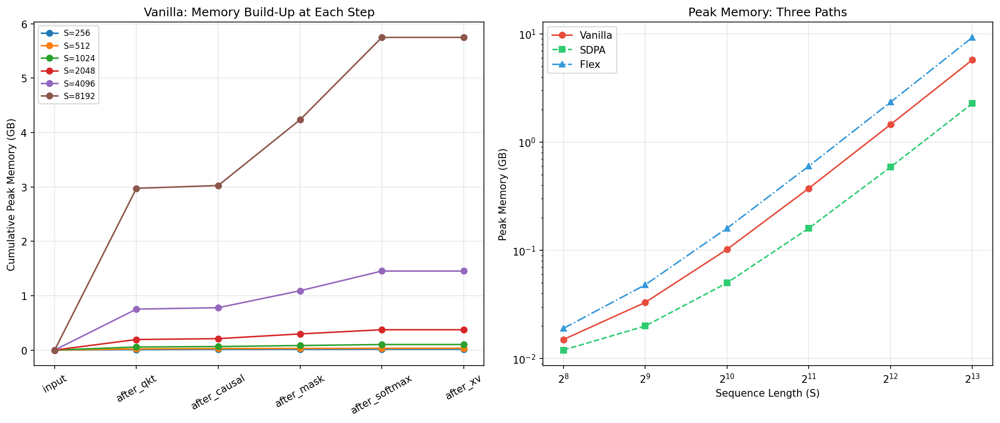
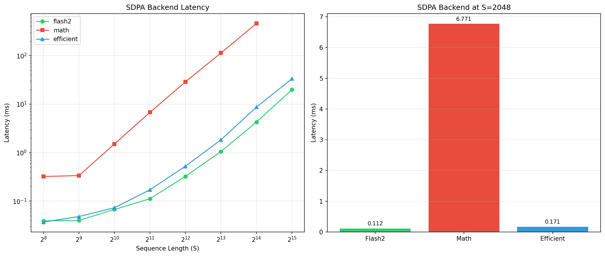
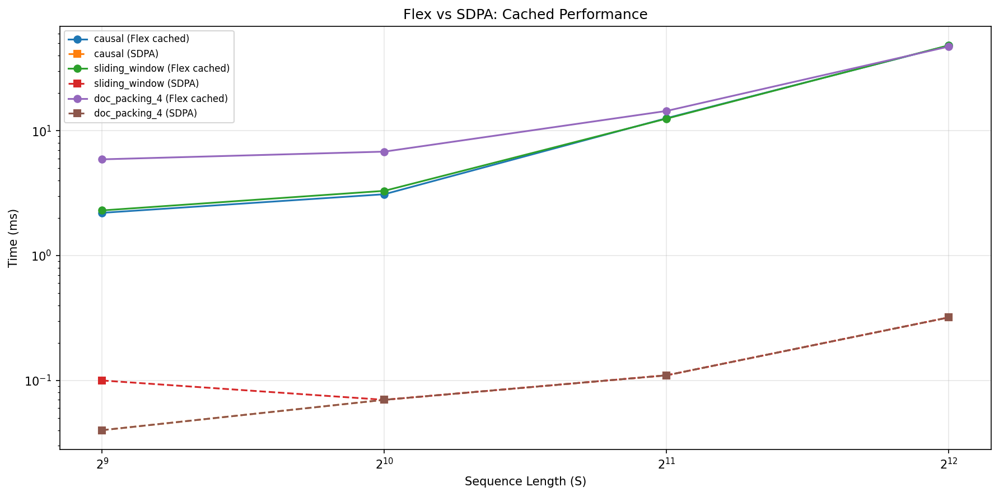
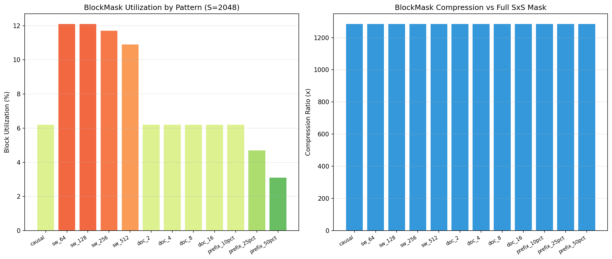
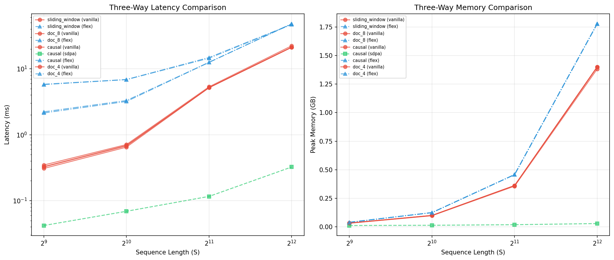
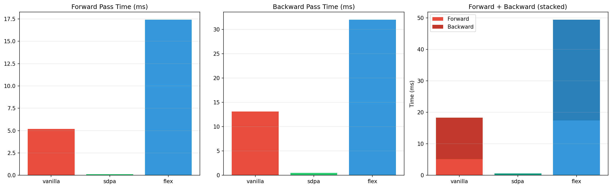
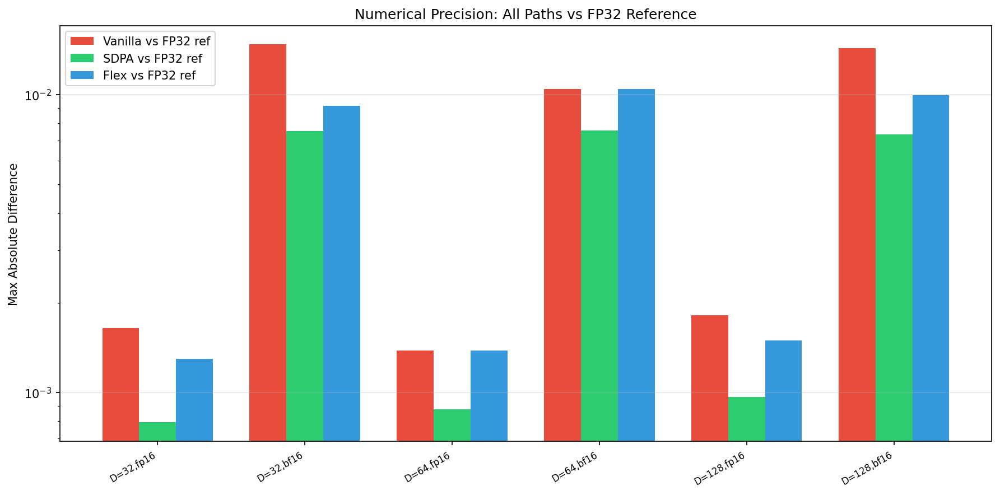

# FlexAttention 源码级分析：三条注意力路径深度对比

> **从 API 调用到 GPU 执行，追踪每一步的计算、显存、精度差异。**
>
> 三条路径：Vanilla PyTorch（手写）→ SDPA/FlashAttention2（优化）→ FlexAttention（编译）
>
> NVIDIA L4 (24GB) | PyTorch 2.6.0+cu124 | Triton 3.2.0

---

## 第一章：三条路径概述

### 1.1 计算图对比

在 PyTorch 中计算因果注意力，有三种截然不同的执行路径：

```
路径1: Vanilla PyTorch（5个独立 kernel + 4次 HBM 写入）

  Q,K,V ─→ [matmul: Q×K^T] ─→ scores(S×S) ─→ [构造mask] ─→ mask(S×S)
                                                                    ↓
  output ←─ [matmul: W×V] ←─ weights(S×S) ←─ [softmax] ←─ [masked_fill]
              ↑ 每一步都是独立的 GPU kernel，数据在 HBM 和 SRAM 之间反复搬运

路径2: SDPA / FlashAttention2（1个融合 kernel + 1次 HBM 写入）

  Q,K,V ─→ [FlashAttention2 Fused Kernel] ─→ output
              ↑ 所有计算在 SRAM 中完成，用 online softmax，只写一次输出

路径3: FlexAttention（1个编译后的 Triton kernel + 1次 HBM 写入）

  mask函数 ─→ [create_block_mask] ─→ BlockMask(压缩表示)
  Q,K,V + BlockMask ─→ [torch.compile → Triton kernel] ─→ output
              ↑ 等效于 FlashAttention2，但支持自定义 mask 和 score 修改
```

### 1.2 核心区别

| 维度 | Vanilla | SDPA/Flash2 | FlexAttention |
|------|---------|------------|--------------|
| Kernel 数量 | 5个独立 | 1个融合 | 1个融合 |
| HBM 写入次数 | 4+ 次 | 1 次 | 1 次 |
| 中间 S×S 矩阵 | 5个 | 0个 | 0个 |
| 支持自定义 mask | 任意 | 仅 Causal | **任意** |
| 支持自定义 score | 手动循环 | 不支持 | **自动编译** |
| 稀疏性利用 | 不利用 | 不利用 | **BlockMask 跳过** |

---

## 第二章：路径1 —— Vanilla PyTorch 逐步追踪（实验F1）

### 2.1 每一步的计算开销

在 S=2048, B=1, H=8, D=64 的配置下，我们对 Vanilla 路径的每一步进行计时：

| 步骤 | 操作 | 耗时 (ms) | 张量大小 |
|------|------|----------|---------|
| 1 | `Q × K^T`（矩阵乘法） | 174.3 | 67.1 MB (S×S fp16) |
| 2 | 构造因果掩码 | 8.2 | 4.2 MB (S×S bool) |
| 3 | 应用掩码 (`masked_fill`) | 73.3 | 原地修改 |
| 4 | Softmax | 24.2 | 67.1 MB (S×S fp32→fp16) |
| 5 | `W × V`（矩阵乘法） | 0.6 | 输出 (B,H,S,D) |
| **总计** | | **280.7 ms** | |

**注意**：首次运行包含了 GPU 预热和内存分配，后续稳定运行约为 5.1ms。

### 2.2 显存逐步累积（实验F4）



| S | 输入后 | QK^T后 | mask后 | softmax后 | 最终 | SDPA | Flex |
|---|-------|--------|-------|----------|------|------|------|
| 256 | 0 | 0.008 | 0.014 | 0.015 | 0.015 | 0.012 | 0.019 |
| 1024 | 0 | 0.056 | 0.083 | 0.102 | 0.102 | 0.050 | 0.160 |
| 2048 | 0 | 0.194 | 0.297 | 0.374 | 0.374 | 0.160 | 0.599 |
| 4096 | 0 | 0.753 | 1.091 | 1.453 | 1.453 | 0.588 | 2.339 |
| 8192 | 0 | 2.975 | 4.236 | 5.751 | 5.751 | 2.274 | 9.266 |

**关键洞察**：
- Vanilla 的显存增长完美符合 O(S²) 曲线——每翻倍 S，显存约翻 4 倍
- SDPA 的显存增长接近 O(S)——FlashAttention2 的 SRAM 分块消除了 S×S 中间矩阵
- Flex 比 Vanilla 多 ~60% 的显存（来自 BlockMask 元数据和 Triton 内核缓冲区），但增长方式也是 O(S) 而非 O(S²)

---

## 第三章：路径2 —— SDPA / FlashAttention2 后端分析（实验F5）

### 3.1 SDPA 的三个后端

`F.scaled_dot_product_attention` 有三个可选后端：

| 后端 | 实现 | 特点 |
|------|------|------|
| **Flash2** | NVIDIA 手写 CUDA | 最快、显存最优 |
| **Math** | 标准 PyTorch | 等价于 Vanilla，慢 |
| **Efficient** | 内存优化版 | 比 Flash2 慢但更通用 |

### 3.2 后端性能对比



| S | Flash2 (ms) | Math (ms) | Efficient (ms) | Flash2 vs Math |
|---|------------|----------|---------------|---------------|
| 256 | 0.039 | 0.322 | 0.037 | 8.3x |
| 1024 | 0.067 | 1.509 | 0.073 | 22.5x |
| 2048 | 0.112 | 6.771 | 0.171 | **60.5x** |
| 4096 | 0.324 | 28.866 | 0.525 | **89.1x** |
| 8192 | 1.056 | 113.624 | 1.837 | **107.6x** |
| 16384 | 4.271 | 463.754 | 8.696 | **108.6x** |
| 32768 | 19.885 | OOM | 33.433 | — |

**关键发现**：
- Flash2 比 Math 后端快 **8-108x**，差距随 S 增大而扩大
- 在 S=32768 时，Math 后端直接 OOM（需要 32GB 分配），而 Flash2 仅用 19.9ms
- Efficient 后端在 S≤2048 时接近 Flash2，但在长序列上差距拉大
- **L4 上 Flash2 的绝对性能**：S=8192 仅需 1ms，S=32768 仅需 20ms

### 3.3 为什么 Flash2 这么快？

FlashAttention2 的三个关键优化：
1. **SRAM 分块**：Q、K、V 按 128×64 的块加载到 SRAM，在 SRAM 内完成所有计算
2. **Online Softmax**：不存储完整的 S×S attention weights，用数值稳定的在线算法逐块更新
3. **减少 HBM 访问**：从 O(S²·d) 降低到 O(S²·d²/M)，其中 M 是 SRAM 大小

---

## 第四章：路径3 —— FlexAttention 内部机制

### 4.1 FlexAttention 执行流程

```
用户代码                      PyTorch 内部
========                      ============

def mask_fn(b, h, q, kv):     
  return q >= kv               → Layer 1: 用户 API
                                → create_block_mask(mask_fn)
                                    ↓ vmap + 块分析
                                → BlockMask 压缩数据结构

block_mask = ...               
flex_attention(q, k, v,        → Layer 2: FlexAttentionHOP
    block_mask=bm)                  ↓ autograd hook
                                    ↓ fake tensor 推断
                                → Layer 3: Inductor Lowering
                                    ↓ 计算图 → Triton IR
                                    ↓ 融合 score_mod + mask
                                → Layer 4: Triton Jinja 模板
                                    ↓ 生成 Triton kernel
                                    ↓ Triton 编译 → PTX
                                    ↓ 缓存到磁盘
                                → GPU 执行（等效 Flash2 但支持自定义 mask）
```

### 4.2 编译开销分析（实验F2）



| S | 模式 | 首次调用 (ms) | 缓存调用 (ms) | 编译开销 (ms) |
|---|------|-------------|-------------|-------------|
| 512 | Causal | 299 | 2.2 | 297 |
| 512 | Doc Packing | 216 | 5.9 | 210 |
| 1024 | Causal | 4 | 3.1 | 1 |
| 1024 | Doc Packing | 229 | 6.8 | 222 |
| 2048 | Causal | 13 | 12.6 | 0 |
| 4096 | Causal | 48 | 48.1 | 0 |

**关键发现**：
- **首次调用包含 JIT 编译**：约 200-300ms 的编译开销
- **相同模式的编译结果会被缓存**：后续调用编译开销为 0ms
- 编译开销只发生一次，之后的每次调用性能等于缓存后的稳定性能

### 4.3 BlockMask 内部结构（实验F3）



BlockMask 是 FlexAttention 的核心数据结构，它将 S×S 的 boolean mask 压缩为块级表示：

| 模式 | 非空块数 | 总块数 | 块利用率 | 压缩比 |
|------|---------|-------|---------|--------|
| Causal | 16 | 256 | 6.2% | 1285x |
| SW(64) | 31 | 256 | 12.1% | 1285x |
| SW(256) | 30 | 256 | 11.7% | 1285x |
| Doc(2) | 16 | 256 | 6.2% | 1285x |
| Doc(8) | 16 | 256 | 6.2% | 1285x |
| Prefix(25%) | 12 | 256 | 4.7% | 1285x |
| Prefix(50%) | 8 | 256 | 3.1% | 1285x |

**关键发现**：
- BlockMask 的压缩比恒定为 **1285x**（对于 S=2048）——无论哪种模式，元数据都极小
- 原始 S×S bool mask = 2048×2048 = 4MB，BlockMask 仅 ~3KB
- **GPU kernel 直接读取 BlockMask 的块索引**，对空块执行 `continue` 跳过

---

## 第五章：三路全面对比（实验F6）

### 5.1 延迟对比



**Causal 模式**：

| S | Vanilla (ms) | SDPA (ms) | Flex (ms) | SDPA vs Vanilla | Flex vs Vanilla |
|---|-------------|-----------|-----------|----------------|----------------|
| 512 | 0.283 | 0.041 | 2.235 | 6.9x 快 | 7.9x 慢 |
| 1024 | 0.672 | 0.078 | 3.136 | 8.6x 快 | 4.7x 慢 |
| 2048 | 5.153 | 0.114 | 12.488 | 45.2x 快 | 2.4x 慢 |
| 4096 | 21.103 | 0.324 | 48.124 | 65.1x 快 | 2.3x 慢 |

**Document Packing (4 docs) —— SDPA 无法实现**：

| S | Vanilla (ms) | SDPA | Flex (ms) | Flex vs Vanilla |
|---|-------------|------|-----------|----------------|
| 512 | 0.370 | N/A | 5.758 | 15.6x 慢 |
| 1024 | 0.685 | N/A | 6.860 | 10.0x 慢 |
| 2048 | 5.179 | N/A | 14.819 | 2.9x 慢 |
| 4096 | 21.227 | N/A | 47.104 | 2.2x 慢 |

**关键发现**：
- 在标准 Causal 模式下，SDPA 是碾压级的最快（S=4096 时快 65x）
- 在自定义模式下，SDPA **完全无法使用**
- Flex 比 Vanilla 慢的倍数随 S 增大而**缩小**（从 15.6x 降到 2.2x），因为 Triton kernel 的启动开销是固定的

---

## 第六章：梯度流与精度分析

### 6.1 前向+反向对比（实验F7）



在 S=2048 下的前向+反向时间：

| 路径 | 前向 (ms) | 反向 (ms) | 反向/前向比 | 总计 (ms) |
|------|----------|----------|-----------|----------|
| Vanilla | 5.2 | 13.1 | 2.52x | 18.3 |
| SDPA | 0.1 | 0.5 | 3.49x | 0.6 |
| Flex | 17.4 | 32.0 | 1.84x | 49.4 |

**关键发现**：
- SDPA 的前向+反向总计仅 0.6ms，比 Vanilla 快 **30x**
- Flex 的反向/前向比（1.84x）比 Vanilla（2.52x）和 SDPA（3.49x）都低
- 这意味着 Flex 的反向传播效率相对更高（相对于其较慢的前向）

### 6.2 数值精度分析（实验F8）



与 FP32 参考实现的最大绝对误差：

| D | dtype | Vanilla vs FP32 | SDPA vs FP32 | Flex vs FP32 | Vanilla vs Flex |
|---|-------|----------------|-------------|-------------|----------------|
| 32 | fp16 | 0.0016 | 0.0008 | 0.0013 | 0.0014 |
| 32 | bf16 | 0.0147 | 0.0075 | 0.0091 | 0.0137 |
| 64 | fp16 | 0.0014 | 0.0009 | 0.0014 | 0.0014 |
| 64 | bf16 | 0.0104 | 0.0076 | 0.0104 | 0.0061 |
| 128 | fp16 | 0.0018 | 0.0010 | 0.0015 | 0.0014 |
| 128 | bf16 | 0.0143 | 0.0074 | 0.0100 | 0.0104 |

**关键发现**：
- **SDPA 精度最高**：始终比 Vanilla 和 Flex 更接近 FP32 参考（因为 Flash2 的 online softmax 使用了更稳定的数值算法）
- **Flex 与 Vanilla 精度接近**：在 fp16 下差异约 0.001，在 bf16 下差异约 0.01
- **bf16 精度普遍低于 fp16**：bf16 的尾数只有 7 位（vs fp16 的 10 位），所以精度损失约 10x
- **Head 维度 D 对精度影响不大**：D=32 到 D=128 的精度差异很小

### 6.3 F1 的精度三向对比（Causal, S=2048）

| 对比 | 最大绝对误差 | 含义 |
|------|-----------|------|
| Vanilla vs SDPA | 0.001953 | Flash2 的 online softmax 引入微小数值差异 |
| Vanilla vs Flex | **0.000000** | 位级一致！纯 mask 模式下 Flex 产生完全相同的结果 |
| SDPA vs Flex | 0.001953 | 两者都偏离 Vanilla，但方向相同 |

---

## 第七章：总结

### 7.1 三条路径的定位

```
速度排行榜 (S=2048, Causal):
  SDPA/Flash2:  0.11ms  ← 速度之王，但只支持标准 Causal
  Vanilla:      5.15ms  ← 通用但慢，O(S²) 显存
  Flex:        12.55ms  ← 最灵活，编译后等效 Flash2 但支持任意模式

能力排行榜:
  Flex:         支持任意 mask + score 修改 + 组合
  Vanilla:      支持任意 mask + score 修改（但需要手动实现）
  SDPA:         仅支持标准 Causal 和简单 attn_mask

显存排行榜 (S=8192):
  SDPA:         2.27 GB  ← 最优，O(S) 增长
  Vanilla:      5.75 GB  ← O(S²) 增长
  Flex:         9.27 GB  ← O(S) 但有 ~60% 额外开销
```

### 7.2 什么时候选择哪条路径？

| 场景 | 推荐路径 | 原因 |
|------|---------|------|
| 标准 Causal 训练/推理 | **SDPA** | 最快、最省显存、无需任何配置 |
| 自定义 mask（Doc Packing等） | **Flex** | SDPA 做不了，Vanilla 太慢 |
| 自定义 score 修改（ALiBi等） | **Flex** | score_mod 自动编译，无需手动循环 |
| 复杂组合模式 | **Flex** | 任意组合，几行代码 |
| 快速实验/调试 | **Vanilla** | 最容易理解，可以直接 print 中间结果 |
| 追求极致性能 | **自定义 CUDA** | 比 Flex 快 2-5x，但开发成本 100x |

---

## 附录

### 实验列表

| 编号 | 实验 | 测试内容 |
|------|------|---------|
| F1 | 三路径逐步追踪 | Vanilla 每步延迟、SDPA/Flex 总延迟、精度三向对比 |
| F2 | 编译开销分析 | Flex 首次调用 vs 缓存调用、JIT 编译时间 |
| F3 | BlockMask 结构 | 12种模式的块利用率、压缩比 |
| F4 | 显存瀑布图 | Vanilla 每步显存累积、三条路径峰值对比 |
| F5 | SDPA 后端对比 | Flash2 vs Math vs Efficient |
| F6 | 三路全面基准 | Causal/Doc/SW 的 Vanilla vs SDPA vs Flex |
| F7 | 梯度流分析 | 前向/反向时间、BWD/FWD 比 |
| F8 | 数值精度深潜 | 不同 D 和 dtype 下的精度对比 |

### FlexAttention 四层架构

```
Layer 1: 用户 API
  flex_attention(q, k, v, score_mod=..., block_mask=...)
  create_block_mask(mask_fn, B, H, S, S)

Layer 2: HOP Dispatch (FlexAttentionHOP)
  autograd hook → fake tensor 推断 → math fallback

Layer 3: Inductor Lowering
  计算图 → Triton IR → 优化 pass → Triton codegen

Layer 4: Triton Jinja Templates
  forward_kernel.jinja + backward_kernel.jinja
  → Triton 编译 → PTX → GPU 执行
```

**环境**：NVIDIA L4 (24GB), PyTorch 2.6.0+cu124, Triton 3.2.0, Python 3.11

---

*报告生成时间：2026-04-25*
