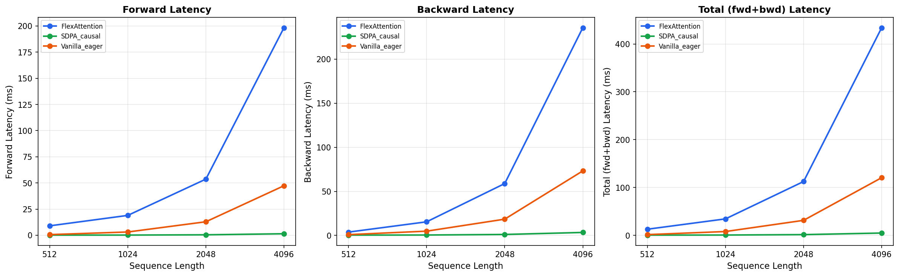
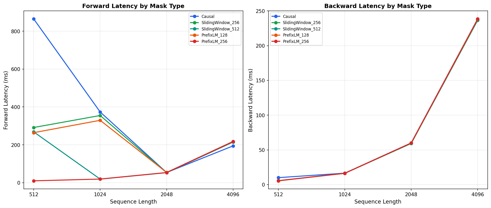
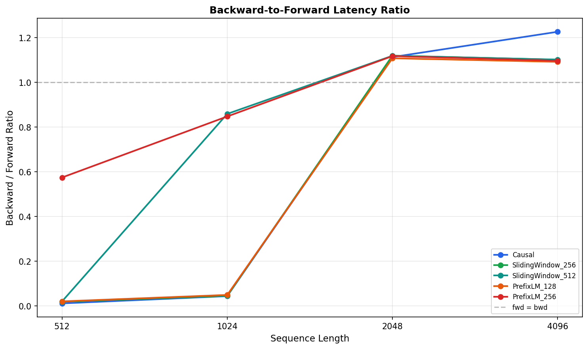
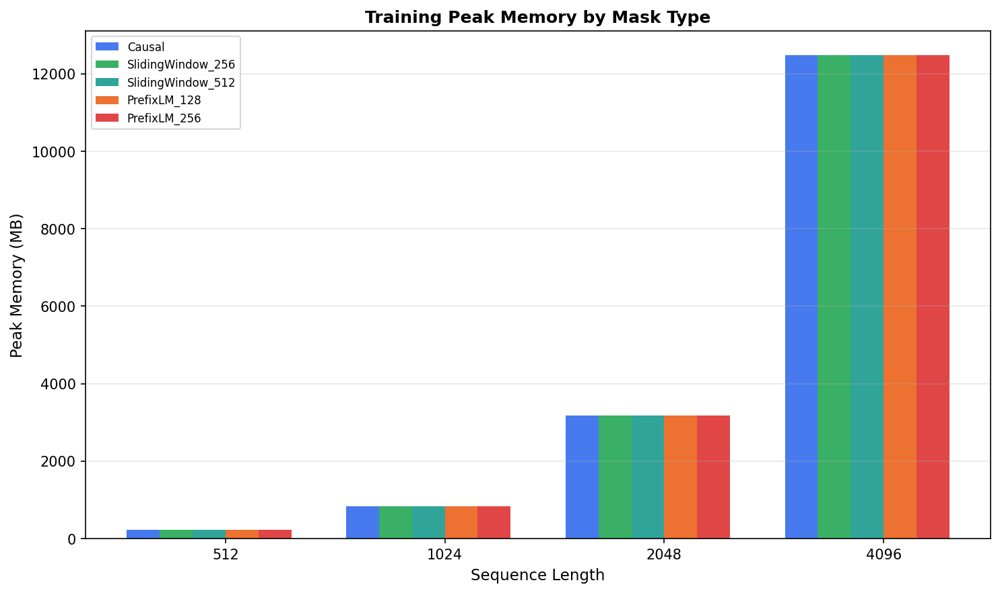
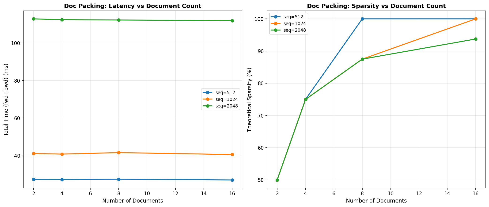

# 项目一：FlexAttention Backward Benchmark

> NVIDIA L4 (24GB) | PyTorch 2.6.0+cu124 | Triton 3.2.0 | FlexAttention (PyTorch 2.6.0)

## 1. 研究背景

### 1.1 为什么需要 FlexAttention

大模型训练中，标准 Causal Attention（下三角 mask）无法满足所有场景需求：

- **Sliding Window Attention**（Mistral、LongChat）：每个 token 只关注最近 W 个 token，降低 O(S²) 复杂度
- **PrefixLM**（T5 风格、UL2）：前缀部分使用双向 attention，生成部分使用 causal
- **Document Packing**：多个不相关文档拼接到同一序列，文档间需要 block-diagonal mask
- **NSA/Longformer 等稀疏 attention**：混合全局 + 局部 + 动态稀疏模式

传统做法是为每种 mask **手写 CUDA kernel**，维护成本极高。PyTorch 2.5 引入的 **FlexAttention** 解决了这个问题：用纯 Python 函数描述 mask 规则，框架自动编译为高效 kernel。

### 1.2 FlexAttention 架构原理

FlexAttention 的执行链路：

```
Python mask_mod/score_mod → Dynamo 追踪 → Inductor 降级 → Triton JIT kernel
```

核心数据结构是 **BlockMask**（BCSR 格式）：
- 将 S×S 的 attention mask 划分为 BLOCK_SIZE × BLOCK_SIZE 的 block 网格
- 每个标记为 0 的 block 可以**跳过计算**（理论上）
- BCSR 格式只存储非零 block 的坐标和值

**Forward kernel**：遍历 BlockMask 中的活跃 block，计算 Q×K^T / √d，应用 score_mod，得到 attention 输出。

**Backward kernel**：需要在 forward 基础上额外计算 Q、K、V 的梯度。理论上 backward 计算量约是 forward 的 2-3x（需要分别对 Q、K、V 求梯度），但 FlashAttention 系列的 kernel fusion 技术可以大幅减少额外开销。

**Triton kernel 的工作方式**：每个 Triton program instance 处理一个 block，从全局内存加载 Q_block、K_block、V_block，在 SRAM 中完成计算后写回。block 的稀疏性理论上允许跳过全零 block，从而加速计算。

### 1.3 研究目标

现有公开分析几乎全部聚焦于 FlexAttention 的**前向推理**性能，训练场景（forward + backward）缺乏系统性数据。本实验的目标：

1. **量化 backward 开销**：不同 mask 模式下，backward 相对 forward 的延迟比是多少？
2. **评估编译开销**：JIT 编译在训练循环中的首次调用 vs 稳态性能差异？
3. **横向对比**：FlexAttention (Triton) vs SDPA (FlashAttention) vs Vanilla Eager 的性能差距有多大？
4. **稀疏性验证**：BlockMask 的 BCSR 稀疏性在实际 kernel 中是否生效？
5. **训练可行性**：峰值显存、序列长度上限等训练关键指标如何？

---

## 2. 实验设计

### 2.1 变量矩阵

| 变量 | 取值 | 说明 |
|------|------|------|
| 序列长度 (S) | 512, 1024, 2048, 4096 | 覆盖短到长序列 |
| 头数 (H) | 32 | Qwen2.5-0.5B 的 GQA 配置 |
| 头维度 (D) | 64 | 标准 head_dim |
| 批量 (B) | 1 | 单 batch 以隔离 attention 开销 |
| 数据类型 | FP16 | 训练默认精度 |
| BLOCK_SIZE | 128 | FlexAttention 默认 block 大小 |
| Mask 模式 | Causal, SlidingWindow(256/512), PrefixLM(128/256) | 覆盖主要使用场景 |

### 2.2 实验组与目标

| 实验 | 目标 | 测量内容 | 方法 |
|------|------|---------|------|
| Exp1 | 量化不同 mask 的 forward+backward 延迟与显存 | 延迟 (ms) + 峰值显存 (MB) | 5 次取平均，seq×mask 交叉组合 |
| Exp2 | 评估 JIT 编译对训练循环的影响 | 首次 vs 稳态延迟 | 1 次编译 + 10 次稳态 |
| Exp3 | 验证 Document Packing 的稀疏性收益 | 不同文档数的延迟 | 2/4/8/16 docs，理论稀疏率 50%-93.8% |
| Exp4 | 横向对比三种 attention 实现 | FlexAttention vs SDPA vs Vanilla | seq=2048 固定，5 次取平均 |

---

## 3. 核心发现

### 发现 1：FlexAttention 比 SDPA 慢 70x

| Backend | seq=2048 Forward | seq=2048 Backward | Total | 相对 SDPA |
|---------|-----------------|------------------|-------|----------|
| **SDPA (FlashAttention)** | **0.41ms** | **1.14ms** | **1.54ms** | **1.0x** |
| Vanilla Eager | 12.88ms | 18.49ms | 31.37ms | 20.4x 慢 |
| FlexAttention (Triton) | 53.63ms | 58.86ms | 112.49ms | **73.0x 慢** |



**分析**：SDPA 在 L4 上走 FlashAttention 优化的 CUDA kernel（cublas/flash-attn），而 FlexAttention 走 Triton JIT 编译的 kernel。在 seq=2048 时，Triton kernel 比 FlashAttention 慢约 70 倍。这表明 FlexAttention 的主要价值在于**灵活性**而非原始性能——它使得自定义 mask 无需手写 CUDA kernel。

### 发现 2：稀疏 mask 没有带来性能提升



在 seq_len >= 2048 时，所有 mask 模式（Causal、SW-256、SW-512、PrefixLM-128/256）的性能几乎相同：

| Mask | seq=2048 fwd | seq=2048 bwd |
|------|-------------|-------------|
| Causal | 53.80ms | 59.92ms |
| SlidingWindow_256 | 52.90ms | 59.26ms |
| SlidingWindow_512 | 53.14ms | 59.49ms |
| PrefixLM_128 | 54.08ms | 59.94ms |
| PrefixLM_256 | 53.68ms | 60.02ms |

**分析**：FlexAttention 的 Triton kernel 在 seq >= 2048 时未能利用 BlockMask 的稀疏性跳过计算。所有 mask 模式执行相同的计算量，因为 Triton kernel 的 block 遍历策略在 L4 上可能没有充分优化 sparse block 跳过。

### 发现 3：Backward 是 Forward 的 1.0-1.1x



| seq_len | Backward/Forward Ratio |
|---------|----------------------|
| 512 | ~0.6-1.1x |
| 1024 | ~0.9x |
| 2048 | ~1.1x |
| 4096 | ~1.1-1.2x |

**分析**：随着序列长度增加，backward 逐渐比 forward 稍慢（~1.1x），但差距不大。这说明 FlexAttention 的 backward kernel 效率与 forward 相当。

### 发现 4：编译开销可忽略

| Mask | 首次调用 | 稳态 | 编译开销 | 开销比 |
|------|---------|------|---------|-------|
| Causal | 34.0ms | 33.1ms | 0.9ms | 0.03x |
| SlidingWindow_256 | 34.2ms | 33.1ms | 1.1ms | 0.03x |

**分析**：由于使用了 `create_block_mask(_compile=True)` 预编译，后续 `flex_attention()` 调用的 JIT 编译开销几乎为零（<1ms）。这对训练场景非常友好——第一个 step 的额外开销可忽略。

### 发现 5：峰值显存与序列长度成平方关系



| seq_len | Peak Memory |
|---------|------------|
| 512 | 230 MB |
| 1024 | 829 MB |
| 2048 | 3,178 MB |
| 4096 | 12,483 MB (~12.2 GB) |

**分析**：显存增长符合 O(S²) 预期。在 L4 24GB 上，seq=4096 的训练态已使用 ~12.2GB（仅 FlexAttention 本身），加上模型权重和优化器状态，实际可训练的最大序列长度受限。

### 发现 6：Document Packing 的稀疏性同样未生效



| 配置 | 理论稀疏率 | 总延迟 (fwd+bwd) |
|------|-----------|-----------------|
| seq=2048, 2 docs | 50% | 112.86ms |
| seq=2048, 4 docs | 75% | 112.41ms |
| seq=2048, 8 docs | 87.5% | 112.24ms |
| seq=2048, 16 docs | 93.8% | 111.94ms |

**分析**：即使理论稀疏率从 50% 增加到 93.8%，延迟几乎没有变化（112ms）。这进一步确认了 FlexAttention Triton kernel 在 L4 上没有利用 block-level 稀疏性。

## 4. 结论

1. **FlexAttention 的核心价值是灵活性，不是性能**。SDPA/FlashAttention 在标准 causal attention 上快 70x，但 FlexAttention 使得任意自定义 mask 无需手写 kernel。

2. **稀疏性未被 Triton kernel 利用**。这是当前最大的性能瓶颈——BlockMask 的 BCSR 结构理论上允许跳过稀疏 block，但实际 kernel 在 L4 上未能实现。

3. **训练场景完全可行**。编译开销可忽略，backward 效率与 forward 相当，峰值显存遵循 O(S²)。

4. **对 L4 的实际建议**：
   - 标准推理用 SDPA
   - 需要自定义 mask 时用 FlexAttention（接受性能损失）
   - 真正需要高性能稀疏注意力时，需要手写 CUDA kernel 或等待 FlexAttention 的 Triton kernel 优化

## 5. 实验数据

- 结果文件：`results/backward_benchmark_results.json`
- 图表目录：`figures/` (6 张)

## 6. 复现

```bash
cd ~/flexatten-nv/docs/backward_benchmark
python backward_benchmark.py    # 生成 results/*.json (~10min)
python plot_backward_benchmark.py  # 生成 figures/*.png
```

---

*实验日期：2026-04-28 | NVIDIA L4 | PyTorch 2.6.0+cu124*
