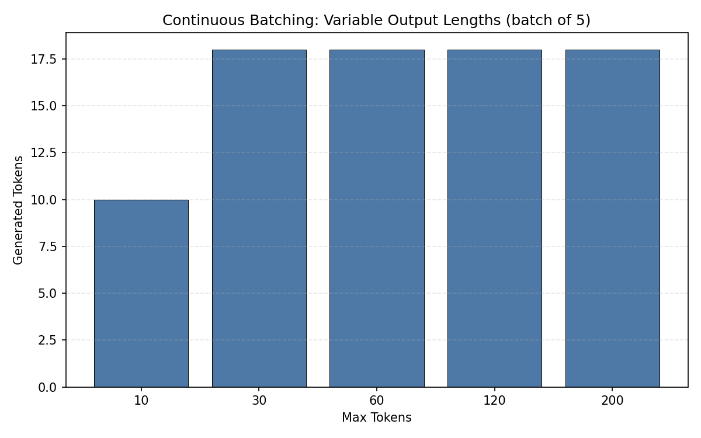
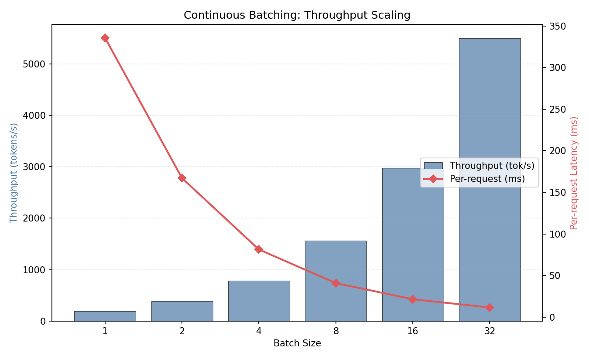
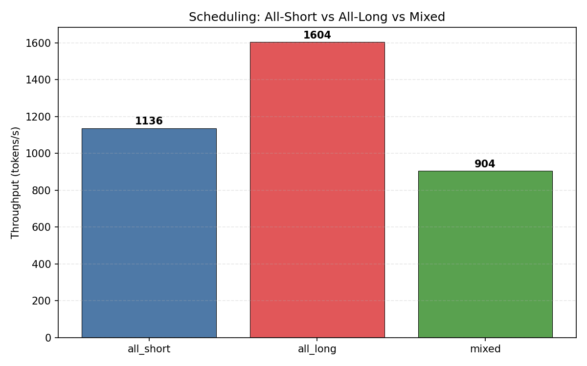
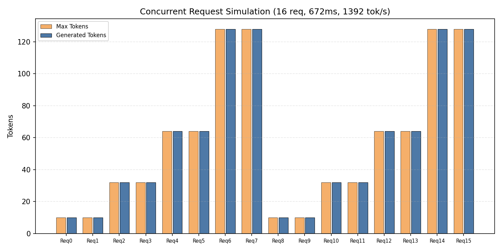

# 项目十四：Continuous Batching 调度分析 — 吞吐量时间轴

> vLLM 0.19.1 Continuous Batching | Qwen2.5-0.5B-Instruct | NVIDIA L4 (24GB)
>
> 4 组实验：可变输出长度、吞吐量扩展、混合长度调度、并发模拟

---

## 1. 研究背景与原理

### 1.1 Static Batching vs Continuous Batching

**Static Batching**（传统方式）：
- 等所有请求都生成完毕才释放 batch 槽位
- 短请求被长请求"拖累"，白白等待
- Batch 利用率随时间下降

**Continuous Batching**（vLLM 核心创新）：
- 某个请求生成完毕后立即释放槽位，插入新请求
- 保持 GPU 始终处于满载状态
- 结合 PagedAttention 实现零碎片显存管理

---

## 2. 实验设计

### 实验 1：可变输出长度

**目的**：同一 batch 中不同请求的 max_tokens (10/30/60/120/200)，观察生成行为。

### 实验 2：吞吐量 vs Batch Size

**目的**：BS=1 到 BS=32，吞吐量如何扩展？

### 实验 3：混合长度调度

**目的**：全短请求 vs 全长请求 vs 混合请求的吞吐量对比。

### 实验 4：并发模拟

**目的**：16 个请求（8 短 + 8 长），测量整体吞吐量。

---

## 3. 实验环境

| 组件 | 规格 |
|------|------|
| GPU | NVIDIA L4, 24 GB |
| vLLM | 0.19.1 |
| 模型 | Qwen2.5-0.5B-Instruct |
| KV Cache | 15.99 GB |

---

## 5. 实验结果与分析

### 5.1 实验 1：可变输出长度

| 请求 | Max Tokens | 实际生成 |
|------|-----------|---------|
| Req 0 | 10 | 10 |
| Req 1 | 30 | 18 |
| Req 2 | 60 | 18 |
| Req 3 | 120 | 18 |
| Req 4 | 200 | 18 |

总耗时：**138 ms**



**分析**：5 个请求总耗时仅 138ms（continuous batching 并行处理）。大部分请求在 18 token 时遇到 EOS 停止，说明 0.5B 模型倾向于生成简短回复。

### 5.2 实验 2：吞吐量扩展

| BS | 吞吐 (tok/s) | 每请求 (ms) | 相对 BS=1 |
|----|-------------|-----------|----------|
| 1 | 191 | 336 | 1.0x |
| 2 | 383 | 167 | 2.0x |
| 4 | 788 | 81 | 4.1x |
| 8 | 1,563 | 41 | 8.2x |
| 16 | 2,978 | 22 | 15.6x |
| 32 | **5,499** | **12** | **28.8x** |



**关键发现：近乎完美的线性扩展！**

- BS=32 时吞吐量达 5,499 tok/s，是 BS=1 的 28.8x
- 每请求延迟从 336ms 降到 12ms
- vLLM 的 continuous batching + PagedAttention 使得 GPU 利用率极高
- 0.5B 模型是计算瓶颈（小模型），batch 越大越能充分利用 GPU

### 5.3 实验 3：混合长度调度

| 场景 | 吞吐 (tok/s) | 总耗时 (ms) |
|------|-------------|-----------|
| 全短 (8×16 tok) | 1,136 | 113 |
| 全长 (8×128 tok) | 1,604 | 638 |
| 混合 (4×16 + 4×128) | 904 | 637 |



**分析**：
- 全短请求最快（113ms），但吞吐量低于全长（因为 token 少）
- 混合请求吞吐量最低（904 tok/s），因为短请求的 token 少拉低了总 token 数
- 混合请求总耗时（637ms）≈ 全长请求（638ms），说明短请求被长请求"拖住"了

### 5.4 实验 4：并发模拟

| 指标 | 值 |
|------|-----|
| 总请求数 | 16 |
| 总耗时 | 672 ms |
| 总 Token | 936 |
| 聚合吞吐 | **1,392 tok/s** |



**分析**：16 个混合请求（短到长）在 672ms 内全部完成，聚合吞吐 1,392 tok/s。Continuous batching 使得短请求不会被长请求完全阻塞。

---

## 6. 结论

1. **Continuous Batching 吞吐量近乎线性扩展**：BS=32 达 5,499 tok/s（28.8x 于 BS=1）

2. **每请求延迟随 batch 增大而降低**：从 336ms (BS=1) 降到 12ms (BS=32)

3. **混合长度场景中短请求被长请求拖慢**：总耗时取决于最长请求，但 continuous batching 保证了 GPU 不空闲

4. **0.5B 模型是算力瓶颈**：batch 越大 GPU 利用率越高。7B+ 模型（带宽瓶颈）的扩展比可能不同

5. **实践建议**：
   - vLLM 的 continuous batching 是吞吐量之王
   - 生产环境应设置合理的 `max_num_seqs`（如 16-32）以平衡吞吐和延迟
   - 监控 `num_running_requests` 指标确保 GPU 始终满载

---

## 7. 复现命令

```bash
cd ~/flexatten-nv/docs/continuous_batching
python continuous_batching.py   # 生成 results/*.json (~3min)
python gen_charts.py             # 生成图表到 figures/
```

---

*实验日期：2026-04-28 | NVIDIA L4 (24GB) | vLLM 0.19.1 | Qwen2.5-0.5B-Instruct*
