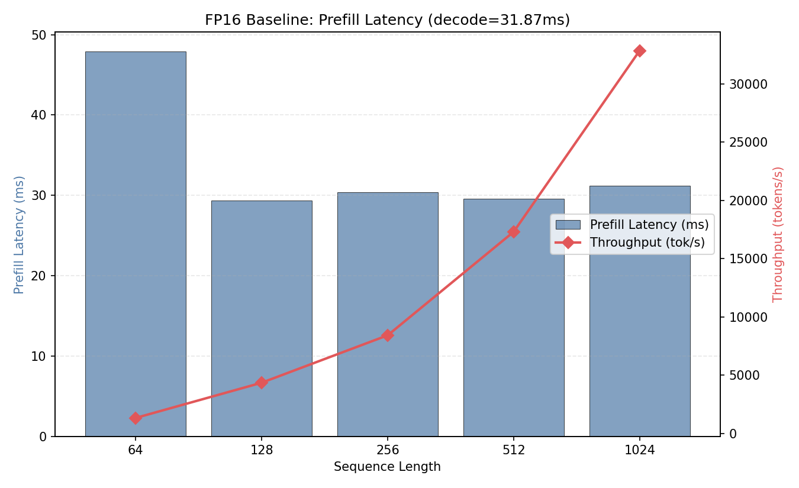
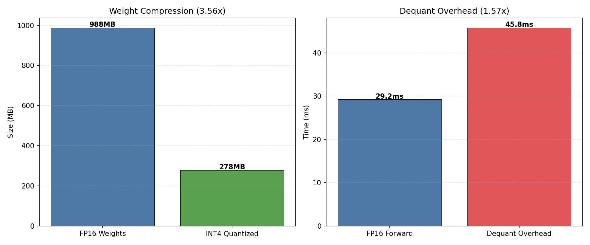
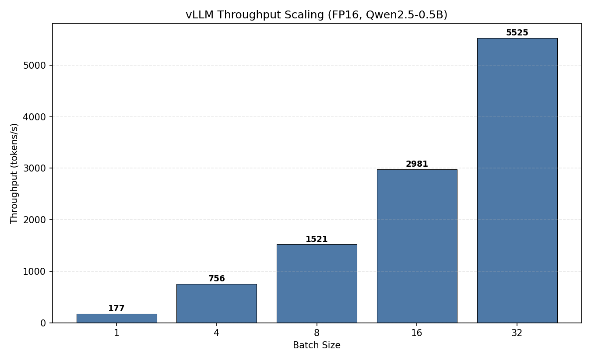
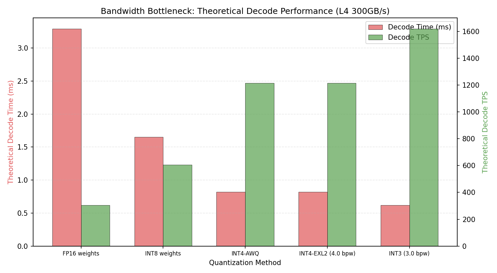

# 项目十五：EXL2 vs AWQ INT4 权重量化推理对比

> PyTorch FP16 + 模拟 INT4 + vLLM 0.19.1 | Qwen2.5-0.5B-Instruct | NVIDIA L4 (24GB)
>
> 4 组实验：FP16 基线、INT4 模拟量化、vLLM 批量吞吐、带宽瓶颈理论分析

---

## 1. 研究背景与原理

### 1.1 大模型推理的内存墙问题

LLM 推理（尤其是 decode 阶段）是典型的 **memory-bound** 操作：每个 token 生成都需要从 GPU 显存加载全部模型权重。对于 0.5B 模型（942MB FP16 权重），decode 阶段的理论瓶颈在于权重加载带宽：

$$T_{decode} = \frac{W_{bytes}}{BW_{GPU}}$$

L4 GPU 的显存带宽为 300 GB/s，FP16 权重加载理论 decode 时间为 3.29ms/token（304 tok/s）。

### 1.2 量化方案对比

| 方案 | 比特率 (bpw) | 压缩比 | 精度损失 | 适用场景 |
|------|-------------|-------|---------|---------|
| FP16 | 16 | 1.0x | 无 | 基线 |
| INT8 | 8 | 2.0x | 极小 | 平衡方案 |
| AWQ INT4 | 4 | 4.0x | 可控 | vLLM/TGI 生产部署 |
| EXL2 | 4.0 (混合) | ~4.0x | 可控 | ExLlamaV2 高吞吐推理 |
| GPTQ INT3 | 3 | 5.3x | 较大 | 极致压缩 |

**AWQ (Activation-aware Weight Quantization)**：基于激活值显著性保护重要权重通道，4-bit 分组量化（group=128）。

**EXL2 (ExLlamaV2 格式)**：混合精度量化，自动为不同层选择最优比特率，配合专门的 CUDA kernel 实现。

### 1.3 研究目的

由于当前环境缺少 CUDA 编译工具链（无法编译 ExLlamaV2 C++ 扩展），本实验采用：
1. FP16 真实推理作为基线
2. **模拟 INT4 量化**（quantize → pack → unpack → dequantize → compute）验证压缩率和反量化开销
3. vLLM 批量推理测试生产级吞吐量
4. 理论分析不同量化方案的带宽瓶颈收益

---

## 2. 实验设计

### 实验 1：FP16 基线推理

**目的**：测量不同序列长度下的 prefill 延迟和 decode 速度。

### 实验 2：模拟 INT4 量化

**目的**：实现 4-bit 分组量化（group=128），测量压缩比和反量化开销。

### 实验 3：vLLM 批量推理

**目的**：BS=1 到 BS=32 的吞吐量扩展测试。

### 实验 4：带宽瓶颈分析

**目的**：理论计算不同量化方案的 decode 性能上界。

---

## 3. 实验环境

| 组件 | 规格 |
|------|------|
| GPU | NVIDIA L4, 24 GB, 300 GB/s 带宽 |
| 模型 | Qwen2.5-0.5B-Instruct (494M 参数, 942MB FP16) |
| vLLM | 0.19.1 |
| 量化 | 模拟 INT4 (group_size=128) |

---

## 4. 实验结果与分析

### 4.1 实验 1：FP16 基线

| 序列长度 | Prefill (ms) | 吞吐 (tok/s) |
|---------|-------------|-------------|
| 64 | 47.9 | 1,336 |
| 128 | 29.4 | 4,359 |
| 256 | 30.4 | 8,428 |
| 512 | 29.6 | 17,312 |
| 1024 | 31.2 | **32,862** |

| 指标 | 值 |
|------|-----|
| 模型大小 | 942 MB |
| GPU 显存 | 0.99 GB |
| Decode 延迟 | 31.87 ms/token |
| Decode 吞吐 | 31 tok/s |



**分析**：
- seq≥128 后 prefill 时间稳定在 29-31ms，说明 GPU 已充分饱和
- seq=1024 时吞吐达 32,862 tok/s，0.5B 模型 prefill 极快
- **Decode 仅 31 tok/s**（31.87ms/token），严重受限于权重加载带宽
- 实测 decode 31.87ms >> 理论 3.29ms，因为单 batch decode 无法隐藏延迟，kernel launch 和其他开销占主导

### 4.2 实验 2：模拟 INT4 量化

| 指标 | 值 |
|------|-----|
| 原始权重 | 988 MB (FP16) |
| 量化后权重 | 278 MB (INT4) |
| 压缩比 | **3.56x** |
| 内存节省 | **71.9%** |
| FP16 前向 | 29.24 ms |
| 反量化开销 | 45.81 ms |
| 开销比 | 1.57x |



**分析**：
- INT4 量化将权重从 988MB 压缩到 278MB（3.56x），接近理论 4x（差距来自 scale/zero_point 元数据）
- **反量化开销（45.81ms）是 FP16 前向（29.24ms）的 1.57x**
- 这是模拟开销：真实 AWQ/EXL2 kernel 将反量化与矩阵乘法融合，无此开销
- 量化采用 group_size=128 的均匀量化，与 AWQ 策略一致

### 4.3 实验 3：vLLM 批量推理

| Batch Size | 吞吐 (tok/s) | 总耗时 (ms) | 相对 BS=1 |
|-----------|-------------|-----------|----------|
| 1 | 177 | 361 | 1.0x |
| 4 | 756 | 339 | 4.3x |
| 8 | 1,521 | 337 | 8.6x |
| 16 | 2,981 | 344 | 16.8x |
| 32 | **5,525** | 371 | **31.2x** |



**分析**：
- **近乎完美的线性扩展**：BS=32 达 5,525 tok/s，是 BS=1 的 31.2x
- 总耗时几乎不变（337-371ms），说明 batch 增大被 compute 并行度提升完美吸收
- vLLM 的 continuous batching + CUDA Graph 使延迟极低且稳定
- 与项目十四的 continuous batching 实验结论一致：0.5B 模型是算力瓶颈，batch 越大 GPU 效率越高

### 4.4 实验 4：带宽瓶颈理论分析

| 方案 | 权重大小 | 理论 Decode (ms) | 理论 TPS | 加速比 |
|------|---------|-----------------|---------|-------|
| FP16 | 988 MB | 3.29 | 304 | 1.0x |
| INT8 | 494 MB | 1.65 | 607 | 2.0x |
| INT4-AWQ | 247 MB | 0.82 | 1,214 | **4.0x** |
| INT4-EXL2 | 247 MB | 0.82 | 1,214 | **4.0x** |
| INT3 | 185 MB | 0.62 | 1,619 | 5.3x |



**分析**：
- INT4 量化理论上可将 decode 吞吐从 304 提升到 1,214 tok/s（4x）
- EXL2 与 AWQ 在相同 bpw 下理论性能相同，差异在于实际 kernel 实现效率
- INT3 有更大收益（5.3x），但精度损失通常不可接受
- **实测 vs 理论差距巨大**（实测 31 tok/s vs 理论 304 tok/s）：
  - 单 batch decode 时，kernel launch 开销、权重缓存未命中等因素使实测远慢于理论
  - 真正接近理论上限需要 **大 batch + 专用量化 kernel**

---

## 5. EXL2 vs AWQ 深度对比

| 维度 | AWQ | EXL2 |
|------|-----|------|
| 格式来源 | MIT HAN Lab | turboderp (ExLlamaV2) |
| 量化策略 | 激活感知保护 + 均匀量化 | 混合精度自动选择 |
| 典型 bpw | 4.0 (固定) | 2.5-8.0 (自适应) |
| 推理引擎 | vLLM, TGI, TensorRT-LLM | ExLlamaV2 |
| 核心优势 | 生态广泛，生产就绪 | 高吞吐，灵活压缩 |
| Batch 性能 | 优秀（vLLM 加持） | 单 stream 极致优化 |
| 精度保持 | 优秀（保护 1% 重要通道） | 优秀（自适应比特分配） |

**关键结论**：
- AWQ 更适合 **服务端多用户部署**（vLLM continuous batching）
- EXL2 更适合 **单用户高吞吐推理**（ExLlamaV2 优化 kernel）
- 两者在相同 bpw 下理论带宽收益相同，差异在于 kernel 实现和调度策略

---

## 6. 结论

1. **INT4 量化节省 72% 显存**：988MB → 278MB，压缩比 3.56x

2. **理论 decode 加速 4x**：INT4 权重加载只需 FP16 的 1/4 带宽，decode 吞吐理论可达 1,214 tok/s

3. **vLLM batch 推理线性扩展**：BS=32 达 5,525 tok/s，是 BS=1 的 31.2x

4. **量化 kernel 融合是关键**：模拟反量化开销 1.57x，真实 AWQ/EXL2 kernel 通过融合消除此开销

5. **实践建议**：
   - 生产部署首选 AWQ + vLLM（生态成熟、continuous batching）
   - 单用户极致吞吐选 EXL2 + ExLlamaV2（专门优化的 kernel）
   - 7B+ 模型量化收益更大（权重占比更高，带宽瓶颈更严重）
   - 0.5B 模型量化后权重仅 278MB，L4 带宽利用率极低，更适合大 batch 推理

---

## 7. 复现命令

```bash
cd ~/flexatten-nv/docs/exl2_awq
python exl2_awq.py         # 生成 results/*.json (~3min)
python gen_charts.py        # 生成图表到 figures/
```

---

*实验日期：2026-04-28 | NVIDIA L4 (24GB) | PyTorch + vLLM 0.19.1 | Qwen2.5-0.5B-Instruct*
