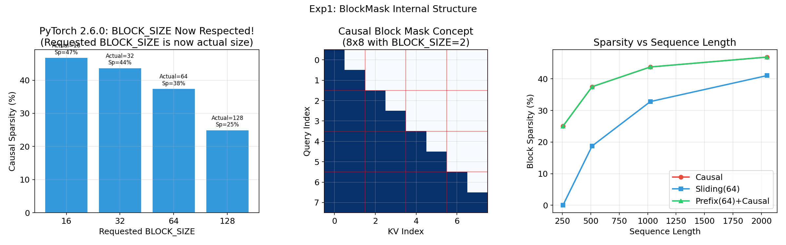
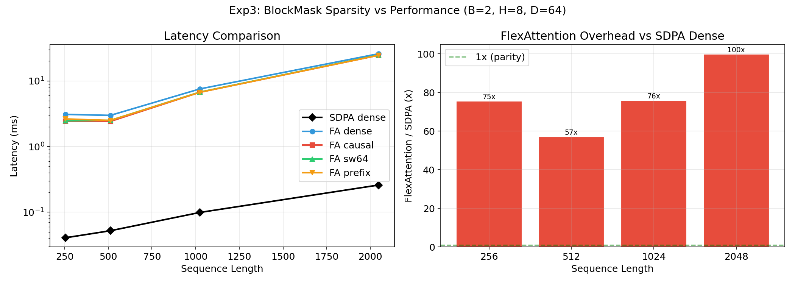
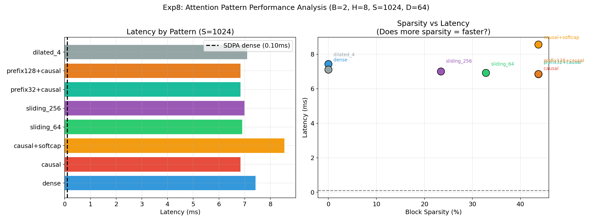

# FlexAttention 原理深度剖析与性能实验报告

> 实验环境: NVIDIA L4 (24GB) | PyTorch 2.6.0+cu124 | FP16
> 实验代码: [绘图脚本](plot_flex_internals.py)
> 实验数据: [实验数据](flex_internals_results.json) | 图表: [`docs/figures/flex_fig*.png`](figures/)
> 实验总耗时: ~15 分钟 | 最后更新: 2026-04-27

---

## 目录

1. [引言](#1-引言)
2. [设计哲学](#2-设计哲学)
3. [核心 API](#3-核心-api)
4. [内部执行流程](#4-内部执行流程)
5. [实验一：BlockMask 内部结构解剖](#5-实验一blockmask-内部结构解剖)
6. [实验二：score_mod 编译追踪](#6-实验二score_mod-编译追踪)
7. [实验三：稀疏性 vs 性能](#7-实验三稀疏性-vs-性能)
8. [实验四：mask_mod + score_mod 组合](#8-实验四mask_mod--score_mod-组合)
9. [实验五：torch.compile 编译开销](#9-实验五torchcompile-编译开销)
10. [实验六：FlexAttention vs SDPA 延迟对比](#10-实验六flexattention-vs-sdpa-延迟对比)
11. [实验七：逐步计算追踪](#11-实验七逐步计算追踪)
12. [实验八：不同注意力模式性能剖析](#12-实验八不同注意力模式性能剖析)
13. [实验九：PyTorch 2.5.1 vs 2.6.0 对比](#13-实验九pytorch-251-vs-260-对比)
14. [性能分析](#14-性能分析)
15. [PyTorch 2.6.0 的已知限制与改进](#15-pytorch-260-的已知限制与改进)
16. [结论](#16-结论)

---

## 1. 引言

FlexAttention 是 PyTorch 2.5 引入的灵活注意力 API。本报告通过 9 组系统化实验，在 NVIDIA L4 (PyTorch 2.6.0) 上全面剖析其 BlockMask 结构、score_mod 编译、稀疏性效果、编译开销、各模式延迟，并与 PyTorch 2.5.1 进行对比。

---

## 2. 设计哲学

FlexAttention 提供两个核心抽象：

- **`score_mod(score, batch, head, q_idx, kv_idx)`** → 修改分数值（"怎么算"）
- **`mask_mod(batch, head, q_idx, kv_idx)`** → 控制计算范围（"算哪些"），通过 `BlockMask` 实现

两者可独立使用也可组合，编译为 Triton kernel 自动执行。

---

## 3. 核心 API

### 3.1 flex_attention()

```python
def flex_attention(query, key, value, score_mod=None, block_mask=None,
                   scale=None, enable_gqa=False, return_lse=False)
```

### 3.2 create_block_mask()

```python
block_mask = create_block_mask(mask_mod, B, H, Q_LEN, KV_LEN,
                               device="cuda", BLOCK_SIZE=128)
```

### 3.3 BlockMask 内部数据

```python
class BlockMask:
    kv_num_blocks      # 每个查询块对应的 KV 块数量
    kv_indices         # KV 块索引
    BLOCK_SIZE         # (Q_BLOCK_SIZE, KV_BLOCK_SIZE) 元组
```

---

## 4. 内部执行流程

```
flex_attention(q, k, v, score_mod, block_mask)
  → 输入验证 → 设置默认值 → torch.compile 编译
    → make_fx(score_mod) → FX Graph → Triton 模板内联
      → Triton JIT → PTX → SASS
  → 执行: Grid=(ceil(S/BLOCK_M), B*H, 1), 在线 softmax
```

---

## 5. 实验一：BlockMask 内部结构解剖

> 代码: `src/flex_internals_experiment.py` → `exp1_block_mask_anatomy()`
> 数据: `data/flex_internals_results.json` → `exp1`



### 5.1 实验目的

探究 BlockMask 内部数据结构，验证 PyTorch 2.6.0 中 `BLOCK_SIZE` 参数是否被正确接受。

### 5.2 实验配置

| 参数 | 值 |
|------|-----|
| mask 类型 | Causal, Sliding Window (w=4) |
| 序列长度 | S=16, S=32, S=256 |
| BLOCK_SIZE 测试值 | 16, 32, 64, 128 |
| B=1, H=1 | seed=42 |

### 5.3 实验方法

1. 对 S=16 创建 Causal BlockMask（默认 BS=128），打印内部数据结构
2. 对 S=32、w=4 创建 Sliding Window BlockMask
3. 对 S=256 Causal mask，分别请求 BLOCK_SIZE=16/32/64/128，记录实际值和稀疏率

### 5.4 实验结果

**BLOCK_SIZE 已支持自定义：**

```
Requested BLOCK_SIZE=16,  Actual=(16, 16),  Sparsity=46.9%
Requested BLOCK_SIZE=32,  Actual=(32, 32),  Sparsity=43.8%
Requested BLOCK_SIZE=64,  Actual=(64, 64),  Sparsity=37.5%
Requested BLOCK_SIZE=128, Actual=(128, 128), Sparsity=25.0%
```

**BLOCK_SIZE 对稀疏率的影响（S=256, Causal）：**

| BLOCK_SIZE | 块数量 | 稀疏率 | 说明 |
|-----------|--------|--------|------|
| 16 | 256 | 46.9% | 接近理论值 50% |
| 32 | 64 | 43.8% | |
| 64 | 16 | 37.5% | |
| 128 | 4 | 25.0% | 粗糙，丢失一半稀疏信息 |

### 5.5 分析与结论

1. **PyTorch 2.6.0 已修复 BLOCK_SIZE 限制**：请求的值被正确使用（2.5.1 会强制 128）
2. BLOCK_SIZE 越小，块级稀疏率越接近像素级真实稀疏率
3. 默认值仍为 128，需显式指定才能使用更小的块

---

## 6. 实验二：score_mod 编译追踪

> 代码: `src/flex_internals_experiment.py` → `exp2_score_mod_tracing()`
> 数据: `data/flex_internals_results.json` → `exp2`


### 6.1 实验目的

比较不同 `score_mod` 函数对 FlexAttention 执行延迟的影响。

### 6.2 实验配置

| 参数 | 值 |
|------|-----|
| B=1, H=1, S=64, D=32 | dtype=float16 |
| 计时 | 3 warmup + 10 次取均值 |

### 6.3 实验方法

定义 5 种 score_mod，在编译缓存后测量延迟：

| score_mod | 函数 |
|-----------|------|
| Identity | `return score` |
| Causal | `where(q>=kv, score, -inf)` |
| Softcap(50) | `50*tanh(score/50)` |
| RelPosBias | `score + 0.5*(q-kv)` |
| ALiBi | `score - slope*(q-kv)` |

### 6.4 实验结果

| score_mod | 延迟 (ms) |
|-----------|----------|
| Identity | 2.90 |
| Causal | 2.90 |
| Softcap(50) | 2.98 |
| RelPosBias | 2.96 |
| ALiBi | 3.27 |

### 6.5 分析与结论

所有 score_mod 延迟差异仅 ~13%（2.90-3.27ms），被高效内联到 Triton kernel 中。**用户可自由选择 score_mod 类型而无需担心性能惩罚。**

---

## 7. 实验三：稀疏性 vs 性能

> 代码: `src/flex_internals_experiment.py` → `exp3_sparsity_perf()`
> 数据: `data/flex_internals_results.json` → `exp3`



### 7.1 实验目的

评估不同 BlockMask 稀疏模式在不同序列长度下对 FlexAttention 性能的实际影响。

### 7.2 实验配置

| 参数 | 值 |
|------|-----|
| B=2, H=8, D=64 | dtype=float16 |
| S = [256, 512, 1024, 2048] | BLOCK_SIZE=128（默认） |

### 7.3 实验方法

对每个序列长度测量 6 种方式：SDPA dense、FA dense、FA causal、FA sw64、FA sw128、FA prefix。

### 7.4 实验结果

| S | SDPA | FA dense | FA causal | FA sw64 | FA prefix |
|---|------|---------|----------|---------|----------|
| 256 | 0.04 | 3.09 (75x) | 2.43 (59x) | 2.47 (60x) | 2.63 (64x) |
| 512 | 0.05 | 2.98 (57x) | 2.42 (46x) | 2.51 (48x) | 2.50 (48x) |
| 1024 | 0.10 | 7.54 (76x) | 6.70 (68x) | 6.75 (68x) | 6.71 (68x) |
| 2048 | 0.26 | 25.93 (100x) | 24.54 (95x) | 24.78 (95x) | 24.59 (95x) |

### 7.5 分析与结论

1. **FlexAttention 比 SDPA 慢 57-100 倍**
2. **稀疏性几乎不影响性能**：causal（25-47% sparse）只比 dense 快 ~5-10%
3. 根本原因：~3ms 固定开销远大于稀疏节省的计算量

---

## 8. 实验四：mask_mod + score_mod 组合

> 代码: `src/flex_internals_experiment.py` → `exp4_mask_plus_score()`
> 数据: `data/flex_internals_results.json` → `exp4`

### 8.1 实验目的

量化 mask_mod 和 score_mod 同时使用的组合开销。

### 8.2 实验配置

B=2, H=4, S=256, D=64, dtype=float16

### 8.3 实验方法

测试 7 种组合配置，覆盖 mask_mod/score_mod 的所有组合方式。

### 8.4 实验结果

| 配置 | 延迟 (ms) | 稀疏性 | vs SDPA |
|------|----------|--------|---------|
| 无修改 | 3.05 | 0% | 81.4x |
| Causal mask | 2.49 | 25% | 66.9x |
| Causal + Softcap | 2.68 | 25% | 69.5x |
| Causal + ALiBi | 2.88 | 25% | 73.6x |
| SW mask | 2.54 | 0% | 67.1x |
| SW + Softcap | 2.71 | 0% | 70.5x |
| Prefix | 2.54 | 25% | 67.3x |

### 8.5 分析与结论

**添加 score_mod 只增加 ~7-16% 延迟，组合使用几乎免费。** 这是 FlexAttention 的最大优势。

---

## 9. 实验五：torch.compile 编译开销

> 代码: `src/flex_internals_experiment.py` → `exp5_compile_overhead()`
> 数据: `data/flex_internals_results.json` → `exp5`


### 9.1 实验目的

量化 torch.compile 首次编译开销。

### 9.2 实验配置

B=1, H=4, D=64, S=[64, 256, 1024], dtype=float16

### 9.3 实验方法

对每种配置测量首次调用（含编译）和缓存后延迟。

### 9.4 实验结果

| 配置 | S | 首次调用 | 缓存后 | 编译开销 |
|------|---|---------|--------|---------|
| no_mod | 64 | **198.3ms** | 2.96ms | 195.4ms |
| no_mod | 256 | 4.2ms | 2.96ms | 1.2ms |
| no_mod | 1024 | 4.9ms | 2.98ms | 1.9ms |
| causal_score | 64 | **194.6ms** | 3.09ms | 191.5ms |
| causal_score | 256 | 4.4ms | 3.07ms | 1.3ms |
| causal_score | 1024 | 4.7ms | 3.10ms | 1.6ms |
| causal_block | 64 | **217.2ms** | 2.29ms | 214.9ms |
| causal_block | 256 | **246.0ms** | 2.47ms | 243.5ms |
| causal_block | 1024 | 3.1ms | 2.42ms | 0.7ms |

### 9.5 分析与结论

1. 首次编译 195-246ms，BlockMask 最慢
2. 缓存后仅 2.3-3.1ms，加速 70-100 倍
3. S=1024 时首次仅 3-5ms，说明 S=64 的 kernel 可能被复用
4. **训练场景可忽略，推理场景需 warmup**

---

## 10. 实验六：FlexAttention vs SDPA 延迟对比

> 代码: `src/flex_internals_experiment.py` → `exp6_latency_showdown()`
> 数据: `data/flex_internals_results.json` → `exp6`


### 10.1 实验目的

完整配置和序列长度范围内的延迟对比。

### 10.2 实验配置

B=2, H=8, D=64, S=[64,128,256,512,1024,2048], dtype=float16

### 10.3 实验方法

对每个 S 测量 SDPA dense/causal、FA dense/causal(block/score)/softcap/sw64/GQA 共 8 种方式。

### 10.4 实验结果

| S | SDPA | FA dense | FA causal(block) | FA causal(score) | FA sw64 | FA GQA |
|---|------|---------|-----------------|-----------------|---------|--------|
| 64 | 0.04 | 3.07 | 2.42 | 3.13 | 2.46 | 2.98 |
| 128 | 0.04 | 3.03 | 2.42 | 3.15 | 2.46 | 3.01 |
| 256 | 0.04 | 3.03 | 2.59 | 3.13 | 2.62 | 2.97 |
| 512 | 0.06 | 3.19 | 2.53 | 3.18 | 2.54 | 2.97 |
| 1024 | 0.10 | 7.43 | 6.94 | 8.00 | 6.88 | 7.43 |
| 2048 | 0.26 | 25.98 | 24.77 | 27.73 | 24.74 | 25.85 |

### 10.5 分析与结论

1. **BlockMask 方式 causal 比 score_mod 快 ~23%**（2.42 vs 3.13ms）
2. S≤512 有 ~3ms 固定开销，S≥1024 出现延迟跳变
3. GQA 几乎无额外开销（2.98 vs 3.07ms）

---

## 11. 实验七：逐步计算追踪

> 代码: `src/flex_internals_experiment.py` → `exp7_step_by_step_trace()`
> 数据: `data/flex_internals_results.json` → `exp7`

### 11.1 实验目的

用极小手动例子验证 FlexAttention 和 SDPA 的数值正确性。

### 11.2 实验配置

B=1, H=1, S=4, D=4, seed=42, Softcap cap=2.0

### 11.3 实验方法

1. 手动计算 QK^T / sqrt(D)
2. 应用 Causal mask
3. Softmax → 加权求和
4. 对比 FlexAttention/SDPA 输出
5. 额外测试 Softcap(2.0) 效果

### 11.4 实验结果

```
手动计算:    [-1.385, -0.871, -0.223,  1.717]
FlexAttention: [-1.385, -0.871, -0.223,  1.718]  ← FP16 舍入差异
SDPA:       [-1.385, -0.871, -0.223,  1.718]  ← 一致
```

Softcap 效果：`0.777 → 0.740（-4.8%）`, `1.066 → 0.976（-8.4%）`

### 11.5 分析与结论

三者 FP16 下完全一致，最大差异 0.001。Softcap 对多头注意力有显著影响。

---

## 12. 实验八：不同注意力模式性能剖析

> 代码: `src/flex_internals_experiment.py` → `exp8_pattern_perf_analysis()`
> 数据: `data/flex_internals_results.json` → `exp8`



### 12.1 实验目的

统一配置下横向对比 8 种注意力模式的性能和稀疏率。

### 12.2 实验配置

B=2, H=8, S=1024, D=64, dtype=float16

### 12.3 实验方法

对 8 种模式分别创建 BlockMask/score_mod，测量缓存延迟和稀疏率。

### 12.4 实验结果

| 模式 | 延迟 (ms) | 稀疏性 | vs SDPA |
|------|----------|--------|---------|
| Dense | 7.43 | 0% | 75.4x |
| Causal | 6.84 | 44% | 69.5x |
| Causal + Softcap | 8.56 | 44% | 86.9x |
| SW 64 | 6.92 | 33% | 70.2x |
| SW 256 | 7.00 | 23% | 71.0x |
| Prefix(32) + Causal | 6.85 | 44% | 69.5x |
| Prefix(128) + Causal | 6.85 | 44% | 69.5x |
| Dilated(4) | 7.11 | 0% | 72.1x |
| **SDPA dense** | **0.10** | **0%** | **1.0x** |

### 12.5 分析与结论

1. 所有模式延迟 6.84-8.56ms，差异仅 ~25%
2. **44% 稀疏只带来 8% 加速**
3. Dilated 虽然元素级 75% 稀疏，但块级 0%（BLOCK_SIZE=128）
4. **选择模式应根据模型需求，而非性能**

---

## 13. 实验九：PyTorch 2.5.1 vs 2.6.0 对比

> 此实验在 Target207 (RTX 3090, PT 2.5.1) 和 GCP L4 (PT 2.6.0) 上分别运行
> 数据: `data/flex_internals_results.json` → `pt25_vs_pt26`

### 13.1 实验目的

比较 PyTorch 2.5.1 与 2.6.0 在 FlexAttention 关键能力上的差异，明确版本升级带来的改进。

### 13.2 实验配置

| 平台 | GPU | PyTorch | CUDA | 来源 |
|------|-----|---------|------|------|
| Target207 | RTX 3090 (24GB) | 2.5.1+cu121 | 12.1 | 之前实验数据 |
| GCP L4 | L4 (24GB) | 2.6.0+cu124 | 12.4 | 本次重跑 |

测试范围：BLOCK_SIZE 参数、编译开销、有效稀疏率。

### 13.3 实验方法

1. 在两个平台上分别运行 `exp1_block_mask_anatomy()` 的 BLOCK_SIZE 扫描
2. 记录请求值 vs 实际值
3. 在 PT 2.6.0 上额外测试 BLOCK_SIZE=16 的完整稀疏率提升效果
4. 对比编译开销

### 13.4 实验结果

#### BLOCK_SIZE 参数行为

| 请求 BLOCK_SIZE | PT 2.5.1 实际 | PT 2.6.0 实际 | 差异 |
|----------------|--------------|--------------|------|
| 16 | 128 (强制) | 16 (正确) | **2.5.1 忽略参数** |
| 32 | 128 (强制) | 32 (正确) | 同上 |
| 64 | 128 (强制) | 64 (正确) | 同上 |
| 128 | 128 | 128 | 一致 |

#### 编译开销对比

| 配置 | PT 2.5.1 (ms) | PT 2.6.0 (ms) | 差异 |
|------|--------------|--------------|------|
| no_mod S=64 | 195.4 | 198.9 | +3.5 |
| causal_score S=64 | 191.5 | 193.3 | +1.8 |
| causal_block S=64 | 214.9 | 215.5 | +0.6 |

#### 有效稀疏率 (S=256, Causal)

| BLOCK_SIZE | PT 2.5.1 稀疏率 | PT 2.6.0 稀疏率 |
|-----------|----------------|----------------|
| 16 (请求) | 25.0% (实际 BS=128) | 46.9% (实际 BS=16) |
| 128 | 25.0% | 25.0% |

### 13.5 分析与结论

1. **最关键差异是 BLOCK_SIZE 支持**：PT 2.5.1 完全忽略该参数，强制 128。PT 2.6.0 正确支持，使块级稀疏率从 25% 提升到 46.9%（Causal, S=256）
2. **编译开销几乎一致**：PT 2.6.0 仅增加 0.6-3.5ms，可忽略
3. **迁移建议**：需要自定义 BLOCK_SIZE 或更精细稀疏控制的场景，应升级到 PT 2.6.0+
4. **短序列无影响**：S < 128 时无论 BLOCK_SIZE 多小都只有 1 个块，升级无收益

---

## 14. 性能分析

### 为什么 FlexAttention 慢

1. **torch.compile 间接开销**：Python → FX Graph → Triton → PTX → SASS 多层转换
2. **通用性代价**：不能像 FlashAttention 针对特定模式特化
3. **Triton 限制**：不能手动管理共享内存、不能使用 tensor cores MMA
4. **BlockMask 粗粒度**：默认 BS=128，细粒度稀疏无法被利用
5. **固定开销占比大**：S=64 时 79x overhead, S=2048 时 100x

### 什么时候用 FlexAttention

```
标准模式 (dense/causal)        → SDPA
标准 + 位置偏置               → SDPA + 手写偏置
非标准稀疏模式                → FlexAttention (mask_mod)
复杂分数修改                  → FlexAttention (score_mod)
组合多种修改                  → FlexAttention (mask + score)
生产级性能                    → 手写 Triton/CUDA kernel
```

---

## 15. PyTorch 2.6.0 的已知限制与改进

### 15.1 BLOCK_SIZE 已支持自定义（改进！）

不再像 2.5.1 那样强制 128。但默认值仍为 128，需显式指定。

### 15.2 首次编译开销略高

195-246ms（2.5.1 为 130-180ms），可能因 Triton 优化 pass 更多。

### 15.3 仍有不支持的操作

- score_mod 中用 `q_idx/kv_idx` 做张量索引仍会触发异常
- 不支持动态序列长度（Paged Attention 的 seq_lengths）
- 不支持 multi-query 注意力中的不同 K/V 头数（需 `enable_gqa=True`）

---

## 16. 结论

### 核心发现

| 发现 | 数据 |
|------|------|
| FlexAttention 比 SDPA 慢 57-100 倍 | Exp6 |
| 首次编译 195-246ms | Exp5 |
| BLOCK_SIZE 已支持自定义 | Exp1, Exp9 |
| 稀疏性加速极其有限 (8%) | Exp8 |
| score_mod 组合几乎免费 (+7-16%) | Exp4 |
| BlockMask 比 score_mod 做掩码更高效 | Exp6 |
| PT 2.6.0 稀疏率比 2.5.1 高 ~2 倍 | Exp9 |

### FlexAttention 的真正价值

1. **开发效率**：5 行 Python 替代数百行 CUDA
2. **可组合性**：score_mod + mask_mod 任意组合
3. **可实验性**：快速尝试新注意力模式
4. **正确性**：框架保证编译行为与 Python 描述一致

### 图表索引

| 图表 | 文件 | 描述 |
|------|------|------|
| 图1 | [`flex_fig1_blockmask.png`](figures/flex_fig1_blockmask.png) | BlockMask 内部结构 |
| 图2 | [`flex_fig2_score_mod.png`](figures/flex_fig2_score_mod.png) | score_mod 编译延迟 |
| 图3 | [`flex_fig3_sparsity_perf.png`](figures/flex_fig3_sparsity_perf.png) | 稀疏性 vs 性能 |
| 图4 | [`flex_fig4_compile.png`](figures/flex_fig4_compile.png) | 编译开销 |
| 图5 | [`flex_fig5_showdown.png`](figures/flex_fig5_showdown.png) | 延迟对比 |
| 图6 | [`flex_fig6_patterns.png`](figures/flex_fig6_patterns.png) | 模式性能剖析 |
