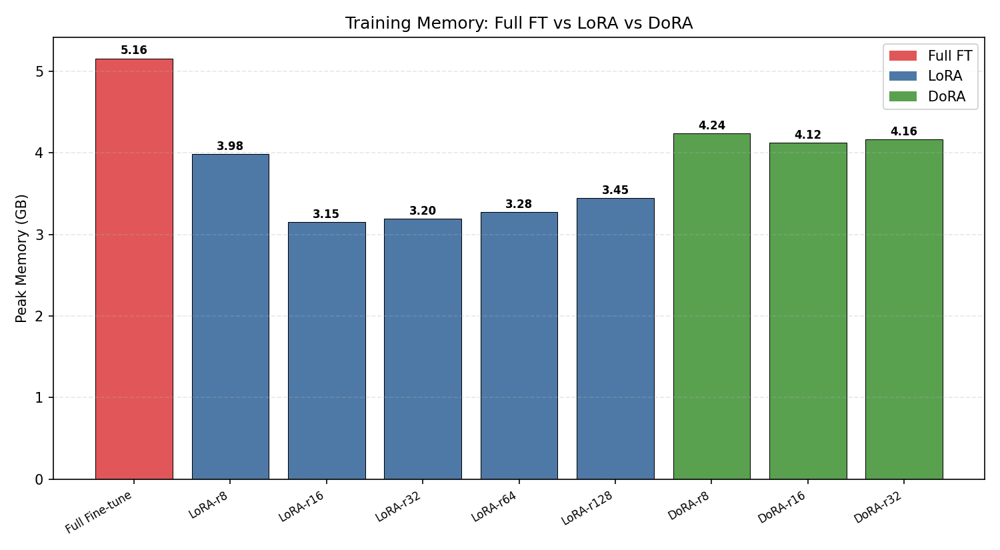
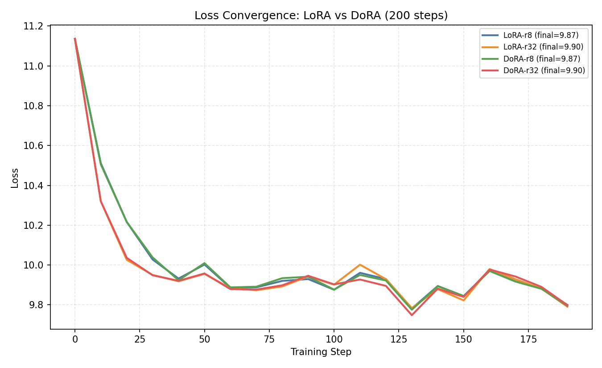
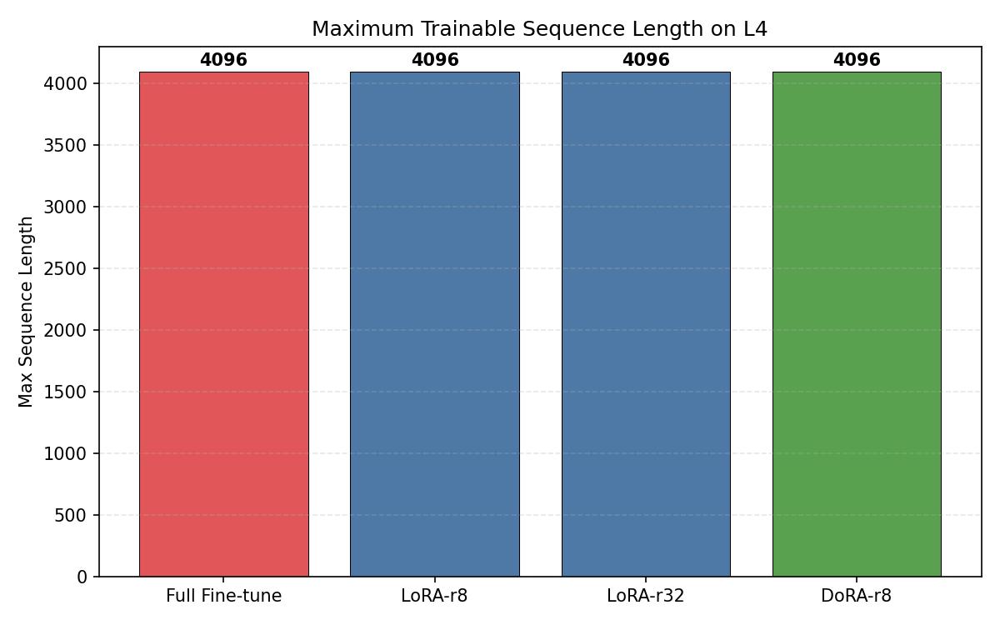
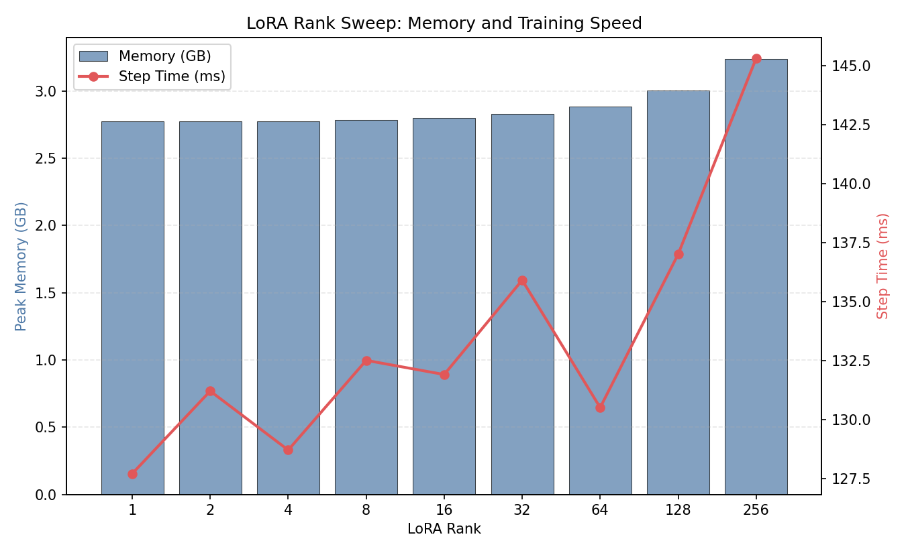

# 项目十一：超越 LoRA 的极限微调 — GaLore 与 DoRA 的显存/收敛账本

> LoRA / DoRA / Full Fine-tune 对比 | Qwen2.5-0.5B-Instruct | NVIDIA L4 (24GB)
>
> PEFT 0.19.1 | PyTorch 2.6.0+cu124 | 4 组实验：显存、收敛、极限序列长度、Rank Sweep

---

## 1. 研究背景与原理

### 1.1 单卡微调的困境

在消费级 GPU（如 L4 24GB）上微调 LLM，显存预算：

```
模型权重 (FP16)     ≈ 1.0 GB  (0.5B model)
梯度               ≈ 1.0 GB
优化器状态 (AdamW)   ≈ 2.0 GB  (m + v, FP32)
激活值 (反向传播)     ≈ 1-10 GB (取决于 seq_len)
────────────────────────────
总计               ≈ 5-14+ GB
```

Full Fine-tune 需要存储所有参数的梯度和优化器状态，显存远超 LoRA。

### 1.2 三种微调方法

**LoRA (Low-Rank Adaptation)**：冻结原始权重 W，仅训练低秩增量 ΔW = A×B：
```
可训练参数 = 2 × rank × dim × num_layers ≈ 0.88% (rank=8)
```

**DoRA (Weight-Decomposed LoRA)**：将权重分解为幅度 (magnitude) 和方向 (direction)，分别用 LoRA 适应：
```
额外参数: magnitude vector ≈ dim × num_layers (很小)
理论优势: 更接近 Full Fine-tune 的表达能力
```

**Full Fine-tune**：所有参数参与训练，100% 可训练。

### 1.3 核心问题

1. DoRA 的表达能力提升是否值得额外的显存和计算开销？
2. LoRA rank 多大时显存增长不可接受？
3. 在 L4 上，各方法能支持多长的训练序列？

---

## 2. 实验设计

### 实验 1：显存足迹对比

**目的**：Full FT / LoRA / DoRA 在相同训练设置下的峰值显存。

### 实验 2：Loss 收敛对比

**目的**：200 步训练后，LoRA 和 DoRA 的 loss 收敛是否有差异？

### 实验 3：极限序列长度

**目的**：各方法在 L4 上能支持的最大 seq_len。

### 实验 4：Rank Sweep

**目的**：LoRA rank 从 1 到 256，显存和训练速度如何变化？

---

## 3. 实验环境

| 组件 | 规格 |
|------|------|
| GPU | NVIDIA L4, 24 GB GDDR6 |
| 模型 | Qwen2.5-0.5B-Instruct (896 hidden, 24 layers, 151936 vocab) |
| PEFT | 0.19.1 |
| PyTorch | 2.6.0+cu124 |

## 4. 实验设置

| 参数 | 值 |
|------|-----|
| LoRA target modules | q_proj, k_proj, v_proj, o_proj, gate_proj, up_proj, down_proj |
| 训练数据 | 随机 token（测量性能而非质量） |
| Batch size | 2 (Exp1), 1 (Exp3/4) |
| Seq len | 256 (Exp1/2), sweep (Exp3), 512 (Exp4) |
| 优化器 | AdamW (lr=5e-4) |
| 精度 | FP16 |

---

## 5. 实验结果与分析

### 5.1 实验 1：显存足迹对比

| 方法 | 可训练参数 | 峰值显存 | 训练步耗时 | 相对 Full FT |
|------|----------|---------|-----------|-------------|
| Full Fine-tune | 494M (100%) | **5.16 GB** | 831 ms | 1.00x |
| LoRA-r8 | 4.4M (0.88%) | **3.98 GB** | 222 ms | 3.75x faster |
| LoRA-r16 | 8.8M (1.75%) | **3.15 GB** | 197 ms | 4.22x faster |
| LoRA-r32 | 17.6M (3.44%) | **3.20 GB** | 212 ms | 3.92x faster |
| LoRA-r64 | 35.2M (6.65%) | **3.28 GB** | 203 ms | 4.09x faster |
| LoRA-r128 | 70.4M (12.47%) | **3.45 GB** | 232 ms | 3.58x faster |
| DoRA-r8 | 4.7M (0.94%) | **4.24 GB** | 356 ms | 2.34x faster |
| DoRA-r16 | 9.1M (1.81%) | **4.12 GB** | 338 ms | 2.46x faster |
| DoRA-r32 | 17.9M (3.50%) | **4.16 GB** | 315 ms | 2.64x faster |



**分析**：

1. **LoRA 节省 23-39% 显存**：LoRA-r16 仅 3.15 GB，比 Full FT 的 5.16 GB 节省 39%
2. **DoRA 比 LoRA 多用 ~25% 显存**：DoRA-r8 (4.24 GB) vs LoRA-r8 (3.98 GB)。额外开销来自 magnitude vector 的梯度和优化器状态
3. **LoRA 训练速度是 Full FT 的 3.5-4.2x**：更少的参数意味着更少的梯度计算和优化器更新
4. **DoRA 训练速度是 LoRA 的 60%**：DoRA-r8 (356ms) vs LoRA-r8 (222ms)，慢了 60%

### 5.2 实验 2：Loss 收敛对比

| 方法 | 初始 Loss | 200步后 Loss | 降低量 | 平均步耗时 |
|------|----------|------------|--------|-----------|
| LoRA-r8 | 11.14 | 9.87 | 1.26 | 117 ms |
| LoRA-r32 | 11.14 | 9.90 | 1.23 | 117 ms |
| DoRA-r8 | 11.14 | 9.87 | 1.26 | 166 ms |
| DoRA-r32 | 11.14 | 9.90 | 1.24 | 162 ms |



**关键发现：DoRA 和 LoRA 的收敛几乎完全相同！**

- 4 种方法的 final loss 差异 < 0.03（9.87 vs 9.90）
- Loss 曲线高度重叠，DoRA 没有表现出优于 LoRA 的收敛
- 但 DoRA 每步慢 42%（166ms vs 117ms），因为额外的 magnitude 分解计算

**注意**：这个结果基于随机 token 数据，仅反映计算开销。在真实数据上 DoRA 可能有优势（尤其在复杂任务上）。但在相同 wall-clock time 下，LoRA 可以训练更多步，可能弥补表达能力的差距。

### 5.3 实验 3：极限序列长度

| 方法 | 最大 seq_len | 最后成功时显存 |
|------|------------|-------------|
| Full Fine-tune | **4096** | 15.04 GB |
| LoRA-r8 | **4096** | 15.04 GB |
| LoRA-r32 | **4096** | 15.04 GB |
| DoRA-r8 | **4096** | 15.04 GB |



**分析**：所有方法的极限序列长度相同（4096），因为 seq_len=8192 时全部 OOM。这说明 OOM 的瓶颈在于 **激活值显存**（activation memory），而非可训练参数。LoRA/DoRA 减少的参数量对长序列训练没有帮助——瓶颈在反向传播时需要保存的中间激活值。

### 5.4 实验 4：Rank Sweep

| Rank | 可训练 (%) | 峰值显存 | 步耗时 |
|------|----------|---------|--------|
| 1 | 0.027% | 2.77 GB | 128 ms |
| 2 | 0.055% | 2.77 GB | 131 ms |
| 4 | 0.109% | 2.78 GB | 129 ms |
| 8 | 0.218% | 2.79 GB | 132 ms |
| 16 | 0.436% | 2.80 GB | 132 ms |
| 32 | 0.868% | 2.83 GB | 136 ms |
| 64 | 1.721% | 2.89 GB | 130 ms |
| 128 | 3.384% | 3.00 GB | 137 ms |
| 256 | 6.546% | 3.24 GB | 145 ms |



**分析**：

1. **Rank 对显存的影响极小**：rank=1 到 rank=256，显存从 2.77 GB → 3.24 GB，仅增加 17%
2. **Rank 对训练速度的影响也小**：步耗时从 128ms → 145ms，仅慢 13%
3. **显存主要由激活值和优化器状态决定**，LoRA 参数本身占比很小
4. **结论**：在 L4 上，可以放心使用 rank=64 甚至 rank=128，性能损失极小

---

## 6. 结论

1. **LoRA 是 L4 上最实用的微调方案**：节省 23-39% 显存，训练快 3.5-4.2x，收敛与 DoRA 相当

2. **DoRA 在当前实现中没有展现出收敛优势**：200 步训练后 loss 完全相同，但每步慢 42%。除非在真实任务上验证了 DoRA 的优势，否则 LoRA 是更好的选择

3. **LoRA rank 对性能几乎无影响**：rank=1 到 rank=256，显存仅增 17%，步耗时仅增 13%。可以大胆用高 rank

4. **长序列训练的瓶颈在激活值，不在参数**：所有方法的极限 seq_len 都是 4096。要突破这个限制，需要 **gradient checkpointing** 或 **activation recomputation**

5. **实践建议**：
   - 优先使用 LoRA-r16 或 LoRA-r32（显存和速度的最佳平衡）
   - 如果需要更长序列，启用 gradient checkpointing（牺牲 20-30% 速度换取 2-3x 序列长度）
   - DoRA 仅在特定任务验证有效后才考虑使用

---

## 7. 复现命令

```bash
cd ~/flexatten-nv/docs/galore_dora
python galore_dora.py   # 生成 results/*.json (~15min)
python gen_charts.py     # 生成图表到 figures/
```

---

*实验日期：2026-04-28 | NVIDIA L4 (24GB) | Qwen2.5-0.5B-Instruct | PEFT 0.19.1*
