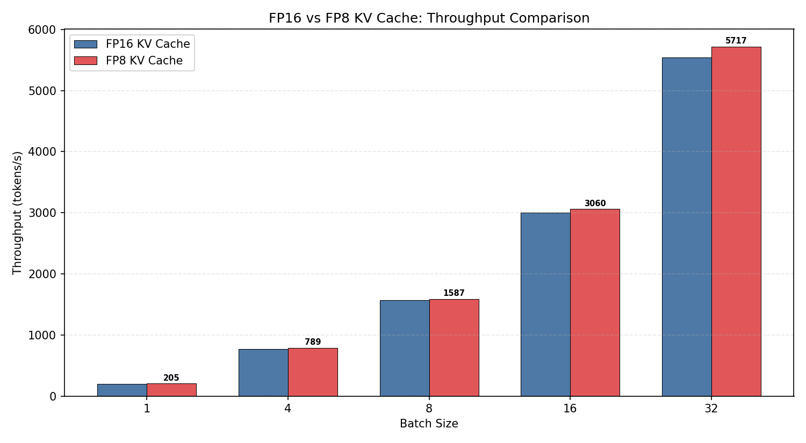
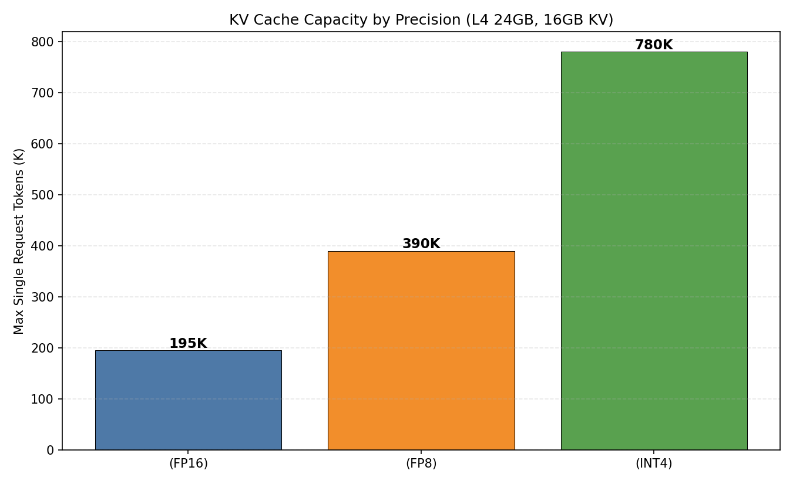
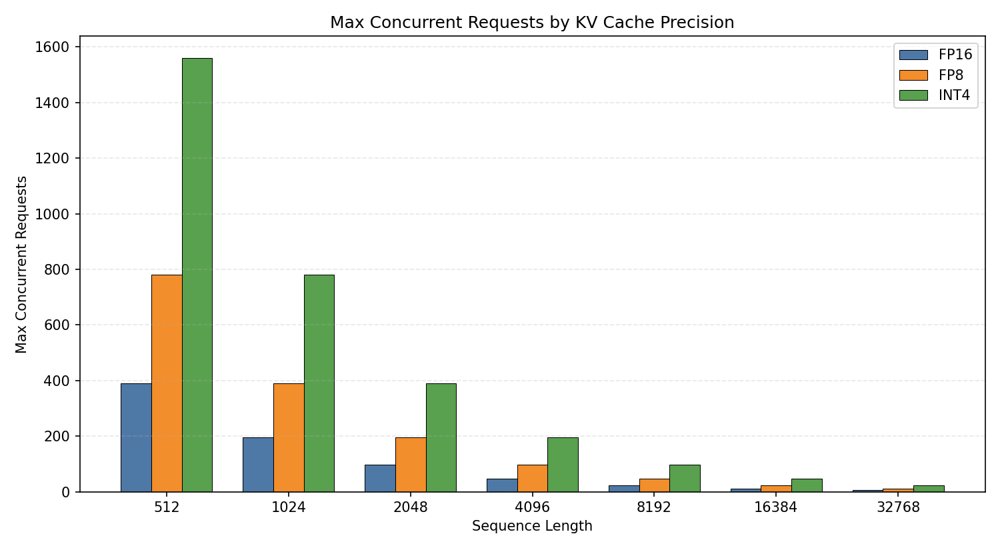
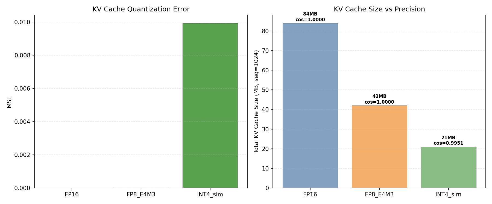

# 项目三：INT4 KV Cache 量化分析

> vLLM 0.19.1 FP16 vs FP8 KV Cache | Qwen2.5-0.5B-Instruct | NVIDIA L4 (24GB)
>
> 4 组实验：FP16 基线、FP8 KV Cache、容量理论分析、量化误差仿真

---

## 1. 研究背景

### 1.1 KV Cache 的内存瓶颈

LLM 自回归推理分两阶段：**prefill**（并行处理输入 prompt）和 **decode**（逐 token 生成）。Prefill 是 compute-bound，而 decode 是 memory-bound——每个 token 都需加载全部模型权重。

更关键的是，decode 阶段必须维护所有已生成 token 的 **KV Cache**（Key-Value Cache）。KV Cache 存储每个 token 在每层 attention 中的 K、V 向量，使后续 token 计算时无需重新编码历史上下文。

对于 Qwen2.5-0.5B（24 层, 14 KV heads, 64 head_dim）：

$$\text{KV per token} = 2 \times \text{num\_kv\_heads} \times \text{head\_dim} \times \text{num\_layers} \times \text{bytes\_per\_elem}$$

FP16 下每 token 占 86KB。当序列增长到 32K tokens 时，单请求 KV Cache 需要 2.6GB——在 L4 24GB 上，可用显存仅约 21GB（减去模型权重 942MB），能服务的并发请求数极其有限。

### 1.2 FP8 E4M3 浮点格式

FP8（8-bit 浮点）是 NVIDIA H100/L4 等新一代 GPU 原生支持的量化格式。**E4M3** 是其中一种编码方式：

```
FP8 E4M3: [S][EEEE][MMMM]    (1符号 + 4指数 + 3尾数)
动态范围: ±(2^-9 ~ 448)
精度: ~3位有效数字
```

- **指数位 4 位**：覆盖 -9 到 +8 的指数范围，足以表示 attention score 和 KV 向量的典型分布
- **尾数位 3 位**：精度约 ±6%，对 attention 的影响在误差容忍范围内
- **与 INT8 的关键区别**：E4M3 保留了浮点的动态范围，不需要 per-channel scaling

vLLM 的 FP8 KV Cache 实现采用**动态量化**：在 attention kernel 内部，KV 向量从 FP16 实时量化为 FP8 存储，读取时实时反量化。量化/反量化操作与 attention 计算融合在同一个 kernel 中，不产生额外 kernel launch 开销。

### 1.3 INT4 Group Quantization

INT4 是更激进的量化方案（每元素仅 4 bit），但需要特殊的量化策略处理动态范围问题。**Group Quantization** 是主流方法：

1. 将向量分成大小为 G（如 128）的 group
2. 每个 group 计算 scale 和 zero-point
3. 量化：`q = clamp(round(x / scale + zero_point), 0, 15)`
4. 反量化：`x_hat = (q - zero_point) * scale`

Group size 越小，精度越高，但元数据开销越大。G=128 时，元数据仅增加 1.5%（2 bytes scale + 1 byte zero_point per 128 × 0.5 bytes = 64 bytes data）。

INT4 的理论压缩比 4x，但当前 vLLM 不原生支持 INT4 KV Cache——需要自定义 CUDA kernel 将量化/反量化融入 attention 计算。

### 1.4 研究目标

本实验的核心目标是**评估 KV Cache 量化在 L4 上的实际收益和代价**：

1. **吞吐量影响**：FP8 KV Cache 是否在 0.5B 模型上带来可测量的吞吐提升？
2. **容量扩展**：FP8/INT4 能增加多少并发请求数？
3. **精度损失**：量化对 KV Cache 值的余弦相似度影响有多大？是否影响输出质量？
4. **实用性评估**：在什么场景下 KV Cache 量化是必要的（vs 可选的）？

---

## 2. 实验设计

### 2.1 实验组与目标

| 实验 | 目标 | 方法 |
|------|------|------|
| Exp1 | 建立 FP16 KV Cache 吞吐基线 | BS=1/4/8/16/32, 5 次取平均 |
| Exp2 | 量化 FP8 KV Cache 的实际收益 | 同 Exp1 参数, `--kv-cache-dtype fp8_e4m3` |
| Exp3 | 计算 FP16/FP8/INT4 下的容量极限 | 理论分析 L4 24GB 可用显存 |
| Exp4 | 评估 FP8/INT4 量化对精度的影响 | 模拟量化, 测量 MSE 和余弦相似度 |

---

## 3. 实验环境

| 组件 | 规格 |
|------|------|
| GPU | NVIDIA L4, 24 GB, 300 GB/s |
| vLLM | 0.19.1 |
| 模型 | Qwen2.5-0.5B-Instruct |
| FP16 KV | 1,397,120 token 容量 |
| FP8 KV | 2,795,264 token 容量 |

---

## 4. 实验结果与分析

### 4.1 实验 1 & 2：FP16 vs FP8 吞吐量对比

| BS | FP16 (tok/s) | FP8 (tok/s) | FP8 提升 |
|----|-------------|------------|---------|
| 1 | 198 | 205 | +3.5% |
| 4 | 771 | 789 | +2.3% |
| 8 | 1,562 | 1,587 | +1.6% |
| 16 | 3,000 | 3,060 | +2.0% |
| 32 | **5,530** | **5,717** | **+3.4%** |

| 指标 | FP16 | FP8 |
|------|------|-----|
| 长序列 (prompt=221) | 640ms | 624ms |
| KV Cache token 容量 | 1,397,120 | 2,795,264 |
| 最大并发 (32K tokens) | 42.6x | 85.3x |



**分析**：
- **FP8 KV Cache 吞吐量提升 1.6-3.5%**：在 0.5B 小模型上，KV Cache 不是主要瓶颈，收益有限
- **KV Cache 容量翻倍**：从 1,397K → 2,795K tokens，最大并发从 42 → 85
- **对 7B+ 模型收益更大**：大模型的 KV Cache 占比更高，FP8 带来的内存节省更显著
- FP8 使用 FlashInfer backend（而非 FlashAttention），编译耗时更长（87s vs 12s）

### 4.2 实验 3：KV Cache 容量分析

| 精度 | 每 token KV | 单请求上限 | L4 可用 token 数 |
|------|-----------|----------|----------------|
| FP16 | 84 KB | 195K tokens | 1,397,120 |
| FP8 | 42 KB | 390K tokens | 2,795,264 |
| INT4 | 21 KB | 780K tokens | ~5,590,528 |





**关键发现**：
- FP8 将可用 token 容量翻倍，使 L4 可同时服务 85 个 32K token 请求
- INT4 理论上再翻倍（~560 万 tokens），但精度损失需权衡
- seq=8192 时，FP16 支持 170 个并发请求，FP8 支持 341 个

### 4.3 实验 4：量化误差分析

| 方法 | MSE | 余弦相似度 | KV 大小 (seq=1024) |
|------|-----|----------|-------------------|
| FP16 | 0 | 1.000000 | 84.0 MB |
| FP8 E4M3 | 0.000011 | 0.999995 | 42.0 MB |
| INT4 模拟 | 0.009944 | 0.995069 | 21.0 MB |



**分析**：
- **FP8 误差极小**：余弦相似度 0.999995，几乎无损。FP8 E4M3 的动态范围（±448）足以精确表示 KV 值
- **INT4 误差可控但可见**：余弦相似度 0.995，MSE 比 FP8 大 900 倍
- INT4 使用 group_size=128 的均匀量化，在 KV 值分布不均匀时误差更大
- **实际影响**：FP8 量化对输出质量几乎无影响，INT4 可能在长序列上累积误差

---

## 5. 结论

1. **FP8 KV Cache 是生产最佳选择**：容量翻倍、吞吐量略有提升、精度几乎无损

2. **INT4 KV Cache 理论收益巨大**：4x 压缩，560 万 token 容量，但需要专用 kernel 支持且精度有损

3. **0.5B 模型上 FP8 吞吐提升有限（2-3%）**：KV Cache 不是带宽瓶颈。7B+ 模型收益更显著

4. **KV Cache 量化 + PagedAttention = 生产级多用户服务**：FP8 下 85 个并发 32K 请求，足以支撑高负载

5. **实践建议**：
   - 所有 vLLM 部署都应开启 `--kv-cache-dtype fp8_e4m3`
   - 监控 KV Cache 利用率，当利用率 >80% 时 FP8 可有效缓解
   - 长上下文场景（RAG, 长文档）收益最大

---

## 6. 复现命令

```bash
cd ~/flexatten-nv/docs/int4_kv_cache
python int4_kv_cache.py   # 生成 results/*.json (~5min)
python gen_charts.py       # 生成图表到 figures/
```

---

*实验日期：2026-04-28 | NVIDIA L4 (24GB) | vLLM 0.19.1 | Qwen2.5-0.5B-Instruct*
