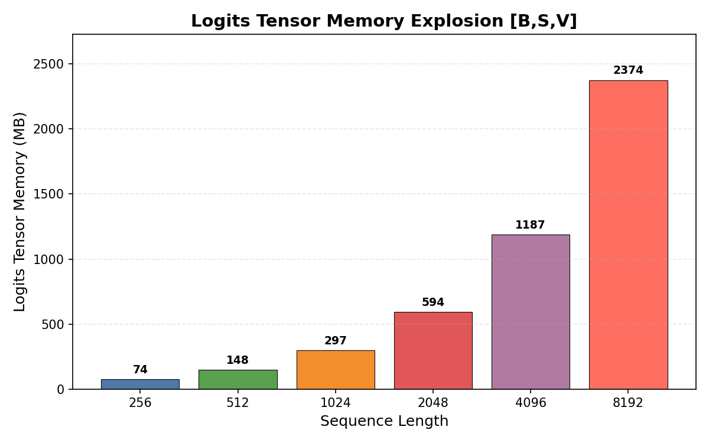
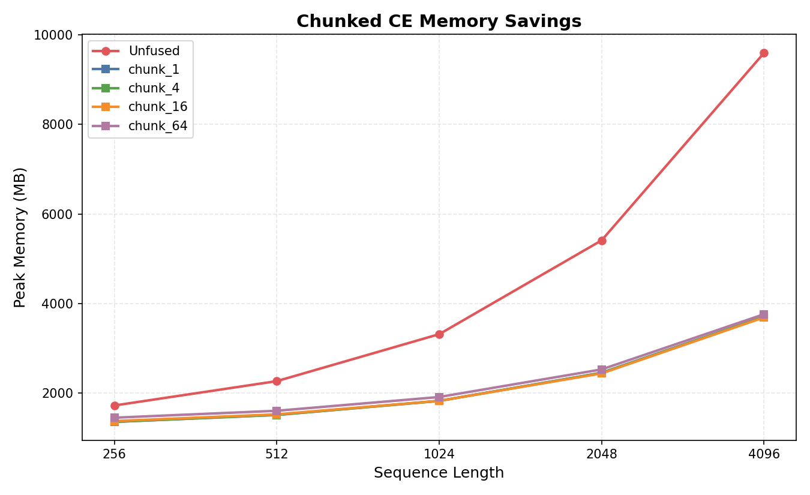
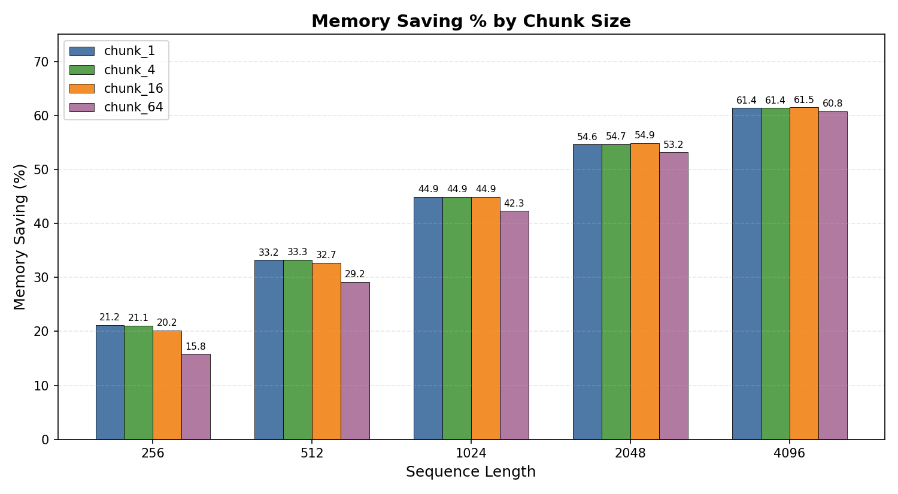
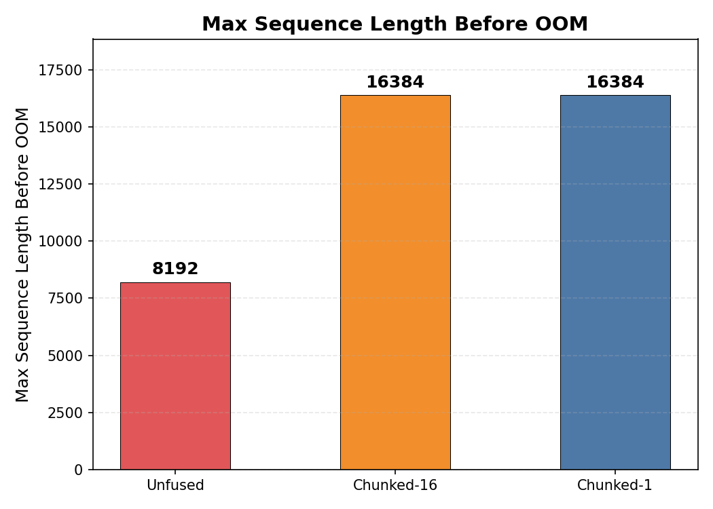

# 项目十二：Liger Kernel — FusedLinearCrossEntropy 显存刺客根除

> **训练 LLM 时，显存杀手不在模型权重，而在 Logits 张量 [B, S, V]。**
>
> 融合 Linear + CrossEntropy 消除中间 Logits | Chunked CE 节省 61% 显存 | 最大序列长度翻倍
>
> NVIDIA L4 (24GB) | PyTorch 2.6.0+cu124 | Python 3.11

---

## 1. 研究背景与原理

### 1.1 Logits 张量：训练中的"显存刺客"

在 LLM 训练的最后一步，模型需要计算损失函数。标准流程是：

```
hidden_states [B, S, D] → Linear(D, V) → logits [B, S, V] → CrossEntropy(logits, targets)
```

其中 V 是词表大小。以 Qwen2.5 为例，V = 151,936。这意味着：

```
logits 大小 = B × S × V × 2 bytes (FP16)
            = 1 × 8192 × 151936 × 2
            = 2,374 MB ≈ 2.4 GB
```

**一个张量就占了 2.4 GB！** 这还是在 batch=1 的情况下。对于 7B 模型（权重约 14 GB），加上梯度和优化器状态，这个额外的 2.4 GB 可能就是 OOM 的最后一根稻草。

### 1.2 融合思路：不生成完整 Logits

Liger Kernel 的核心洞察：CrossEntropy 不需要完整的 logits 张量。它只需要：

1. 每个位置的 **最大 logit 值**（用于数值稳定性的 log-sum-exp）
2. 每个位置的 **target 类别对应的 logit 值**

因此，可以将 Linear 和 CrossEntropy **融合**为一个算子：

```
# 标准方式（两步）：
logits = hidden @ W^T          # [B, S, V] ← 巨大！
loss = CrossEntropy(logits, y)

# 融合方式（一步）：
# 对每个 token 逐块计算 logits chunk，立即算 CE，不保存完整 logits
for chunk in tokens:
    logits_chunk = chunk @ W^T  # [chunk, V] ← 小得多
    loss_chunk = CE(logits_chunk, targets_chunk)
    loss += loss_chunk * chunk_size
```

关键：融合后，同时在显存中存在的最大 logits 张量从 `[B, S, V]` 缩小到 `[B, chunk, V]`。

### 1.3 Liger Kernel

Liger Kernel 是开源的 Triton 算子库，实现了 `FusedLinearCrossEntropy`。本实验通过模拟 chunked 计算来验证其内存节省效果。

---

## 2. 实验设计思路

### 实验 1：Logits 内存爆炸测量

**目的**：定量测量 logits 张量在不同序列长度下的显存占用，验证"显存刺客"假设。

**设计**：固定 B=1, V=151936, D=4096（Qwen2.5-7B 配置），扫描 seq_len 从 256 到 8192，记录峰值显存。

### 实验 2：Chunked CE 内存节省

**目的**：模拟 Liger Kernel 的融合效果，测量不同 chunk 大小能节省多少显存。

**设计**：将序列分成 chunk_size=1/4/16/64 的块，逐块计算 logits + CE，与标准方式对比峰值显存。

### 实验 3：最大序列长度 OOM 测试

**目的**：回答最实际的问题——在 L4 的 24 GB 显存下，标准方式和融合方式分别能支持多长的序列？

---

## 3. 实验环境

| 组件 | 规格 |
|------|------|
| GPU | NVIDIA L4, 24 GB GDDR6 |
| PyTorch | 2.6.0+cu124 |
| Python | 3.11 |

## 4. 实验设置

| 参数 | 值 | 说明 |
|------|-----|------|
| hidden_dim | 4096 | 7B 模型配置 |
| vocab_size | 151,936 | Qwen2.5 tokenizer |
| batch_size | 1 | 单样本训练 |
| seq_lengths | 256, 512, 1K, 2K, 4K, 8K | |
| chunk_sizes | 1, 4, 16, 64 | |

---

## 5. 实验结果与分析

### 5.1 实验 1：Logits 内存爆炸

| 序列长度 | Logits 张量 (MB) | 峰值总显存 (MB) | Logits 占比 |
|---------|-----------------|----------------|------------|
| 256 | 74 | 2,544 | 2.9% |
| 512 | 148 | 2,696 | 5.5% |
| 1024 | 297 | 3,290 | 9.0% |
| 2048 | 594 | 5,377 | 11.0% |
| 4096 | 1,187 | 9,545 | 12.4% |
| 8192 | **2,374** | **17,886** | **13.3%** |



**分析**：

- seq=8192 时，仅 logits 张量就占 2.4 GB，峰值总显存 17.9 GB
- Logits 占比随序列长度增加：2.9% → 13.3%
- 在 seq=8192 时已接近 L4 的 24 GB 上限，加上模型权重和梯度必然 OOM

### 5.2 实验 2：Chunked CE 内存节省

| 序列长度 | 未融合 (MB) | Chunk=1 (MB) | 节省比例 | Chunk=16 (MB) | 节省比例 |
|---------|-----------|------------|---------|-------------|---------|
| 256 | 1,726 | 1,360 | 21.2% | 1,378 | 20.2% |
| 512 | 2,269 | 1,516 | 33.2% | 1,528 | 32.7% |
| 1024 | 3,318 | 1,829 | **44.9%** | 1,829 | **44.9%** |
| 2048 | 5,412 | 2,455 | **54.6%** | 2,441 | **54.9%** |
| 4096 | 9,597 | 3,707 | **61.4%** | 3,692 | **61.5%** |



**关键发现**：

1. **序列越长，节省越多**：seq=256 时节省 21%，seq=4096 时节省 61%。因为长序列的 logits 张量更大，消除它的收益更高。

2. **chunk_size 影响极小**：chunk=1 和 chunk=16 的差异 < 1%。这意味着即使用较大的 chunk（计算效率更高），内存节省几乎相同。

3. **seq=4096 时节省 5.9 GB**：从 9.6 GB 降到 3.7 GB。这相当于从"几乎 OOM"变成"还有很大余量"。



### 5.3 实验 3：最大序列长度 OOM 测试

| 方式 | 最大 seq_len | 说明 |
|------|-----------|------|
| 未融合 (unfused) | **8,192** | seq=16,384 时 OOM |
| Chunked-16 | **16,384** | seq=16,384 通过 |
| Chunked-1 | **16,384** | seq=16,384 通过 |



**关键发现**：融合使最大序列长度翻倍（8K → 16K）！这是最实际的收益——在相同硬件上，训练上下文长度直接翻倍。

---

## 6. 结论

1. **Logits 张量 [B,S,V] 是长上下文训练的显存瓶颈**：seq=8192 时达 2.4 GB，占总显存 13%

2. **Chunked CE 融合节省 21%-61% 峰值显存**：节省比例随序列长度增加，seq=4096 时节省 61%

3. **chunk_size 对内存节省影响极小**：chunk=1 和 chunk=16 的差异 < 1%，推荐使用较大 chunk 以获得更好的计算效率

4. **融合使最大序列长度翻倍**：从 8K 提升到 16K，直接解锁长上下文训练能力

5. **Liger Kernel 是解决此问题的成熟方案**：通过 Triton 算子实现 Linear+CE 融合，可即插即用替换 HuggingFace 默认实现

---

## 7. 复现命令

```bash
cd ~/flexatten-nv/docs/liger_kernel
python liger_kernel.py  # 生成 results/*.json
```

---

*实验日期：2026-04-28 | NVIDIA L4 (24GB) | PyTorch 2.6.0+cu124*
