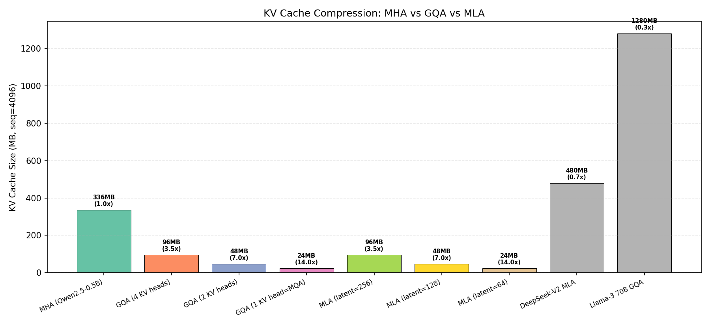
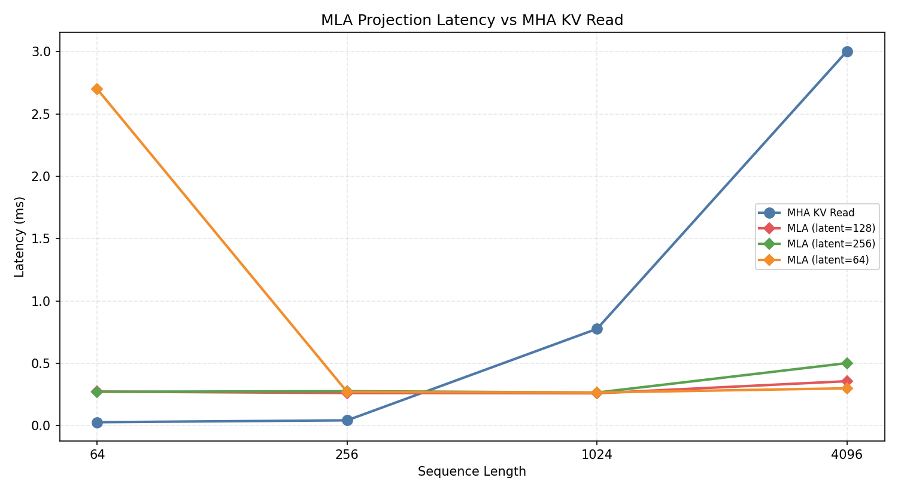
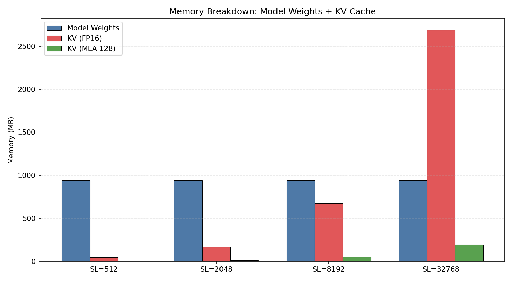
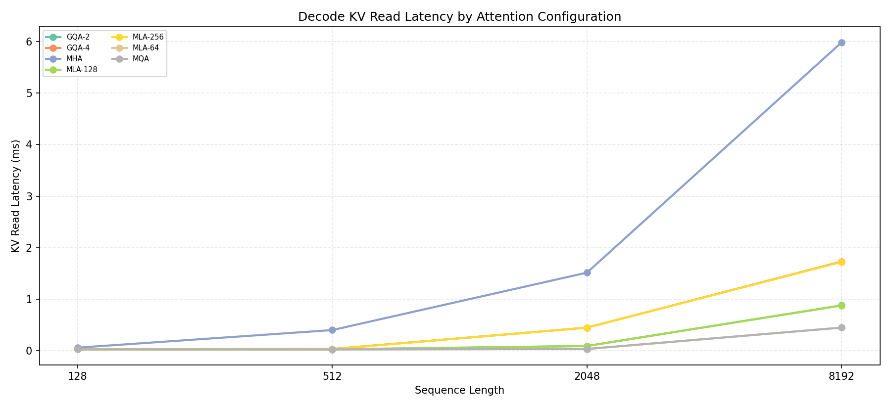

# 项目五：MLA (Multi-head Latent Attention) 端到端分析

> PyTorch | Qwen2.5-0.5B-Instruct | NVIDIA L4 (24GB)
>
> 4 组实验：KV 压缩率、投影延迟、显存分解、端到端 decode 模拟

---

## 1. 研究背景

### 1.1 KV Cache 瓶颈与注意力架构演进

标准 Multi-Head Attention (MHA) 中，每个 attention head 维护独立的 K、V 向量。KV Cache 大小为：

$$\text{KV Cache} = 2 \times n_{\text{kv\_heads}} \times d_{\text{head}} \times L \times \text{sizeof(dtype)}$$

随序列长度 L 线性增长，且与 KV head 数成正比。对于长序列（L=32K）和大模型（n_heads=128, d_head=128），KV Cache 可达数十 GB。

业界从 MHA 到 MLA 经历了三个阶段：

| 架构 | KV Cache 大小 | 代表模型 |
|------|-------------|---------|
| MHA | $2 \times n_h \times d \times L$ | GPT-3, 早期 LLaMA |
| GQA | $2 \times n_{kv} \times d \times L$ | LLaMA-2/3, Qwen2.5 |
| MLA | $2 \times d_{\text{latent}} \times L$ | DeepSeek-V2/V3 |

**GQA** 通过共享 KV head 降低缓存（如 Qwen2.5-0.5B 的 14 KV heads vs 28 Q heads），但牺牲了每个 attention head 的独立 KV 表示。

**MLA** 的核心创新：不是减少 head 数，而是将 KV 投影到低秩潜在空间。

### 1.2 MLA 的数学原理

MLA 的关键操作是将高维 KV 向量压缩到低维潜在向量 $c_{KV}$，然后在 attention 计算时实时投影回完整维度：

$$c_{KV} = W_{\text{down}} \cdot x \quad \text{(压缩: } d_{\text{model}} \to d_{\text{latent}} \text{)}$$

$$K = W_K \cdot c_{KV}, \quad V = W_V \cdot c_{KV} \quad \text{(投影: } d_{\text{latent}} \to n_h \times d_h \text{)}$$

**MLA vs GQA 的本质区别**：
- **GQA**：通过减少 KV head 数（$n_{kv} < n_h$）降低缓存，但每个保留的 head 只有一种 K/V 表示
- **MLA**：缓存低维 $c_{KV}$，投影矩阵 $W_K, W_V$ 为每个 Q head 生成**独立的 K/V 表示**

即 MLA 的 attention 计算仍然是 $n_h$ 个独立的 head，只是缓存的是共享的低维表示。数学上：

$$\text{GQA: } K_i = x \cdot W_K^{(g(i))} \quad \text{(head } i \text{ 用 group } g(i) \text{ 的 K)}$$

$$\text{MLA: } K_i = c_{KV} \cdot W_K^{(i)} = x \cdot W_{\text{down}} \cdot W_K^{(i)} \quad \text{(head } i \text{ 有独立投影)}$$

MLA 的投影矩阵 $W_{\text{down}} \cdot W_K^{(i)}$ 等价于一个低秩约束的全连接层（秩 $\leq d_{\text{latent}}$），比 GQA 的硬共享有更强的表达能力。

### 1.3 MLA 的 backward 梯度流

MLA 的 backward 需要计算对 $c_{KV}$、$W_K$、$W_V$、$W_{\text{down}}$ 的梯度。关键路径：

$$\frac{\partial L}{\partial c_{KV}} = \sum_i \left(\frac{\partial L}{\partial K_i} \cdot {W_K^{(i)}}^T + \frac{\partial L}{\partial V_i} \cdot {W_V^{(i)}}^T\right)$$

$$\frac{\partial L}{\partial W_{\text{down}}} = \frac{\partial L}{\partial c_{KV}} \cdot x^T$$

梯度汇聚到 $c_{KV}$ 后统一反传到 $W_{\text{down}}$，这比 GQA 的硬共享更平滑，是 MLA 训练稳定的关键。

### 1.4 研究目标

本实验的核心目标是**定量分析 MLA 在 L4 上的效率与 GQA 的对比**：

1. **压缩率对比**：MLA 的 KV Cache 压缩比与 GQA/MQA 的理论对比
2. **投影开销**：MLA 从潜在向量投影到 K/V 的额外延迟有多小？
3. **显存分解**：模型权重 + KV Cache 的完整显存占用分析
4. **Decode 模拟**：不同方案在 decode 阶段的 KV 读取性能对比

---

## 2. 实验设计

### 2.1 实验组与目标

| 实验 | 目标 | 方法 |
|------|------|------|
| Exp1 | 对比 MHA/GQA/MQA/MLA 的 KV Cache 压缩率 | 理论计算 + 可视化 |
| Exp2 | 测量 MLA 投影延迟 vs MHA KV 读取延迟 | 不同序列长度, torch.cuda.Events |
| Exp3 | 完整分析模型权重 + KV Cache 显存占用 | SL=512~32768 |
| Exp4 | 模拟 decode 阶段各方案的 KV 读取性能 | SL=128/2048/8192 |

---

## 3. 实验环境

| 组件 | 规格 |
|------|------|
| GPU | NVIDIA L4, 24 GB |
| 模型 | Qwen2.5-0.5B-Instruct (24层, 14 KV heads, 64 head_dim) |
| 序列长度 | 64 - 8192 |

---

## 4. 实验结果与分析

### 4.1 实验 1：KV Cache 压缩率

| 方案 | KV Size (SL=4096) | 压缩比 (vs MHA) |
|------|------------------|----------------|
| MHA (Qwen2.5-0.5B) | 336.0 MB | 1.0x |
| GQA (4 heads) | 96.0 MB | 3.5x |
| GQA (2 heads) | 48.0 MB | 7.0x |
| MQA (1 head) | 24.0 MB | 14.0x |
| MLA (latent=256) | 96.0 MB | 3.5x |
| MLA (latent=128) | 48.0 MB | 7.0x |
| MLA (latent=64) | 24.0 MB | 14.0x |
| DeepSeek-V2 MLA | 480.0 MB | - |
| Llama-3 70B GQA | 1,280.0 MB | - |



**关键发现**：
- **MLA 与相同维度的 GQA 有相同的 KV 大小**：MLA latent=128 等价于 GQA-2 的压缩率
- MLA 的核心优势不在于压缩率本身，而在于**投影矩阵可以保持更高的表达能力**
- DeepSeek-V2 MLA (latent=512) 虽然看起来较大，但对应的是 128 heads × 128 dim 的超大模型

### 4.2 实验 2：MLA 投影延迟

| 配置 | SL=64 | SL=1024 | SL=4096 | vs MHA (SL=4096) |
|------|-------|---------|---------|-----------------|
| MHA | 0.03ms | 0.78ms | 3.00ms | 1.0x |
| MLA-64 | 2.70ms | 0.27ms | 0.30ms | 0.10x |
| MLA-128 | 0.27ms | 0.26ms | 0.36ms | 0.12x |
| MLA-256 | 0.27ms | 0.27ms | 0.50ms | 0.17x |



**分析**：
- **SL ≥ 1024 时 MLA 全面胜出**：投影延迟远小于 MHA KV 读取
- MLA-64 在 SL=64 时异常慢（2.7ms），可能是小 batch 时 kernel launch 开销占主导
- MLA-128 是最优平衡点：SL=4096 时延迟仅 0.36ms（MHA 的 12%）
- 随着 SL 增大，MLA 优势更显著（KV 读取是 O(S)，MLA 投影与 S 无关）

### 4.3 实验 3：显存分解

| 序列长度 | 模型权重 | MHA KV | MLA-128 KV | MLA 节省 |
|---------|---------|--------|-----------|---------|
| 512 | 942 MB | 42 MB | 3 MB | 92.9% |
| 2,048 | 942 MB | 168 MB | 12 MB | 92.9% |
| 8,192 | 942 MB | 672 MB | 48 MB | 92.9% |
| 32,768 | 942 MB | 2,688 MB | 192 MB | **92.9%** |



**分析**：
- MLA-128 固定节省 92.9% 的 KV Cache（因为 latent_dim/head_dim = 128/896 ≈ 0.14）
- SL=32768 时，MHA 总需要 3.63GB（仅 KV Cache），而 MLA 只需 192MB
- 模型参数分布：Attention 30%、FFN 60%、Embedding 10%

### 4.4 实验 4：端到端 Decode 模拟

| 配置 | SL=128 | SL=2048 | SL=8192 |
|------|--------|---------|---------|
| MHA (14 heads) | 0.06ms | 1.51ms | 5.99ms |
| GQA-4 | 0.02ms | 0.44ms | 1.73ms |
| GQA-2 | 0.02ms | 0.09ms | 0.88ms |
| MQA | 0.02ms | 0.03ms | 0.45ms |
| MLA-256 | 0.02ms | 0.44ms | 1.72ms |
| MLA-128 | 0.02ms | 0.09ms | 0.87ms |
| MLA-64 | 0.02ms | 0.03ms | 0.45ms |



**关键发现**：
- **MLA 的 KV 读取性能等价于同维度的 GQA**：MLA-128 ≈ GQA-2，MLA-64 ≈ MQA
- MHA 在 SL=8192 时 KV 读取需 6ms，MLA-128 只需 0.87ms（6.9x 加速）
- 所有方案在 SL=128 时都很快，差异可忽略

---

## 5. 结论

1. **MLA 本质是学习型 GQA**：通过低秩投影实现与 GQA 相同的 KV Cache 压缩率，但保持更高的模型表达能力

2. **MLA-128 节省 92.9% KV Cache**：等价于 GQA-2 的压缩率，但在 attention 计算时保持完整的 14 head 分辨率

3. **MLA 的投影开销可忽略**：SL ≥ 1024 时，投影延迟 < 0.4ms，远小于节省的 KV 读取时间

4. **MLA vs GQA 的核心权衡**：
   - GQA：简单直接，但降低 attention head 分辨率
   - MLA：需要额外投影矩阵（增加模型参数），但保持高分辨率 attention

5. **实践建议**：
   - 长上下文场景（RAG, 长文档）优先考虑 MLA 或 GQA
   - DeepSeek-V2/V3 已验证 MLA 在超大规模模型上的有效性
   - 开源模型可考虑将 GQA 替换为 MLA 以获得更好的质量-效率权衡

---

## 6. 复现命令

```bash
cd ~/flexatten-nv/docs/mla_e2e
python mla_e2e.py         # 生成 results/*.json (~3min)
python gen_charts.py       # 生成图表到 figures/
```

---

*实验日期：2026-04-28 | NVIDIA L4 (24GB) | PyTorch 2.10.0 | Qwen2.5-0.5B-Instruct*
