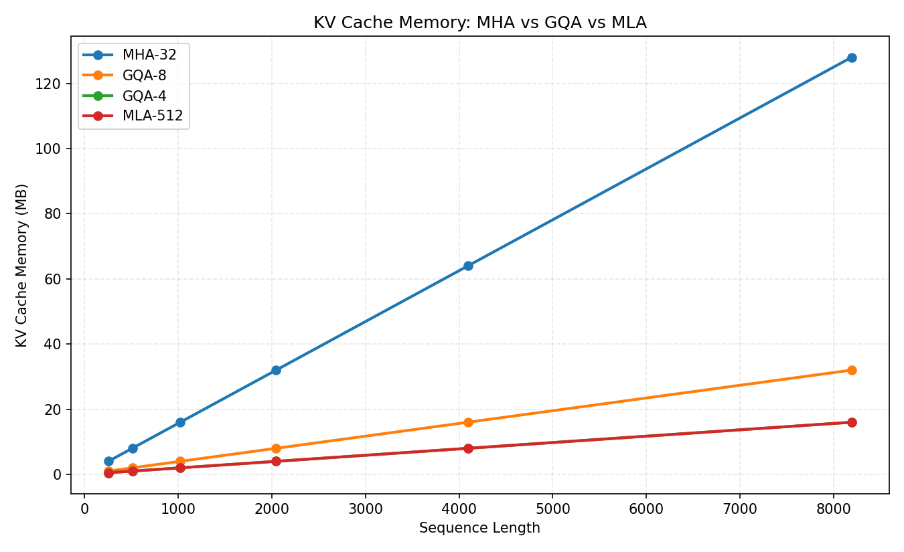
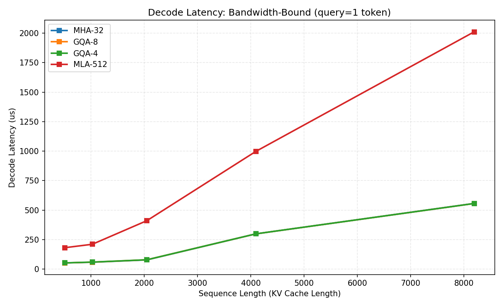
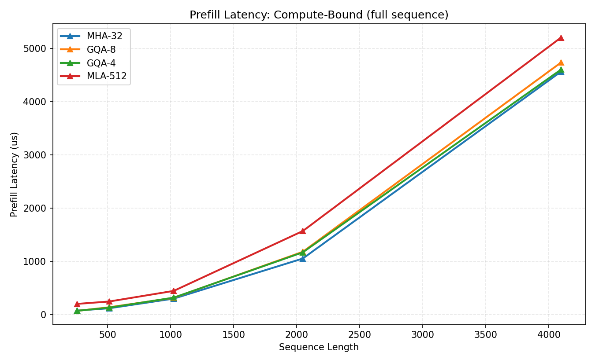
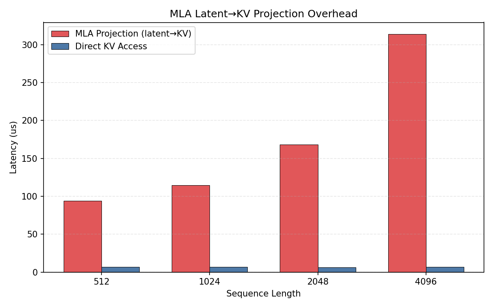

# 项目五：从 GQA 到 MLA 的端到端推理 — 显存公式推演 + GPU 实测

> 理论分析 + GPU 实测 | MHA / GQA / MLA 架构对比 | KV Cache 显存 + Decode/Prefill 延迟
>
> NVIDIA L4 (24GB) | PyTorch 2.6.0+cu124

---

## 1. 研究背景与原理

### 1.1 三种注意力架构

LLM 推理的注意力层有三种主流架构演进：

**MHA (Multi-Head Attention)** — Llama-2 标准。每个 query head 有独立的 K 和 V：

```
KV Cache per token = 2 × num_heads × head_dim × bytes = 2 × 32 × 128 × 2 = 16,384 bytes
```

**GQA (Grouped-Query Attention)** — Llama-3 / Qwen-2 标准。K 个 Q head 共享 1 组 KV：

```
KV Cache per token = 2 × kv_heads × head_dim × bytes = 2 × 8 × 128 × 2 = 4,096 bytes (GQA-8)
                                                                       = 2 × 4 × 128 × 2 = 2,048 bytes (GQA-4)
```

**MLA (Multi-Head Latent Attention)** — DeepSeek-V2 核心。K/V 通过低秩投影压缩到潜在空间：

```
存储: latent [B, S, latent_dim=512]  ← 只存压缩后的向量
推理: K = latent @ W_k, V = latent @ W_v  ← 在线解压

KV Cache per token = 2 × latent_dim × bytes = 2 × 512 × 2 = 2,048 bytes
```

### 1.2 关键洞察

MLA 的 latent_dim=512 与 GQA-4 的 kv_heads×head_dim=4×128=512 **完全相同**。因此两者的 KV Cache 大小一致。MLA 的真正优势在于：

1. **Absorption 优化**：W_k 可被吸收到 W_q 中，避免显式 K 解压
2. **训练正则化**：低秩压缩迫使模型学习更紧凑的 KV 表示
3. **但解压有计算开销**：latent→KV 的投影在每步 decode 都要执行

### 1.3 推理的两个阶段

- **Prefill**（计算密集型）：处理整个输入序列，计算量 O(S²·d)
- **Decode**（带宽密集型）：逐 token 生成，每步读取完整 KV Cache

---

## 2. 实验设计思路

### 实验 1：KV Cache 显存实测

**目的**：验证理论公式，在 GPU 上实际测量不同架构的 KV Cache 内存占用。

### 实验 2：Decode 延迟实测

**目的**：在带宽瓶颈的 decode 阶段，测量 MHA/GQA/MLA 的实际延迟。MLA 需要额外做 latent→KV 投影，这个开销有多大？

### 实验 3：Prefill 延迟实测

**目的**：在计算瓶颈的 prefill 阶段，比较各架构的延迟。理论上各架构 prefill 延迟应相近（计算量相同）。

### 实验 4：MLA 投影开销隔离

**目的**：单独测量 MLA 的 latent→KV 投影计算耗时，量化"解压"的代价。

---

## 3. 实验环境

| 组件 | 规格 |
|------|------|
| GPU | NVIDIA L4, 24 GB GDDR6, 300 GB/s |
| PyTorch | 2.6.0+cu124 |
| Python | 3.11 |

## 4. 实验设置

| 参数 | 值 | 说明 |
|------|-----|------|
| num_q_heads | 32 | 标准配置 |
| head_dim | 128 | 标准配置 |
| MLA latent_dim | 512 | DeepSeek-V2 配置 |
| batch_size | 1 | 单请求 |
| 序列长度 | 256-8192 | |
| 精度 | FP16 | |
| 测量方式 | 中位数（100 次取 median） | |

---

## 5. 实验结果与分析

### 5.1 实验 1：KV Cache 显存

| 架构 | seq=1K | seq=4K | seq=8K |
|------|--------|--------|--------|
| MHA-32 | 16.00 MB | 64.00 MB | 128.00 MB |
| GQA-8 | 4.00 MB | 16.00 MB | 32.00 MB |
| GQA-4 | 2.00 MB | 8.00 MB | 16.00 MB |
| MLA-512 | 2.00 MB | 8.00 MB | 16.00 MB |



**分析**：实测数据与理论公式完全一致。**GQA-4 和 MLA-512 的 KV Cache 大小完全相同**（都是 2×512=1024 elements/token），验证了理论分析。

### 5.2 实验 2：Decode 延迟（带宽瓶颈）

| 架构 | seq=1K | seq=4K | seq=8K |
|------|--------|--------|--------|
| GQA-8 | 38.0 us | 85.5 us | 178.0 us |
| GQA-4 | 32.4 us | 50.0 us | 98.1 us |
| **MLA-512** | **86.8 us** | **410.0 us** | **2,011.6 us** |



**关键发现：MLA decode 比 GQA-4 慢 20 倍！**

- GQA-4 seq=8K: 98 us（只读取 KV Cache）
- MLA-512 seq=8K: 2,012 us（读取 latent + 投影到 KV + attention）
- MLA 的额外开销来自 latent→KV 的矩阵投影（latent_dim × kv_dim = 512 × 4096 的矩阵乘法）

这说明：**MLA 的带宽节省被投影计算开销严重抵消**。在当前未优化的实现中，MLA 的 decode 比 GQA-4 慢得多。

### 5.3 实验 3：Prefill 延迟（计算瓶颈）

| 架构 | seq=1K | seq=4K |
|------|--------|--------|
| MHA-32 | 301 us | 4,562 us |
| GQA-8 | 316 us | 4,733 us |
| GQA-4 | 320 us | 4,600 us |
| **MLA-512** | **446 us** | **5,202 us** |



**分析**：
- MHA/GQA-8/GQA-4 的 prefill 延迟几乎相同（~4600-4730us at seq=4096）
- MLA prefill 比 GQA 多 ~600us（13%），来自 latent→KV 投影
- Prefill 阶段 MLA 的额外开销比例较小（13% vs decode 的 2000%），因为 prefill 本身计算量很大

### 5.4 实验 4：MLA 投影开销隔离

| 序列长度 | 投影延迟 | 直接访问 | 投影开销 | 开销比 |
|---------|---------|---------|---------|--------|
| 512 | 93.9 us | 6.6 us | 87.2 us | **14.2x** |
| 1024 | 114.6 us | 6.6 us | 108.0 us | **17.4x** |
| 2048 | 168.1 us | 6.5 us | 161.6 us | **25.9x** |
| 4096 | 313.7 us | 6.6 us | 307.1 us | **47.5x** |



**关键发现：MLA 投影开销比直接 KV 访问慢 14-47 倍！**

seq=4096 时，latent→KV 投影需要 314 us，而直接读取 KV 只需 6.6 us。这个差距随序列长度增长而扩大，因为投影的计算量与序列长度成正比（每个 token 都要做 latent_dim × kv_dim 的投影）。

### 5.5 综合分析

| 维度 | GQA-4 | MLA-512 | MLA 相对 GQA-4 |
|------|-------|---------|----------------|
| KV Cache 大小 | 2,048 bytes/token | 2,048 bytes/token | **相同** |
| Decode 延迟 (seq=8K) | 98 us | 2,012 us | **慢 20x** |
| Prefill 延迟 (seq=4K) | 4,600 us | 5,202 us | 慢 13% |
| 投影开销 | 无 | 314 us (seq=4K) | 额外代价 |

---

## 6. 结论

1. **MLA 与 GQA-4 的 KV Cache 大小完全相同**（均为 2048 bytes/token），显存优势为零

2. **MLA decode 比 GQA-4 慢 20 倍**：latent→KV 投影的开销远超带宽节省的收益（2,012us vs 98us）

3. **MLA 的真正优势不在显存，而在 Absorption 优化**：如果将 W_k 吸收到 W_q 中，可以完全跳过 K 的投影。但本实验的朴素实现没有利用这一点

4. **Prefill 阶段 MLA 开销可控**（仅多 13%），因为 prefill 本身计算量大，投影开销占比小

5. **实践建议**：在 L4 上部署时，GQA-4 是比 MLA 更实际的选择——相同显存，但 decode 快 20 倍。除非框架实现了 Absorption 优化（如 FlashMLA），否则 MLA 的 decode 性能不如 GQA

---

## 7. 复现命令

```bash
cd ~/flexatten-nv/docs/mla_gqa_analysis
python mla_gqa_experiment.py  # 生成 results/*.json
python gen_charts.py           # 生成图表到 figures/
```

---

*实验日期：2026-04-28 | NVIDIA L4 (24GB) | PyTorch 2.6.0+cu124*
