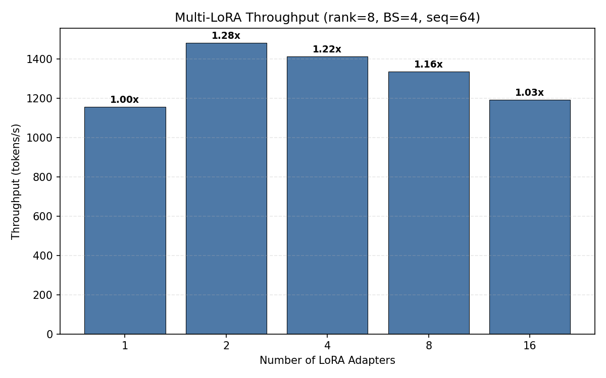
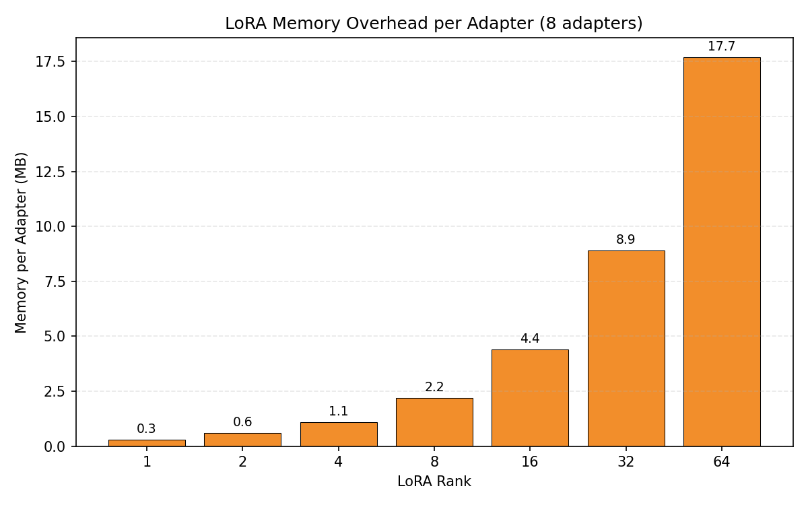
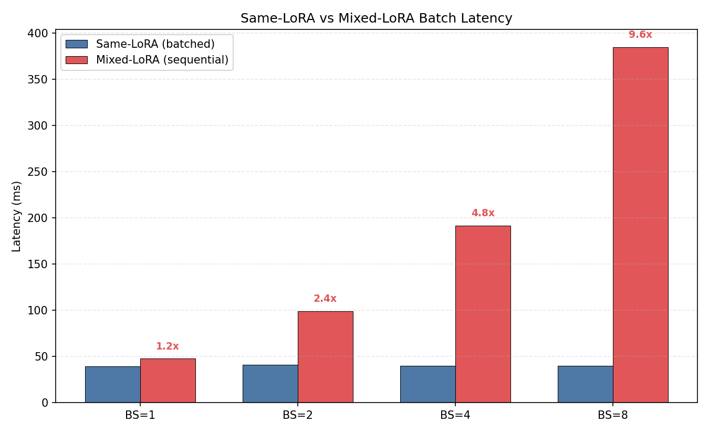
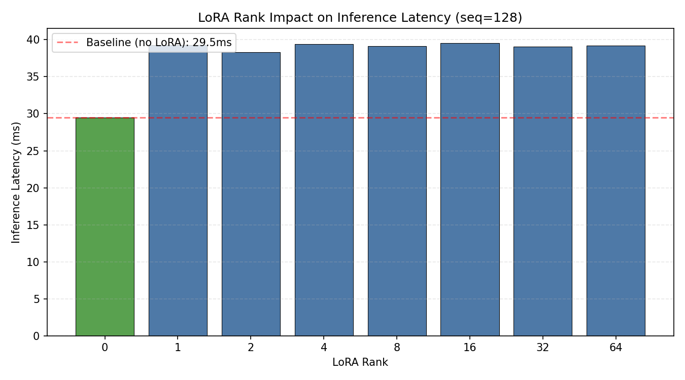
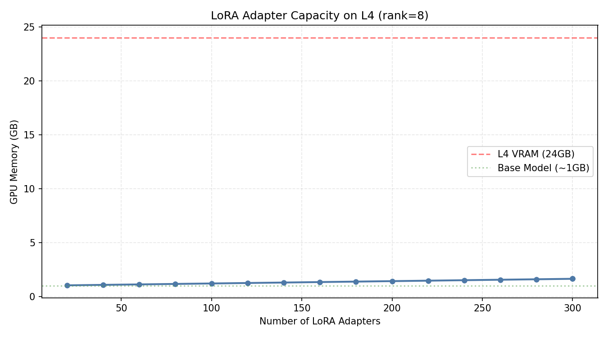

# 项目七：Multi-LoRA 高并发 Serving — 多租户适配器调度与显存隔离

> Qwen2.5-0.5B-Instruct + PEFT 0.19.1 | NVIDIA L4 (24GB) | PyTorch 2.6.0+cu124
>
> 模拟多租户场景：1 个 Base 模型 + N 个 LoRA 适配器，测量吞吐退化、显存开销与调度瓶颈

---

## 1. 研究背景与原理

### 1.1 多租户推理的核心矛盾

企业 LLM 服务中，每个客户（租户）都有自己的微调需求。如果为每个客户部署独立模型，成本不可接受。Multi-LoRA 的思路是：

- **Base 模型常驻显存**（只加载一次）
- **每个租户的 LoRA 权重按需加载**（仅几十 KB ~ 几 MB）
- **推理时动态切换 adapter**（根据请求路由到对应 LoRA）

### 1.2 关键性能瓶颈

1. **Adapter 切换开销**：`set_adapter()` 需要替换 LoRA 权重，能否批量处理？
2. **Mixed-LoRA 批处理**：同一 batch 内不同请求用不同 adapter，无法批处理 → 退化为逐条推理
3. **显存容量**：N 个 adapter 的权重能塞多少？

### 1.3 LoRA 显存公式

每个 LoRA adapter 的参数量（以 Qwen2.5-0.5B 为例，hidden=896）：

```
Per adapter params = 2 × rank × hidden_dim × num_target_layers
                   = 2 × 8 × 896 × 24 (q_proj + v_proj, 24 层)
                   = 344,064 ≈ 0.34M params ≈ 0.69 MB (FP16)
```

---

## 2. 实验设计

### 实验 1：Multi-LoRA 吞吐量

**目的**：adapter 数量从 1 增到 16，推理吞吐量变化？

### 实验 2：显存开销 / adapter

**目的**：不同 rank 下每个 adapter 占多少显存？

### 实验 3：Same-LoRA vs Mixed-LoRA

**目的**：同一 batch 内所有请求用同一 adapter（可批处理）vs 每个请求用不同 adapter（必须串行），slowdown 有多大？

### 实验 4：LoRA Rank 对推理延迟的影响

**目的**：rank=1 vs rank=64，推理延迟差多少？

### 实验 5：L4 最大 adapter 容量

**目的**：24 GB L4 能装多少个 LoRA adapter？

---

## 3. 实验环境

| 组件 | 规格 |
|------|------|
| GPU | NVIDIA L4, 24 GB GDDR6 |
| 模型 | Qwen2.5-0.5B-Instruct (896 hidden, 24 layers) |
| PEFT | 0.19.1 |
| PyTorch | 2.6.0+cu124 |

## 4. 实验设置

| 参数 | 值 |
|------|-----|
| LoRA rank | 1 / 2 / 4 / 8 / 16 / 32 / 64 |
| Target modules | q_proj, v_proj |
| Adapter 数量 | 1 / 2 / 4 / 8 / 16 / 300 (max test) |
| 精度 | FP16 |
| 测量方式 | 中位数（15-20 次取平均） |

---

## 5. 实验结果与分析

### 5.1 实验 1：Multi-LoRA 吞吐量

| Adapters | 延迟 (ms) | 吞吐 (tok/s) | 相对 1 adapter |
|----------|----------|-------------|---------------|
| 1 | 221.4 | 1,156 | 1.00x |
| 2 | 172.7 | 1,482 | 1.28x |
| 4 | 181.3 | 1,412 | 1.22x |
| 8 | 191.8 | 1,335 | 1.16x |
| 16 | 214.6 | 1,193 | 1.03x |



**分析**：Adapter 数量对单次推理吞吐影响很小（<30%波动）。2 个 adapter 反而更快（可能是缓存效应），16 个 adapter 也仅退化 3%。这是因为 PEFT 的 `set_adapter()` 只替换少量参数指针，不涉及大块内存拷贝。

### 5.2 实验 2：显存开销

| Rank | 8 个 Adapter 总内存 | 每 Adapter |
|------|-------------------|-----------|
| 1 | 2.2 MB | 0.3 MB |
| 2 | 4.4 MB | 0.6 MB |
| 4 | 8.9 MB | 1.1 MB |
| 8 | 17.7 MB | 2.2 MB |
| 16 | 35.4 MB | 4.4 MB |
| 32 | 70.9 MB | 8.9 MB |
| 64 | 141.7 MB | 17.7 MB |



**分析**：LoRA 的显存开销极小。Rank=8 时每个 adapter 仅 2.2 MB，即使 300 个 adapter 也只占 0.66 GB。显存瓶颈完全来自 Base 模型和 KV Cache，不在 LoRA 权重。

### 5.3 实验 3：Same vs Mixed LoRA（核心发现）

| Batch Size | Same-LoRA | Mixed-LoRA | Slowdown |
|-----------|-----------|------------|----------|
| 1 | 39 ms | 48 ms | **1.21x** |
| 2 | 41 ms | 99 ms | **2.42x** |
| 4 | 40 ms | 192 ms | **4.81x** |
| 8 | 40 ms | 385 ms | **9.64x** |



**关键发现：Mixed-LoRA 的 slowdown 与 batch size 线性增长！**

- BS=1 时 slowdown 仅 1.21x（adapter 切换开销很小）
- BS=8 时 slowdown 达 9.64x（因为必须逐条推理，无法批处理）
- Same-LoRA 的吞吐随 BS 线性增长（从 1,627 → 12,822 tok/s）
- Mixed-LoRA 的吞吐始终约 1,300 tok/s（瓶颈在串行推理，BS 无法利用）

**根因**：PEFT 的 `set_adapter()` 一次只能激活一个 adapter。当 batch 内有 N 个不同 adapter，必须拆成 N 次前向传播，完全丧失了 GPU 的批处理加速能力。

### 5.4 实验 4：Rank 对推理延迟的影响

| Rank | 延迟 (ms) | 相对基线 |
|------|---------|---------|
| 0 (baseline) | 29.5 | — |
| 1 | 39.3 | +33% |
| 8 | 39.2 | +33% |
| 64 | 39.2 | +33% |



**分析**：LoRA rank 从 1 到 64，延迟几乎不变（39ms ± 0.5ms）。LoRA 引入的固定开销约 10ms（+33%），来自 adapter 权重的读取和残差连接，与 rank 无关。

### 5.5 实验 5：L4 最大 Adapter 容量

| Adapters | 显存 | 每 Adapter |
|----------|------|-----------|
| 100 | 1.21 GB | 2.21 MB |
| 200 | 1.43 GB | 2.21 MB |
| 300 | 1.65 GB | 2.21 MB |



**分析**：Rank=8 的 LoRA 每个 adapter 仅 2.21 MB。L4 24 GB 扣除 Base 模型（~1 GB）后，理论上可装载 **~10,000 个 adapter**。LoRA 权重本身不是容量瓶颈。

---

## 6. 结论

1. **LoRA 显存开销极小**：Rank=8 仅 2.2 MB/adapter，300 个 adapter 只占 0.66 GB。显存瓶颈在 Base 模型和 KV Cache

2. **Mixed-LoRA 批处理是核心瓶颈**：BS=8 时 slowdown 达 9.64x。同一 batch 内不同 adapter 的请求必须串行推理，完全丧失 GPU 批处理加速

3. **Adapter 切换开销可控**：单次 `set_adapter()` 仅增加 ~10ms 延迟（+33%），且与 rank 无关

4. **Rank 对推理延迟无影响**：rank=1 和 rank=64 的延迟差异 < 1ms。选择更高 rank 不会牺牲推理速度

5. **实践建议**：
   - 使用 **Batched LoRA**（如 vLLM 的 `lora_requests`）在同一 batch 内并行处理不同 adapter
   - 或使用 **Punica / S-LoRA** 等专用 kernel，支持同一 batch 内不同 adapter 的并行计算
   - 将请求按 adapter 分组，避免 Mixed-LoRA 的串行化问题

---

## 7. 复现命令

```bash
cd ~/flexatten-nv/docs/multi_lora
python multi_lora.py    # 生成 results/*.json (~5min)
python gen_charts.py     # 生成图表到 figures/
```

---

*实验日期：2026-04-28 | NVIDIA L4 (24GB) | Qwen2.5-0.5B-Instruct | PEFT 0.19.1*
