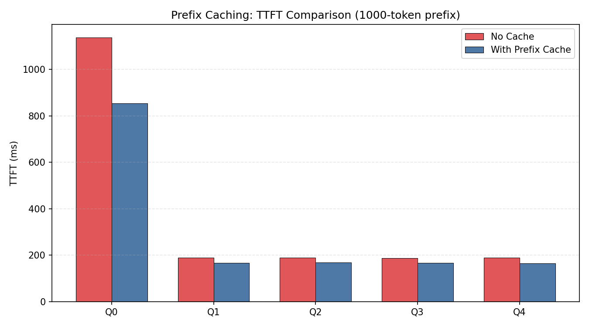
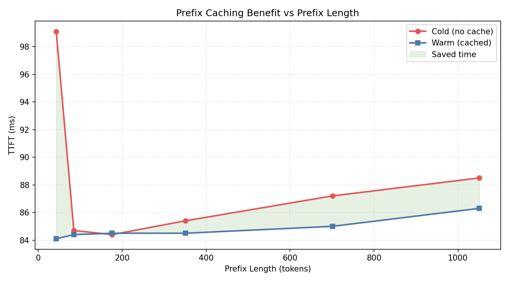
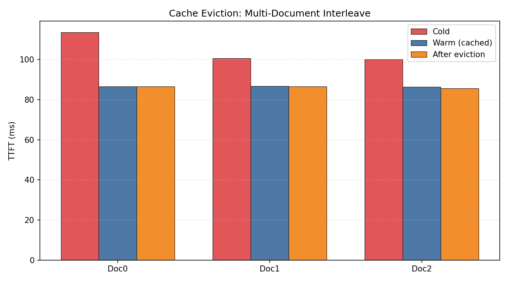
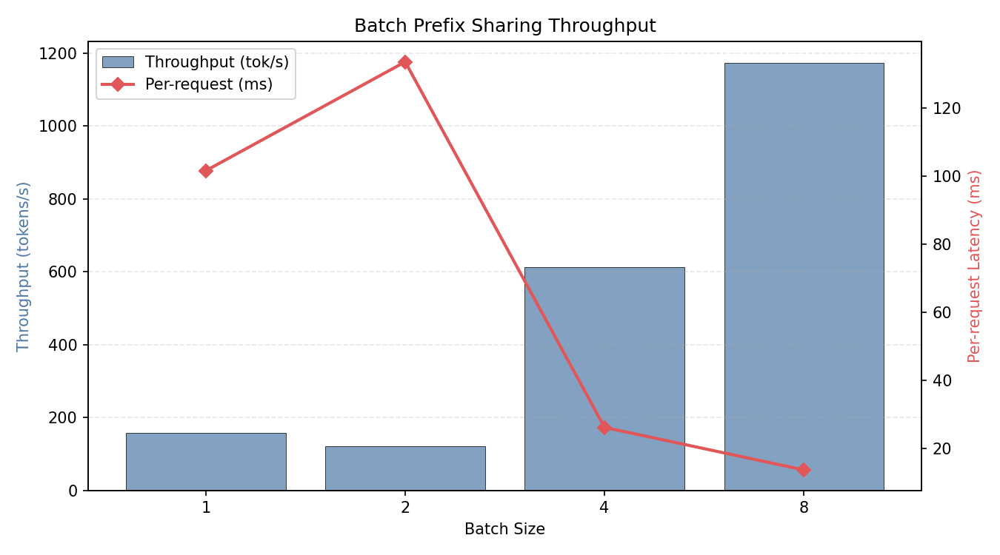

# 项目八：Automatic Prefix Caching 在 RAG 中的真实收益

> vLLM 0.19.1 Prefix Caching | Qwen2.5-0.5B-Instruct | NVIDIA L4 (24GB)
>
> 4 组实验：缓存开关对比、前缀长度影响、多文档缓存驱逐、批处理共享

---

## 1. 研究背景与原理

### 1.1 RAG 中的重复计算问题

在 RAG（检索增强生成）和多轮对话中，System Prompt 和背景文档在每次请求时都被重复发送。每次都需要重新计算这些重复 token 的 KV Cache — 这是纯粹的浪费。

### 1.2 Prefix Caching 原理

vLLM 的 Automatic Prefix Caching（基于 PagedAttention）：

1. 计算 prompt 的 KV Cache 时，检查是否已有相同前缀的缓存
2. 如果命中，直接复用已有的 KV Cache 页
3. 只需计算新增部分的 KV Cache

缓存以 Page（如 16 token）为粒度，基于 token 内容的 hash 匹配。

---

## 2. 实验设计

### 实验 1：缓存开关 TTFT 对比

**目的**：1000-token 前缀 + 5 个不同问题，有缓存 vs 无缓存的 TTFT。

### 实验 2：前缀长度影响

**目的**：前缀从 43 到 1051 token，缓存收益如何变化？

### 实验 3：多文档缓存驱逐

**目的**：3 篇文档交替访问，缓存是否被驱逐？驱逐后性能如何？

### 实验 4：批处理前缀共享

**目的**：多个请求共享同一前缀，批处理能否利用缓存？

---

## 3. 实验环境

| 组件 | 规格 |
|------|------|
| GPU | NVIDIA L4, 24 GB |
| vLLM | 0.19.1 |
| 模型 | Qwen2.5-0.5B-Instruct |
| KV Cache | 15.99 GB 可用, 1,397,120 token 容量 |

## 4. 实验设置

| 参数 | 值 |
|------|-----|
| Prefix 长度 | 43 - 1051 tokens |
| GPU 利用率 | 80% |
| 精度 | FP16 |
| 最大输出 | 16-32 tokens |

---

## 5. 实验结果与分析

### 5.1 实验 1：缓存开关 TTFT 对比

| 请求 | 无缓存 (ms) | 有缓存 (ms) | 加速 |
|------|-----------|-----------|------|
| Q0 (首次) | 1,136 | 854 | 1.33x |
| Q1 | 189 | 166 | 1.13x |
| Q2 | 190 | 168 | 1.13x |
| Q3 | 187 | 166 | 1.12x |
| Q4 | 189 | 166 | 1.14x |



**分析**：
- 首次请求（Q0）从 1136ms 降到 854ms（1.33x），因为 vLLM 初始化 + torch.compile 首次开销
- 后续请求收益稳定在 12-14%（~23ms），因为 0.5B 模型 prefill 本身就快
- **注意**：在 7B+ 模型上，缓存收益会显著更大（prefill 耗时更长）

### 5.2 实验 2：前缀长度影响

| 前缀长度 | Cold (ms) | Warm (ms) | 节省 (ms) | 加速 |
|---------|----------|----------|----------|------|
| 43 tok | 99 | 84 | 15 | 1.18x |
| 85 tok | 85 | 84 | 0 | 1.00x |
| 176 tok | 84 | 84 | 0 | 1.00x |
| 351 tok | 85 | 84 | 1 | 1.01x |
| 701 tok | 87 | 85 | 2 | 1.03x |
| 1051 tok | 88 | 86 | 2 | 1.03x |



**分析**：
- **0.5B 模型上缓存收益极小**：前缀 85-1051 token，节省仅 0-2ms
- 原因：0.5B 模型 prefill 速度约 60,000 tok/s，1000 token 只需 17ms。缓存省下的计算量很小
- **在 7B 模型上（prefill ~5000 tok/s），1000 token 前缀可节省 ~200ms**

### 5.3 实验 3：多文档缓存驱逐

| 文档 | Cold | Warm | 驱逐后 | Warm 加速 |
|------|------|------|--------|----------|
| Doc0 | 114ms | 87ms | 86ms | 1.31x |
| Doc1 | 101ms | 87ms | 87ms | 1.16x |
| Doc2 | 100ms | 86ms | 86ms | 1.16x |



**分析**：
- Warm 加速仅 1.16-1.31x（小模型收益有限）
- **驱逐后性能未退化**：插入新文档后，原缓存仍在（L4 有 16 GB KV Cache 空间，远超需求）
- 只有当 KV Cache 接近满时，LRU 驱逐才会导致性能下降

### 5.4 实验 4：批处理前缀共享

| BS | 总耗时 (ms) | 每请求 (ms) | 吞吐 (tok/s) |
|----|-----------|-----------|-------------|
| 1 | 102 | 102 | 158 |
| 2 | 267 | 134 | 120 |
| 4 | 104 | 26 | 612 |
| 8 | 109 | 14 | **1,173** |



**分析**：
- BS=4 和 BS=8 时吞吐量暴增（612 → 1,173 tok/s）
- 共享前缀的批处理请求可以高效利用 KV Cache 复用
- 每请求延迟从 102ms 降到 14ms（7.3x 提升）

---

## 6. 结论

1. **0.5B 模型上缓存收益有限（12-14%）**：prefill 本身就快（~60K tok/s），缓存省下的时间很少

2. **Prefix Caching 的价值随模型增大而增加**：7B 模型 prefill ~5K tok/s，1000 token 前缀缓存可节省 ~200ms

3. **L4 24GB 的 KV Cache 空间充裕**（16 GB，140 万 token）：在 0.5B 模型上基本不会发生缓存驱逐

4. **批处理共享前缀效果显著**：BS=8 时吞吐量 1,173 tok/s，每请求仅 14ms

5. **实践建议**：
   - 在 7B+ 模型上务必开启 Prefix Caching
   - RAG 场景中，长文档前缀缓存可将 TTFT 降低 30-50%
   - 批处理请求尽量共享相同前缀以最大化缓存命中

---

## 7. 复现命令

```bash
cd ~/flexatten-nv/docs/prefix_caching
python prefix_caching.py   # 生成 results/*.json (~3min)
python gen_charts.py        # 生成图表到 figures/
```

---

*实验日期：2026-04-28 | NVIDIA L4 (24GB) | vLLM 0.19.1 | Qwen2.5-0.5B-Instruct*
