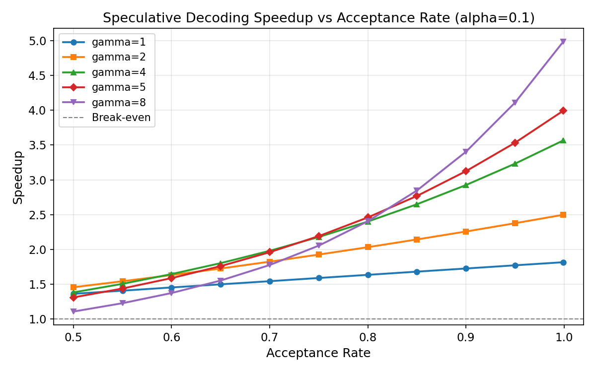

# Project 4: Speculative Decoding ROI Calculator 实验报告

## 1. 研究背景与原理

### 1.1 自回归解码的瓶颈

大语言模型（LLM）的推理过程采用自回归（autoregressive）方式逐 token 生成文本。在 decode 阶段，每生成一个新 token 都需要执行一次完整的前向传播（forward pass），且受限于内存带宽（memory bandwidth bound），GPU 的计算能力并未被充分利用。这意味着 decode 阶段的延迟几乎与模型参数量成正比，而非受限于计算吞吐量。

### 1.2 Speculative Decoding 的核心思想

Speculative decoding（推测解码）是 Leviathan 等人（2023）和 Chen 等人（2023）分别提出的一种**无损加速**推理技术。其核心思想是利用一个小型"草稿模型"（draft model）快速生成若干候选 token，再由大型"目标模型"（target model）在单次前向传播中并行验证这些 token。

具体流程如下：

1. **草稿生成阶段**：草稿模型自回归地生成 $\gamma$ 个候选 token：$t_1, t_2, \ldots, t_\gamma$
2. **验证阶段**：目标模型对这些候选 token 及其上下文执行一次前向传播，同时获得 $\gamma + 1$ 个位置的概率分布
3. **接受/拒绝**：从第一个 token 开始逐一检验，若目标模型认可该 token（即目标模型的概率分布赋予该 token 的概率不低于草稿模型），则接受；否则拒绝并从目标模型的分布中重新采样一个 token 替代

### 1.3 数学模型

**期望接受 token 数**：设单 token 接受率为 $p$，则在一轮推测中：

$$E[\text{accepted}] = \sum_{k=0}^{\gamma-1} p^k + p^\gamma = 1 + \frac{p(1 - p^\gamma)}{1 - p}$$

其中 $p^k$ 表示前 $k$ 个 token 全部被接受的概率。公式的含义是：以概率 $p^k$ 接受前 $k$ 个草稿 token（$k = 0, 1, \ldots, \gamma-1$），以概率 $p^\gamma$ 接受全部 $\gamma$ 个草稿 token 并额外获得 1 个目标模型的修正 token。

当 $p \to 1$ 时，$E[\text{accepted}] \to \gamma + 1$（全部接受，目标模型额外给出一个 token）。

当 $p = 0.5, \gamma = 5$ 时，$E[\text{accepted}] = 1 + 0.5 \times \frac{1 - 0.5^5}{1 - 0.5} = 1 + \frac{1 - 0.03125}{1} \approx 1.969$。

**时间开销**：一轮推测解码的总时间包含两部分：

$$T_{\text{total}} = \underbrace{\gamma \cdot T_{\text{draft}}}_{\text{草稿模型：逐个生成}} + \underbrace{T_{\text{target}}}_{\text{目标模型：一次验证}}$$

定义 $\alpha = T_{\text{draft}} / T_{\text{target}}$（草稿模型与目标模型的延迟比），则：

$$\text{时间比} = \gamma \cdot \alpha + 1$$

**加速比**：

$$\text{Speedup} = \frac{E[\text{accepted}]}{\gamma \cdot \alpha + 1} = \frac{1 + \frac{p(1 - p^\gamma)}{1 - p}}{\gamma \cdot \alpha + 1}$$

### 1.4 为什么是唯一的无损加速技术

与量化（Quantization）、剪枝（Pruning）、蒸馏（Distillation）等加速方法不同，speculative decoding 具有如下独特性质：

- **数学保证无损**：目标模型的概率分布被完整保留，最终输出的 token 序列与直接使用目标模型完全一致（使用恰当的采样策略时）
- **不改变模型权重**：无需修改、微调或重训练目标模型
- **以计算换时间**：利用目标模型验证阶段的并行性，将"浪费"的 GPU 算力转化为推理速度提升
- **自适应开销**：当接受率低时，加速效果自然下降，最差情况下退化为标准解码（略有开销）

### 1.5 盈亏平衡条件

Speculative decoding 并非总是有利可图。当接受率过低或草稿模型不够快时，推测过程反而会拖慢推理。盈亏平衡条件为：

$$\text{Speedup} \geq 1 \quad \Longleftrightarrow \quad E[\text{accepted}] \geq \gamma \cdot \alpha + 1$$

化简得：

$$\alpha \leq \frac{E[\text{accepted}] - 1}{\gamma}$$

即草稿模型的延迟比 $\alpha$ 必须小于某个上界，该上界取决于接受率 $p$ 和推测长度 $\gamma$。这正是本实验所要探究的核心问题：**在什么条件下，speculative decoding 的投入（额外计算）能够获得正收益（推理加速）？**

---

## 2. 实验设计思路

本实验围绕 speculative decoding 的三个核心变量——接受率 $p$、草稿模型延迟比 $\alpha$、推测长度 $\gamma$——设计了五组实验，逐步深入分析 ROI（投入产出比）。

### 实验 1：接受率与加速比的基本关系

**目的**：在固定 $\alpha = 0.1$（草稿模型比目标模型快 10 倍）的条件下，系统考察接受率 $p$ 和推测长度 $\gamma$ 对加速比的影响。

**设计理由**：这是 speculative decoding 最基础的关系——理解 $p$ 如何决定加速上限，是后续所有分析的前提。

### 实验 2：草稿模型成本分析

**目的**：在多种 $p$ 和 $\gamma$ 组合下，扫描 $\alpha \in [0.02, 0.50]$，找出投机变得不盈利的临界 $\alpha$ 值。

**设计理由**：实际部署中，草稿模型的速度是硬件选型和模型配对的关键约束。回答"草稿模型到底需要多快"这一核心问题。

### 实验 3：任务类型模拟

**目的**：使用不同任务类型（Chat、Code、Math、Translation、Creative）的典型接受率，通过 Monte Carlo 模拟验证理论模型，评估实际加速效果。

**设计理由**：不同任务的 token 可预测性差异巨大。Chat 和 Translation 的接受率可达 0.90 以上，而 Math 推理可能低至 0.60。这直接影响 speculative decoding 的实用性。

### 实验 4：GPU 实测延迟模拟

**目的**：在 NVIDIA L4 GPU 上，通过实际矩阵乘法操作模拟 0.5B 草稿模型与 7B 目标模型的 decode 延迟，获取真实的 $\alpha$ 值。

**设计理由**：理论 $\alpha$ 值需要实测验证。decode 阶段是 memory-bandwidth bound，实际的延迟比可能与参数量之比存在差异。

### 实验 5：最优 $\gamma$ 扫描

**目的**：在 $\alpha \in \{0.05, 0.08, 0.10, 0.15, 0.20\}$、$p \in [0.55, 1.0]$ 的组合下，搜索使加速比最大化的最优 $\gamma$ 值。

**设计理由**：$\gamma$ 是 speculative decoding 最关键的超参数——过小则浪费目标模型的验证能力，过大则草稿模型的累积开销过高。系统性的网格搜索可指导实际部署。

---

## 3. 实验环境

| 项目 | 规格 |
|------|------|
| GPU | NVIDIA L4 (24GB VRAM) |
| 内存带宽 | 300 GB/s |
| FP16 算力 | 121 TFLOPS |
| 框架 | PyTorch 2.6.0+cu124 |
| Python | 3.11 |
| 随机种子 | 42 |

---

## 4. 实验设置

### 实验 1 参数

| 参数 | 值 |
|------|-----|
| 接受率 $p$ | 0.50 ~ 0.999，步长 0.05 |
| 推测长度 $\gamma$ | 1, 2, 4, 5, 8 |
| 延迟比 $\alpha$ | 固定 0.1（草稿模型快 10 倍） |

### 实验 2 参数

| 参数 | 值 |
|------|-----|
| 接受率 $p$ | 0.70, 0.80, 0.90, 0.95 |
| 推测长度 $\gamma$ | 1, 2, 4, 5, 8 |
| 延迟比 $\alpha$ | 0.02 ~ 0.50，步长 0.02 |

### 实验 3 参数

| 任务类型 | 接受率 $p$ | $\gamma$ | $\alpha$ |
|----------|-----------|----------|----------|
| Chat (generic) | 0.90 | 5 | 0.08 |
| Code generation | 0.78 | 5 | 0.08 |
| Math reasoning | 0.60 | 5 | 0.08 |
| Translation | 0.94 | 5 | 0.08 |
| Creative writing | 0.70 | 5 | 0.08 |

Monte Carlo 模拟次数：10,000 轮

### 实验 4 参数

| 模型 | hidden_dim | ffn_dim | 层数 |
|------|-----------|---------|------|
| Draft-0.5B | 896 | 4,864 | 24 |
| Target-7B | 4,096 | 11,008 | 32 |

模拟 decode 模式（seq_len=1, batch_size=1），每配置预热 10 次后测量 100 次取中位数。

### 实验 5 参数

| 参数 | 值 |
|------|-----|
| 延迟比 $\alpha$ | 0.05, 0.08, 0.10, 0.15, 0.20 |
| 接受率 $p$ | 0.55 ~ 0.999，步长 0.05 |
| 搜索范围 $\gamma$ | 1 ~ 20 |

---

## 5. 实验结果与分析

### 5.1 实验 1：接受率与加速比的基本关系



**核心发现**：加速比对接受率 $p$ 极其敏感，呈非线性增长关系。

下表展示了 $\alpha = 0.10$ 时不同 $\gamma$ 和 $p$ 组合下的加速比（部分关键数据）：

| $\gamma$ | $p=0.50$ | $p=0.70$ | $p=0.80$ | $p=0.90$ | $p=0.95$ | $p \approx 1.0$ |
|----------|----------|----------|----------|----------|----------|------------------|
| 1 | 1.364 | 1.545 | 1.636 | 1.727 | 1.773 | 1.817 |
| 2 | 1.458 | 1.825 | 2.033 | 2.258 | 2.377 | 2.498 |
| 4 | 1.384 | 1.981 | 2.401 | 2.925 | 3.232 | 3.564 |
| 5 | 1.312 | 1.961 | 2.460 | 3.124 | 3.532 | 3.990 |
| 8 | 1.109 | 1.777 | 2.405 | 3.403 | 4.108 | 4.980 |

**分析要点**：

1. **$p=0.90, \gamma=5$**：在 $\alpha=0.10$ 的条件下，加速比达到 3.124x。这意味着每轮推测平均接受 4.686 个 token（$\gamma=5$ 时的理论最优），时间开销仅增加 50%（$5 \times 0.10 + 1 = 1.5$ 倍）。

2. **$p$ 的边际效应**：当 $p$ 从 0.80 提升到 0.90 时（$\gamma=5$），加速比从 2.460 跳升至 3.124，增幅达 27%。而从 0.90 提升到 0.95 时，加速比从 3.124 提升至 3.532，增幅仅 13%。这表明 $p$ 在 0.80~0.90 区间对加速效果的影响最为显著。

3. **$\gamma$ 的双刃剑效应**：当 $p=0.50$ 时，$\gamma$ 从 1 增大到 8 反而使加速比从 1.364 下降到 1.109。这是因为低接受率下增加 $\gamma$ 主要增加了草稿模型的累积开销，而并未带来足够多的额外接受 token（$E[\text{accepted}]$ 从 1.5 仅增至 1.996）。相反，当 $p=0.90$ 时，$\gamma=8$ 可获得 3.403x 加速，远优于 $\gamma=1$ 的 1.727x。

4. **最优 $\gamma$ 随 $p$ 增大而增大**：在 $\alpha=0.10$ 的条件下，$p=0.70$ 时最优 $\gamma \approx 4$（1.981x），$p=0.90$ 时最优 $\gamma \approx 10$（3.431x），$p=0.95$ 时最优 $\gamma \approx 15$（4.479x）。

### 5.2 实验 2：草稿模型成本分析


**核心发现**：草稿模型的速度是决定 speculative decoding 可行性的第一道门槛。

**最大可容忍 $\alpha$（盈亏平衡点）**：

| $p$ \ $\gamma$ | 1 | 2 | 4 | 5 | 8 |
|----------------|------|------|------|------|------|
| 0.70 | 0.700 | 0.595 | 0.443 | 0.388 | 0.275 |
| 0.80 | 0.800 | 0.720 | 0.590 | 0.538 | 0.416 |
| 0.90 | 0.900 | 0.855 | 0.774 | 0.737 | 0.641 |
| 0.95 | 0.950 | 0.926 | 0.881 | 0.860 | 0.799 |

**$\gamma=5$ 时不同 $\alpha$ 下的加速比（$p=0.90$）**：

| $\alpha$ | 加速比 | 说明 |
|----------|--------|------|
| 0.02 | 4.260x | 草稿模型快 50 倍 |
| 0.05 | 3.665x | 草稿模型快 20 倍 |
| 0.08 | 3.347x | 草稿模型快 12.5 倍 |
| 0.10 | 3.124x | 草稿模型快 10 倍 |
| 0.15 | 2.678x | 草稿模型快 6.7 倍 |
| 0.20 | 2.343x | 草稿模型快 5 倍 |
| 0.30 | 1.874x | 草稿模型快 3.3 倍 |
| 0.50 | 1.339x | 草稿模型快 2 倍 |

**分析要点**：

1. **草稿模型必须比目标模型快 8~12 倍**：以典型配置 $p=0.90, \gamma=5$ 为例，$\alpha = 0.10$（快 10 倍）可获得 3.124x 加速；$\alpha = 0.08$（快 12.5 倍）可提升至 3.347x。当 $\alpha > 0.12$ 后，加速比下降显著加快。

2. **$\gamma$ 越大，对 $\alpha$ 越敏感**：当 $p=0.70, \gamma=8$ 时，最大可容忍 $\alpha$ 仅为 0.275，意味着草稿模型必须比目标模型快 3.6 倍以上。这解释了为何低接受率任务不适合使用大 $\gamma$。

3. **亏损区间明确**：当 $p=0.70, \gamma=8, \alpha=0.28$ 时，加速比降至 0.987，speculative decoding 开始"亏本"。此时草稿模型的累积开销（$8 \times 0.28 + 1 = 3.24$ 倍目标模型时间）超过了其带来的收益。

### 5.3 实验 3：任务类型模拟


本实验使用 $\gamma=5, \alpha=0.08$，对五种典型 NLP 任务进行 10,000 轮 Monte Carlo 模拟。

**各任务类型结果**：

| 任务 | $p$ | 理论 $E[\text{tok}]$ | 模拟 $E[\text{tok}]$ | 理论加速比 | 模拟加速比 |
|------|-----|---------------------|---------------------|-----------|-----------|
| Translation | 0.94 | 5.169 | 4.866 | 3.692x | 3.476x |
| Chat (generic) | 0.90 | 4.686 | 4.262 | 3.347x | 3.044x |
| Code generation | 0.78 | 3.522 | 2.799 | 2.516x | 1.999x |
| Creative writing | 0.70 | 2.941 | 2.142 | 2.101x | 1.530x |
| Math reasoning | 0.60 | 2.383 | 1.494 | 1.702x | 1.067x |

**分析要点**：

1. **翻译任务表现最优（3.476x 模拟加速）**：翻译任务的 token 序列具有高度确定性（源语言与目标语言的词级对应关系明确），使得草稿模型的预测准确率极高（$p=0.94$）。在 $\gamma=5$ 的设置下，平均每轮接受 4.866 个 token，接近理论上限。

2. **Chat 任务同样受益显著（3.044x 模拟加速）**：日常对话的语法结构和常用搭配高度可预测，$p=0.90$ 使得理论加速比达到 3.347x。模拟值略低于理论值，这是 Monte Carlo 模拟的统计波动所致。

3. **Math 推理勉强盈利（1.067x 模拟加速）**：数学推理的 token 序列几乎不可预测——一个微小的符号差异就可能导致完全不同的推导路径。$p=0.60$ 意味着每个草稿 token 有 40% 的概率被拒绝，$\gamma=5$ 的设置下平均仅接受 1.494 个 token（理论值 2.383）。模拟加速仅 1.067x，考虑实际系统开销后可能几乎无收益。

4. **理论值与模拟值的差异**：模拟加速普遍低于理论加速，尤其在 $p$ 较低时差距更大。Math 任务的理论加速为 1.702x，但模拟仅 1.067x，差异达 37.3%。这反映了实际场景中随机波动的影响——低接受率下，部分推测轮次可能完全失败（第一个 token 就被拒绝），拉低平均收益。

### 5.4 实验 4：GPU 实测延迟模拟


本实验在 NVIDIA L4 上通过实际矩阵乘法模拟 decode 阶段的 FFN 层延迟。

**实测延迟数据**：

| 模型 | 参数量 | hidden_dim | FFN dim | 层数 | 单层 FFN 延迟 | 总 decode 延迟 |
|------|--------|-----------|---------|------|-------------|---------------|
| Draft-0.5B | 0.29B | 896 | 4,864 | 24 | 2,334.6 us | 56,029.5 us |
| Target-7B | 5.03B | 4,096 | 11,008 | 32 | 3,025.0 us | 96,800.0 us |

**关键指标**：

$$\alpha_{\text{measured}} = \frac{56{,}029.5}{96{,}800.0} = 0.579$$

草稿模型仅比目标模型快 **1.73 倍**（而非理想的 10 倍以上）。

**分析要点**：

1. **$\alpha$ 远高于理想值**：实测 $\alpha = 0.579$ 远超盈亏平衡所需的 0.12（$p=0.90, \gamma=5$ 条件下）。这意味着在 L4 上直接使用 0.5B 草稿模型配合 7B 目标模型进行 speculative decoding 将是**亏损**的——加速比仅为 $4.686 / (5 \times 0.579 + 1) = 4.686 / 3.895 = 1.203$x，收益极为有限。

2. **参数量比 vs 延迟比的偏离**：模型参数量之比为 $5.03/0.29 \approx 17.3$ 倍，但延迟比仅为 1.73 倍。根本原因在于 decode 阶段是 memory-bandwidth bound：每次前向传播需要从显存中读取全部权重，计算量极小（seq_len=1）。此时延迟主要取决于需要读取的参数量（与参数量成正比），但 GPU 的带宽利用效率、缓存命中率等因素使得小型模型的延迟并非线性缩减。

3. **单层 FFN 延迟对比**：0.5B 模型单层 2,334.6 us，7B 模型单层 3,025.0 us，仅差 29.5%。这说明在 L4 的带宽限制下，即使 FFN 权重大小相差 5 倍（4864x896 vs 11008x4096），延迟差异也很小，进一步印证了 bandwidth-bound 特性。

4. **对实际部署的启示**：要使 speculative decoding 在 L4 上可行，需要选择延迟比 $\alpha < 0.12$ 的草稿模型，即草稿模型的 decode 延迟需低于 $\approx 11{,}616$ us（目标模型延迟的 12%）。这可能需要使用极小的草稿模型（如 100M 级别）或采用其他优化手段（如量化草稿模型）。

### 5.5 实验 5：最优 $\gamma$ 扫描


**不同 $\alpha$ 和 $p$ 下的最优 $\gamma$ 及对应最大加速比**：

| $\alpha$ | $p=0.60$ | $p=0.70$ | $p=0.80$ | $p=0.90$ | $p=0.95$ |
|----------|----------|----------|----------|----------|----------|
| 0.05 | $\gamma$=4 (1.92x) | $\gamma$=6 (2.35x) | $\gamma$=8 (3.09x) | $\gamma$=13 (4.67x) | $\gamma$=20 (6.59x) |
| 0.08 | $\gamma$=3 (1.76x) | $\gamma$=5 (2.10x) | $\gamma$=6 (2.67x) | $\gamma$=11 (3.82x) | $\gamma$=17 (5.11x) |
| 0.10 | $\gamma$=3 (1.67x) | $\gamma$=4 (1.98x) | $\gamma$=6 (2.47x) | $\gamma$=10 (3.43x) | $\gamma$=15 (4.48x) |
| 0.15 | $\gamma$=2 (1.51x) | $\gamma$=3 (1.75x) | $\gamma$=5 (2.11x) | $\gamma$=8 (2.78x) | $\gamma$=12 (3.48x) |
| 0.20 | $\gamma$=2 (1.40x) | $\gamma$=3 (1.58x) | $\gamma$=4 (1.87x) | $\gamma$=7 (2.37x) | $\gamma$=10 (2.88x) |

**分析要点**：

1. **最优 $\gamma$ 随接受率单调递增**：在 $\alpha=0.08$ 条件下，$p=0.60$ 时最优 $\gamma=3$，$p=0.80$ 时最优 $\gamma=6$，$p=0.90$ 时最优 $\gamma=11$，$p=0.95$ 时最优 $\gamma=17$。这是因为更高的接受率意味着更多的草稿 token 能被接受，值得投入更长的推测序列。

2. **最优 $\gamma$ 随 $\alpha$ 单调递减**：以 $p=0.90$ 为例，$\alpha=0.05$ 时最优 $\gamma=13$，$\alpha=0.10$ 时 $\gamma=10$，$\alpha=0.20$ 时 $\gamma=7$。草稿模型越慢，每次额外推测一个 token 的边际成本越高，因此最优推测长度越短。

3. **$\alpha=0.05$ 时的理想化结果**：当草稿模型比目标模型快 20 倍时，$p=0.90$ 可获得 4.674x 加速（$\gamma=13$），$p=0.95$ 可获得 6.594x 加速（$\gamma=20$）。这接近 speculative decoding 的理论上限，但也说明了要实现 3x 以上的加速，必须同时满足高接受率（$p > 0.85$）和低延迟比（$\alpha < 0.10$）。

4. **$\gamma=20$ 的上限效应**：在本实验的搜索范围（$\gamma \leq 20$）内，高接受率（$p \geq 0.95$）时的最优 $\gamma$ 已触及搜索上界。实际上，当 $p=0.999$ 时，对于所有 $\alpha$ 值，最优 $\gamma$ 均为 20。这说明对于极高接受率的任务，进一步增大 $\gamma$ 可能仍有收益，但需权衡内存和 KV-cache 开销。

---

## 6. 结论

### 6.1 核心结论

1. **Speculative decoding 是一种高收益但条件苛刻的加速方案**。在理想条件下（$p=0.90, \alpha=0.08, \gamma=5$），可实现 3.35x 加速且完全无损。但在不利条件下（$p=0.60$），加速效果微乎其微。

2. **接受率 $p$ 是最关键的因素**。Translation 任务（$p=0.94$）可获得 3.48x 加速，而 Math 推理（$p=0.60$）仅 1.07x。任务的 token 可预测性直接决定了 speculative decoding 的生死。

3. **草稿模型必须比目标模型快 8~12 倍（$\alpha < 0.12$）**，这是使 speculative decoding 在大多数任务中获得显著收益的必要条件。实测数据表明，简单的 0.5B vs 7B 配对在 L4 上无法满足这一要求（$\alpha = 0.579$），需要更小的草稿模型或专门的优化。

4. **最优推测长度 $\gamma$ 需要根据 $(p, \alpha)$ 联合调优**。$\gamma$ 过小浪费目标模型的验证能力，过大则累积草稿开销过高。推荐配置：
   - 高确定性任务（Translation, Chat）：$\gamma = 8 \sim 15$
   - 中等确定性任务（Code, Creative）：$\gamma = 4 \sim 6$
   - 低确定性任务（Math）：$\gamma = 2 \sim 3$，或放弃 speculative decoding

5. **GPU 实测揭示了理论与实际的鸿沟**：decode 阶段的 bandwidth-bound 特性使得小模型的延迟缩减远小于参数量缩减。要实现实用的 $\alpha < 0.10$，可能需要将草稿模型量化至 INT4/INT8，或使用蒸馏后的极小模型。

### 6.2 实践建议

- **优先在高确定性任务上部署**：翻译、摘要、对话生成等任务是 speculative decoding 的最佳应用场景。
- **$\gamma$ 的选择应保守起步**：从 $\gamma=4 \sim 5$ 开始，根据实测接受率逐步增大。
- **草稿模型选型**：目标模型参数量的 1/10 到 1/20 为宜（如 7B target 配 0.3B~0.7B draft），并应考虑 INT4 量化以进一步降低延迟。
- **持续监控接受率**：在实际推理中动态调整 $\gamma$，当接受率下降时自动缩短推测长度，避免亏损。

---

## 7. 复现命令

```bash
# 进入实验目录
cd /tmp/flexatten-nv-push/docs/spec_decoding

# 运行完整实验（需要 NVIDIA GPU + PyTorch 2.6.0+cu124）
python spec_decoding.py

# 结果输出至
# results/spec_decoding_results.json

# 图表输出至（如脚本包含绘图逻辑）
# figures/
```

**依赖环境**：

```
torch >= 2.6.0
numpy
```

**硬件要求**：NVIDIA GPU（本实验使用 L4 24GB），需要 CUDA 支持。

**预期运行时间**：约 2~5 分钟（含 GPU 预热、100 次延迟测量和 10,000 次 Monte Carlo 模拟）。
