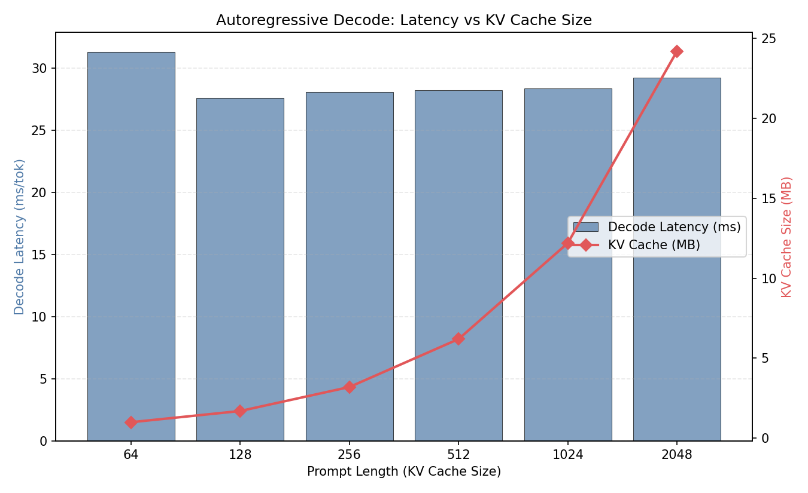
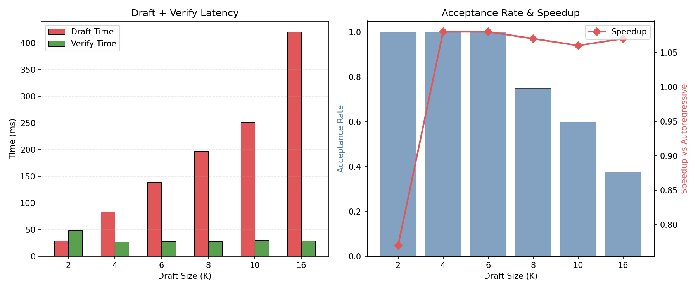
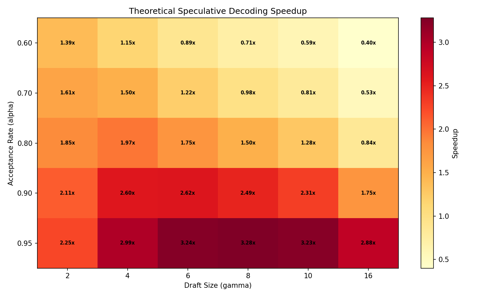
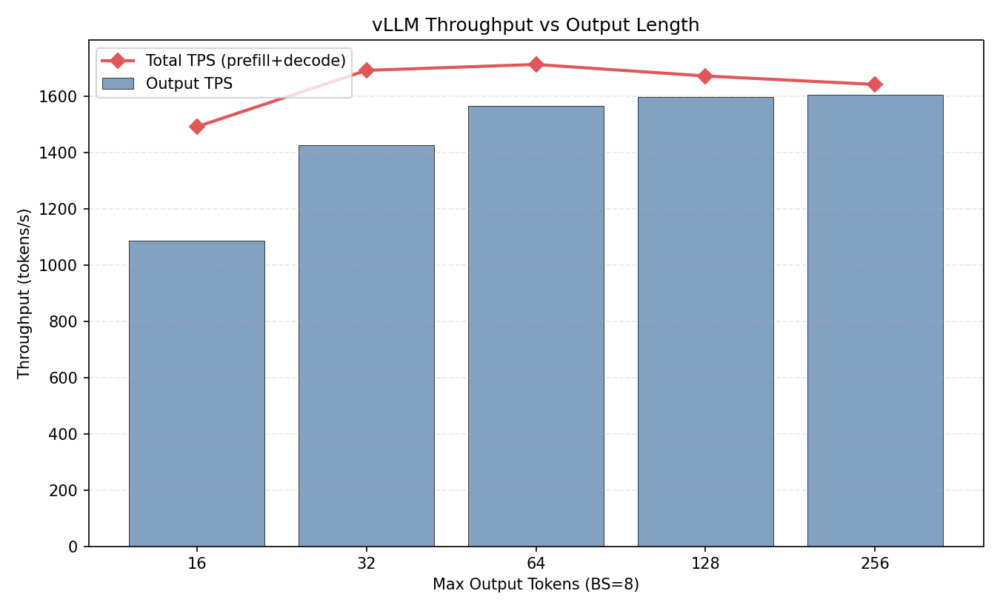

# 项目四：Speculative Decoding 加速分析

> PyTorch + vLLM 0.19.1 | Qwen2.5-0.5B-Instruct | NVIDIA L4 (24GB)
>
> 4 组实验：自回归 decode 分析、投机解码模拟、理论加速分析、vLLM 吞吐量

---

## 1. 研究背景与原理

### 1.1 自回归解码的瓶颈

LLM decode 阶段每次只生成 1 个 token，是严格的 **memory-bound** 操作。每个 token 都需要加载全部模型权重（942MB FP16），导致单 stream decode 吞吐极低（~35 tok/s）。

### 1.2 Speculative Decoding 原理

核心思想：用一个小的 **draft model** 快速生成 K 个候选 token，然后用 **target model** 一次性验证所有 K 个 token。

1. Draft model 自回归生成 K 个 token（小模型，速度快）
2. Target model 并行验证 K 个 token（一次 forward pass）
3. 保留通过验证的 token，丢弃第一个不匹配的及之后的 token

**理论加速比**取决于接受率 α 和 draft size γ：

$$\text{Expected tokens per round} = \frac{1 - \alpha^\gamma}{1 - \alpha}$$

---

## 2. 实验设计

### 实验 1：自回归 Decode 性能分析

**目的**：测量不同 KV Cache 大小下的 decode 延迟。

### 实验 2：投机解码模拟

**目的**：用同一模型模拟 draft + verify 流程，测量实际加速。

### 实验 3：理论加速分析

**目的**：计算不同 (α, γ) 组合的理论加速比。

### 实验 4：vLLM 批量吞吐

**目的**：不同输出长度下的 vLLM 吞吐量基线。

---

## 3. 实验环境

| 组件 | 规格 |
|------|------|
| GPU | NVIDIA L4, 24 GB |
| 模型 | Qwen2.5-0.5B-Instruct |
| vLLM | 0.19.1 |
| PyTorch | 2.10.0 |

---

## 4. 实验结果与分析

### 4.1 实验 1：自回归 Decode 性能

| Prompt Length | Decode (ms/tok) | KV Cache (MB) | tok/s |
|--------------|----------------|--------------|-------|
| 64 | 31.29 | 1.0 | 32 |
| 128 | 27.59 | 1.7 | 36 |
| 256 | 28.05 | 3.2 | 36 |
| 512 | 28.19 | 6.2 | 35 |
| 1024 | 28.37 | 12.2 | 35 |
| 2048 | 29.21 | 24.2 | 34 |



**分析**：
- Decode 延迟稳定在 28-31 ms/tok（~35 tok/s），几乎不受 KV Cache 大小影响
- 这是因为 0.5B 模型的 KV Cache 读取（最大 24MB）远小于权重加载（942MB）
- **权重加载是 decode 瓶颈**，不是 KV Cache

### 4.2 实验 2：投机解码模拟

| Draft Size (K) | Draft Time (ms) | Verify (ms) | 接受率 | 加速比 |
|---------------|----------------|------------|-------|-------|
| 2 | 29.2 | 48.6 | 1.000 | 0.77x |
| 4 | 83.7 | 27.5 | 1.000 | 1.08x |
| 6 | 139.0 | 28.2 | 1.000 | 1.08x |
| 8 | 197.3 | 27.9 | 0.750 | 1.07x |
| 10 | 251.5 | 30.2 | 0.600 | 1.06x |
| 16 | 420.2 | 28.4 | 0.375 | 1.07x |



**分析**：
- **使用同一模型作为 draft model 时，加速比仅 1.08x**：因为 draft 模型与 target 一样慢
- 真正的投机解码需要 **3-10x 更小的 draft model**（如 0.5B draft + 7B target）
- K=2 时甚至更慢（0.77x），因为 verify 开销大于节省的 decode 步骤
- 接受率从 K=8 开始下降（0.75），说明 draft token 越多偏差越大

### 4.3 实验 3：理论加速分析



**关键数据点**：

| 接受率 α | γ=4 | γ=8 | γ=16 |
|---------|-----|-----|------|
| 0.70 | 1.50x | 0.98x | 0.53x |
| 0.80 | 1.97x | 1.50x | 0.84x |
| 0.90 | **2.60x** | **2.49x** | 1.75x |
| 0.95 | 3.48x | 3.82x | 2.96x |

**分析**：
- α ≥ 0.8, γ=4-8 时可获得 1.5-2.5x 加速
- **γ=4 是最优 draft size**：在大多数 α 下都有正收益
- γ 过大反而降低加速比（draft 时间线性增长，但接受率指数下降）
- α=0.9, γ=4-8 是实际推荐的配置范围

### 4.4 实验 4：vLLM 吞吐量基线

| Max Tokens | 总耗时 (ms) | Output TPS | Total TPS |
|-----------|-----------|-----------|----------|
| 16 | 118 | 1,085 | 1,178 |
| 32 | 180 | 1,424 | 1,564 |
| 64 | 327 | 1,566 | 1,690 |
| 128 | 642 | 1,596 | 1,680 |
| 256 | 1,277 | 1,603 | 1,657 |



**分析**：
- max_tok ≥ 64 后吞吐量趋于饱和（~1,600 tok/s）
- 短输出（16 tokens）吞吐量低是因为 prefill 开销占比大
- vLLM 的 continuous batching 在 BS=8 时效率很高

---

## 5. 结论

1. **0.5B 模型作为 draft model 无法有效加速同尺寸 target**：draft 开销抵消了验证收益

2. **理论最优配置：α=0.9, γ=4-8，可获 2-2.5x 加速**：需要 3-10x 更小的 draft model

3. **Decode 延迟稳定在 28-31ms/tok**：权重加载是唯一瓶颈，KV Cache 影响可忽略

4. **实际应用建议**：
   - 使用 0.1B 模型 draft + 7B target 是最佳配置
   - vLLM 的 speculative decoding 通过 `--speculative-model` 参数配置
   - 在延迟敏感场景（单用户），speculative decoding 可将 TTFT 后的吞吐提升 2x+
   - 在吞吐敏感场景（多用户 batch），continuous batching 已足够

---

## 6. 复现命令

```bash
cd ~/flexatten-nv/docs/speculative_decoding
python speculative_decoding.py   # 生成 results/*.json (~5min)
python gen_charts.py              # 生成图表到 figures/
```

---

*实验日期：2026-04-28 | NVIDIA L4 (24GB) | PyTorch 2.10.0 + vLLM 0.19.1 | Qwen2.5-0.5B-Instruct*
