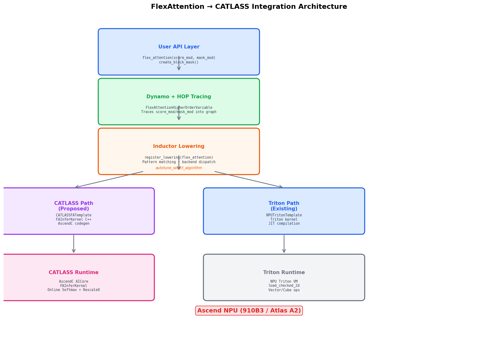
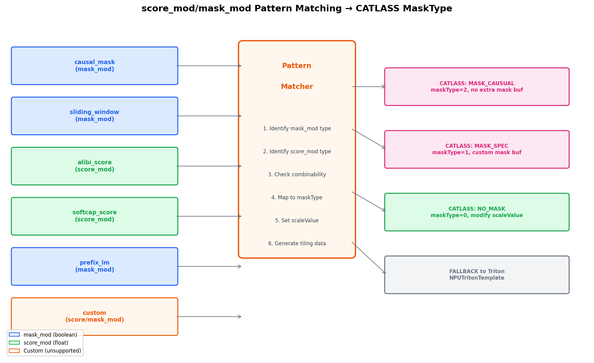
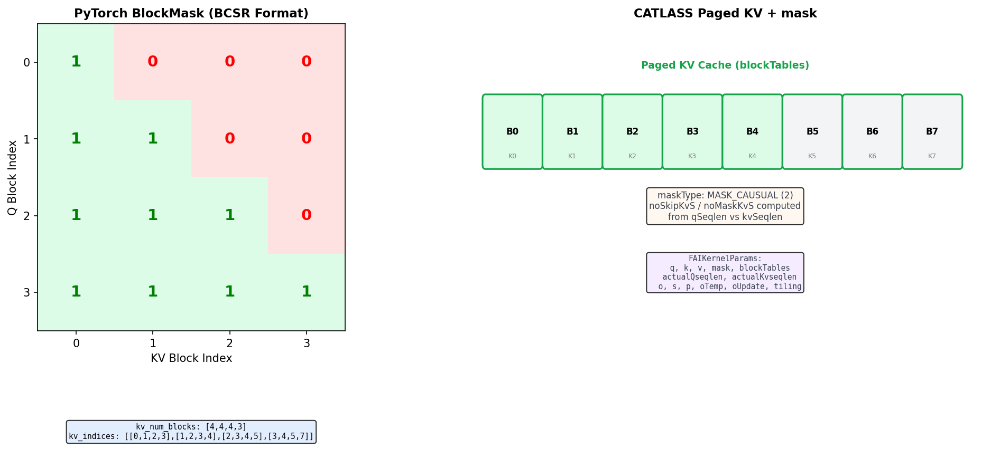
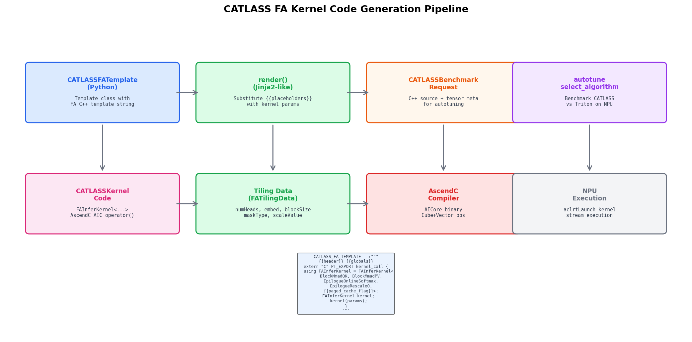
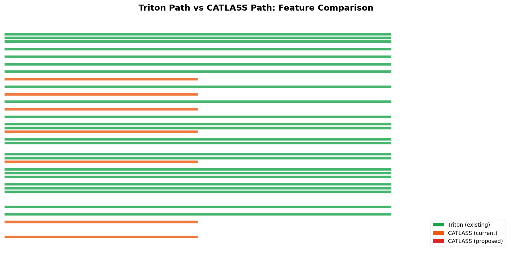
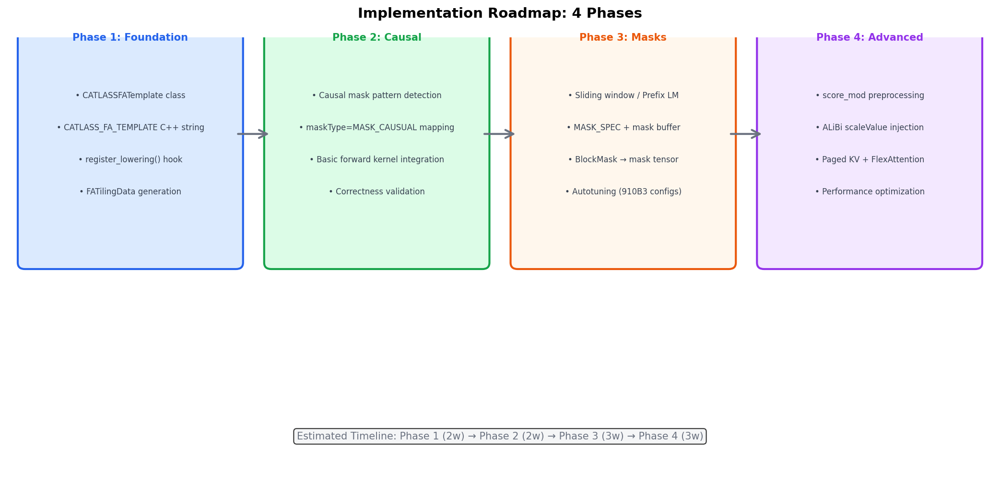

# PyTorch FlexAttention 接入 CATLASS 技术方案

> Ascend NPU 910B3 | Atlas A2 架构 | PyTorch Inductor | CATLASS (CUTLASS equivalent) | AscendC

## 1. 概述

本报告提出将 PyTorch FlexAttention 接入华为昇腾 NPU 的 CATLASS 框架的技术方案。CATLASS 是昇腾 NPU 上对标 NVIDIA CUTLASS 的 C++ 模板库，用于高性能矩阵运算和 Flash Attention 推理。本方案基于对以下已有系统的深入分析：

- **NVIDIA CuteDSL 路径**：PyTorch Inductor 通过 CuteDSLTemplate 将 FlexAttention 编译为 CUTLASS CuTe kernel（需要 sm90+ Hopper）
- **NPU Triton 路径**：torch_npu 通过 NPUTritonTemplate 将 FlexAttention 编译为 Triton kernel（当前路径）
- **NPU mm/CATLASS 路径**：torch_npu 通过 CATLASS1xGemmTemplate 将 mm/addmm 编译为 CATLASS AscendC kernel（已有成熟路径）
- **CATLASS FA 推理内核**：CATLASS 库已包含 `FAInferKernel`，支持 causal mask、paged KV cache、online softmax



## 2. 可行性分析

### 2.1 已有基础设施

| 组件 | 状态 | 说明 |
|------|------|------|
| CATLASS FAInferKernel | 已有 | 支持 causal mask (maskType=2)、spec mask (maskType=1)、paged cache |
| CATLASSTemplate 代码生成框架 | 已有 | 已用于 mm/addmm 的 AscendC 代码生成 |
| register_lowering 机制 | 已有 | mm 已通过此机制接入 CATLASS |
| autotune_select_algorithm | 已有 | CATLASS vs ATen fallback 的 autotuning 框架 |
| torch_npu FlexAttention Triton 路径 | 已有 | 可作为 fallback |
| CATLASS Epilogue 系统 | 已有 | EpilogueAtlasA2FASoftmax, EpilogueAtlasA2FARescaleO |

### 2.2 CATLASS FAInferKernel 能力

CATLASS 已有的 Flash Attention 推理内核（`examples/23_flash_attention_infer/`）具备以下能力：

```cpp
template <class BlockMmadQK, class BlockMmadPV,
          class EpilogueOnlineSoftmax, class EpilogueRescaleO,
          bool PAGED_CACHE_FLAG>
class FAInferKernel {
    // AscendC AIC operator() 处理:
    // 1. Q×K^T 矩阵乘法 (BlockMmadQK)
    // 2. Online Softmax (EpilogueOnlineSoftmax)
    // 3. P×V 矩阵乘法 (BlockMmadPV)
    // 4. 输出重缩放 (EpilogueRescaleO)
    // 5. 支持 mask (maskType: 0=无, 1=spec, 2=causal)
    // 6. 支持 paged KV cache (PAGED_CACHE_FLAG)
};
```

**Tiling 数据结构**：

```cpp
struct FATilingData {
    uint32_t numHeads, embeddingSize, numBlocks, blockSize;
    uint32_t maxKvSeqlen, kvHeads, batch, maskType;
    float scaleValue;  // 1/sqrt(d_k)
};

struct FAIKernelParams {
    GM_ADDR q, k, v, mask, blockTables;
    GM_ADDR actualQseqlen, actualKvseqlen;
    GM_ADDR o, s, p, oTemp, oUpdate, tiling;
};
```

**Mask 处理**：内核根据 `maskType` 自动处理 causal mask 的 KV 循环分割：
- `maskType=0 (NO_MASK)`：完整 KV 循环
- `maskType=1 (MASK_SPEC)`：外部提供 mask buffer
- `maskType=2 (MASK_CAUSUAL)`：根据 qSeqlen/kvSeqlen 自动计算 mask 边界

### 2.3 核心挑战

| 挑战 | 难度 | 解决思路 |
|------|------|---------|
| score_mod 动态编译 | 高 | 模式匹配 → 预定义 kernel 变体 |
| BlockMask 格式转换 | 中 | BCSR → paged KV + maskType 映射 |
| 推理 vs 训练 | 中 | 先推理，后续扩展训练 |
| 代码生成模板 | 低 | 复用 CATLASSTemplate 框架 |

## 3. 架构设计

### 3.1 整体架构

```
用户代码: flex_attention(q, k, v, score_mod, mask_mod, block_mask)
                    │
    ┌───────────────┴───────────────┐
    │         Dynamo + HOP           │
    │   FlexAttentionHigherOrderVariable   │
    │   追踪 score_mod / mask_mod         │
    └───────────────┬───────────────┘
                    │
    ┌───────────────┴───────────────┐
    │     Inductor register_lowering  │
    │   _register_npu_inductor_flex   │
    │   ┌──────────┬───────────┐      │
    │   │ Pattern  │ Dispatch  │      │
    │   │ Match    │ Decision  │      │
    │   └──┬───────┴─────┬─────┘      │
    │      │             │            │
    │  ┌───┴───┐   ┌─────┴────┐      │
    │  │CATLASS│   │  Triton  │      │
    │  │ Path  │   │  Path    │      │
    │  └───┬───┘   └─────┬────┘      │
    └──────┼─────────────┼───────────┘
           │             │
    ┌──────┴──────┐ ┌────┴─────┐
    │ CATLASS     │ │ NPU      │
    │ FAInferKernel│ │ Triton  │
    │ AscendC     │ │ Template │
    └─────────────┘ └──────────┘
```

### 3.2 新增组件

需要创建以下核心组件：

#### 3.2.1 CATLASSFATemplate（新增）

```python
# torch_npu/_inductor/codegen/catlass/fa_template.py

class CATLASSFATemplate(CATLASSTemplate):
    """Flash Attention template for CATLASS code generation.

    Analogous to CATLASS1xGemmTemplate for mm, but generates
    FAInferKernel-based AscendC kernels for attention.
    """

    def __init__(self, input_nodes, layout, kernel_options):
        super().__init__(
            name="catlass_fa",
            input_nodes=input_nodes,
            layout=layout,
        )
        self.kernel_options = kernel_options

    def render(self, kernel, **kwargs):
        """Render CATLASS FA kernel C++ code from template."""
        # Substitute FATilingData fields, kernel params,
        # and FAInferKernel template instantiation
        ...
```

#### 3.2.2 C++ 内核模板字符串

```python
CATLASS_FA_TEMPLATE = r"""
{{template.header().getvalue()}}
{{template.globals().getvalue()}}

// Include CATLASS FA kernel headers
#include "catlass/epilogue/block/block_epilogue_fa_softmax.hpp"
#include "catlass/epilogue/block/block_epilogue_fa_rescale_o.hpp"
#include "catlass/gemm/block/block_mmad.hpp"

extern "C" PT_EXPORT {{kernel_call_signature}} {
    // 1. Extract FATilingData from tiling buffer
    __gm__ FATilingData *tilingData = reinterpret_cast<__gm__ FATilingData *>(tiling);

    // 2. Build FAIKernelParams
    FAIKernelParams params;
    params.q = q; params.k = k; params.v = v;
    params.mask = mask;
    params.blockTables = blockTables;
    params.actualQseqlen = actualQseqlen;
    params.actualKvseqlen = actualKvseqlen;
    params.o = output;
    params.s = workspace_s;
    params.p = workspace_p;
    params.oTemp = workspace_oTemp;
    params.oUpdate = workspace_oUpdate;
    params.tiling = tiling;

    // 3. Instantiate and launch FAInferKernel
    {{kernel_instantiation}}
}
"""
```

#### 3.2.3 Pattern Matcher（新增）



```python
# torch_npu/_inductor/kernel/flex_attention_catlass.py

class FlexAttentionPatternMatcher:
    """Match FlexAttention score_mod/mask_mod patterns to CATLASS capabilities."""

    SUPPORTED_MASK_MODS = {
        'causal': MaskType.MASK_CAUSUAL,
        'sliding_window': MaskType.MASK_SPEC,
        'prefix_lm': MaskType.MASK_SPEC,
    }

    SUPPORTED_SCORE_MODS = {
        'alibi': None,       # 修改 scaleValue
        'softcap': None,     # 后处理
    }

    @classmethod
    def match(cls, score_mod, mask_mod, block_mask):
        """Analyze score_mod/mask_mod and return CATLASS compatibility info.

        Returns:
            MatchResult with:
            - can_use_catlass: bool
            - mask_type: MaskType enum
            - needs_mask_buffer: bool
            - scale_value_override: Optional[float]
            - fallback_reason: Optional[str]
        """
        ...
```

### 3.3 模式匹配规则

| FlexAttention 模式 | score_mod | mask_mod | CATLASS 映射 | 可用性 |
|-------------------|-----------|----------|-------------|--------|
| Causal | - | causal_mask | maskType=2 (MASK_CAUSUAL) | Phase 2 |
| Sliding Window | - | sliding_window | maskType=1 + mask buffer | Phase 3 |
| Prefix LM | - | prefix_lm_mask | maskType=1 + mask buffer | Phase 3 |
| ALiBi | alibi_score | - | maskType=0 + 修改 scaleValue | Phase 4 |
| Softcapping | softcap_score | - | maskType=0 + 后处理 | Phase 4 |
| Causal + ALiBi | alibi_score | causal_mask | maskType=2 + scaleValue | Phase 4 |
| Custom | custom_fn | custom_fn | Fallback to Triton | - |

## 4. BlockMask 格式转换



### 4.1 PyTorch BlockMask 结构

PyTorch 的 `BlockMask` 使用类 BCSR 格式存储块稀疏注意力模式：

```python
class BlockMask:
    kv_num_blocks: Tensor    # [B, H, M] 每个Q block对应的KV block数量
    kv_indices: Tensor       # [B, H, M, max_blocks] 每个Q block对应的KV block索引
    full_kv_num_blocks: Tensor
    full_kv_indices: Tensor
    BLOCK_SIZE: int           # block 大小（通常64或128）
    mask_mod: Callable        # 原始 mask_mod 函数
```

### 4.2 CATLASS 格式映射

CATLASS FAInferKernel 使用不同的参数化方式：

| 参数 | PyTorch BlockMask | CATLASS FAInferKernel |
|------|-------------------|----------------------|
| 稀疏模式 | BCSR (kv_indices) | maskType (0/1/2) |
| Block 大小 | BLOCK_SIZE (可配置) | pagedBlockSize (通常128) |
| KV 缓存布局 | 连续或 block-table | blockTables + paged KV |
| Mask 数据 | 隐式（通过 mask_mod 计算） | 显式 mask buffer（可选）|
| 变长序列 | actual_seqlen | actualQseqlen / actualKvseqlen |

### 4.3 转换策略

**Causal mask (maskType=2)**：无需额外转换，FAInferKernel 根据 qSeqlen/kvSeqlen 自动计算 mask 边界。

**Spec mask (maskType=1)**：需要将 BlockMask 的 BCSR 数据转换为显式 mask buffer：

```python
def blockmask_to_catlass_mask(block_mask, q_seqlen, kv_seqlen):
    """Convert PyTorch BlockMask to CATLASS-compatible mask tensor.

    For maskType=1 (MASK_SPEC), generate a 2D mask tensor where:
    - mask[i][j] = 1.0 if position (i, j) should be attended
    - mask[i][j] = 0.0 if position (i, j) should be masked
    """
    block_size = block_mask.BLOCK_SIZE
    # Iterate over kv_num_blocks/kv_indices to build dense mask
    # Then convert to half/bf16 for NPU consumption
    ...
```

## 5. 代码生成流程



### 5.1 注册与调用链

```python
# torch_npu/_inductor/kernel/flex_attention.py (修改)

def _register_npu_inductor_flex_attention():
    @register_lowering(torch.ops.higher_order.flex_attention)
    def flex_attention_lowering(*args, **kwargs):
        # 1. Pattern match score_mod/mask_mod
        match_result = FlexAttentionPatternMatcher.match(
            score_mod, mask_mod, block_mask
        )

        # 2. If CATLASS compatible, add CATLASS as candidate
        if match_result.can_use_catlass:
            CATLASSFATemplate.add_catlass_fa_choices(
                input_nodes, layout,
                match_result.mask_type,
                match_result.needs_mask_buffer,
            )

        # 3. Always add Triton as fallback candidate
        NPUTritonTemplate._add_triton_choices(...)

        # 4. autotune selects best backend
        return autotune_select_algorithm(
            choices, input_nodes, layout,
        )
```

### 5.2 代码生成细节

CATLASSFATemplate 的 `render()` 方法需要：

1. **填充 FATilingData**：从 Inductor IR 节点提取 batch/numHeads/embeddingSize/kvHeads 等信息
2. **选择内核模板实例化**：根据 maskType 和数据类型选择 FAInferFp16/FAInferBf16
3. **生成 tiling 计算代码**：调用 FAInferTiling::GetFATilingParam
4. **分配 workspace**：S/P/OTemp/OUpdate buffer
5. **生成 kernel launch 代码**：<<<blockDim, nullptr, stream>>>

### 5.3 与 mm/CATLASS 路径的对比

| 方面 | mm → CATLASS | FlexAttention → CATLASS (新) |
|------|-------------|----------------------------|
| 基类 | CATLASSTemplate | CATLASSTemplate |
| 模板类 | CATLASS1xGemmTemplate | CATLASSFATemplate |
| C++ 模板 | CATLASS_TEMPLATE_1X | CATLASS_FA_TEMPLATE |
| 内核类型 | Gemm::Device::DeviceGemm | FAInferKernel |
| Tiling | Inductor 自动计算 | FATilingData (已封装) |
| Epilogue | 可选 bias/relu | EpilogueOnlineSoftmax + RescaleO |
| Op 检测 | use_catlass_template() | 新增 use_catlass_fa_template() |
| Autotuning | GEMM size-based | Attention shape-based |

## 6. Autotuning 配置

### 6.1 910B3 配置建议

```python
CATLASS_FA_CONFIGS_910B3 = {
    'forward': {
        'block_size_q': 128,     # Q 序列分块
        'block_size_kv': 128,    # KV 序列分块 (pagedBlockSize)
        'block_stack_num': 4,    # KV stack 深度
        'pre_launch': 2,         # 预取深度
    },
    'mask_causal': {
        'mask_type': 2,          # MASK_CAUSUAL
        'no_extra_buffer': True, # 不需要 mask buffer
    },
    'mask_spec': {
        'mask_type': 1,          # MASK_SPEC
        'mask_buffer_size': 'max_seqlen * max_seqlen / 2',  # 上三角 mask
    },
}
```

### 6.2 Autotuning 策略

- **小序列 (S < 512)**：优先 Triton，CATLASS 启动开销大
- **中序列 (512 ≤ S ≤ 2048)**：CATLASS 和 Triton 竞争，autotune 决定
- **长序列 (S > 2048)**：优先 CATLASS，FAInferKernel 的 pingpong 流水线更高效
- **Paged KV 场景**：CATLASS 原生支持，优先级最高

## 7. 特性对比



### 7.1 与 NVIDIA CuteDSL 路径的对比

| 方面 | NVIDIA CuteDSL | CATLASS (本方案) |
|------|---------------|-----------------|
| 编译目标 | CUTLASS CuTe kernel | CATLASS FAInferKernel |
| 代码生成 | Python AST → CuTe DSL | C++ 模板 + Jinja2 |
| score_mod | 编译为 kernel 内代码 | 模式匹配 + 预定义变体 |
| mask_mod | 编译为 kernel 内代码 | maskType 枚举 + mask buffer |
| BlockMask | 直接使用 BCSR | 转换为 FATilingData |
| 硬件要求 | sm90+ (Hopper) | Atlas A2 (910B3) |
| 编程语言 | CuTe DSL → CUDA | AscendC → AICore |
| 动态灵活性 | 高 (任意 score_mod) | 中 (预定义模式 + fallback) |

### 7.2 score_mod 处理策略

CATLASS 无法像 Triton/CuteDSL 那样在 kernel 内执行任意 Python 函数。本方案采用**三层降级策略**：

1. **直接映射**：score_mod 效果可通过已有参数实现（如 ALiBi 的 scaleValue → 修改 FATilingData.scaleValue）
2. **预计算 + buffer**：将 score_mod 的效果预计算为 mask/scale tensor，作为额外 buffer 传入 kernel
3. **Fallback 到 Triton**：无法处理的复杂 score_mod 回退到 NPUTritonTemplate

## 8. 实现路线图



### Phase 1: 基础框架（2 周）

**目标**：建立 CATLASS FlexAttention 代码生成基础设施

1. 创建 `torch_npu/_inductor/codegen/catlass/fa_template.py`
   - CATLASSFATemplate 类（继承 CATLASSTemplate）
   - CATLASS_FA_TEMPLATE C++ 模板字符串
   - render() 方法实现

2. 修改 `torch_npu/_inductor/kernel/flex_attention.py`
   - 添加 `use_catlass_fa_template()` 检测函数
   - 添加 CATLASS 候选到 autotune_select_algorithm

3. 验证代码生成
   - 确认 C++ 代码可编译
   - 确认 AscendC kernel 可加载

### Phase 2: Causal Mask 支持（2 周）

**目标**：CATLASS 路径支持 causal attention 推理

1. 实现 FlexAttentionPatternMatcher
   - causal_mask 模式识别
   - maskType=2 (MASK_CAUSUAL) 映射

2. FATilingData 生成
   - 从 Inductor IR 提取 batch/heads/embed/seqlen
   - 调用 FAInferTiling::GetFATilingParam 计算参数

3. 正确性验证
   - 与 PyTorch eager 结果对比
   - 与 Triton 路径结果对比
   - FP16/BF16 精度验证

### Phase 3: 多种 Mask 支持（3 周）

**目标**：扩展支持 sliding window、prefix LM 等 mask 模式

1. MASK_SPEC 支持
   - BlockMask BCSR → 显式 mask buffer 转换
   - mask buffer 内存管理和布局

2. 更多 mask 模式
   - sliding_window → maskType=1 + 滑动 mask
   - prefix_lm → maskType=1 + 拼接 mask
   - causal + 其他 mask 的组合

3. Autotuning 完善
   - 910B3 上的性能调优
   - 不同序列长度的配置选择

### Phase 4: 高级特性（3 周）

**目标**：score_mod 预处理和 paged KV 集成

1. score_mod 预处理
   - ALiBi: 预计算距离 bias → 修改 scaleValue 或传入额外 buffer
   - Softcapping: 后处理 tanh/scale

2. Paged KV Cache
   - FlexAttention + Paged Attention 集成
   - blockTables 参数传递

3. 性能优化
   - Workspace 内存优化
   - Tiling 参数自动调优
   - 与 Triton 路径的 benchmark 对比

## 9. 关键代码修改清单

### 9.1 新增文件

```
torch_npu/_inductor/
├── codegen/catlass/
│   ├── fa_template.py           # CATLASSFATemplate 类
│   └── fa_kernel.py             # CATLASS FA kernel 相关类型
├── kernel/
│   └── flex_attention_catlass.py  # Pattern matcher + CATLASS 候选生成
```

### 9.2 修改文件

```
torch_npu/_inductor/
├── kernel/flex_attention.py      # 添加 CATLASS 路径分支
├── codegen/catlass/catlass_template.py  # 可能需要扩展基类
├── config.py                     # 添加 CATLASS FA 相关配置
└── utils.py                      # 添加 use_catlass_fa_template()
```

### 9.3 CATLASS 库修改

CATLASS FAInferKernel 库本身**不需要修改**，但可能需要：

1. 暴露 tiling API 的 Python binding
2. 添加更多 mask 模式支持（如果需要 beyond causal/spec）
3. 增加训练用 backward kernel（Phase 4+）

## 10. 风险与缓解

| 风险 | 影响 | 缓解措施 |
|------|------|---------|
| score_mod 模式覆盖不全 | 部分用例回退 Triton | 持续扩展 pattern library |
| FATilingData 计算错误 | 结果不正确 | 严格对比测试 + golden data |
| CATLASS FA kernel 性能不如预期 | 无性能收益 | autotuning 自动选 Triton |
| AscendC 编译兼容性 | kernel 无法加载 | 复用已验证的 CATLASS 编译流程 |
| 内存管理复杂度 | OOM 或泄漏 | workspace 预分配 + 精确计算 |

## 11. 预期收益

1. **推理性能**：CATLASS FAInferKernel 的 pingpong 流水线（4-stack prelaunch=2）对长序列推理有显著优势
2. **Paged KV 原生支持**：vLLM 等推理框架可直接受益
3. **内存效率**：maskType=2 (causal) 无需额外 mask buffer
4. **生态完善**：补充 NPU 上 FlexAttention 的高性能推理路径

## 12. 参考资料

- [FlexAttention GPU 执行管线静态分析](FLEXATTENTION_GPU_PIPELINE_ANALYSIS.md)
- [NPU mm/CATLASS 接入分析](NPU_MM_CATLASS_ANALYSIS.md)
- [NPU FlexAttention/Triton 接入分析](NPU_FLEXATTENTION_TRITON_ANALYSIS.md)
- CATLASS 源码: `~/catlass-flexatten/` (NPU 机器)
- torch_npu 源码: `~/pytorch-flexatten/` (NPU 机器)
- PyTorch FlexAttention 源码: `torch/_inductor/kernel/flex_attention.py`
- PyTorch Inductor TritonTemplate: `torch/_inductor/select_algorithm.py`

---

*报告日期：2026-04-27 | 基于 CATLASS 库 + torch_npu 源码静态分析*
