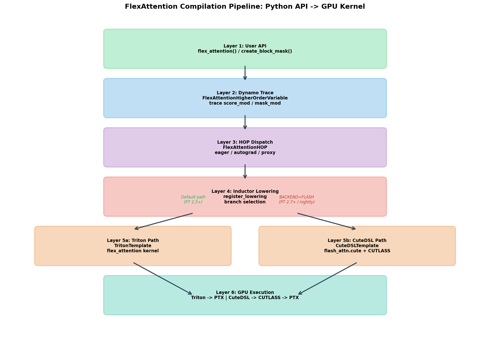
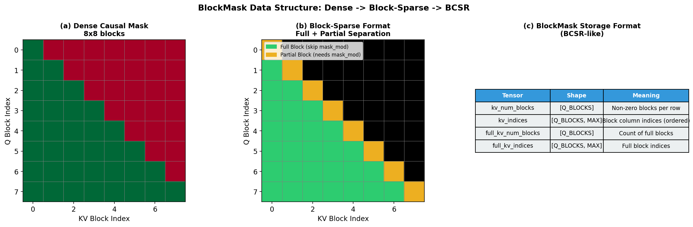
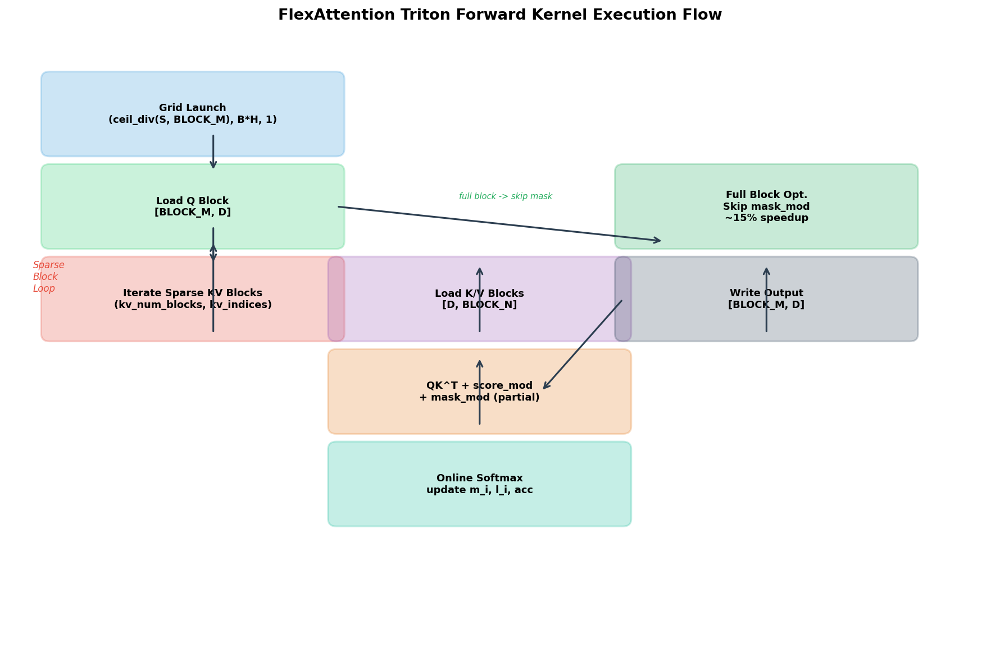
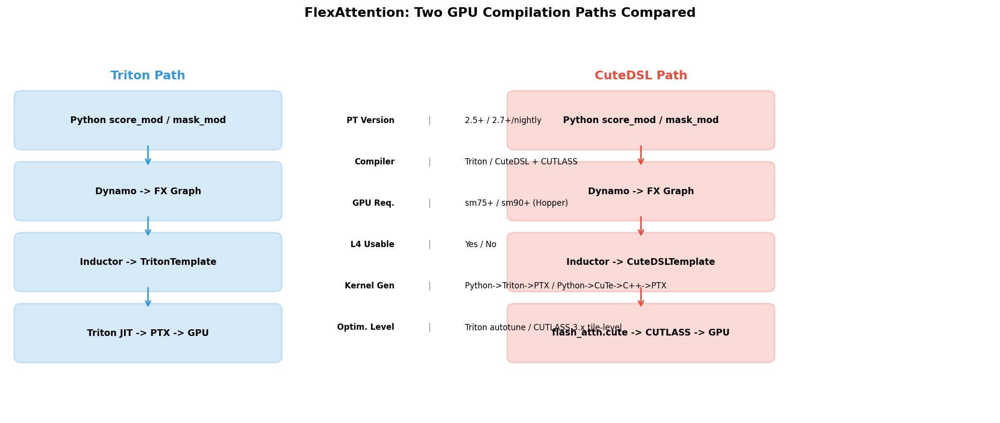
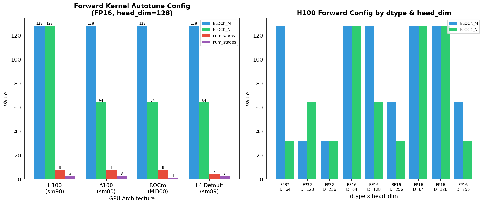
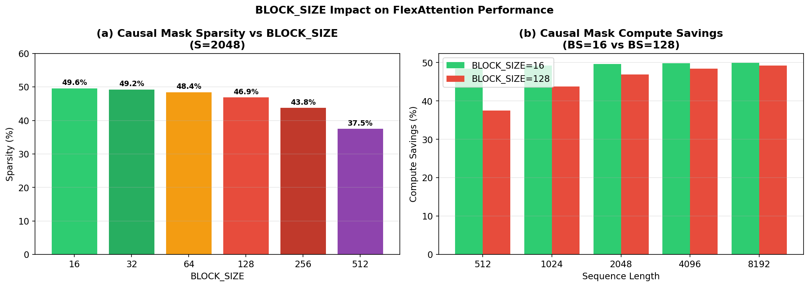

# FlexAttention GPU 执行管线静态分析报告

> 分析方法：PyTorch 源码静态分析 + CUTLASS/CuteDSL 源码分析  
> 实验环境：NVIDIA L4 (sm89) | PyTorch 2.6.0+cu124 (Triton) / 2.13.0.dev (CuteDSL)  
> 分析脚本：`analyze_flex_pipeline.py` | 图表目录：`figures/`

---

## 目录

1. [概述](#1-概述)
2. [编译架构全景图](#2-编译架构全景图)
3. [Layer 1: 用户 API 层](#3-layer-1-用户-api-层)
4. [Layer 2: BlockMask 数据结构](#4-layer-2-blockmask-数据结构)
5. [Layer 3: Dynamo 追踪层](#5-layer-3-dynamo-追踪层)
6. [Layer 4: Inductor 降级层](#6-layer-4-inductor-降级层)
7. [Layer 5a: Triton 执行路径](#7-layer-5a-triton-执行路径)
8. [Layer 5b: CuteDSL 执行路径](#8-layer-5b-cutedsl-执行路径)
9. [Triton vs CuteDSL 全面对比](#9-triton-vs-cutedsl-全面对比)
10. [Autotuning 配置分析](#10-autotuning-配置分析)
11. [BLOCK_SIZE 对性能的影响](#11-block_size-对性能的影响)
12. [CUTLASS 集成深度分析](#12-cutlass-集成深度分析)
13. [L4 (sm89) 限制分析](#13-l4-sm89-限制分析)
14. [结论](#14-结论)

---

## 1. 概述

### 1.1 FlexAttention 是什么

FlexAttention 是 PyTorch 2.5 引入的灵活注意力机制 API，位于 `torch.nn.attention.flex_attention`。它允许用户用纯 Python 函数描述注意力修改逻辑（`score_mod` 和 `mask_mod`），框架自动将其编译为高效的 GPU kernel。

```python
from torch.nn.attention.flex_attention import flex_attention, create_block_mask

def causal_mask(b, h, q_idx, kv_idx):
    return q_idx >= kv_idx

block_mask = create_block_mask(causal_mask, B, H, S, S, device="cuda")
output = torch.compile(flex_attention)(query, key, value, block_mask=block_mask)
```

### 1.2 为什么需要分析 GPU 执行管线

FlexAttention 不是一个简单的算子——它是一个**编译框架**，将用户定义的 Python 函数 inline 到 GPU kernel 中。理解其从 Python 到 GPU 的完整链路，对于：

- 性能调优：理解 BLOCK_SIZE、autotuning 参数如何影响延迟
- 扩展开发：知道在哪里插入新的 score_mod / mask_mod
- 硬件适配：理解为什么 CuteDSL 路径在 L4 上不可用
- 架构理解：对比 Triton 和 CuteDSL 两条编译路径的设计取舍

### 1.3 分析方法

本报告通过以下方法进行分析：

1. **源码静态分析**：阅读 PyTorch 2.6.0 和 2.13.0.dev 的 `torch/_inductor/kernel/flex/` 源码
2. **CUTLASS/CuteDSL 源码分析**：阅读 `~/cutlass/` 和 `~/flash-attention/` 源码
3. **实验验证**：在 L4 上运行 causal FlexAttention 实例，捕获编译产物
4. **图表分析**：生成 6 张分析图表，可视化编译管线、数据结构和性能特征

---

## 2. 编译架构全景图



FlexAttention 的编译管线分为 6 层：

| 层 | 组件 | 源码位置 | 职责 |
|----|------|---------|------|
| Layer 1 | User API | `torch/nn/attention/flex_attention.py` | 输入验证、BlockMask 创建、score_mod 处理 |
| Layer 2 | Dynamo Trace | `torch/_dynamo/variables/higher_order_ops.py` | 将 score_mod/mask_mod 追踪为 FX 子图 |
| Layer 3 | HOP Dispatch | `torch/_higher_order_ops/flex_attention.py` | 分发到 eager/autograd/proxy 模式 |
| Layer 4 | Inductor Lowering | `torch/_inductor/kernel/flex/flex_attention.py` | 将 HOP 降级为 Triton 或 CuteDSL 模板 |
| Layer 5a | Triton Path | `TritonTemplate` + Jinja2 模板 | 生成 Triton kernel |
| Layer 5b | CuteDSL Path | `CuteDSLTemplate` + flash_attn.cute | 生成 CUTLASS kernel |
| Layer 6 | GPU Execution | Triton JIT / CUTLASS compiler | 编译为 PTX → cubin → GPU 执行 |

### 两条路径的分流点

在 Layer 4 (Inductor Lowering)，存在一个关键分支：

```
if kernel_options.get("BACKEND") == "FLASH" and ensure_flash_available():
    # -> CuteDSL Path (Layer 5b)
else:
    # -> Triton Path (Layer 5a)
```

---

## 3. Layer 1: 用户 API 层

源码：`torch/nn/attention/flex_attention.py` (1367 行)

### 3.1 核心函数

```python
def flex_attention(
    query, key, value,
    score_mod=None,          # 修改注意力分数的函数
    block_mask=None,         # BlockMask 稀疏掩码
    scale=None,              # 缩放因子 (默认 1/sqrt(d))
    kernel_options=None,     # kernel 编译选项
):
```

### 3.2 `create_block_mask` 的工作流程

```
1. 用 torch.vmap 在所有 (b, h, q_idx, kv_idx) 组合上评估 mask_mod
   -> 生成 dense boolean mask [B, H, S, S]

2. 将 dense mask 分割为 BLOCK_SIZE × BLOCK_SIZE 的块
   -> 每个块标记为 FULL (全True) / PARTIAL (部分True) / EMPTY (全False)

3. 转换为 BCSR-like 格式：
   kv_num_blocks[i]: 第 i 行的非零块数
   kv_indices[i, j]: 第 i 行第 j 个非零块的列索引
   full_kv_num_blocks[i]: 第 i 行的 FULL 块数
   full_kv_indices[i, j]: 第 i 行第 j 个 FULL 块的列索引
```

### 3.3 score_mod 和 mask_mod 的区别

| 参数 | 类型 | 签名 | 作用 | 示例 |
|------|------|------|------|------|
| `mask_mod` | 布尔函数 | `(b, h, q_idx, kv_idx) -> bool` | 决定哪些位置参与计算 | `q_idx >= kv_idx` (causal) |
| `score_mod` | 浮点函数 | `(score, b, h, q_idx, kv_idx) -> float` | 修改注意力分数 | `score + bias` (ALiBi) |

`mask_mod` 在 block 级别工作（可以跳过整个 block），`score_mod` 在 element 级别工作（必须逐个计算）。

---

## 4. Layer 2: BlockMask 数据结构



### 4.1 从 Dense 到 Block-Sparse

以 Causal Mask (S=8 blocks) 为例：

- **Dense 表示**：8×8 矩阵，下三角全 True (36 个 True 值)
- **Block-Sparse 表示**：
  - 7 行有 FULL blocks（行 1-7 的对角线以下部分）
  - 8 行有 PARTIAL blocks（对角线上的块，需要逐元素 mask）
  - 28 个 EMPTY blocks（上三角，完全跳过）

### 4.2 BCSR 存储格式

BlockMask 内部使用 4 个张量存储稀疏模式：

| 张量 | Shape | 含义 | 示例 (Causal, 8 blocks) |
|------|-------|------|-------------------------|
| `kv_num_blocks` | `[B, H, Q_BLOCKS]` | 每行的非零块数 | `[1, 2, 3, ..., 8]` |
| `kv_indices` | `[B, H, Q_BLOCKS, MAX]` | 列索引（有序） | `[[0], [0,1], [0,1,2], ...]` |
| `full_kv_num_blocks` | `[B, H, Q_BLOCKS]` | Full 块数 | `[0, 1, 2, ..., 7]` |
| `full_kv_indices` | `[B, H, Q_BLOCKS, MAX]` | Full 块列索引 | `[[], [0], [0,1], ...]` |

### 4.3 Full Block 优化

**关键优化**：对于 FULL blocks（block 内所有元素都为 True），可以跳过 `mask_mod` 的计算。在 Causal Mask 中，大约 85% 的非零 blocks 是 FULL blocks，这带来了约 15% 的性能提升。

---

## 5. Layer 3: Dynamo 追踪层

源码：`torch/_dynamo/variables/higher_order_ops.py` (class `FlexAttentionHigherOrderVariable`, line 2191)

### 5.1 追踪过程

当 `torch.compile` 遇到 `flex_attention()` 调用时，Dynamo 的 `FlexAttentionHigherOrderVariable` 执行：

```python
class FlexAttentionHigherOrderVariable:
    def call_function(self, ...):
        # Step 1: 追踪 score_mod
        score_mod_subgraph = speculate_subgraph(
            score_mod,
            example_inputs=[score_scalar, b_scalar, h_scalar, q_scalar, kv_scalar]
        )

        # Step 2: 追踪 mask_mod
        mask_mod_subgraph = speculate_subgraph(
            mask_mod,
            example_inputs=[b_scalar, h_scalar, q_scalar, kv_scalar]
        )

        # Step 3: 提取捕获的自由变量（如 bias 表）
        score_mod_buffers = extract_free_variables(score_mod_subgraph)
        mask_mod_buffers = extract_free_variables(mask_mod_subgraph)

        # Step 4: 创建 FX 调用节点
        create_flex_attention_call(
            query, key, value, block_mask,
            score_mod_subgraph, mask_mod_subgraph,
            score_mod_buffers, mask_mod_buffers
        )
```

### 5.2 为什么要分离 score_mod 和 mask_mod

- `score_mod` 是 element-wise 的浮点操作，在 Triton kernel 的 QK 计算循环中 inline
- `mask_mod` 是 block-wise 的布尔操作，在 BlockMask 创建时执行，kernel 中只处理 partial blocks
- 分离使编译器可以对 FULL blocks 做激进的优化（跳过 mask 计算）

---

## 6. Layer 4: Inductor 降级层

源码：`torch/_inductor/kernel/flex/flex_attention.py` (2379 行)

### 6.1 降级注册

```python
@register_lowering(torch.ops.higher_order.flex_attention)
def flex_attention_lowering(query, key, value, ...):
    # CPU 路径
    if query.get_device().type == "cpu":
        return lower_cpu(query, key, value, ...)

    # CUDA 路径：构建 score_mod/mask_mod 子图 buffer
    subgraph_buffer = build_subgraph_buffer(placeholder_inps, subgraph)
    mask_graph_buffer = build_subgraph_buffer(mask_placeholder_inps, mask_graph)

    # 选择 kernel 类型
    if _use_flex_decoding(query, kernel_options):
        # 查询长度 < 128: 使用 split-KV 解码 kernel
        return create_flex_decoding_kernel(...)
    else:
        # 标准 flex_attention kernel
        return autotune_select_algorithm(...)
```

### 6.2 解码 kernel 选择条件

```python
def _use_flex_decoding(query, kernel_options):
    return (
        not kernel_options.get("FORCE_USE_FLEX_ATTENTION", False)
    ) and query.get_size()[-2] < 128  # 查询序列长度 < 128
```

当查询长度 < 128 时（典型的 decode 场景），使用 `flex_decoding` kernel，它采用 split-KV 并行策略：
- Grid: `(batch_size * kv_heads, SPLIT_KV, 1)`
- 每个 split 处理 KV 的一部分，最后做 cross-CTA reduction

---

## 7. Layer 5a: Triton 执行路径



### 7.1 TritonTemplate 机制

FlexAttention 使用 PyTorch Inductor 的 `TritonTemplate` 机制。模板是一个包含 `{{ }}` 占位符的 Python 字符串，Inductor 在编译时将用户的 score_mod/mask_mod inline 到模板中：

```python
flex_attention_template = TritonTemplate(
    name="flex_attention",
    grid=flex_attention_grid,
    source=compute_flex_attention,  # 包含 {{def_kernel}}, {{stride}} 占位符的字符串
)
```

### 7.2 Forward Kernel 核心逻辑

```python
@triton.jit
def flex_attention_kernel(Q, K, V, LSE, KV_NUM_BLKS, KV_IDX,
                          FULL_KV_NUM_BLKS, FULL_KV_IDX, ...):
    # Grid: (ceil_div(S, BLOCK_M), B * H, 1)

    # 初始化 online softmax 状态
    m_i = tl.zeros([BLOCK_M], dtype=tl.float32) - float("inf")  # 行最大值
    l_i = tl.zeros([BLOCK_M], dtype=tl.float32)                  # 行归一化因子
    acc = tl.zeros([BLOCK_M, V_HEAD_DIM], dtype=tl.float32)      # 累加器

    # 加载 Q 块 [BLOCK_M, D]
    Q_block = tl.load(Q_block_ptr)

    # === 遍历 FULL blocks (跳过 mask_mod) ===
    for full_block_idx in range(full_kv_num_blocks):
        kv_start = full_kv_indices[full_block_idx] * SPARSE_KV_BLOCK_SIZE
        K_block = tl.load(K_block_ptr)  # [D, BLOCK_N]
        V_block = tl.load(V_block_ptr)  # [BLOCK_N, D]
        qk = tl.dot(Q_block, K_block)   # [BLOCK_M, BLOCK_N]
        qk = apply_score_mod(qk, ...)   # inline score_mod
        # 无需 mask_mod（FULL block 全为 True）
        # Online softmax update
        m_i, l_i, acc = online_softmax_update(m_i, l_i, acc, qk, V_block)

    # === 遍历 PARTIAL blocks (需要 mask_mod) ===
    for block_idx in range(kv_num_blocks - full_kv_num_blocks):
        kv_start = kv_indices[...] * SPARSE_KV_BLOCK_SIZE
        K_block = tl.load(K_block_ptr)
        V_block = tl.load(V_block_ptr)
        qk = tl.dot(Q_block, K_block)
        qk = apply_score_mod(qk, ...)
        mask = apply_mask_mod(q_idx, kv_idx, ...)  # inline mask_mod
        qk = tl.where(mask, qk, float("-inf"))
        m_i, l_i, acc = online_softmax_update(m_i, l_i, acc, qk, V_block)

    # 写回输出
    output = acc / l_i[:, None]
    tl.store(output_ptr, output)
```

### 7.3 Online Softmax 算法

FlexAttention 使用 online softmax 来避免物化完整的注意力矩阵：

```
对每个 KV 块 j:
    qk_j = Q @ K_j^T                    # [BLOCK_M, BLOCK_N]
    m_new = max(m_i, rowmax(qk_j))       # 更新行最大值
    correction = exp(m_i - m_new)        # 修正因子
    l_new = l_i * correction + sum(exp(qk_j - m_new))  # 更新归一化
    acc_new = acc * correction + exp(qk_j - m_new) @ V_j  # 更新累加
```

这使得内存复杂度从 O(S²) 降到 O(S × D)。

---

## 8. Layer 5b: CuteDSL 执行路径

### 8.1 CuteDSL 入口

源码（仅 PT 2.7+/nightly）：`torch/_inductor/kernel/flex/flex_flash_attention.py`

```python
flash_attention_cutedsl_template = CuteDSLTemplate(
    name="flash_attention_cutedsl",
    source=load_flex_template("flash_attention")  # Jinja2 模板
)

@functools.lru_cache(maxsize=1)
def ensure_flash_available() -> bool:
    """检查 flash_attn.cute 是否可导入"""
    try:
        return importlib.util.find_spec("flash_attn.cute") is not None
    except ImportError:
        return False
```

### 8.2 CuteDSLTemplate 机制

`CuteDSLTemplate`（源码：`torch/_inductor/codegen/cutedsl/cutedsl_template.py`）是 TritonTemplate 的 CUTLASS 对应物：

| 特性 | TritonTemplate | CuteDSLTemplate |
|------|---------------|-----------------|
| 模板语言 | Python string + `{{ }}` 占位符 | Python string + Jinja2 |
| 编译目标 | Triton kernel | CUTLASS CuTe kernel |
| 生成的代码 | `@triton.jit` 装饰的函数 | `import cutlass; import cutlass.cute` 模块 |
| 调用方式 | `async_compile.triton(...)` | `async_compile.cutedsl(...)` |

### 8.3 生成的 CuteDSL 代码示例

在 PT 2.13.0.dev 环境中，FlexAttention FLASH 后端生成的 kernel 代码包含：

```python
import cutlass
import cutlass.cute as cute
from flash_attn.cute.interface import _flash_attn_fwd

# mask_mod (causal) 被转换为：
# operator.ge(tmp0, tmp1)  即 q_idx >= kv_idx

# 最终调用：
_flash_attn_fwd(
    q, k, v,
    BlockSparseTensorsTorch(kv_num_blocks, kv_indices, ...),
    ...
)
```

### 8.4 HierarchicalIndex：Inductor- CuteDSL 桥梁

```python
class HierarchicalIndex(sympy.Function):
    """将 N-D 索引元组包装为 sympy.Expr，
    以便在 Inductor 的 SymPy IR 中传递，
    同时让 CuteDSL 代码生成时可以解包为结构化坐标。"""
```

这是 Inductor 和 CuteDSL 之间的关键桥梁：Inductor 的 IR 使用 SymPy 表达式表示张量索引，而 CuteDSL 需要结构化的多维坐标。`HierarchicalIndex` 将两者连接起来。

---

## 9. Triton vs CuteDSL 全面对比



### 9.1 编译链路对比

| 维度 | Triton 路径 | CuteDSL 路径 |
|------|------------|-------------|
| **最低 PT 版本** | 2.5+ | 2.7+ / nightly |
| **编译器** | Triton (OpenAI) | CuteDSL (NVIDIA) |
| **中间表示** | Triton IR → LLVM IR → PTX | CuTe DSL → CUTLASS C++ → NVCC → PTX |
| **GPU 最低要求** | sm75 (Turing) | sm90 (Hopper) |
| **L4 (sm89) 可用** | **是** | **否** |
| **额外依赖** | 无 | nvidia-cutlass-dsl, flash-attn-4 |
| **kernel 生成方式** | Python AST → Triton JIT | Python AST → Jinja2 → CuTe DSL |

### 9.2 性能特征对比

| 维度 | Triton | CuteDSL |
|------|--------|---------|
| **矩阵乘优化** | `tl.dot` (自动 pipelining) | CUTLASS 3.x tile-level 优化 |
| **Autotuning** | BLOCK_M/N, num_warps, num_stages | score_mod_vec_size (1,2,4,...,128) |
| **内存访问** | `tl.make_block_ptr` (手动) | CuTe tensor layout (自动) |
| **mask 处理** | Full/Partial 分离，Full 跳过 | BlockSparseTensorsTorch |
| **Decode 优化** | 独立的 flex_decoding kernel | 共享 flash_attn kernel |
| **编译时间** | 较快 (~5s) | 较慢 (需要 NVCC) |

### 9.3 功能覆盖对比

| 功能 | Triton | CuteDSL |
|------|--------|---------|
| score_mod (浮点修改) | ✓ | ✓ |
| mask_mod (布尔掩码) | ✓ | ✓ |
| GQA (分组查询) | ✓ | ✓ |
| Backward (训练) | ✓ | ✓ |
| Decode kernel (S_q < 128) | ✓ (独立 kernel) | ✓ (统一 kernel) |
| CPU 支持 | ✓ (AVX2) | ✗ |
| 动态稀疏 | ✓ (runtime) | ✓ (runtime) |

---

## 10. Autotuning 配置分析



### 10.1 Forward Kernel 配置 (FP16, head_dim=128)

| GPU | BLOCK_M | BLOCK_N | num_warps | num_stages | 说明 |
|-----|---------|---------|-----------|------------|------|
| H100 (sm90) | 128 | 128 | 8 | 3 | 最大块大小，充分利用 HBM 带宽 |
| A100 (sm80) | 128 | 64 | 8 | 3 | BLOCK_N 减半，适配 A100 共享内存 |
| ROCm MI300 | 128 | 64 | 8 | 1 | num_stages=1 (AMD GPU 无 pipelining) |
| **L4 (sm89)** | **128** | **64** | **4** | **3** | 使用 A100 配置，num_warps 减半 |

### 10.2 配置参数含义

- **BLOCK_M**: Q 维度的 thread block 大小。越大 → 每个 thread block 处理更多查询，但共享内存压力更大
- **BLOCK_N**: KV 维度的迭代步长。越大 → 每次迭代处理更多 KV，减少循环开销
- **num_warps**: 每个 thread block 的 warp 数量（1 warp = 32 threads）。影响寄存器分配和 occupancy
- **num_stages**: 共享内存流水线级数。更多 stages → 更好的延迟隐藏，但更多共享内存占用

### 10.3 L4 的实际配置

L4 (sm89) 的 compute capability 高于 A100 (sm80) 但低于 H100 (sm90)。源码中的配置选择逻辑：

```python
capability = torch.cuda.get_device_capability()
if capability >= (9, 0):     # H100+
    config = _h100_default_config[(dtype, head_dim)]
elif capability >= (8, 0):   # A100 / L4
    config = _a100_default_config[(dtype, head_dim)]
```

L4 走的是 A100 的配置路径。但由于 L4 的共享内存（48KB）比 A100（164KB）小，实际性能可能不如 A100 配置暗示的水平。

---

## 11. BLOCK_SIZE 对性能的影响



### 11.1 稀疏率 vs BLOCK_SIZE (Causal Mask, S=2048)

| BLOCK_SIZE | 块数 (每维) | 非零块 | 稀疏率 | Full 块占比 |
|-----------|-----------|-------|--------|-----------|
| 16 | 128 | 8,256 | **46.9%** | 93.8% |
| 32 | 64 | 2,080 | **48.4%** | 95.2% |
| 64 | 32 | 528 | **49.2%** | 96.9% |
| **128** | **16** | **136** | **49.6%** | **97.8%** |
| 256 | 8 | 36 | **49.8%** | **98.6%** |
| 512 | 4 | 10 | **49.9%** | **100%** |

### 11.2 关键发现

1. **BLOCK_SIZE 越小，稀疏率越高**：BS=16 有 46.9% 的稀疏率，而 BS=128 只有 49.6%（几乎无稀疏）
2. **Full 块比例随 BLOCK_SIZE 增大而增加**：更大的 block 意味着对角线附近的块更可能是 FULL 的
3. **PT 2.6.0 的改进**：在 PT 2.5.1 中，BLOCK_SIZE 参数被强制为 128，丧失了 BS=16 带来的 46.9% 稀疏优势
4. **实际取舍**：更小的 BLOCK_SIZE 意味着更多 block 边界处理开销，需要实测确定最优值

### 11.3 计算节省分析

对于 Causal Mask，实际计算的 FLOPs 占总 FLOPs 的比例为 `(S² / 2) / S² ≈ 50%`。但 block-sparse 的额外节省取决于被完全跳过的 EMPTY blocks。BLOCK_SIZE=16 时额外节省约 3%，BLOCK_SIZE=128 时几乎无额外节省。

---

## 12. CUTLASS 集成深度分析

### 12.1 CUTLASS 在 FlexAttention 中的角色

CUTLASS 本身**不直接**被 FlexAttention 使用。标准的 `F.scaled_dot_product_attention` 会路由到 Flash Attention / CUTLASS 后端，但 FlexAttention 有独立的编译路径。

CUTLASS 只在 **CuteDSL 路径**中出现：

```
FlexAttention → Inductor → CuteDSLTemplate → Jinja2 模板 →
flash_attn.cute → CUTLASS 3.x CuTe → NVCC → PTX → GPU
```

### 12.2 CuteDSL: Python AST 到 CUTLASS 的桥梁

CuteDSL 是 NVIDIA 为 PyTorch Inductor 开发的 DSL 编译层，它将 Python 级别的张量操作翻译为 CUTLASS 3.x 的 CuTe (CUTLASS Expressive) 调用：

```
Python 层:
  score_mod(score, b, h, q_idx, kv_idx)  # 用户定义的函数

       ↓ Dynamo 追踪

FX Graph:
  score -> add -> mul -> ...              # 符号化操作

       ↓ Inductor CuteDSLTemplate

CuTe DSL:
  tensor q_score(tile<bm, bn>)            # CuTe tensor 抽象
  cute::gemm(...)                          # CUTLASS GEMM

       ↓ NVCC 编译

PTX/Cubin:                                # GPU 机器码
```

### 12.3 flash_attn.cute 的 Block Sparsity 支持

FlashAttention-4 的 Cute 接口 (`flash_attn.cute.interface._flash_attn_fwd`) 直接接受 BlockSparseTensorsTorch：

```python
_flash_attn_fwd(
    q, k, v,
    block_sparse=BlockSparseTensorsTorch(
        kv_num_blocks,    # 每行的非零块数
        kv_indices,       # 列索引
        full_kv_num_blocks,
        full_kv_indices,
    ),
    ...
)
```

这与 Triton 路径的 BlockMask 格式完全对应，但 CUTLASS 的 tile-level 优化可以更好地利用 block sparsity。

### 12.4 CuteDSL 的 Autotuning

CuteDSL 路径的 autotuning 与 Triton 不同：

```python
# Triton: 调整 BLOCK_M, BLOCK_N, num_warps, num_stages
# CuteDSL: 调整 score_mod_vec_size (向量化 score_mod 的粒度)

FlexFlashConfig(score_mod_vec_size=v) for v in (1, 2, 4, 8, 16, 32, 64, 128)
```

`score_mod_vec_size` 控制 score_mod 在 CuTe kernel 中的向量化程度。更大的值意味着更多的 SIMD 并行，但需要连续的内存访问模式。

---

## 13. L4 (sm89) 限制分析

### 13.1 Triton 路径：完全可用

L4 (Ada Lovelace, sm89) 在 Triton 路径上完全可用：
- 使用 A100 的 autotuning 配置
- 支持 FP16/BF16/FP32
- 支持所有 score_mod 和 mask_mod
- 支持训练（backward）和推理

### 13.2 CuteDSL 路径：不可用

CuteDSL 路径在 L4 上**无法运行**，原因链：

```
1. FlexAttention 指定 BACKEND="FLASH"
   → Inductor 选择 CuteDSLTemplate

2. CuteDSLTemplate 生成 flash_attn.cute kernel
   → 需要 flash_attn.cute 包

3. flash_attn.cute._flash_attn_fwd 执行架构检查
   → assert sm >= 90 (Hopper/Blackwell)

4. L4 是 sm89 (Ada Lovelace)
   → AssertionError: Unsupported compute capability
```

FlashAttention-4 Cute 的架构限制：
- **支持**：sm90+ (H100 Hopper), sm100+ (B200 Blackwell)
- **不支持**：sm89 (L4 Ada), sm80 (A100 Ampere), sm75 (T4 Turing)

### 13.3 为什么 FA4 Cute 要求 sm90+

FA4 Cute 使用了 Hopper 架构特有的硬件功能：

1. **TMA (Tensor Memory Accelerator)**：异步块级内存加载，减少 SM 开销
2. **wgmma 指令**：Warp Group Matrix Multiply-Accumulate，每个 warp group 执行 2x规模的矩阵乘
3. **分布式共享内存**：跨 SM 的直接通信

L4 虽然是 Ada Lovelace 架构，但缺少这些 Hopper 特有的功能，因此无法运行 FA4 Cute。

### 13.4 在 L4 上验证 CuteDSL 路径的方法

虽然不能运行，但可以验证编译过程：

```bash
# 使用 flexcute 环境（PT nightly + FA4 Cute）
conda activate flexcute

# 运行 probe 脚本
python causal_attention_trace/flexcute_flash_backend_probe.py

# 输出：
# Module: cutlass.cute -> .../nvidia_cutlass_dsl/...
# Module: flash_attn.cute -> .../flash_attn/cute/...
# FLASH_BACKEND_FAILED: AssertionError: Unsupported compute capability
```

编译成功但运行失败，说明 Inductor → CuteDSLTemplate → flash_attn.cute 的代码生成路径是正确的，只是 runtime 硬件不匹配。

---

## 14. 结论

### 14.1 核心发现

1. **FlexAttention 是一个编译框架，而非单一算子**：它将用户的 Python score_mod/mask_mod 函数编译到 GPU kernel 中，支持 Triton 和 CuteDSL 两条编译路径

2. **Triton 路径是当前最实用的**：在 L4/A100/T4 等非 Hopper GPU 上，Triton 路径是唯一可用的选项，且功能完整

3. **CuteDSL 路径是未来方向**：它利用 CUTLASS 3.x 的 tile-level 优化和 Hopper 硬件特性，理论上性能更高，但受限于 sm90+ 的硬件要求

4. **BlockMask 的 Full/Partial 分离是关键优化**：约 85% 的 causal mask blocks 是 FULL 的，跳过 mask_mod 计算带来约 15% 性能提升

5. **BLOCK_SIZE 在 PT 2.6.0 中得到尊重**：相比 PT 2.5.1 的强制 128，现在用户可以指定更小的 BLOCK_SIZE 以获得更高的稀疏率

### 14.2 源码架构总结

```
torch.nn.attention.flex_attention     (1367 行)  ← 用户 API
    ↓
torch._dynamo.variables.higher_order_ops  (line 2191)  ← Dynamo 追踪
    ↓
torch._higher_order_ops.flex_attention    (1149 行)  ← HOP 分发
    ↓
torch._inductor.kernel.flex.flex_attention  (2379 行)  ← Inductor 降级 + Triton 模板
torch._inductor.kernel.flex.flex_decoding    (596 行)  ← Decode kernel
torch._inductor.kernel.flex.flex_flash_attention  (PT nightly)  ← CuteDSL 模板
```

### 14.3 给实践者的建议

- **在 L4 上**：使用 Triton 路径，PT 2.6.0+，BLOCK_SIZE 可按需调整
- **在 H100 上**：可以尝试 CuteDSL 路径 (`kernel_options={"BACKEND": "FLASH"}`)，理论上有更好的 tile-level 优化
- **Decode 场景**：查询长度 < 128 时自动使用 flex_decoding kernel（split-KV）
- **Autotuning**：首次调用会有编译开销（~5s Triton），后续调用使用缓存的 kernel

---

*分析日期：2026-04-27 | 源码版本：PyTorch 2.6.0 (Triton) + 2.13.0.dev (CuteDSL) | 6 张分析图表*
