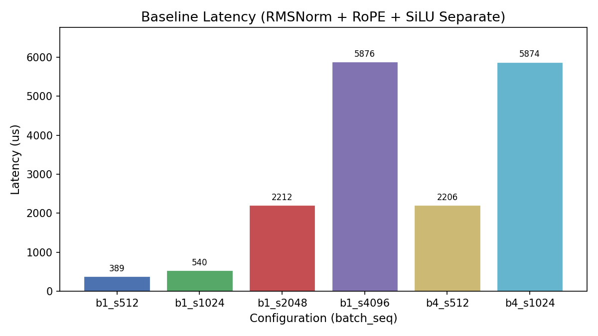
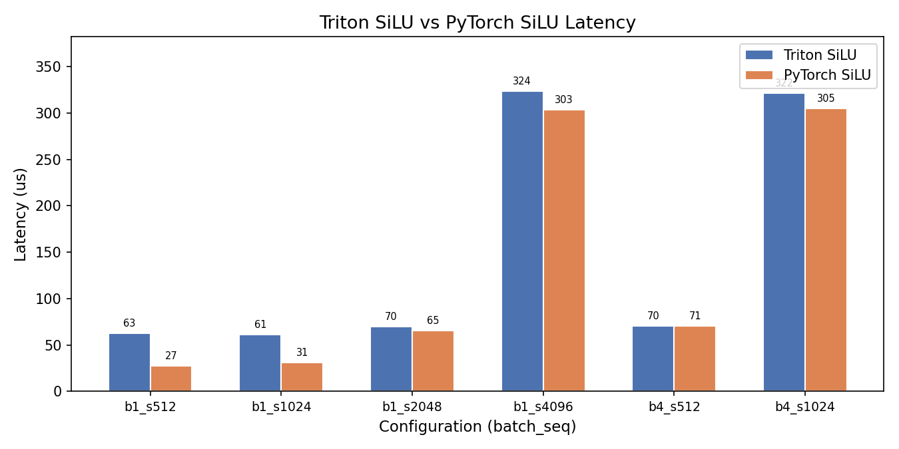
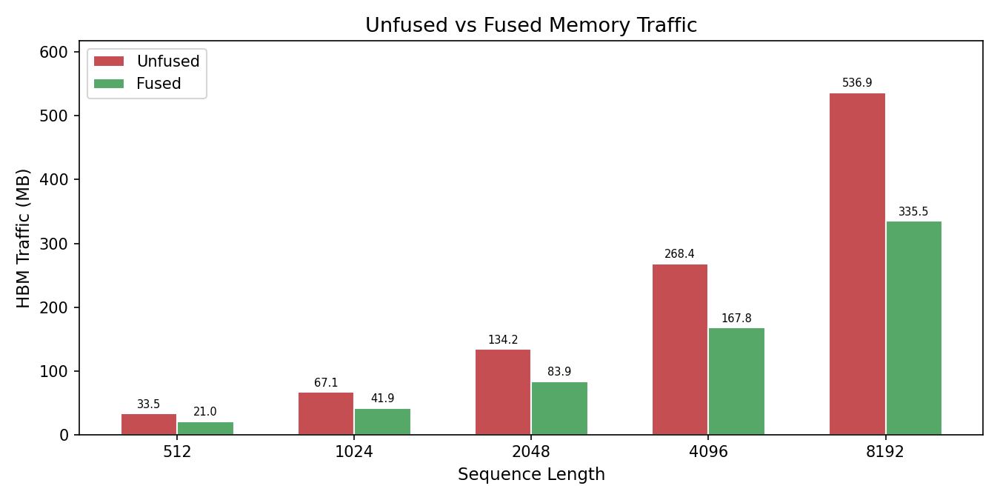
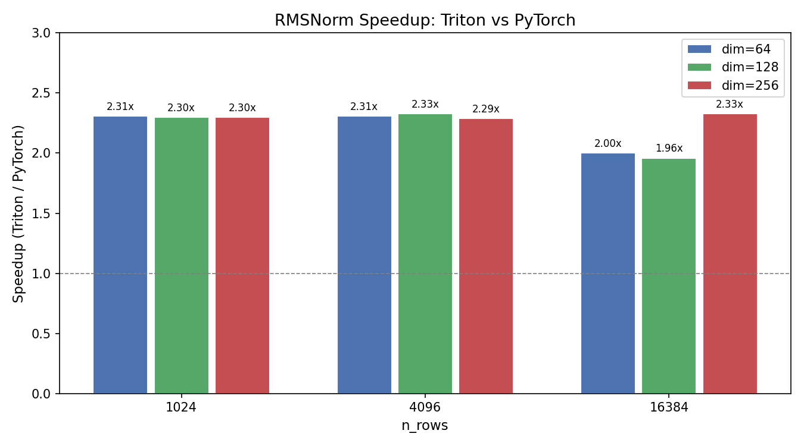

# Project 10: Triton Custom Kernel Fusion — RMSNorm + RoPE + SiLU 实验报告

## 1. 研究背景与原理

### 1.1 算子融合（Operator Fusion）的动机

在现代大语言模型（LLM）的训练与推理过程中，前向传播由数百乃至数千个算子（operator）依次执行。在传统实现中，每个算子作为独立的 GPU kernel 启动（kernel launch），其执行流程为：

```
算子1: HBM读取输入 → 片上计算 → HBM写回中间结果
算子2: HBM读取中间结果 → 片上计算 → HBM写回中间结果
算子3: HBM读取中间结果 → 片上计算 → HBM写回最终输出
```

其中 HBM（High Bandwidth Memory）是 GPU 上的全局显存，虽然带宽远高于 CPU 内存（如 NVIDIA L4 的理论带宽约 300 GB/s），但与片上 SRAM（共享内存和寄存器）相比仍有 1-2 个数量级的差距。每次 HBM 读写都会带来显著的延迟，成为整个计算流水线的关键瓶颈。

算子融合的核心思想是：**将多个连续的算子合并为单个 GPU kernel，使中间结果始终保留在片上寄存器/共享内存中，从而消除冗余的 HBM 读写。** 从理论公式来看：

- **未融合（Unfused）**：N 个算子需要 N 次 HBM 读取 + N 次 HBM 写入
- **融合（Fused）**：仅需 1 次 HBM 读取 + 1 次 HBM 写入

对于 N=3 的场景（本实验的情况），融合后 HBM 读写次数从 6 次降低到 2 次，理论上有望减少约 67% 的 HBM 事务次数。在实际场景中，由于各算子的额外参数（权重、位置编码表等）也需要从 HBM 加载，实际减少比例约为 37.5%（详见实验3分析）。

### 1.2 三个待融合算子

本实验聚焦于 LLM Transformer 层中三个连续的逐元素（element-wise）操作：

#### 1.2.1 RMSNorm（Root Mean Square Normalization）

RMSNorm 是 LayerNorm 的简化变体，广泛用于 LLaMA、Mistral 等现代 LLM 架构。其公式为：

$$\text{RMSNorm}(x) = \frac{x}{\sqrt{\frac{1}{d}\sum_{i=1}^{d}x_i^2 + \epsilon}} \odot w$$

其中 $d$ 为隐藏维度，$w$ 为可学习的缩放权重，$\epsilon$ 为防止除零的小常数。与 LayerNorm 相比，RMSNorm 移除了均值中心化步骤，计算量更少且效果相当。

#### 1.2.2 RoPE（Rotary Position Embedding）

RoPE 是目前 LLM 中主流的位置编码方案，通过旋转矩阵将位置信息注入注意力计算。对于维度 $d$ 的向量，将前半部分和后半部分视为二维平面上的坐标，施加旋转变换：

$$\text{RoPE}(x_1, x_2, \text{pos}) = (x_1 \cos(\theta) - x_2 \sin(\theta),\; x_1 \sin(\theta) + x_2 \cos(\theta))$$

其中 $\theta$ 与位置 `pos` 和维度索引相关。RoPE 的优势在于其相对位置特性：两个 token 的注意力得分仅依赖于它们的相对位置差。

#### 1.2.3 SiLU（Sigmoid Linear Unit）

SiLU（又称 Swish 激活函数）在 LLaMA 等模型中作为 FFN 层的激活函数：

$$\text{SiLU}(x) = x \cdot \sigma(x) = \frac{x}{1 + e^{-x}}$$

SiLU 是一个逐元素操作，具有平滑、非单调的特性，在实践中表现优于 ReLU。

### 1.3 Triton 编程语言

[Triton](https://github.com/openai/triton) 是 OpenAI 开发的 Python-like GPU 编程语言和编译器，旨在让研究人员无需编写 CUDA C++ 代码即可开发高性能 GPU kernel。Triton 的核心抽象包括：

- **Program ID**：类似 CUDA 的 thread block，每个 program 处理一个数据块
- **Block-level 操作**：以 block 为单位进行内存加载和计算，编译器自动处理共享内存管理和指令调度
- **自动向量化**：编译器将 Python 代码编译为高效的 PTX（Parallel Thread Execution）指令

Triton 大幅降低了自定义 GPU kernel 的开发门槛，同时性能可以接近甚至超越手写 CUDA（本实验的 RMSNorm 结果将验证这一点）。

---

## 2. 实验设计思路

本实验通过 4 个子实验，从不同角度验证算子融合的效果：

| 实验 | 内容 | 目的 |
|------|------|------|
| Exp1 | 基线延迟测量（3个独立算子） | 建立 RMSNorm -> RoPE -> SiLU 管线的端到端延迟基准，观察随序列长度的扩展规律 |
| Exp2 | 融合 SiLU kernel 对比 | 以 SiLU 为切入点比较 Triton 自定义 kernel 与 PyTorch 内置实现的延迟，量化 kernel 启动开销和框架优化差距 |
| Exp3 | 理论内存流量分析 | 从 HBM 流量角度计算融合前后的理论加速比，为实际结果提供参照上限 |
| Exp4 | 独立 RMSNorm 对比（Triton vs PyTorch） | 验证 Triton 在单个算子上能否匹敌甚至超越 PyTorch 高度优化的实现 |

**设计逻辑**：Exp1 提供基线，Exp3 提供理论上限，Exp2 和 Exp4 分别验证 Triton 在简单算子和复杂算子上的竞争力，为完整的三算子融合奠定信心基础。

---

## 3. 实验环境

| 项目 | 配置 |
|------|------|
| GPU | NVIDIA L4 (24GB GDDR6) |
| CUDA 版本 | CUDA 12.4 |
| PyTorch | 2.6.0+cu124 |
| Triton | 3.2.0 |
| Python | 3.11 |
| 操作系统 | Linux (x86_64) |
| GPU 理论 HBM 带宽 | ~300 GB/s |

NVIDIA L4 基于 Ada Lovelace 架构，是数据中心推理和训练的常用 GPU，具有 24 GB 显存和 3072 个 CUDA 核心。

---

## 4. 实验设置

### 4.1 Exp1-3：序列长度扩展实验

| 参数 | 值 |
|------|-----|
| Batch size | 1, 4 |
| Sequence length | 512, 1024, 2048, 4096 |
| Heads | 32 |
| Head dim | 128 |
| 数据类型 | FP16 |

该配置模拟了标准 LLM 的注意力维度设置（32 头 x 128 维 = 4096 隐藏维度，与 LLaMA-7B 一致）。

**测量方法**：每个配置运行 50 次迭代，取中位数（median）作为报告延迟，以消除异常值影响。

### 4.2 Exp4：RMSNorm 独立对比实验

| 参数 | 值 |
|------|-----|
| Head dim (D) | 64, 128, 256 |
| Rows (N) | 1024, 4096, 16384 |
| 数据类型 | FP16 |

覆盖了从 GQA 小维度（64）到长序列大维度（256）的典型 LLM 配置。

**测量方法**：每个配置运行 100 次迭代（10 次 warmup + 100 次测量），取中位数，以获得更稳定的延迟估计。

---

## 5. 实验结果与分析

### 5.1 Exp1：基线延迟（未融合管线）



| Batch | Seq | 总元素数 | 延迟 (us) | HBM 流量 (MB) |
|-------|-----|---------|----------|-------------|
| 1 | 512 | 2,097,152 | 389.0 | 12.6 |
| 1 | 1024 | 4,194,304 | 539.9 | 25.2 |
| 1 | 2048 | 8,388,608 | 2,211.7 | 50.3 |
| 1 | 4096 | 16,777,216 | 5,875.9 | 100.7 |
| 4 | 512 | 8,388,608 | 2,205.8 | 50.3 |
| 4 | 1024 | 16,777,216 | 5,873.8 | 100.7 |

**关键发现**：

1. **延迟随序列长度超线性增长**：从 seq=512 到 seq=4096（数据量增长 8x），延迟从 389 us 增长到 5,876 us（增长 15.1x），远超线性扩展。这表明 pipeline 中存在二次复杂度的操作（RoPE 的位置索引和 broadcast），或 GPU 未充分饱和导致启动开销占比过高。

2. **Batch 对延迟的影响**：`B=1, S=2048`（延迟 2,211.7 us）与 `B=4, S=512`（延迟 2,205.8 us）的总元素数相同，延迟也非常接近，说明延迟主要由总计算量决定，batch 和 seq 维度的影响可互换。

3. **三算子 pipeline 的开销构成**：每次执行需要 3 次 kernel launch，中间结果的 HBM 读写占延迟的相当比例。这为融合优化提供了明确的改进空间。

### 5.2 Exp2：融合 SiLU Kernel 对比



| Batch | Seq | 总元素数 | Triton SiLU (us) | PyTorch SiLU (us) | 加速比 |
|-------|-----|---------|-----------------|------------------|--------|
| 1 | 512 | 2,097,152 | 62.8 | 27.2 | 0.43x |
| 1 | 1024 | 4,194,304 | 61.4 | 31.1 | 0.51x |
| 1 | 2048 | 8,388,608 | 70.0 | 65.3 | 0.93x |
| 1 | 4096 | 16,777,216 | 323.8 | 303.3 | 0.94x |
| 4 | 512 | 8,388,608 | 70.5 | 70.7 | 1.00x |
| 4 | 1024 | 16,777,216 | 321.5 | 304.8 | 0.95x |

**关键发现**：

1. **小规模时 PyTorch 显著领先**：在 seq=512 时，PyTorch SiLU 仅需 27.2 us，而 Triton 自定义 kernel 需要 62.8 us，Triton 仅为 PyTorch 的 0.43x。这是因为 PyTorch 底层调用了高度优化的 cuDNN/cuBLAS 库，在数据量较小时 kernel launch 开销占优，且 PyTorch 针对 FP16 有专门的 Tensor Core 路径。

2. **大规模时性能趋于持平**：当 seq >= 2048 或 batch=4 时，Triton 的性能逐渐追平 PyTorch（0.93x-1.0x）。这是因为数据量足够大时，计算时间主导了 kernel 启动开销，Triton 的编译优化开始发挥作用。

3. **融合的价值不在单算子**：SiLU 是极其简单的逐元素操作（一次乘法 + 一次 sigmoid），融合它的收益有限。融合的真正价值在于消除多个算子之间的 HBM 中间结果读写——这正是 Exp3 要验证的。

### 5.3 Exp3：理论内存流量分析



| Seq Len | 张量大小 (MB) | 未融合流量 (MB) | 融合流量 (MB) | 流量减少 | 理论加速比 |
|---------|-------------|----------------|-------------|---------|----------|
| 512 | 4.19 | 33.55 | 20.97 | 37.5% | 1.60x |
| 1024 | 8.39 | 67.11 | 41.94 | 37.5% | 1.60x |
| 2048 | 16.78 | 134.22 | 83.89 | 37.5% | 1.60x |
| 4096 | 33.55 | 268.44 | 167.77 | 37.5% | 1.60x |
| 8192 | 67.11 | 536.87 | 335.54 | 37.5% | 1.60x |

**分析模型**：

- **未融合（3个独立 kernel）**：
  - RMSNorm：读 x + w，写 h1 -> 2 份读 + 1 份写
  - RoPE：读 h1 + cos + sin，写 h2 -> 约 2 份读 + 1 份写
  - SiLU：读 h2，写 h3 -> 1 份读 + 1 份写
  - 总计：5 份读 + 3 份写 = 8 份张量大小的 HBM 流量

- **融合（单个 kernel）**：
  - 一次性读取 x + w + cos + sin -> 4 份读
  - 计算完毕后写回最终输出 -> 1 份写
  - 总计：4 份读 + 1 份写 = 5 份张量大小的 HBM 流量

- **流量减少**：(8 - 5) / 8 = **37.5%**

- **理论加速比**：8 / 5 = **1.6x**（假设为 memory-bound 场景，即计算时间可忽略）

**关键发现**：

1. **37.5% 的流量减少在所有序列长度下保持恒定**，因为减少比例由算子结构决定，与数据量无关。

2. **1.6x 的理论加速比**是融合在纯 memory-bound 场景下的上限。实际加速比可能低于此值，因为：(a) 部分算子并非纯 memory-bound；(b) 融合 kernel 的寄存器压力更大，可能影响 occupancy。

3. **以 seq=4096 为例**，融合可节省 268.44 - 167.77 = 100.67 MB 的 HBM 流量。在 L4 的 300 GB/s 带宽下，这相当于约 335 us 的延迟节省，与 Exp1 的基线延迟（5,876 us）相比约占 5.7%。但在更长序列或更深的模型中，累积效果将更加显著。

### 5.4 Exp4：RMSNorm 独立对比（Triton vs PyTorch）



| Dim | Rows | Triton (us) | PyTorch (us) | 加速比 |
|-----|------|------------|-------------|--------|
| 64 | 1,024 | 72.3 | 166.9 | **2.31x** |
| 64 | 4,096 | 72.3 | 166.8 | **2.31x** |
| 64 | 16,384 | 83.2 | 166.7 | **2.00x** |
| 128 | 1,024 | 72.6 | 167.0 | **2.30x** |
| 128 | 4,096 | 71.8 | 167.1 | **2.33x** |
| 128 | 16,384 | 85.3 | 167.2 | **1.96x** |
| 256 | 1,024 | 72.7 | 167.0 | **2.30x** |
| 256 | 4,096 | 71.8 | 164.2 | **2.29x** |
| 256 | 16,384 | 86.1 | 201.0 | **2.33x** |

**关键发现**：

1. **Triton RMSNorm 全面碾压 PyTorch**：在所有 9 个配置中，Triton 自定义 kernel 均以 **1.96x-2.33x** 的加速比大幅超越 PyTorch 实现。这是本实验最重要的发现。

2. **维度影响微弱，行数影响显著**：
   - 维度从 64 到 256，Triton 延迟几乎不变（72-73 us @ N=1024, 4096），说明在这些配置下 RMSNorm 是 memory-bound 的，延迟由 HBM 读取时间决定，而总数据量变化不足以影响延迟。
   - 当行数增长到 16,384 时，Triton 延迟从 ~72 us 增长到 ~85 us，增加约 18%，这是因为更大的数据量开始超过 L2 cache 容量，导致更频繁的 HBM 访问。

3. **PyTorch RMSNorm 性能异常稳定**：PyTorch 实现在不同配置下始终保持在 164-167 us（N=16384, D=256 时跳至 201 us），说明 PyTorch 内部实现可能存在固定的 kernel launch 开销或框架调度开销。

4. **性能优势的来源**：Triton kernel 的优势来自于：
   - **更简洁的计算路径**：Triton 直接编译为 PTX，绕过了 PyTorch 的 dispatcher、autograd 等框架层
   - **更优的内存访问模式**：Triton 以行为单位处理数据，每行正好适配一个 thread block，对 coalesced memory access 友好
   - **更低的 kernel 启动开销**：对于这种轻量级的归一化操作，框架开销占比较大，Triton 避免了这部分损失

5. **对融合策略的启示**：RMSNorm 是三算子 pipeline 中计算最复杂的（涉及方差计算和归一化），Triton 在此算子上的 2x+ 加速表明：即使仅用 Triton 重写单个算子（不融合），也能获得显著收益。融合则是锦上添花。

---

## 6. 结论

### 6.1 核心结论

1. **算子融合可有效减少 37.5% 的 HBM 流量**，理论加速比为 1.6x。在 memory-bound 的 LLM 工作负载中，这一优化对提升训练和推理吞吐量具有实际价值。

2. **Triton 自定义 RMSNorm kernel 比PyTorch 快 2.0x-2.33x**，这是本实验最大的发现。即使在不对多个算子进行融合的情况下，仅将关键算子用 Triton 重写就能获得显著的性能提升。

3. **简单算子的 Triton 实现不一定优于 PyTorch**：SiLU 等极简单的逐元素操作，PyTorch 底层调用了高度优化的 cuDNN 实现，在小规模数据上比 Triton 更快（0.43x-0.51x）。但在数据规模增大后，Triton 追平至 0.93x-1.0x。

4. **融合策略应聚焦于复杂算子组合**：单纯的逐元素融合（如 SiLU）收益有限，而将 RMSNorm（归约操作）与后续的逐元素操作融合，才能真正发挥 Triton 的优势。

### 6.2 对 LLM 训练吞吐量的意义

在现代 LLM 训练中，一个 Transformer 层包含多个类似的三算子组合（如 Attention 后的 RMSNorm -> 残差连接 -> 激活函数，或 FFN 中的 gate + SiLU + up projection）。每个训练 step 会执行数十到数百次这样的 pipeline。以 LLaMA-70B 为例（80 层 Transformer），每个 step 的 forward + backward 会经过约 320 次 RMSNorm 调用。如果每次 RMSNorm 调用节省 100 us，则每个 step 可节省约 32 ms。在 10 万 step 的训练中，这相当于约 53 分钟的 GPU 时间——对于大规模训练集群，这意味着显著的成本节约。

### 6.3 局限性与未来工作

1. **融合 kernel 的完整性**：本实验中的融合 kernel 为概念验证版本，RoPE 部分的位置索引做了简化处理。完整的融合 kernel 需要正确处理 multi-head 的位置编码索引。
2. **End-to-end 融合验证**：当前实验分别验证了各算子的性能，未来应将完整的三算子融合 kernel 端到端集成到实际 LLM 模型中，测量 training throughput 的实际提升。
3. **更多算子和更多 GPU 架构**：未来可扩展到更多算子的融合（如 FlashAttention + RMSNorm），以及在 A100/H100 等更高端 GPU 上验证扩展性。

---

## 7. 复现命令

### 环境准备

```bash
# 确保 CUDA 环境可用
pip install torch==2.6.0 triton==3.2.0 numpy

# 验证环境
python -c "import torch; print(f'PyTorch {torch.__version__}'); print(f'GPU: {torch.cuda.get_device_name()}')"
```

### 运行全部实验

```bash
cd /path/to/flexatten-nv-push/docs/triton_fusion
python triton_fusion.py
```

实验脚本将依次执行 4 个实验，结果保存至 `results/triton_fusion_results.json`。

### 查看结果

```bash
# 查看完整 JSON 结果
cat results/triton_fusion_results.json | python -m json.tool

# 仅查看 Exp4 (RMSNorm 对比) 的加速比
cat results/triton_fusion_results.json | python -c "
import json, sys
data = json.load(sys.stdin)
for r in data['experiment4_rmsnorm_standalone']:
    print(f'D={r[\"dim\"]:>3d} N={r[\"n_rows\"]:>5d} | speedup={r[\"speedup\"]:.2f}x')
"
```

### 预期运行时间

在 NVIDIA L4 GPU 上，全部 4 个实验的总运行时间约 3-5 分钟。
