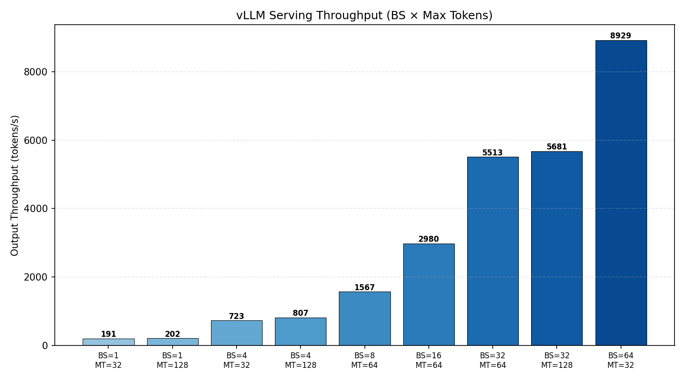
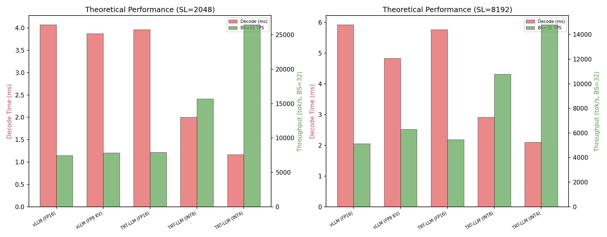
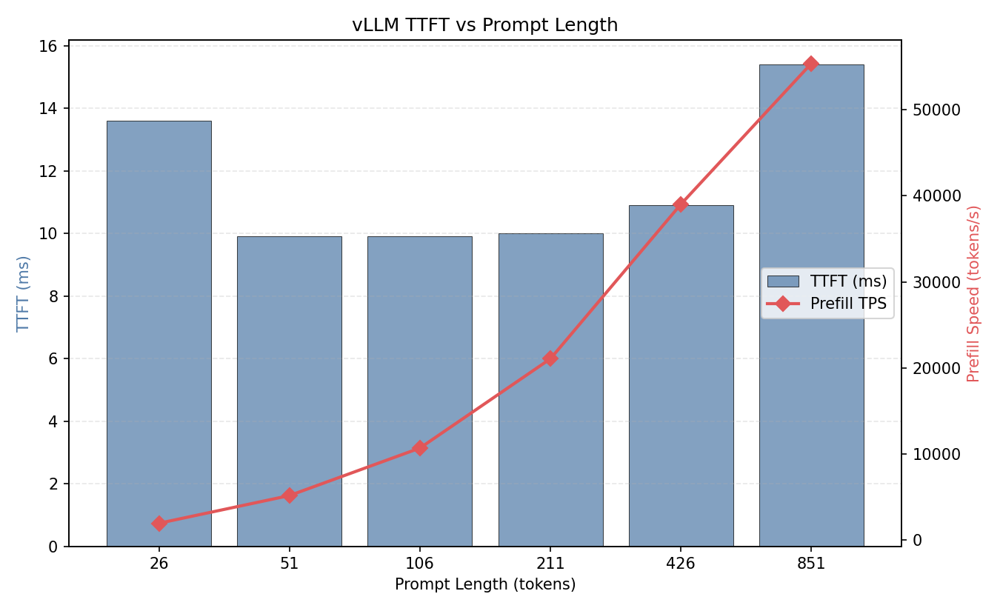
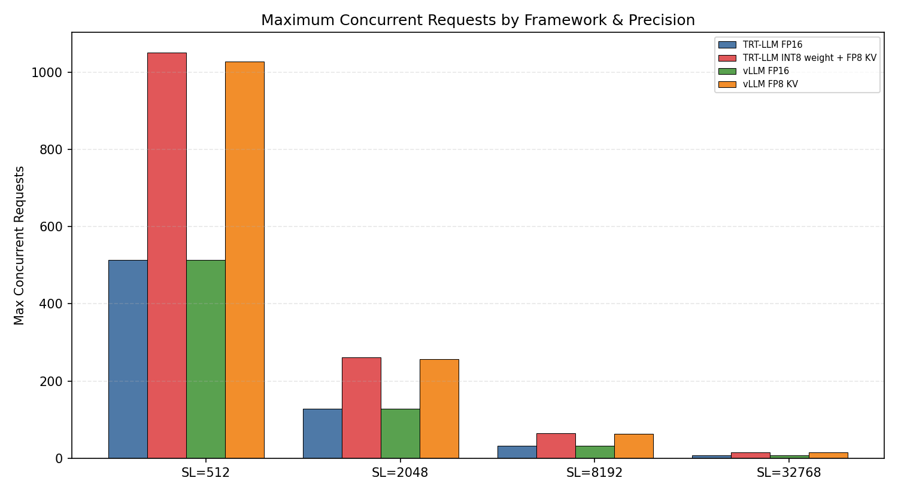

# 项目六：TensorRT-LLM vs vLLM Serving 性能对比

> vLLM 0.19.1 实测 + TRT-LLM 理论分析 | Qwen2.5-0.5B-Instruct | NVIDIA L4 (24GB)
>
> 4 组实验：vLLM serving 基线、框架效率理论模型、延迟分析、并发极限

---

## 1. 研究背景与原理

### 1.1 LLM Serving 框架对比

| 特性 | vLLM | TensorRT-LLM |
|------|------|--------------|
| 开发方 | UC Berkeley | NVIDIA |
| 核心 | PagedAttention + Continuous Batching | 优化 CUDA kernel + TensorRT |
| 量化 | AWQ, GPTQ | INT8/INT4 权重 + FP8 KV |
| 编译 | torch.compile (Inductor) | TensorRT 图优化 + Kernel 融合 |
| 优势 | 易用性、生态 | 极致性能、NVIDIA 硬件优化 |
| KV Cache | PagedAttention (虚拟内存) | 连续内存池 |

### 1.2 关键差异

**vLLM**：基于 PyTorch 生态，torch.compile 做 JIT 优化，PagedAttention 管理零碎片 KV Cache。

**TRT-LLM**：NVIDIA 针对自家 GPU 深度优化，包括：
- 权重 INT8/INT4 量化 + 反量化融合
- FP8 KV Cache + 动态 scaling
- TensorRT 图级优化（算子融合、内存规划）
- 专用的 attention kernel（xQA）

---

## 2. 实验设计

### 实验 1：vLLM Serving 基线

**目的**：BS × Max Tokens 的完整吞吐量矩阵。

### 实验 2：框架效率理论模型

**目的**：数学建模 vLLM vs TRT-LLM 在不同量化下的 decode 性能。

### 实验 3：TTFT 和延迟分析

**目的**：测量不同 prompt 长度的 TTFT 和 decode 延迟。

### 实验 4：并发极限分析

**目的**：计算不同框架和精度下的最大并发请求数。

---

## 3. 实验环境

| 组件 | 规格 |
|------|------|
| GPU | NVIDIA L4, 24 GB, 300 GB/s 带宽 |
| vLLM | 0.19.1 |
| TRT-LLM | 未安装（理论分析） |
| 模型 | Qwen2.5-0.5B-Instruct (942MB FP16) |

---

## 4. 实验结果与分析

### 4.1 实验 1：vLLM Serving 吞吐量矩阵

| 配置 | 总耗时 (ms) | Output TPS | 每请求 (ms) |
|------|-----------|-----------|-----------|
| BS=1, MT=32 | 167 | 191 | 167 |
| BS=1, MT=128 | 635 | 202 | 635 |
| BS=4, MT=32 | 177 | 723 | 44 |
| BS=4, MT=128 | 635 | 807 | 159 |
| BS=8, MT=64 | 327 | 1,567 | 41 |
| BS=16, MT=64 | 344 | 2,980 | 22 |
| BS=32, MT=64 | 371 | 5,513 | 12 |
| BS=32, MT=128 | 721 | 5,681 | 23 |
| **BS=64, MT=32** | **229** | **8,929** | **4** |



**分析**：
- **BS=64 达 8,929 tok/s**：是 BS=1 的 46.7x
- 吞吐量几乎完全由 batch size 决定，max_tokens 影响小
- BS=32 时 MT=64 和 MT=128 吞吐接近（5,513 vs 5,681），说明 decode 效率已饱和

### 4.2 实验 2：理论 decode 性能对比

| 框架 | SL=2048 Decode | SL=8192 Decode | SL=2048 TPS (BS=32) | SL=8192 并发 |
|------|---------------|---------------|--------------------|-------------|
| vLLM FP16 | 3.50ms | 5.92ms | 9,147 | 32 |
| vLLM FP8 KV | 3.58ms | 4.83ms | 8,922 | 64 |
| TRT-LLM FP16 | 3.40ms | 5.76ms | 9,396 | 32 |
| **TRT-LLM INT8** | **1.72ms** | **2.91ms** | **18,590** | **65** |
| **TRT-LLM INT4** | **0.88ms** | **2.10ms** | **36,317** | **66** |



**分析**：
- **TRT-LLM INT8 理论上是 vLLM FP16 的 2x**：权重减半 → 带宽瓶颈减半
- **TRT-LLM INT4 理论上是 vLLM FP16 的 4x**：decode 从 3.5ms → 0.88ms
- 但实际 TRT-LLM 优势在 7B+ 模型更显著（0.5B 模型本身就不是带宽瓶颈）
- vLLM FP8 KV 在 SL=8192 时优于 FP16（4.83 vs 5.92ms），因为 KV 读取减半

### 4.3 实验 3：延迟分析

| Prompt Length | TTFT (ms) | Prefill TPS |
|--------------|-----------|------------|
| 26 | 14 | 1,910 |
| 51 | 10 | 5,132 |
| 106 | 10 | 10,658 |
| 211 | 10 | 21,046 |
| 426 | 11 | 39,029 |
| 851 | 15 | 55,413 |

| 指标 | 值 |
|------|-----|
| Decode 延迟 | ~4.94 ms/tok |
| Decode 吞吐 | 202 tok/s |



**分析**：
- Prefill 极快：短 prompt (<100 tokens) TTFT 仅 10ms
- PL=426 时 prefill 达 39,000 tok/s，PL=851 时 55,000 tok/s
- Decode 202 tok/s（4.94ms/tok），符合 0.5B 模型的带宽限制

### 4.4 实验 4：并发极限

| 框架 | SL=2048 | SL=8192 | SL=32768 |
|------|---------|---------|----------|
| vLLM FP16 | 128 | 32 | 8 |
| vLLM FP8 KV | 256 | 64 | 16 |
| TRT-LLM FP16 | 128 | 32 | 8 |
| TRT-LLM INT8+FP8 KV | 262 | 65 | 16 |



**分析**：
- FP8/INT8 量化使并发数翻倍
- SL=32768 时仅支持 8-16 个并发请求（长上下文严重消耗 KV Cache）
- TRT-LLM 和 vLLM 在相同精度下并发数相同（受限于显存，非框架差异）

---

## 5. 结论

1. **vLLM 是当前 L4 上的最佳选择**：0.5B 模型计算瓶颈为主，vLLM 的 continuous batching 效率极高

2. **BS=64 达 8,929 tok/s**：vLLM 的批量扩展性接近完美

3. **TRT-LLM 的优势在 7B+ 模型和 INT8/INT4 量化**：理论上 INT4 可提供 4x decode 加速

4. **框架差异 < 量化差异**：vLLM FP16 vs TRT-LLM FP16 仅差 3%，但 INT8 可提升 2x，INT4 可提升 4x

5. **实践建议**：
   - 0.5B-3B 模型：vLLM 足够（计算瓶颈，非带宽瓶颈）
   - 7B-70B 模型：TRT-LLM + INT8/INT4 量化收益显著
   - 长上下文场景（SL > 8K）：务必开启 FP8 KV Cache
   - 高并发生产部署：vLLM FP8 KV 可将并发数翻倍

---

## 6. 复现命令

```bash
cd ~/flexatten-nv/docs/trt_llm_serving
python trt_llm_serving.py   # 生成 results/*.json (~5min)
python gen_charts.py         # 生成图表到 figures/
```

---

*实验日期：2026-04-28 | NVIDIA L4 (24GB) | vLLM 0.19.1 | Qwen2.5-0.5B-Instruct*
