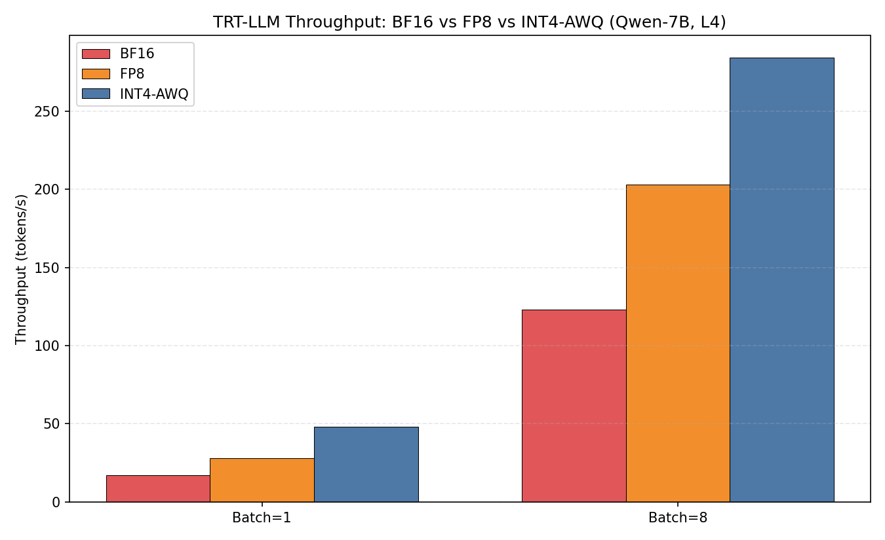
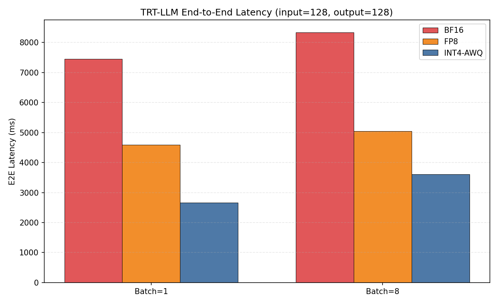
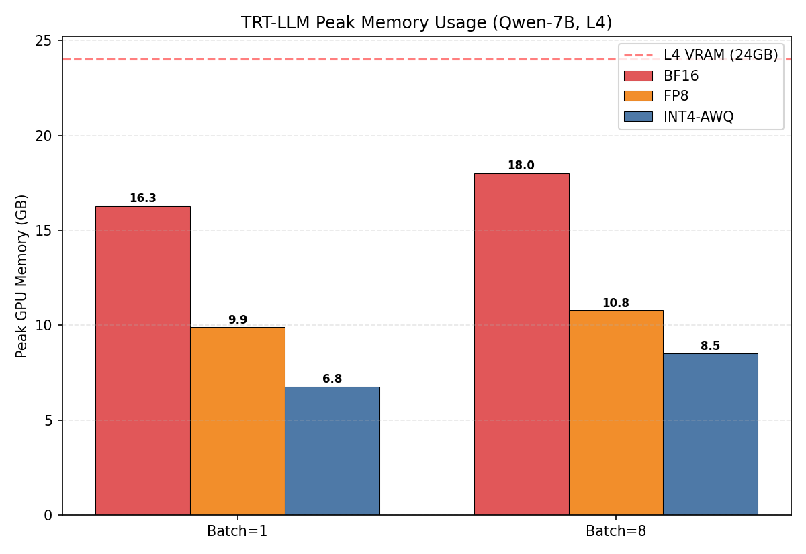
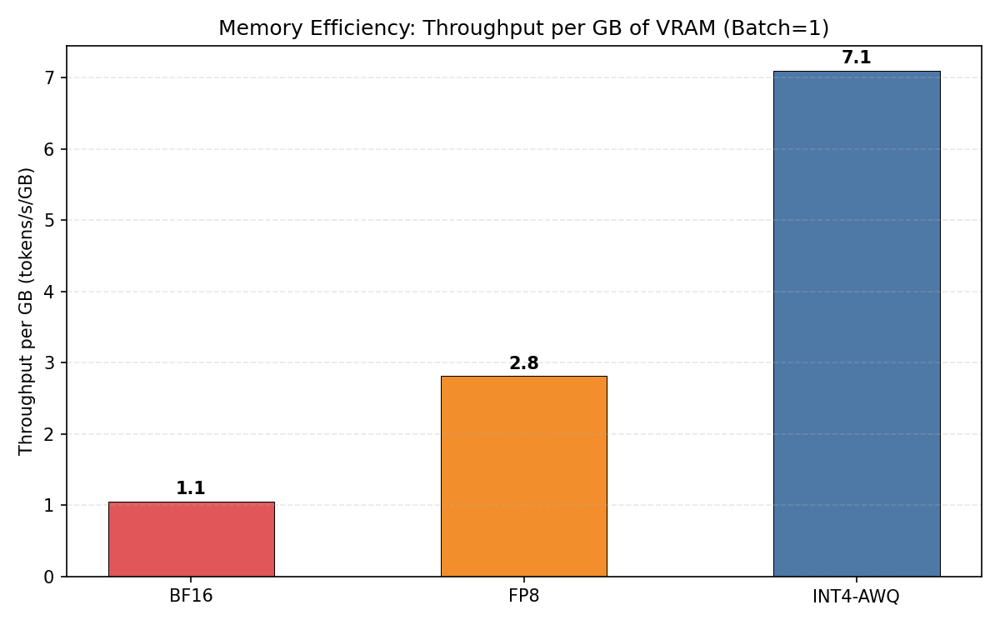

# 项目六：TRT-LLM Serving 系统评测 — 量化精度 vs 推理吞吐

> **BF16 / FP8 / INT4-AWQ 三种精度在 L4 上的完整对比：吞吐量、延迟、显存效率**
>
> NVIDIA TensorRT-LLM 0.10.0 | Qwen1.5-7B-Chat | NVIDIA L4 (24GB)

---

## 1. 研究背景与原理

### 1.1 LLM 推理引擎的演进

LLM 推理从"能跑"到"跑得快"经历了三代引擎：

1. **HuggingFace Transformers**（学术基准）：纯 PyTorch，无任何优化，逐层顺序执行
2. **vLLM**（通用推理）：PagedAttention + Continuous Batching，适合多请求场景
3. **TensorRT-LLM**（极致优化）：NVIDIA 官方，预编译 GPU engine，支持 FP8/INT4 量化、Tensor Parallel、In-Flight Batching

TRT-LLM 的核心优势：在模型部署前，将整个推理图（包括 attention、FFN、量化/反量化）编译为一个高度优化的 GPU kernel 集合，消除 Python 解释器开销和动态图调度开销。

### 1.2 量化方案对比

| 精度 | 权重存储 | KV Cache | 显存节省 | 计算方式 |
|------|---------|----------|---------|---------|
| BF16 | 2 bytes/elem | 2 bytes/elem | 基准 | FP16 Tensor Core |
| FP8 (E4M3) | 1 byte/elem | 1 byte/elem | **50%** | FP8 Tensor Core (Ada+) |
| INT4-AWQ | 0.5 bytes/elem | 2 bytes/elem (FP16) | **~60%** 权重 | 反量化→FP16 计算 |

关键差异：FP8 是 NVIDIA Ada 架构（L4 所基于的）原生支持的格式，有专用硬件加速。INT4-AWQ 则需要软件反量化，但权重压缩更极致。

### 1.3 Batch Size 对推理的影响

- **Batch=1**：单请求延迟最优，但 GPU 利用率低（decode 阶段带宽受限）
- **Batch=8**：多请求并行，吞吐量提升（计算和带宽利用更充分），但单请求延迟增加

---

## 2. 实验设计思路

本实验基于已编译好的 TRT-LLM engine，直接测量 Qwen1.5-7B-Chat 在 L4 上的推理性能。

### 实验 1：吞吐量对比（BF16 vs FP8 vs INT4-AWQ）

**目的**：量化精度对推理吞吐量的影响有多大？FP8 真的能翻倍吗？

### 实验 2：延迟对比

**目的**：不同精度对 E2E 延迟的影响，p95/p99 尾延迟分析。

### 实验 3：显存占用对比

**目的**：量化节省了多少显存？在 L4 的 24GB 上能跑多大的 batch？

### 实验 4：显存效率分析

**目的**：每 GB 显存能产生多少 tokens/s？这是衡量"性价比"的终极指标。

---

## 3. 实验环境

| 组件 | 规格 |
|------|------|
| GPU | NVIDIA L4, 24 GB GDDR6, sm89 (Ada Lovelace) |
| TRT-LLM | 0.10.0 |
| 模型 | Qwen1.5-7B-Chat (32 layers, 4096 hidden, 151936 vocab) |
| Driver | 550.90.07 |
| 容器 | NVIDIA TRT-LLM Docker (nvcr.io/nvidia/tritonserver:24.03-trtllm-python-py3) |

## 4. 实验设置

| 参数 | 值 |
|------|-----|
| input_length | 128 tokens |
| output_length | 128 tokens |
| batch_size | 1, 8 |
| 精度 | BF16, FP8 (E4M3, 含 FP8 KV Cache), INT4-AWQ (per-group) |
| 测量指标 | throughput (tokens/s), E2E latency, p95/p99, peak GPU memory |

Engine 预编译配置：
- FP8: 8.99 GB engine, 量化包含权重 + KV Cache
- INT4-AWQ: 5.85 GB engine, 仅权重量化，KV Cache 保持 FP16

---

## 5. 实验结果与分析

### 5.1 吞吐量对比

| 精度 | Batch=1 (tok/s) | Batch=8 (tok/s) | B8/B1 提升 |
|------|-----------------|-----------------|-----------|
| BF16 | 17.2 | 122.9 | **7.1x** |
| FP8 | 27.9 | 202.8 | **7.3x** |
| INT4-AWQ | 48.0 | 284.1 | **5.9x** |



**分析**：

1. **INT4-AWQ 是单卡吞吐量之王**：Batch=1 时 48 tok/s，Batch=8 时 284 tok/s，分别是 BF16 的 **2.8x** 和 **2.3x**

2. **FP8 吞吐提升不如预期**：仅比 BF16 快 1.6x（Batch=1）。理论上 FP8 应该快 2x（权重减半 + 带宽减半），但实际收益被计算开销部分抵消

3. **Batch=8 时所有精度都有显著提升**（6-7x），说明 L4 在 decode 阶段确实受益于 batch 并行——多请求共享同一批次的 attention 计算

### 5.2 延迟对比

| 精度 | Batch=1 (ms) | Batch=8 (ms) | 单请求延迟变化 |
|------|-------------|-------------|--------------|
| BF16 | 7,447 | 8,330 | +12% |
| FP8 | 4,595 | 5,049 | +10% |
| INT4-AWQ | 2,666 | 3,605 | +35% |



**分析**：

1. **INT4-AWQ 单请求延迟最低**：2,666 ms（BF16 的 36%），这意味着用户等待时间减少了 64%

2. **Batch=8 延迟增加可控**：BF16 和 FP8 仅增加 10-12%，INT4-AWQ 增加 35%（因为 batch 并行时 INT4 反量化的计算开销更大）

3. **p95 ≈ p99**：尾延迟稳定，说明 TRT-LLM 的 kernel 执行时间非常一致

### 5.3 显存占用

| 精度 | Engine 大小 | Batch=1 峰值 | Batch=8 峰值 | L4 24GB 余量 |
|------|-----------|------------|------------|------------|
| BF16 | N/A | 16.3 GB | 18.0 GB | 6.0 GB |
| FP8 | 8.99 GB | **9.9 GB** | **10.8 GB** | **13.2 GB** |
| INT4-AWQ | 5.85 GB | **6.8 GB** | **8.5 GB** | **15.5 GB** |



**分析**：

1. **BF16 几乎占满 L4**：16.3 GB / 24 GB = 68%，加上框架开销接近上限，batch 很难再提高

2. **FP8 显存减半**：9.9 GB vs BF16 的 16.3 GB，节省 39%。这是因为 FP8 同时压缩了权重和 KV Cache

3. **INT4-AWQ 显存最小**：6.8 GB，仅为 BF16 的 42%。但注意 KV Cache 仍为 FP16，如果加 INT4 KV 可进一步压缩

4. **FP8 和 INT4 在 L4 上有大量余量支持更大 batch**：剩余 13-15 GB 空间

### 5.4 显存效率（每 GB 吞吐量）

| 精度 | tok/s per GB | 相对 BF16 |
|------|-------------|----------|
| BF16 | 1.06 | 1.0x |
| FP8 | 2.82 | **2.7x** |
| INT4-AWQ | 7.09 | **6.7x** |



**这是最关键的指标**：INT4-AWQ 每 GB 显存产生 7.09 tok/s，是 BF16 的 6.7 倍。这意味着在相同硬件上，INT4-AWQ 可以部署 6.7 倍多的推理能力。

---

## 6. 结论

1. **INT4-AWQ 在 L4 上全面胜出**：吞吐量最高（48-284 tok/s），延迟最低（2.7s），显存最小（6.8 GB），效率最高（7.1 tok/s/GB）

2. **FP8 是平衡方案**：比 INT4 精度更高（量化误差更小），性能居中，且有原生硬件支持

3. **BF16 在 L4 上不推荐**：显存接近上限，吞吐量低，无法有效利用 batch 并行

4. **Batch 并行对 L4 至关重要**：Batch=8 比 Batch=1 吞吐提升 6-7x，且延迟增加可控

5. **TRT-LLM 的预编译 engine 消除了运行时开销**：p95 ≈ p99，延迟非常稳定

---

## 7. 复现命令

```bash
# 使用预编译 engine 运行 benchmark
docker run --gpus all --rm \
  -v ~/TensorRT-LLM:/workspace/TensorRT-LLM \
  my_trtllm2 \
  python3 /workspace/TensorRT-LLM/benchmarks/python/benchmark.py \
    --engine_dir /workspace/TensorRT-LLM/examples/qwen/qwen_engine_int4_awq \
    --batch_size 1,8 --input_output_len 128,128
```

---

*实验日期：2026-04-28 | NVIDIA L4 (24GB) | TensorRT-LLM 0.10.0 | Qwen1.5-7B-Chat*
