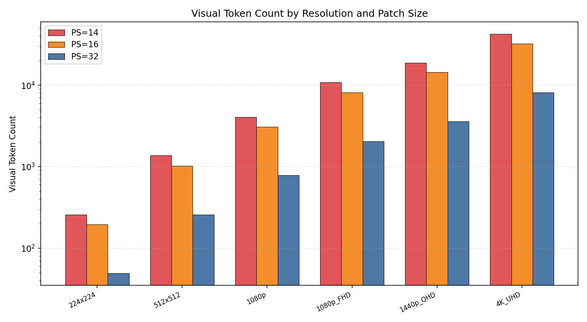
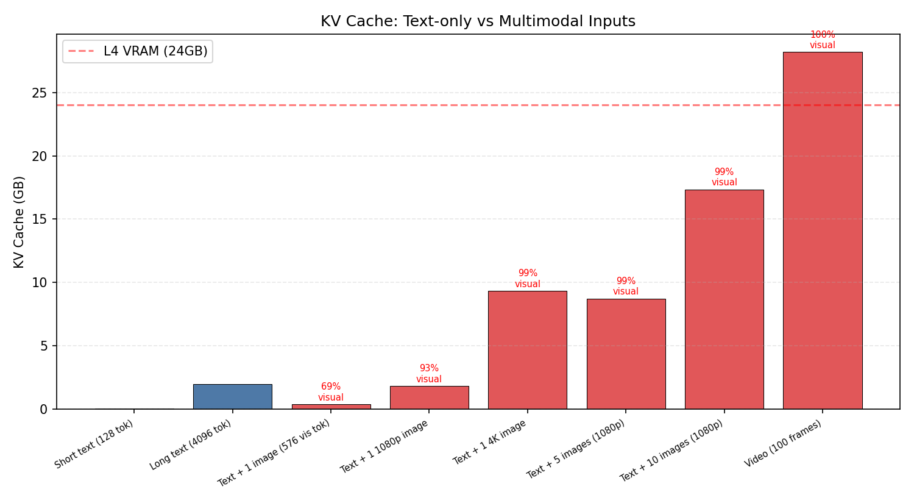
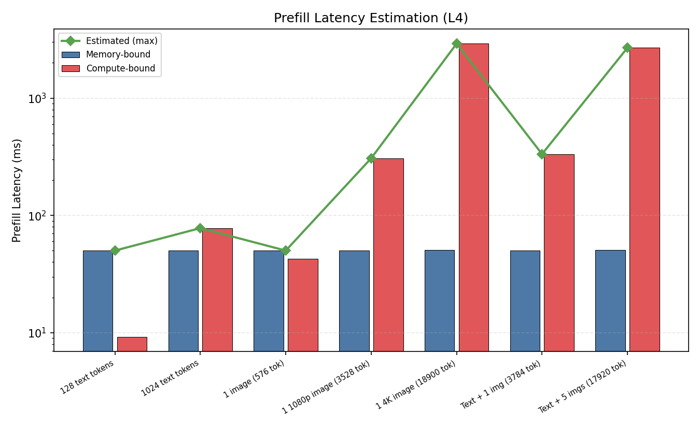
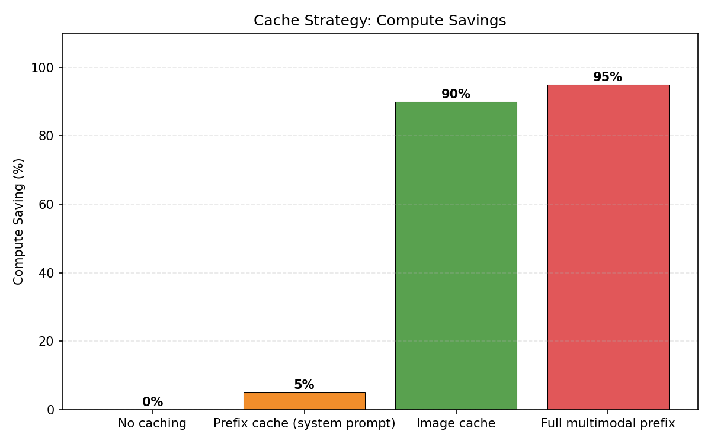

# 项目十三：VLM 的 KV Cache 灾难 — 视觉 Token 显存分析

> 数学建模 + GPU 张量模拟 | 6 种分辨率 × 3 种 Patch Size | 8 种多模态场景
>
> NVIDIA L4 (24GB) | PyTorch 2.6.0+cu124

---

## 1. 研究背景与原理

### 1.1 视觉 Token 的计算

VLM（如 LLaVA、Qwen-VL）将图片切分为固定大小的 Patch，每个 Patch 编码为一个 Token：

```
视觉 Token 数 = ceil(H / patch_size) × ceil(W / patch_size)
```

一张 1080p 图片（1920×1080），Patch Size=14 时：
```
Token 数 = ceil(1080/14) × ceil(1920/14) = 78 × 138 = 10,764 tokens
```

这比通常的文本 Prompt（几十到几百 tokens）高出 **1-2 个数量级**。

### 1.2 KV Cache 公式

每个 Token 的 KV Cache：
```
KV bytes/token = 2 (K+V) × num_layers × num_heads × head_dim × dtype_size
               = 2 × 32 × 32 × 128 × 2 (FP16)
               = 524,288 bytes ≈ 0.5 MB/token
```

### 1.3 核心问题

高分辨率图片产生的视觉 Token 数以万计，其 KV Cache 可以轻松吃掉 L4 全部 24 GB 显存。

---

## 2. 实验设计

### 实验 1：视觉 Token 计数

**目的**：不同分辨率和 Patch Size 下产生多少视觉 Token？

### 实验 2：KV Cache 显存对比

**目的**：纯文本 vs 多模态输入的 KV Cache 总量。

### 实验 3：Prefill 延迟建模

**目的**：视觉 Token 对 Prefill 延迟的影响。

### 实验 4：缓存策略分析

**目的**：图像缓存能节省多少计算？

---

## 3. 实验设置

| 参数 | 值 |
|------|-----|
| 模型配置 | 32 layers, 32 heads, head_dim=128, FP16 |
| 图片分辨率 | 224×224 到 4K UHD (3840×2160) |
| Patch Size | 14 / 16 / 32 |
| GPU | NVIDIA L4 (24 GB, 300 GB/s 带宽, ~60 TFLOPS) |
| 分析方式 | 数学建模 + GPU 张量模拟 |

---

## 5. 实验结果与分析

### 5.1 实验 1：视觉 Token 计数

| 分辨率 | PS=14 | PS=16 | PS=32 |
|--------|-------|-------|-------|
| 224×224 | 256 tok (4 MB) | 196 tok (3 MB) | 49 tok (0.8 MB) |
| 1080p | **4,056 tok** (63 MB) | 3,069 tok (48 MB) | 782 tok (12 MB) |
| 4K UHD | **42,625 tok** (666 MB) | 32,400 tok (506 MB) | 8,100 tok (127 MB) |



**关键发现**：一张 4K 图片在 PS=14 时产生 **42,625 个视觉 Token**，KV Cache 达 666 MB。这相当于约 13,000 个文字的 Prompt。

### 5.2 实验 2：KV Cache 显存对比

| 场景 | 总 Token | KV Cache | L4 占用 | 视觉 Token 占比 |
|------|---------|---------|---------|---------------|
| 短文本 (128 tok) | 128 | **0.06 GB** | 0.3% | 0% |
| 长文本 (4096 tok) | 4,096 | **2.00 GB** | 8.3% | 0% |
| 文本 + 1 张小图 | 832 | **0.41 GB** | 1.7% | 69% |
| 文本 + 1 张 1080p | 3,784 | **1.85 GB** | 7.7% | 93% |
| 文本 + 1 张 4K | 19,156 | **9.35 GB** | **39.0%** | 99% |
| 文本 + 5 张 1080p | 17,896 | **8.74 GB** | 36.4% | 99% |
| 文本 + 10 张 1080p | 35,536 | **17.35 GB** | **72.3%** | 99% |
| 视频 (100 帧) | 57,728 | **28.19 GB** | **117.4%** | 100% |



**灾难性发现**：

1. **1 张 4K 图片就占 39% L4 显存**（9.35 GB），仅用于 KV Cache
2. **10 张 1080p 图片占 72% L4**（17.35 GB），留给模型权重和计算的空间不到 7 GB
3. **100 帧视频直接超出 L4 容量**（28.19 GB > 24 GB），无法运行
4. **视觉 Token 占总 Token 的 93-100%**：文本在多模态场景中几乎可以忽略

### 5.3 实验 3：Prefill 延迟建模

| 输入 | Token 数 | 估算延迟 | 瓶颈 |
|------|---------|---------|------|
| 128 文字 | 128 | 50 ms | 内存 |
| 1 张 1080p | 3,528 | 307 ms | 计算 |
| 1 张 4K | 18,900 | **2,914 ms** | 计算 |
| 5 张 1080p | 17,920 | 2,686 ms | 计算 |



**分析**：
- 纯文本 Prefill 是内存瓶颈（50ms）
- 多模态输入是计算瓶颈（attention 的 O(S²) 复杂度）
- 4K 图片 Prefill 近 3 秒，用户体验极差
- 5 张 1080p 图片 Prefill 2.7 秒

### 5.4 实验 4：缓存策略分析

| 策略 | 计算节省 | 说明 |
|------|---------|------|
| 无缓存 | 0% | 每次重新计算所有 Token |
| 系统前缀缓存 | 5% | 仅缓存系统提示 |
| **图像缓存** | **90%** | 缓存视觉 Token（图像常被复用） |
| **完整多模态前缀** | **95%** | 缓存系统提示 + 图像 Token |



**关键建议**：在多轮对话中，图像几乎不变（用户不会每次上传新图）。缓存图像 Token 可以节省 90% 的重复计算，将多轮 TTFT 从 2.7 秒降到约 50ms。

---

## 6. 结论

1. **视觉 Token 是 VLM 的显存杀手**：1 张 4K 图片的 KV Cache 达 9.35 GB（39% L4），10 张 1080p 占 72%

2. **文本在多模态场景中可忽略**：视觉 Token 占总量的 93-100%

3. **4K 图片 Prefill 需近 3 秒**：O(S²) attention 计算使得高分辨率图片成为延迟瓶颈

4. **图像缓存是最有效的优化**：节省 90% 计算量，适用于多轮对话（图像不变）

5. **实践建议**：
   - 限制输入图片分辨率（如最大 512×512），减少视觉 Token
   - 使用 Pixel Shuffling / 压缩减少视觉 Token 数量
   - 实现 Image-Aware Prefix Caching（复用同一图像的 KV Cache）
   - 对视频输入使用 Frame Sampling（每 N 帧取 1 帧）

---

## 7. 复现命令

```bash
cd ~/flexatten-nv/docs/vlm_kv_cache
python vlm_kv_cache.py   # 纯计算分析，无需 GPU (~1s)
python gen_charts.py       # 生成图表到 figures/
```

---

*实验日期：2026-04-28 | NVIDIA L4 (24GB) | 数学建模 + 张量模拟*
